# Setup Oracle APEX in Database Cloud Service

## Introduction

Oracle Application Express (APEX) is a feature of Oracle Database that you can use to build low code applications rapidly and also accelerates the modernization of the legacy applications.

If you already have an APEX 20.2 Workspace provisioned, you can skip this lab.

Estimated Lab Time: 45 minutes

### What is an APEX Workspace?
An APEX Workspace is a logical domain where you define APEX applications. Each workspace is associated with one or more database schemas (database users) which are used to store the database objects, such as tables, views, packages, and more. APEX applications are built on top of these database objects.

### Objectives

* Create Database from Database Cloud Services
* Install and Setup Oracle APEX, ORDS and Tomcat Server
* Setup Oracle APEX Workspace with wizard

### Prerequisites

- An Oracle Cloud Infrastructure account with IAM privileges to provision database using Public Cloud Database Service
- PUTTY, Filezilla if you have Windows Machine.

### Where to Run the Lab
You can run this lab in any Oracle Database with APEX 20.2 installed. This includes the APEX Application Development Service , Database in Public Cloud Database Service, your on-premises Oracle Database (providing APEX 20.2 is installed), on a third party cloud provider where APEX 20.2 is installed, or even on your laptop by installing Oracle XE or Oracle VirtualBox App Dev VM and installing APEX 20.2.

Below are steps on how to provision database on *Database Cloud Service* .

## Task 1:  Create Database in OCI DBCS Service

1. Navigate to **Bare Metal, VM, and Exadata**.

	

2. Select **Create DB System**.  

	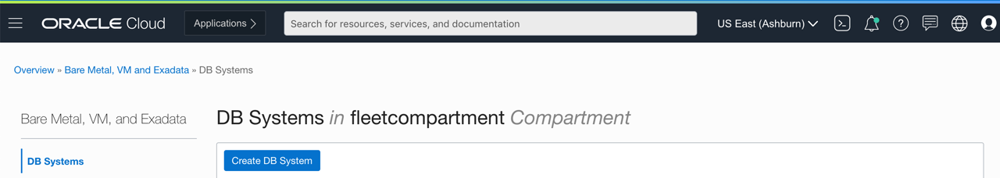

3. Enter the following details and hit **Next**.

  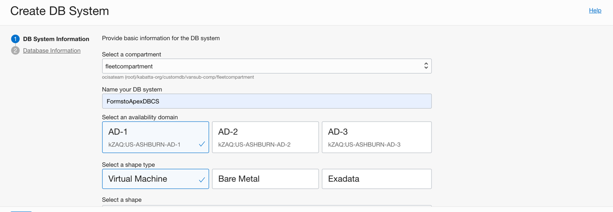
  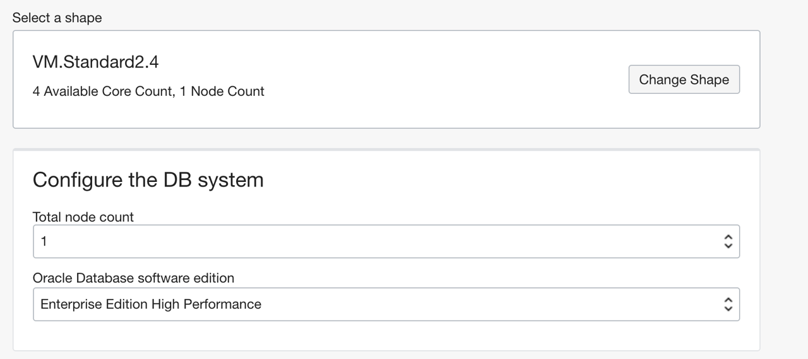
  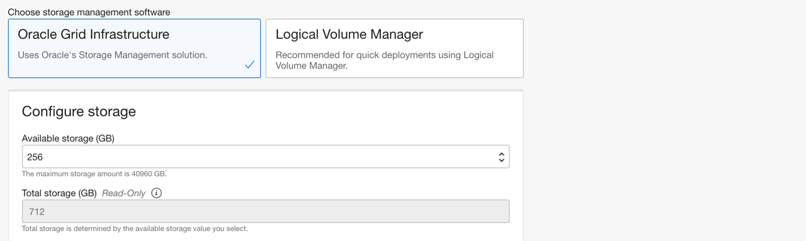

  Scroll down and paste your public key.

  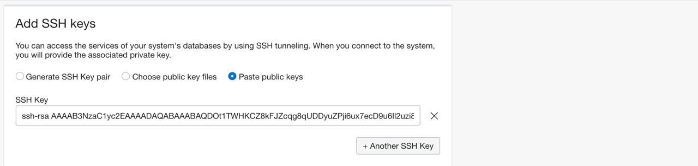

4. Scroll down further, select your network, enter a hostname prefix, and then select **Next**.

  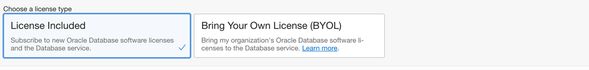
  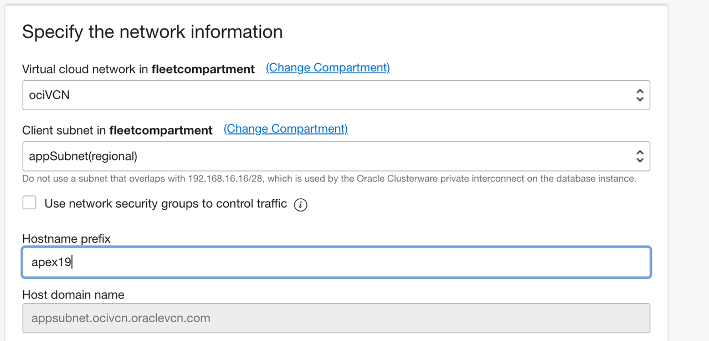
  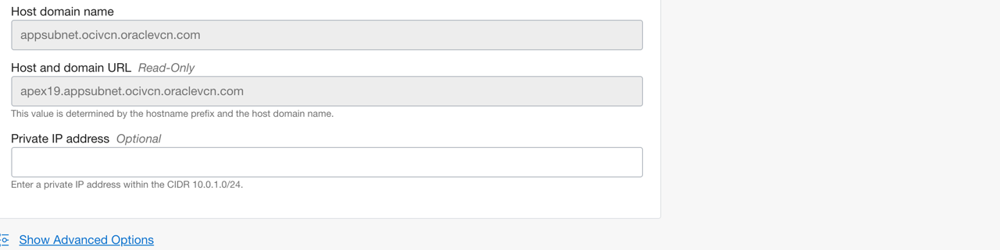
  

5. Enter the following details and then select **Create DB System**.

  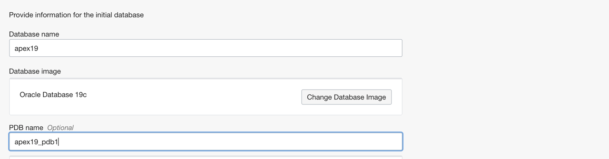
  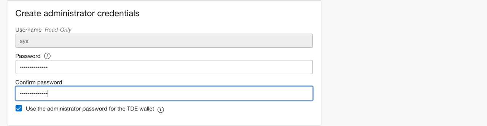
  

6. Wait until the Status changes from Provisioning to Available
  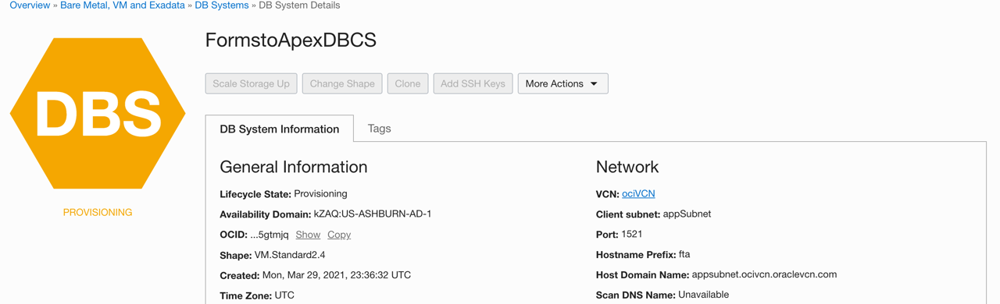
  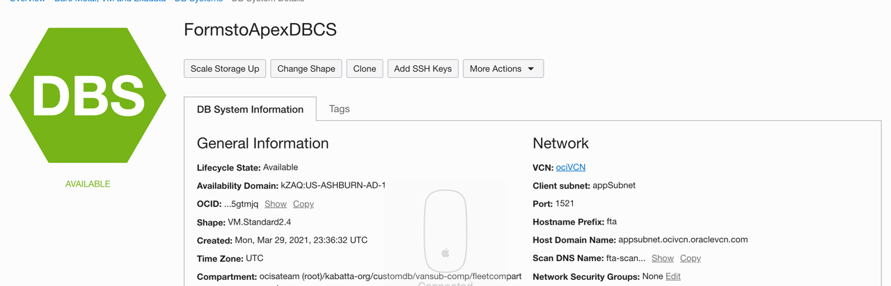

7. Navigate to the node to retrieve the public IP address.

  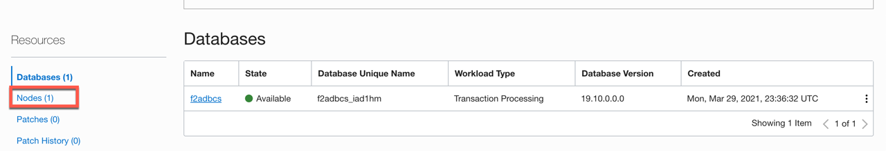
  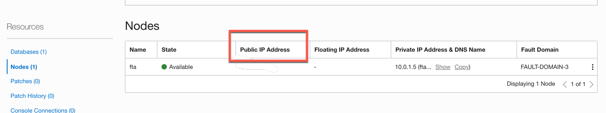


## Task 2:  Install Oracle APEX in DBCS.

Oracle APEX is not preinstalled in the database cloud service like how it is done with ATP or ADW , we will go through the install and configuration of APEX

The software packages we will be installing are
  * APEX 20.2x
  * Oracle Rest Data Services - ORDS 20.x
  * Apache Tomcat


1. Download the [Latest APEX version](https://www.oracle.com/tools/downloads/apex-v191-downloads.html) and save it to a folder.  

2. Download the [Latest Oracle REST Data Services version](https://www.oracle.com/database/technologies/appdev/rest-data-services-downloads.html) and save it to a folder.  

3. Open a command window in the workshop directory and scp the downloaded files to /tmp dbcs.  Enter the following command.  
    ```
    <copy>scp -i keys/<private key> apex_20.2.zip opc@<DBCS IP>:/tmp
    scp -i keys/<private key> ords-20.4.3.050.1904.zip opc@<DBCS IP>:/tmp</copy>
    ```
  If you have windows system , you can copy with Filezilla or Winscp

4. SSH to dbcs from the terminal window or using PUTTY.

5. Unzip the file in a new folder as root user, change directory into it and then become user oracle:
    ```
    <copy>[opc@linux ~]$ sudo su -
    [root@linux ~]# cd /tmp
    [root@linux tmp]# unzip apex_20.2.zip /u01/app/ -d /u01/app/
    [root@linux apex]# cd /u01/app
    [root@linux app]# chown -R oracle:oinstall apex/
    [root@linux app]# cd apex
    [root@linux app]# su oracle</copy>
    ```
6. Let’s connect to the pluggable database. Keep in mind that your PDB will have a different name so change the second SQL command accordingly:

    ```
    <copy>[oracle@linux apex]$ sqlplus / as sysdba
    SQL> SHOW PDBS
    CON_ID CON_NAME                       OPEN MODE  RESTRICTED
    ---------- ------------------------------ ---------- ----------
              2 PDB$SEED                       READ ONLY  NO
              3 F2ADBCS_PDB1                    READ WRITE NO
    SQL> ALTER SESSION SET CONTAINER=F2ADBCS_PDB1;
    Session altered.</copy>
    ```

7. We’ll create a new and dedicated tablespace for APEX data:

    ```
    <copy>SQL> CREATE TABLESPACE apex DATAFILE SIZE 100M AUTOEXTEND ON NEXT 1M;
    Tablespace created.</copy>
    ```

8. We will install APEX 19 in this PDB:
    
    ```
    <copy>SQL> @apexins.sql APEX APEX TEMP /i/</copy>
    ```


9. Change the admin password for the INTERNAL workspace with @apxchpwd.sql, this is the password we will be using to login to APEX administration Console

    ```
    <copy>Leave blank in the name to use the ADMIN one, and just fill in the password you want to use for ADMIN.
    SQL> ALTER SESSION SET CONTAINER=F2ADBCS_PDB1;
    SQL> @apxchpwd.sql
    ...set_appun.sql
    ================================================================================
    This script can be used to change the password of an Application Express
    instance administrator. If the user does not yet exist, a user record will be
    created.
    ================================================================================
    Enter the administrator's username [ADMIN
    User "ADMIN" does not yet exist and will be created.
    Enter ADMIN's email [ADMIN]
    Enter ADMIN's password []
    Created instance administrator ADMIN.</copy>

    ```

10. Create the APEX\_LISTENER and APEX\_REST\_PUBLIC\_USER users by running the **@apex\_rest\_config.sql** script. Again create a password for these accounts and type them in:

    ```
    <copy>SQL> @apex_rest_config.sql
    Enter a password for the APEX_LISTENER user              []
    Enter a password for the APEX_REST_PUBLIC_USER user              []
    ...set_appun.sql
    ...create APEX_LISTENER and APEX_REST_PUBLIC_USER users</copy>
    ```

11. Set password for the APEX\_PUBLIC\_USER and unlock the account. I also made a new profile so that the password for apex\_public\_user never expires.

    ```
    <copy>SQL> ALTER USER apex_public_user IDENTIFIED BY <password> ACCOUNT UNLOCK;
    SQL> CREATE PROFILE password_unlimited LIMIT PASSWORD_LIFE_TIME UNLIMITED;
    SQL> ALTER USER apex_public_user PROFILE password_unlimited;
    SQL> exit</copy>
    ```

## Task 3:  Install Oracle REST Data Services in DBCS.

1. As user root let’s create the TOMCAT Linux user (we will need it later when we install Tomcat), then make a new directory for ORDS files and unzip it there:
    ```
    <copy>[opc@linux tmp]$ sudo su -
    [root@linux ]# adduser tomcat
    [root@linux ]# mkdir /u01/app/ords
    [root@linux ]# mv /tmp/ords-20.4.3.050.1904.zip /u01/app/ords
    [root@linux ]# chown -R tomcat:tomcat /u01/app/ords
    [root@linux ]# cd /u01/app/ords
    [root@linux ords]# su tomcat
    [tomcat@linux ords]# unzip ords-20.4.3.050.1904.zip</copy>
    ```

2. Make a directory to hold the configuration.
    ```
    <copy>[tomcat@linux ords]# mkdir -p /u01/app/ords/conf</copy>
    ```

3. Edit the configuration file (still as user tomcat) and change the contents accordingly.
    ```
    <copy>[tomcat@linux ords]# vi /u01/app/ords/params/ords_params.properties
    db.hostname=fta
    db.port=1521
    db.servicename=f2adbcs_pdb1.appsubnet.ocivcn.oraclevcn.com
    db.sid=
    db.username=APEX_PUBLIC_USER
    migrate.apex.rest=false
    rest.services.apex.add=
    rest.services.ords.add=true
    schema.tablespace.default=APEX
    schema.tablespace.temp=TEMP
    standalone.http.port=8080
    standalone.static.images=
    user.tablespace.default=APEX
    user.tablespace.temp=TEMP</copy>
    ```

  You can find your specific configurations using these parameters:

  **db.hostname** : in Linux command line type “hostname” as any user
  **db.port** : this is by default 1521 unless you manually changed it
  **db.servicename** : PDBname.HostDomainName We have the PDB name from all previous ALTER SESSION commands. To find the Host Domain Name, we can connect to the database with “sqlplus / as sysdba” as oracle user and type “show parameter service_name”. From the output copy and use only the part that starts with sub01234567.vcnXYZ.oraclevcn.com. You can also get it from the DB System details page on the web console.
  You can leave the rest as I have in my file.


4. Use the “ords.war” file to specify the configuration directory using the following command. The file name “ords.war” will result in a URL containing “/ords/”. If you want a different URL, rename the WAR file accordingly. In this post I will use the original name.
As ROOT user (if you are tomcat type exit to become root again) type:
    
    ```
    <copy>[root@linux ords]# /usr/bin/java -jar ords.war configdir /u01/app/ords/conf
    INFO: Set config.dir to /u01/app/ords/conf in: /u01/app/ords/ords.war</copy>
    ```

5. Install ORDS using the following command. This is the equivalent of specifying the “install simple” command line parameters.Type in sys as sysdba as the administrator username. Provide the passwords for the users and press 1 to use PL/SQL Gateway

    ```
    <copy>[root@linux ords]# /usr/bin/java -jar ords.war</copy>
    Enter the database password for ORDS_PUBLIC_USER:
    Confirm password:
    Requires to login with administrator privileges to verify Oracle REST Data Services schema.
    Enter the administrator username: sys as sysdba
    Enter the database password for sys as sysdba:
    Confirm password:
    Retrieving information.
    Enter 1 if you want to use PL/SQL Gateway or 2 to skip this step.
    If using Oracle Application Express or migrating from mod_plsql then you must enter 1 [1]:1
    Enter the database password for APEX_PUBLIC_USER:
    Confirm password:
    Enter 1 to specify passwords for Application Express RESTful Services database users (APEX_LISTENER, APEX_REST_PUBLIC_USER) or 2 to skip this step [1]:1
    Enter the database password for APEX_LISTENER:
    Confirm password:
    Enter the database password for APEX_REST_PUBLIC_USER:
    Confirm password:
    Oct 10, 2019 9:12:29 PM
    INFO: reloaded pools: []
    Installing Oracle REST Data Services version 20.2.0.
    Completed installation for Oracle REST Data Services version 20.2.0
    Enter 1 if you wish to start in standalone mode or 2 to exit [1]:2
    ```

## Task 4:  Downloading and installing Tomcat.

1. Download Tomcat 9 from [HERE](https://tomcat.apache.org/download-90.cgi)  , use the tar.gz link and copy it, then downloaded directly to the cloud database  in a new directory as user root, change it’s owner and unzip it :
    
    ```
    <copy>[root@linux ords]# mkdir /u01/app/tomcat
    [root@linux ords]# -d /u01/app/tomcat/
    [root@linux ords]# chown -R tomcat:tomcat /u01/app/tomcat/
    [root@linux ords]# su tomcat
    [tomcat@linux ords]$ cd /u01/app/tomcat/
    [tomcat@linux ords]$ wget  https://downloads.apache.org/tomcat/tomcat-9/v9.0.44/bin/apache-tomcat-9.0.44.tar.gz
    [tomcat@linux tomcat]$ tar zxvf apache-tomcat-9.0.44.tar.gz</copy>
    ```

2. Let’s start up Tomcat web server:

    ```
    <copy>[tomcat@linux tomcat]$ /u01/app/tomcat/apache-tomcat-9.0.44/bin/startup.sh</copy>
    ```

3. Now we need to open the web server port to allow incoming access, first in the Linux console and then on the Oracle Cloud. Switch to root user and add this port to iptables and save it:

    ```
    <copy>[tomcat@linux tomcat]$ exit
    [root@linux tomcat]# iptables -I INPUT -p tcp -m tcp --dport 8080 -j ACCEPT
    [root@linux tomcat]# service iptables save
    [root@linux tomcat]# service iptables reload</copy>
    ```

4. Go to the web console and open port 8080 on the Oracle Cloud firewall in the Security Lists of the VCN you are using for the database. It should like like this:

  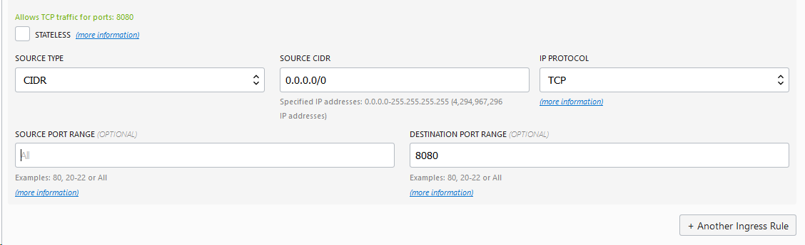

5. Test that Tomcat is working fine and the web page is loading. Type in your web browser the IP address of your cloud database followed by the 8080 port; http://(Enter DBCS IP):8080

  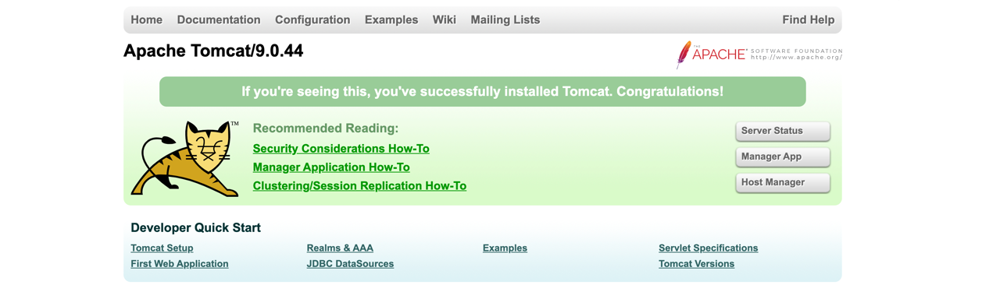

6. Some automation is needed now so that Tomcat starts when Linux instance is rebooted with runlevel script. The script has to be created as OS user root. In one of the first lines, setup a sleep command to be sure that the database is available before the application server starts.

    ```
    <copy>[root@linux tomcat]#   vi /etc/init.d/tomcat
    Paste this inside the file:
    #!/bin/bash
    #
    # tomcat
    #
    # chkconfig:
    # description: Start up the Tomcat servlet engine.
    # Source function library.
    . /etc/init.d/functions
    # Sleep 20 seconds until database is started sucessfully
    sleep 20
    RETVAL=$?
    CATALINA_HOME="/u01/app/tomcat/apache-tomcat-9.0.44"
    case "$1" in
    start)
    if [ -f $CATALINA_HOME/bin/startup.sh ];
    then
    echo $"Starting Tomcat"
    /bin/su tomcat $CATALINA_HOME/bin/startup.sh
    fi
    ;;
    stop)
    if [ -f $CATALINA_HOME/bin/shutdown.sh ];
    then
    echo $"Stopping Tomcat"
    /bin/su tomcat $CATALINA_HOME/bin/shutdown.sh
    fi
    ;;
    *)
    echo $"Usage: $0 {start|stop}"
    exit 1
    ;;
    esac
    exit $RETVAL</copy>
    ```

7. Add the script to the runlevel environment level 3 and 5:
    
    ```
    <copy>[root@linux tomcat]#   chmod 755 /etc/init.d/tomcat
    [root@linux tomcat]#   cd /etc/rc3.d
    [root@linux tomcat]#   ln -s /etc/init.d/tomcat S99tomcat
    [root@linux tomcat]#   cd /etc/rc5.d
    [root@linux tomcat]#   ln -s /etc/init.d/tomcat S99tomcat</copy>
    ```

8. Linking Tomcat with APEX. Switch back to the Tomcat OS user and copy the APEX images to the Tomcat “webapps” directory.

    ```
    <copy>[root@linux tomcat]#   su tomcat
    [tomcat@linux tomcat]$   mkdir /u01/app/tomcat/apache-tomcat-9.0.26/webapps/i/
    [tomcat@linux tomcat]$   cp -R /u01/app/apex/images/* /u01/app/tomcat/apache-tomcat-9.0.26/webapps/i/
    [tomcat@linux tomcat]$   cp /u01/app/ords/ords.war /u01/app/tomcat/apache-tomcat-9.0.26/webapps/</copy>
    ```

9. Login into Oracle Application Express — add /ords at the end of the application server URL like http://DBCS IP:8080/ords.

  You can fill in the INTERNAL workspace and use the Admin and the password you have given to log in.

  

## Task 5:  Create APEX workspace

1. Click **Create Workspace**.

    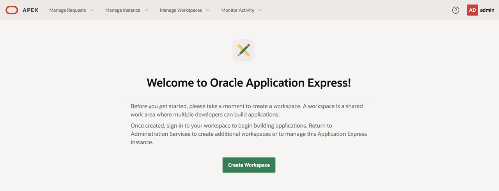

2. In the Create Workspace dialog, enter the following:

    | Property | Value |
    | --- | --- |
    | Database User | DEMO |
    | Password | **`<enter passowrd>`** |
    | Workspace Name | DEMO |

3. Click **Create Workspace**.

4. Enter Workspace Name.

  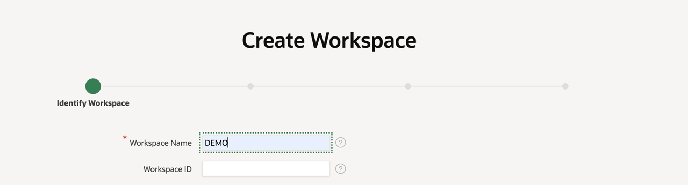

5. Enter the schema ,you can name the schema to be same as workspace name and enter password.
    
  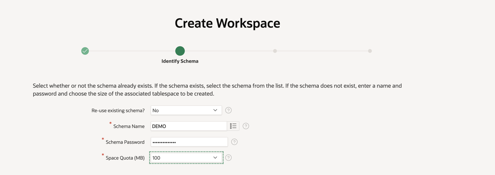

6. Create user for Workspace administrator to login and create applications.
    
  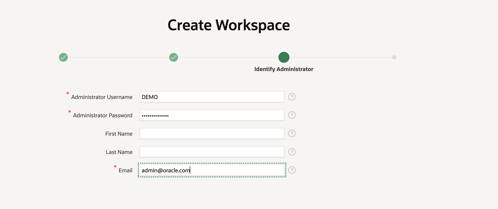

7. Review the details and Create the workspace.
  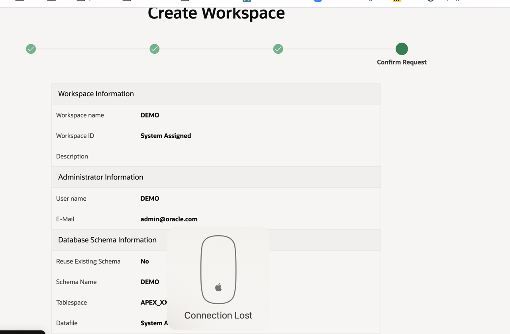

  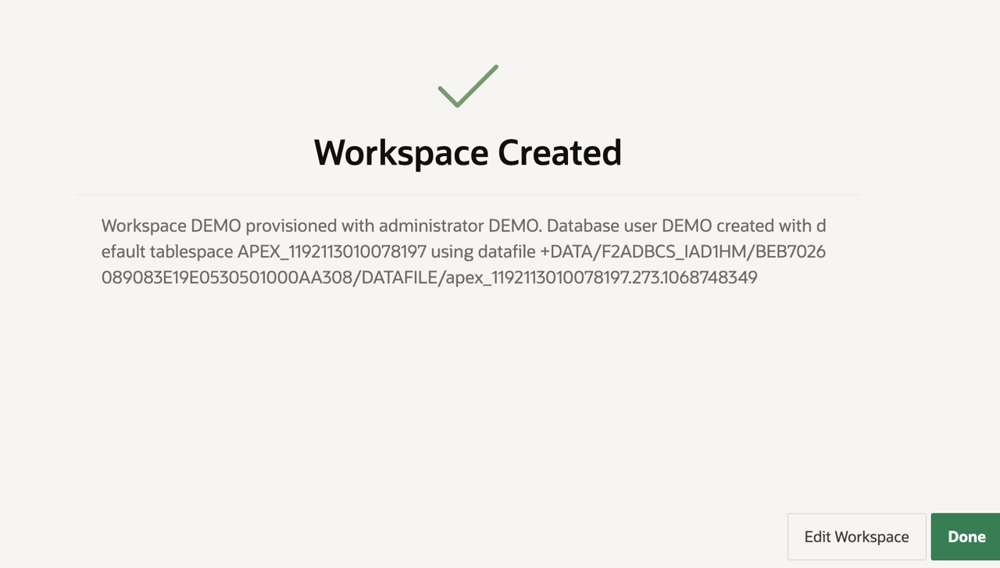


## Summary

 At this point, you know how to create an DBCS database, install APEX and ORDS and create APEX Workspace and you are now ready to start migrating forms Application.

You may now *proceed to the next lab*.

## Acknowledgements

- **Author** -  Vanitha Subramanyam, Senior Solution Architect
- **Contributors** - Vanitha Subramanyam, Senior Solution Architect
- **Last Updated By/Date** - Vanitha Subramanyam, Senior Solution Architect, May 2021
