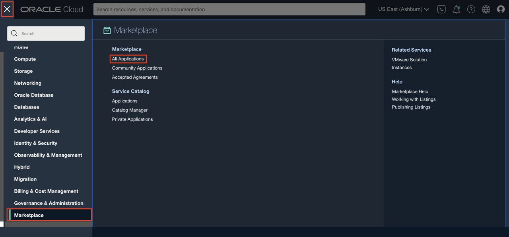
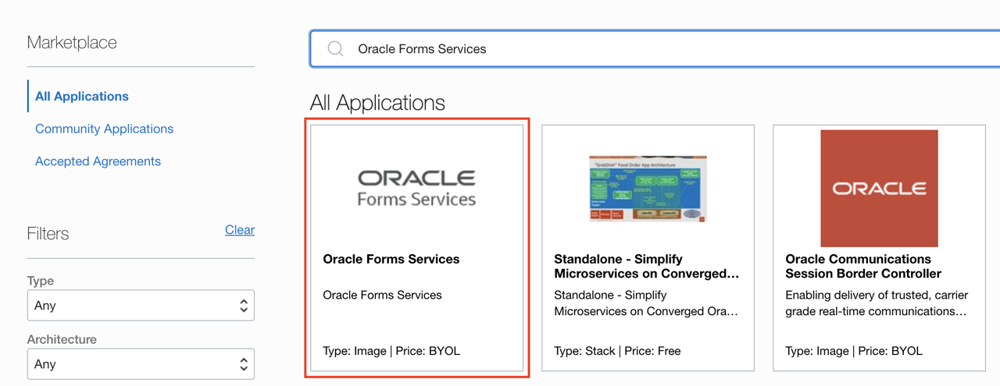
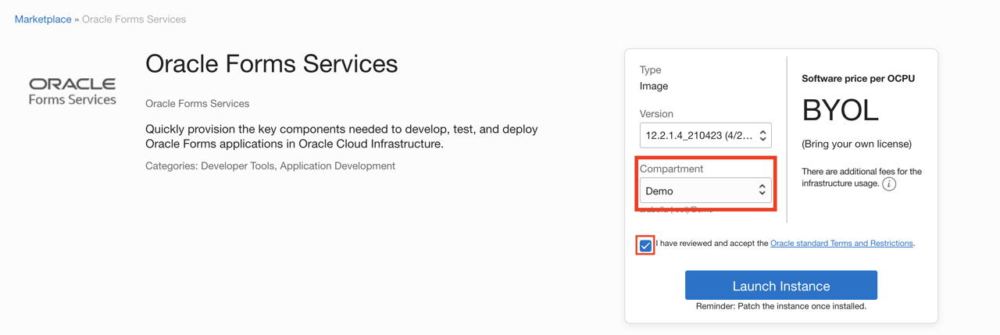
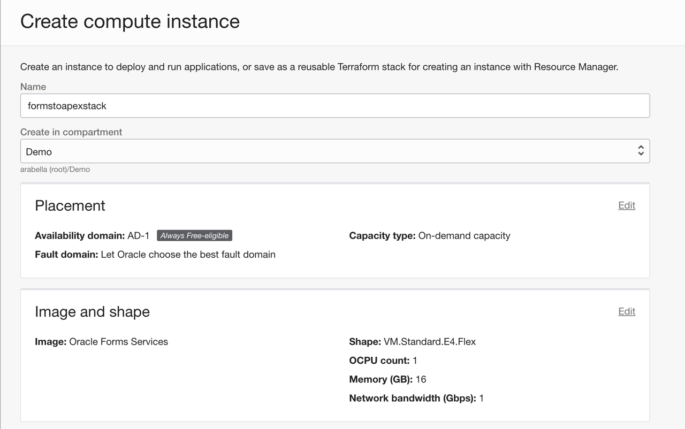
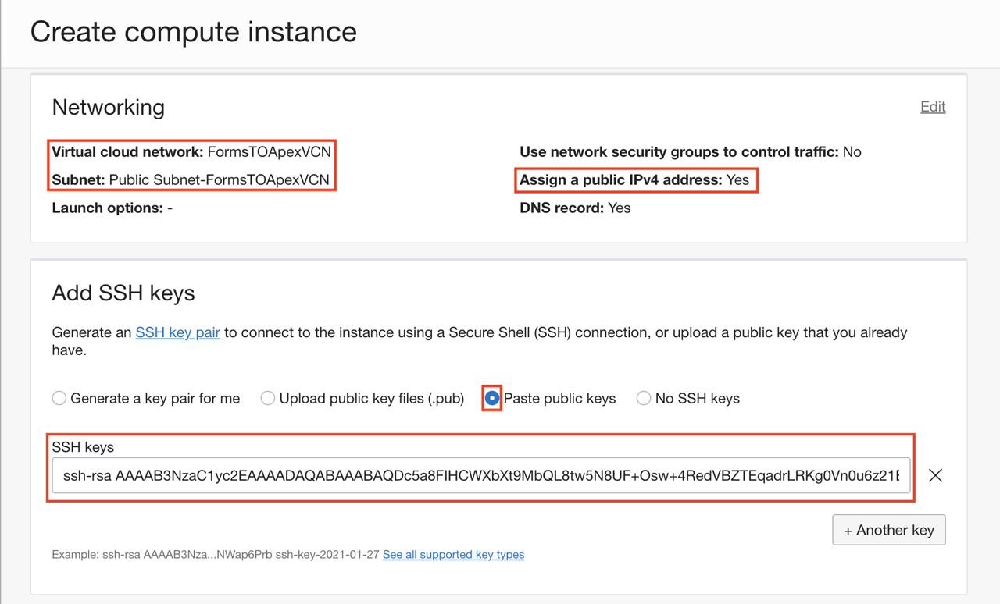
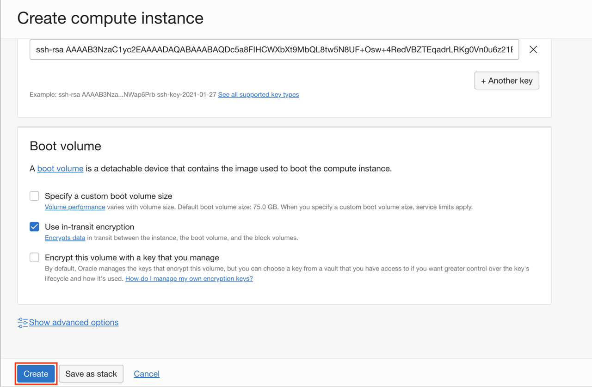
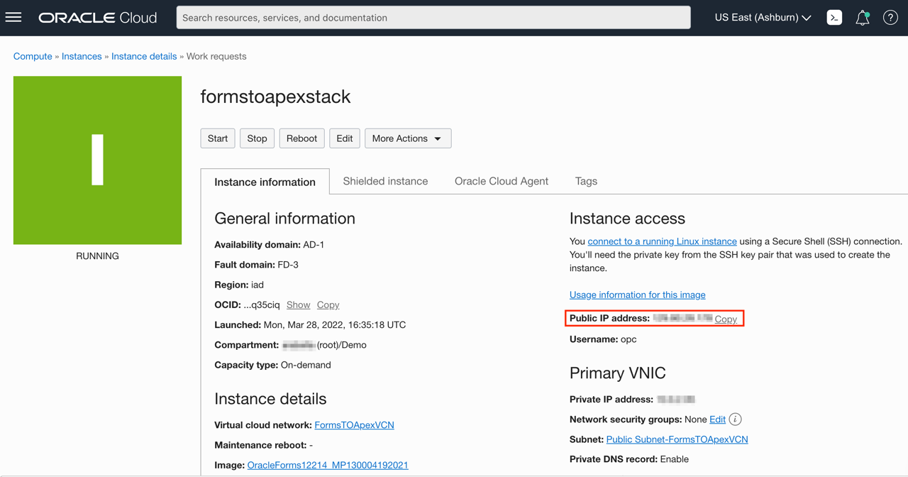
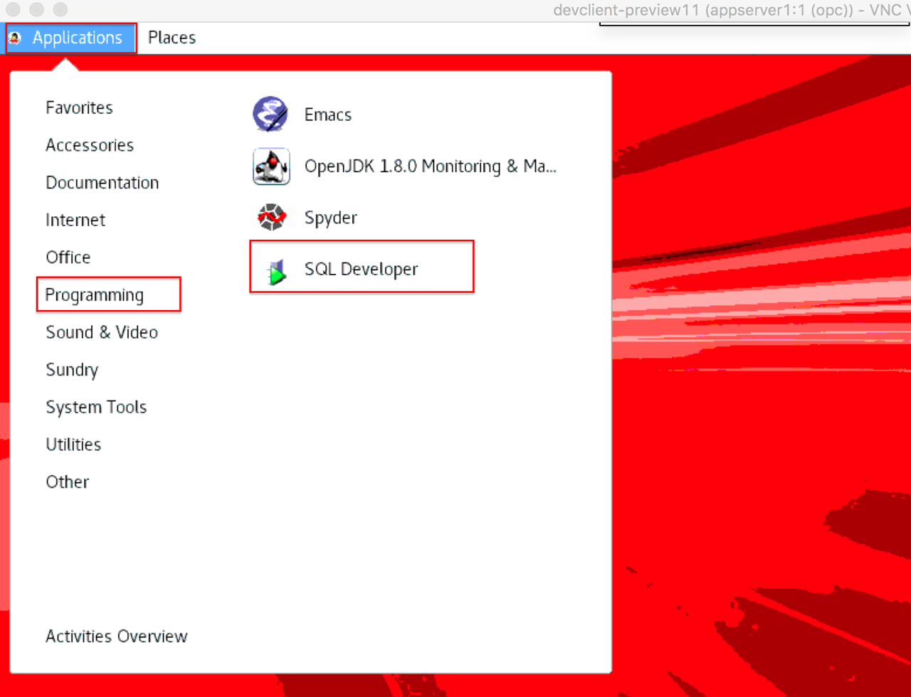

# Configure a development system for Oracle Forms Application from Marketplace in OCI

## Introduction
The Oracle Cloud Infrastructure marketplace provides a pre-built Oracle Forms image with necessary client tools and drivers to build the applications.

The image is pre-configured with tools and language drivers so that you can change/compile Oracle Forms Applications.
For a complete list of features, login to your OCI account, select 'Marketplace' from the top left menu and browse details on the 'Oracle Forms Services'
    

Estimated Lab Time: 30 minutes

### Objectives

As a database user, DBA or application developer,
1. Configure a Oracle Forms system from a pre-built marketplace image
2. Connect with SSH and complete the Forms Installation
3. Copy the SQL Scripts and Sample Forms files to your development system
4. Connect to your DB in Development system using SQL Developer.
5. Run the scripts to create sample schema and insert sample data.
6. Convert the forms to XML

### Prerequisites

- An Oracle Cloud Infrastructure account with IAM privileges to provision compute instances
- VNC Viewer or other suitable VNC client on your local laptop

## Task 1: Provision an OCI Marketplace Forms Services image

We start with deploying a pre-configured client machine instance from the OCI marketplace.

1. Log into your cloud account using your tenant name, username and password.
2. Click the Hamburger Menu, select **Marketplace** and click **All Applications**.
      

3. Search for Oracle Forms Services.
      

4. Choose Oracle Forms Service image from Oracle Image section.

5. Choose the compartment and check the "I have reviewed and accept the Oracle standard Terms and Restrictions" box before launching the instance.
    

6. 
    - Name: formstoapexstack
    - Create in compartment: Choose your compartment
    - Placement: Leave the defaults
    - Image and Shape: Leave the defaults

      

    >**Note**: Please ensure you have picked the right compartment where network resources exist.

    - Networking: Choose the VCN and subnet you have created in the previous lab. This would likely be the public subnet. Ensure **Assign a public IPv4 address** is set to Yes. You would need to ssh into this instance over public internet.
    - Add SSH keys: select **Paste public keys** and paste in your ssh key.

      

9. Click Create.
      

10. Within a few minutes your development instance will be available and a public IP address assigned (if it is provisioned in a public subnet).

11. Once provisioned, you can click on the instance name to see details.
    


## Task 2: Connect from your local laptop into your development system to complete the forms installation

First we ssh into the dev client and invoke the VNC server that comes pre-installed.

1. SSH into your dev client compute instance with public ip details we got from instance details.

    ```
    <copy>ssh -i <private-key> opc@PublicIP</copy>
    ```
2. When you login, the Oracle Forms Installation will continue and you will be prompted with if you want to use your local database. Press the Enter key.

    ```
        ****************************************************************
        *                                                              *
        *   Please provide the following credentials below:            *
        *                                                              *
        *   - VNC password  (Must be 6-8 chars long)                   *
        *      Should contain numbers and letters.                     *
        *      Should contain upper and lower case letters.            *
        *                                                              *
        *   - Database sys/system password (Must be 8-30 chars long)   *
        *      Should contain numbers and letters.                     *
        *      Should contain upper and lower case letters.            *
        *                                                              *
        *   - WLS Repository schema password (Must be 8-30 chars long) *
        *      Should contain upper and lower case letters.            *
        *      Should contain numbers and letters.                     *
        *      Only 3 special characters permitted: # $ _              *
        *                                                              *
        *   - WLS administrator password (Must be 8-12 chars long)     *
        *      Should contain numbers and letters.                     *
        *      Should contain upper and lower case letters.            *
        *                                                              *
        ****************************************************************
        Enter a password for VNC:
        Enter database sys/system user password:
        Enter WLS Repository schema password:
        Enter Weblogic domain administrator password:

        ****************************************************************
        *      Provisioning Oracle FMW Domain                          *
        ****************************************************************

        Oracle Forms Fusion Middleware domain successfully provisioned.
        All Servers have been started and are ready for use.

    ```
    Make a note of all the passwords
3.   All the installation details of software installed, ORACLE\_HOME, ORACLE\_SID, MIDDLEWARE\_HOME, FORMS\_PATH
    can be found in readme file under Desktop folder

    ```
        $ cd Desktop
        $ vi Readme

        Excerpt from Readme file, make a note off these details.
          ------------------------------
          Software Installation Details
          ------------------------------
          All software has been installed and is owned by the "opc" user.

          o Software locations:
            o  Database software is installed only if you choose to have a local database during provisioning.
            o  Database ORACLE_HOME:  /u01/oracle/database/base/Oracle_Home
                 o Database connect string: orcl

            o  Middleware ORACLE_HOME:  /u01/oracle/middleware/Oracle_Home
            o  Middleware DOMAIN_HOME:  /u01/oracle/middleware/user_projects/domains/base_domain

                 o WebLogic Server repository (RCU) schema prefix: FRM
                 o WebLogic Server Administrator username:  weblogic

            o  JDK 8 HOME: /u01/oracle/jdk

            o  FORMS_PATH in frmbld.sh and default.env includes:  /home/opc/oracle/formsmodules


          ------------------------------
          Server Information
          ------------------------------
          o Server Ports:
              Database Listener Port:  1521
              WLS Administration Server : 7001
              WLS_FORMS : 9001
              OHS : 7777 & 4443 (7777 & 4443 opened in Linux firewall)

        ```    
4.   Start your VNC server with the following command,

        ```
        <copy>$ vncserver -geometry 1280x1024</copy>
        ```

        ```
        VNC Server will be started with below output
        New 'formstoapexstack:1 (opc)' desktop is formstoapexstack:1

        Starting applications specified in /home/opc/.vnc/xstartup
        Log file is /home/opc/.vnc/formstoapexstack:1.log
        ```

         Note down what comes after your stack name which is :1 here.

        Open the Log file to check which port the VNC connection will be listening on and note down the port number which is usually 5901 .

        Excerpt from Log file:
        ```
        vncext:      VNC extension running!
        vncext:      Listening for VNC connections on all interface(s), port 5901
        vncext:      Listening for HTTP connections on all interface(s), port 5801
        vncext:      created VNC server for screen 0
        ```

5. Your development system may now be ready for accepting VNC connections.

    >**Note**: As mentioned earlier, you need a VNC client installed on your laptop. This lab uses VNC Viewer.

6. Create a tunnel for VNC through SSH,

   if you have MAC ,

          In a terminal window , issue the following command, with your public IP address at the end. This will create the SSH tunnel for you to use for VNC.
          ```
          ssh -N -L 5901:127.0.0.1:5901 -i ~/<privatekey> opc@<publicIP>
          ```
   if you have Windows,

      You can create SSH tunnels using the PuTTY SSH client.

      a. In Host Name (or IP address) box, enter the ``<publicIP>`` of the target compute node.

      b. Confirm that the Connection type option is set to ``SSH``.

      c. In the Category tree, expand Connection if necessary and then click Data.The Data panel is displayed.

      d. In Auto-login username box, enter ``opc``.
      Confirm that the When username is not specified option is set to Prompt.

      e. In the Category tree, expand SSH and then click Auth.The Auth panel is displayed.

      f. Click the Browse button next to the ``Private key file`` for authentication box. Then, in the Select private key file window, navigate to and open the private key file that you have used during forms instance creation.

      g. In the Category tree, click ``Tunnels``

      h. In the ``Source Port`` box , enter ``5901`` as the port number.

      i. In the Destination box, enter the ``<publicIP>``, a colon, and the port number to which you want to create a tunnel; for example, ``<publicIP>``:5901.  

      k. Confirm that the Local and Auto options are set.

      l. Click Add to add the forwarded port.

      m. In the Category tree, click Session. Enter name for the connection configuration and click ``Save``.

      n. Click ``Open`` to open the connection


7. Start VNC Viewer on your laptop and configure a client connection using the settings as shown.
    

  Note how the connect string for VNC Server is simply localhost:1

8. Connect to your VNC desktop and provide the password you provided on the host earlier.

9. If all goes well, you should now see a linux desktop in your VNC window.

## Task 3: Copy the SQL Scripts, Shell Scripts and Sample Forms files to your development system
1. We have sample forms and sample database scripts that can be downloaded from [here](https://objectstorage.us-ashburn-1.oraclecloud.com/p/LNAcA6wNFvhkvHGPcWIbKlyGkicSOVCIgWLIu6t7W2BQfwq2NSLCsXpTL9wVzjuP/n/c4u04/b/livelabsfiles/o/developer-library/setup-oracle-forms.zip)

2. Unzip the files and Copy the files over to your development system from your local Desktop

      ````
      <copy>scp -i  ~/.ssh/<privake key> ./files/customers.fmb opc@<public ip>:/home/opc/oracle/formsmodules
        scp -i  ~/.ssh/<privake key> ./files/forms_conversion.sql opc@<public ip>:/home/opc/oracle/formsmodules
        scp -i  ~/.ssh/<privake key> ./files/forms_conversion_data_insert.sql opc@<public ip>:/home/opc/oracle/formsmodules
        scp -i  ~/.ssh/<privake key> ./files/frmf2xml.sh opc@<public ip>:/home/opc/oracle/formsmodules
        scp -i  ~/.ssh/<privake key> ./files/formsXMLconvert.sh opc@<public ip>:/home/opc/oracle/formsmodules </copy>       
      ````

## Task 4: Connect to your DB in Development system using SQL Developer

1. In your VNC session, invoke SQL Developer from the top left Applications menu as shown below.
    


    *Note: In the event you have issues launching SQL Developer and it prompts with a java classpath error, simply add the following line to ~/.sqldeveloper/19.1.0/product.conf and retry.*

    ````
    <copy>SetJavaHome /usr/java/jdk1.8.0_231-amd64</copy>
    ````

2. Create an new connection in sql*developer and provide the following information,

    **Connection Name**: Name for your connection

    **Username**: sys as sysdba

    **Password**: <password>

    **Connection Type**: Basic

    **Hostname**: localhost
    **Port**: 1521
    **SID**: orcl

3. Test your connection and save. The *Status* bar will show *Success* if it is a successful connection!


## Task 5: Run the scripts to create sample schema and insert sample data.

  1.  Open the script  forms_conversion_ddl.sql in SQL developer in VNC and execute the script. Make a note of the credential for order user in the script.
  2.  In the same session connect to orders user and run the insert script forms_conversion_data_insert.sql


## Task 6: Convert the Forms to XML files

Before migrating  to Oracle Applications Express, Forms file have to be converted to XML file using frmf2xml utility provided with Oracle Forms Service Image. In the downloaded scripts, formsXMLconvert.sh script that can be run to convert all the Forms files in the directory where it is run from.

    ````
    <copy>cd oracle/formsmodules/
      sh formsXMLconvert.sh</copy>

    ````  
After the script is run verify that you can see customers_fmb.xml

You may now *proceed to the next lab*.

## Acknowledgements

- **Author** -  Vanitha Subramanyam, Senior Solution Architect
- **Contributors** - Vanitha Subramanyam, Senior Solution Architect
- **Last Updated By/Date** - Kamryn Vinson, March 2022
