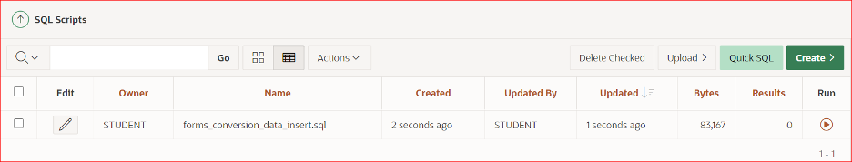
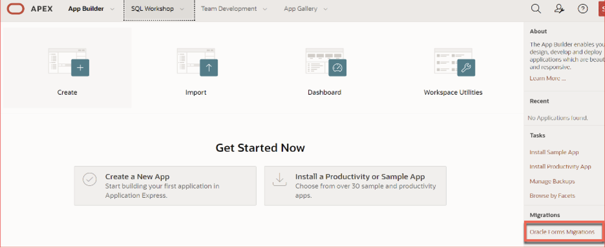
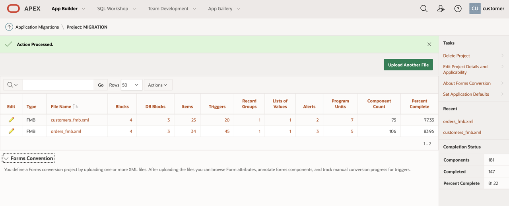

# Create Migration Project in Oracle APEX

## Introduction

Although you can quickly build a new application within Oracle Application Express, it may seem quicker to just build an application from scratch rather than loading the source application definitions into an Oracle Application Express migration project. The value of utilizing a migration project comes from being able to view and annotate all of the business logic, generally hidden in the many Forms triggers.

Developers do not need to be an expert in Oracle Forms and need to know how to locate this business logic within Oracle Forms, as it is easily viewed within the migration project. Developers can readily cut and paste any SQL into the new component within Application Express. Also developers do not need to have Oracle Forms installed onto their computers.

The migration project is designed to ensure all of the important business logic implemented in the Oracle Forms application is migrated. However, it also helps to allocate work and track migration progress.

Estimated Lab Time: 5 minutes

### Objectives

* Create the Schema for Oracle APEX application

### Prerequisites

- Have Oracle Autonomous Database already running in OCI.
- Have Oracle APEX Workspace defined for the migration project

## Task 1: Download the Sample Scripts and Form

1. Download the  sample forms and sample database scripts from [here](https://objectstorage.us-ashburn-1.oraclecloud.com/p/LNAcA6wNFvhkvHGPcWIbKlyGkicSOVCIgWLIu6t7W2BQfwq2NSLCsXpTL9wVzjuP/n/c4u04/b/livelabsfiles/o/developer-library/create-apex-forms.zip)
to use in the lab

2. Unzip the files in your local Desktop

## Task 2: Create Schema Objects: Run the Scripts

In order to start the conversion process, the database objects associated with your Oracle Forms application must reside in the same database as Oracle APEX.

1. From the VNC session created in previous step, Open the Oracle APEX Workspace log in page, enter **``SecretPassw0rd``** for the password, check the **Remember workspace and username** checkbox, and then click **Sign In**.
    

2. Navigate to **SQL scripts** from the Oracle APEX home Page
    

3. Upload the scripts **forms\_conversion\_ddl.sql** and  **conversion\_data\_insert.sql** from your local desktop into APEX 

4. **Run** the script to create the schema objects for customer and orders form 

## Task 3: **Create Migration Project**

Create a conversion project by running Create Migration Project Wizard and loading the application metadata extracted from Forms to XML.

1. From the Apex workspace click on **Oracle Forms Migration** on the bottom right corner of the screen

2. Click on **Create Project** to import XML files that is generated from Forms files.

3. Enter **Project Name**, Choose ``DEMO`` schema and the XML file that is derived from fmb and click Next.

4. Click **Create** to start building the project

5. You can see the count of objects that is available in the forms. Just click on the **File name** to see list of objects and the properties attached to it.

6. Click on **customers_fmb.xml** you can see the details of Blocks, Triggers, List of Values etc from the Customer Form. You can compare with the form builder to make sure all of the objects from forms are being accounted in APEX.

## Summary

At this point, you know how to create an APEX Migration Project and you are ready to start modernizing your forms application fast.

You may now *proceed to the next lab*.

## Acknowledgements

- **Author** -  Vanitha Subramanyam, Senior Solution Architect
- **Contributors** - Abhinav Jain, Staff Cloud Engineer, Sakthikumar Periyasamy Senior Cloud Engineer, Nayan Karumuri Staff Cloud Engineer
- **Last Updated By/Date** - Andres Quintana, March 2022

