# Modernizing Oracle Form to Oracle APEX

## Introduction
In this lab, You will learn how to create the apex application and learn how to modernize the Customer Form and Order Form.  The objective is to show you the options for these sample forms and then you can get an idea to modernize your own Forms Application.

Depending on your requirements you can take advantage of this modernization to update also the business rules, not just the screens. Because this is not a trivial process, so it's the right moment to review the business logic and check what you need to update or remove.

Having said that, let's focus on creating the APEX Application.

Estimated Lab Time: 30 minutes

### Objectives

* Creating an Oracle APEX application
* Modernize the Customer Form from Oracle Forms in Oracle APEX.
* Modernize the Order Form from Oracle Forms in Oracle APEX.


### Prerequisites

- Have Oracle APEX Workspace defined for the migration project


## Task 1: Creating an App

1. In the App Builder menu, click **App Builder**.
2. Click **Create**.

    

3. Click **New Application**.

    

4. Enter the application name, select appearance (template needed for app.) and add pages needed for the application.
    

## Task 2: Create Oracle APEX page for Customer Form


We will be walking through series of steps on how to create Customer Summary Report in Interactive Report and Tree Report along with a modal form to create/update/delete customers. We will also be comparing with APEX migration project on how we can transform the Forms  Blocks/Triggers/LOV and Alerts into APEX.


1. From the Application Home Page, click **Create Page**.
    

2. From the Create Page Screen, Click **Form** and proceed to Next step
    

3. From the Create Page Screen, Click **Report with Form** and proceed to next step
    

4. From  the Create Report with Form Screen , Enter **Form Page Name** and proceed to next step
    

5. Create navigation menu entry and Enter the name for menu you would like to navigate and proceed to next step
    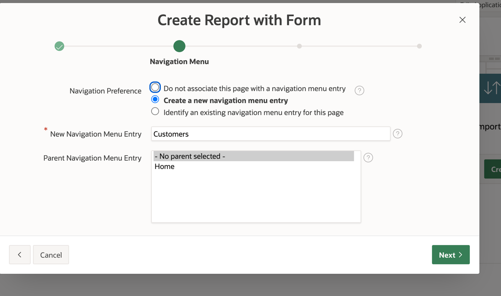

6. From the Data Source Screen, Table/View owner would be defaulted to **DEMO** schema and Select the table **S\_CUSTOMER** from the list of tables , and choose all the items that you would like to be displayed in the Create/Update/Delete Form,  **S\_CUSTOMER** is the same table that the customer form was also based on Form Builder, proceed to next step
    

7. From the Create Form - Columns and Primary Key Screen, Choose the **Primary key Column** and proceed to next step
    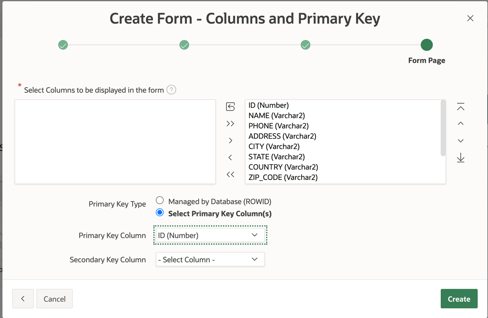

8. You will see the Page Created Successfully , you will see 2 pages created
    

   Wait until the page gets created, the page can take little time to get created, do not click on the **Create** more than once , it can result in unique constraint violation error. 

9. When you run the page, you will be able to see report with all the customers listed and you can edit or create new customer from the Report page.
    


10. **Customer Form** works in the similar way as **Forms Data Block**.
    If you want to manage the create/update operation from the **Interactive Reports** Page you can make the **Customer Form** to be a modal page.
    To make the **Customer Form** to be a modal page , you will have to make few changes to page settings
    From the Application Home Page, Click on Customer Form Page.
    
    Change the **Page Mode** to **Modal Dialog** and click save.
    
    From the Application Builder, Go to **Customer-Interactive Report** and run the page and click on **Create Button** or **Pencil Icon** , the customer modal window opens , you will be able to make changes or create new customer from the form.
    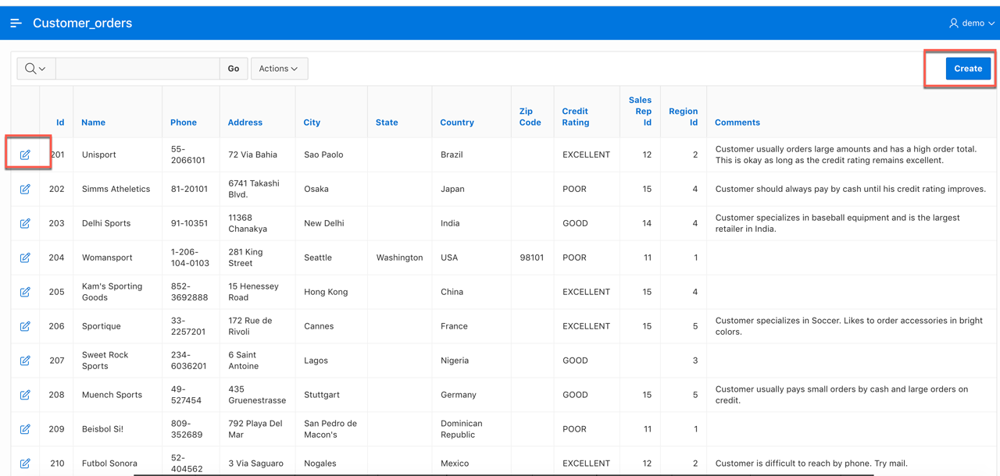

    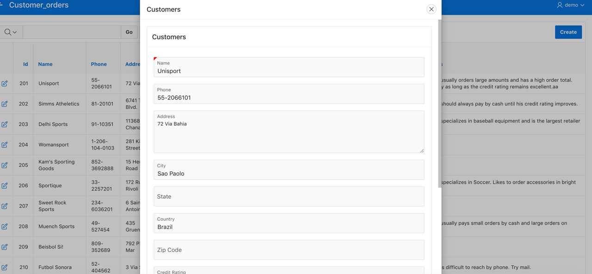

    Creating Customer Modal Form takes care of **Data Block** conversion and **Items** from Forms to APEX.

## Task 3:Create List of Values in Oracle Customer Form APEX page


1. From the App Builder Home Page, Click on **Migrations**
  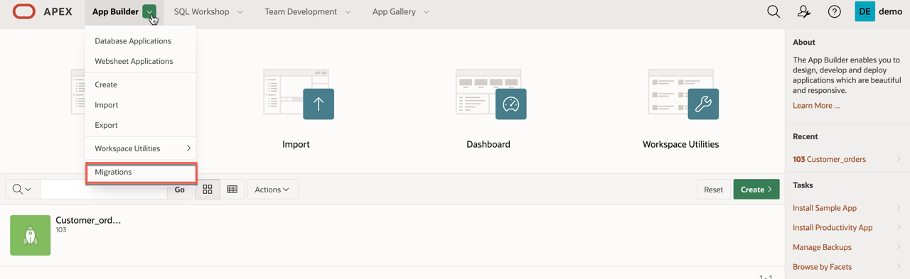

2. Click on **Forms Migration** Project you have created
  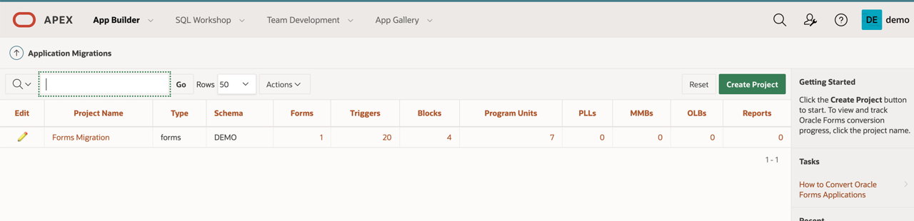

3. Click on **List of Values** on the **customers_fmb.xml** file name row
   

4. There is only one LOV for **Sales Rep LOV** , Click on the pencil icon , Copy the **Record Group Query**
  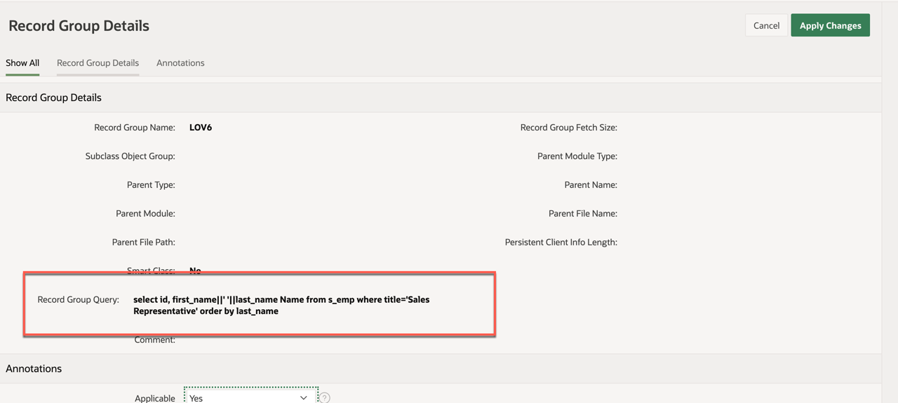

    ````
    <copy>
    select id, first_name||' '||last_name Name from s_emp where title='Sales Representative' order by last_name
    </copy>
    ````
5. Go to your Application Home Page, Click on **Shared Components** and Click on **List of Values**
  

6. Click on Create and choose **Source** as **From Scratch** and Click next.
  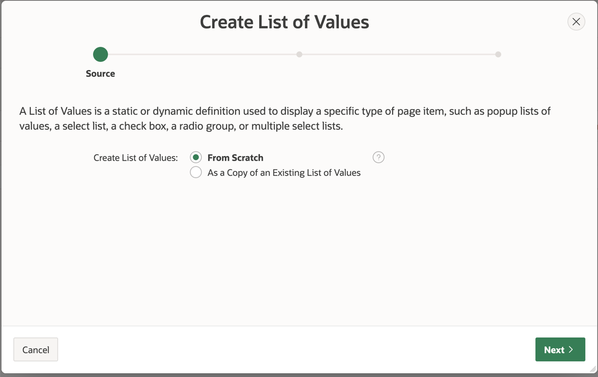

7. Specify the name of the List of Values , you can name it as **Salesrep LOV** and Click next.
      

8. Choose the source type as **SQL Query** and paste the query copied from the **Record Group Query** and click next.
      

9. Leave the default value and Click Create.
      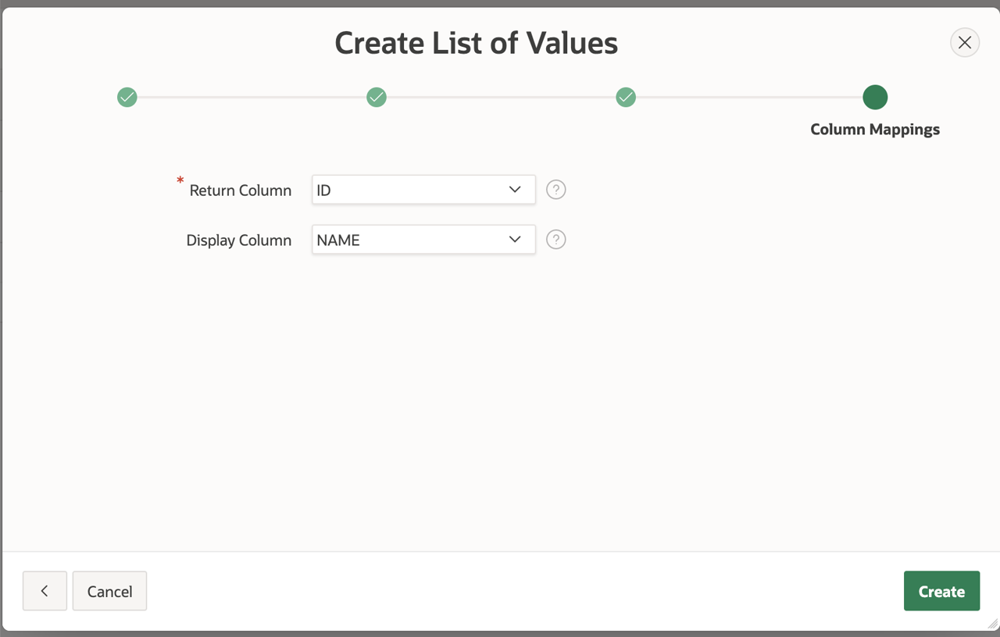

10. **List of values** will be created successfully.
      

11. To associate the List of Values to an item in the Page, Go to your Application Home Page, Click on Customer Form page
      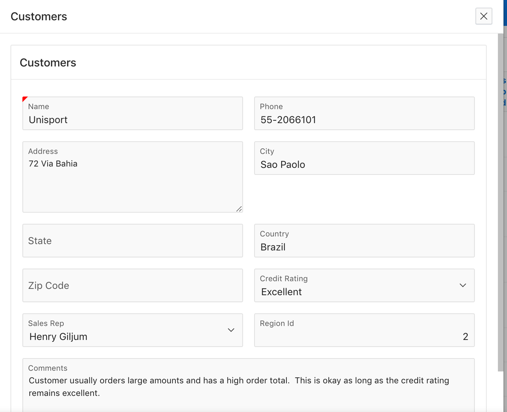

12. Identify the **Customers** Region and Click on **P3\_SALES\_REP\_ID** Item,Under the Page item Section , Change the **Type** to **Select List** and Scroll down to **List of Values** Section, Change the type to **Shared Component** and for **List of Values** select **Salesrep LOV** and Save the page.
      
      

That completes the List of Values section of the Migration.

## Task 4: Migrate Alerts from Forms to APEX  

1. From the App Builder Home Page, Click on **Migrations**
    

2. Click on **Forms Migration** Project you have created
    

3. Click on **Alerts** on the **customers\_fmb.xml** file name row
    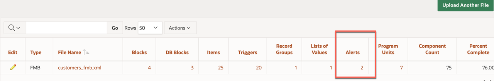

4. You will see two Alerts **DELETE\_ALERT** and **CONFIRM\_REVERT**
    

5. To See how we can migrate to APEX, Go to your Application Home Page, Click on Customer Form page.
    

6. Navigate to **DELETE** button Page item Property, you will see **DELETE_ALERT** is automatically handled by APEX.
    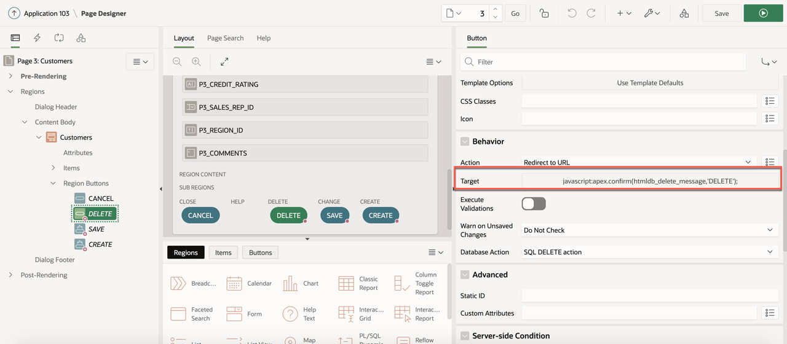

7. **CONFIRM_ALERT** is handled by Page setting, Change the **Warn on unsaved changes** to **Page Default**
    

## Task 5: Migrate Program Units from Forms to APEX  
    
1. **Program Units** logic of customer form does not apply to APEX as it is handled by default processing of APEX.

## Task 6: Migrate Triggers from Forms to APEX  

1. **Triggers** logic of customer form does not apply to APEX as it is handled by default processing of APEX.

## Task 7: Recreate Forms Tree Structure Triggers from Forms to APEX  

- **Customer Form** in the Oracle Forms Service was represented in a **Tree** Structure , You can easily recreate the tree structure in APEX.

1. From the Application Home Page, click **Create Page** and Click **Next**
  

2. From the Create Page, click **Blank Page** and Click **Next**


3. From the Create Blank Page, Enter the  **Page Name** and Click **Next**
    

4. Enter the name for the menu entry and Click **Next**
         

5. Finish the page
       

6. From the Blank Page, Click on **Create Region**
    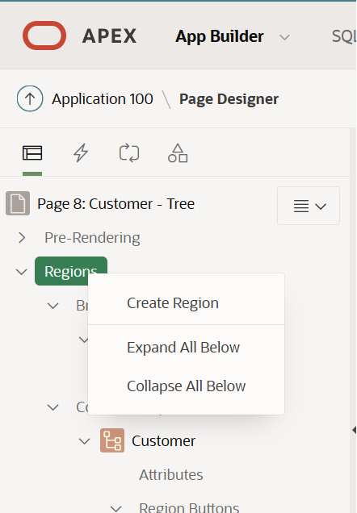   

7. Choose the **Tree** type under the **Identification** section of the region settings and **Source** as **SQL Query**
      

    Enter the below SQL
        
    ````
    <copy>
    SELECT CASE
        WHEN connect_by_isleaf = 1 THEN 0
        WHEN LEVEL = 1 THEN 1
        ELSE -1
        END  AS status,
        LEVEL,
        name AS title,
        icon,
        id   AS value,
        NULL AS tooltip,
        NULL AS LINK,
        parent_id,
        name,
        id_c
        FROM   (SELECT DISTINCT To_char (d.country) id,
                                To_char (NULL)      parent_id,
                                d.country           name,
                                'fa fa-globe'       icon,
                                NULL                id_c
                FROM   s_customer d
                UNION
                SELECT e.id
                        ||'_'
                        ||e.name,
                        e.country,
                        e.name
                        ||' - '
                        || e.address AS name,
                        'fa fa-user' icon,
                        id           id_c
                FROM   s_customer e)
        START WITH parent_id IS NULL
        CONNECT BY parent_id = PRIOR id
    </copy>
    ````
  8. In order for the Tree to show up, make the changes as shown below to **Settings** under **Attributes** Section and save the form.
        

  9. Link the tree node to **Customer Modal Form**
     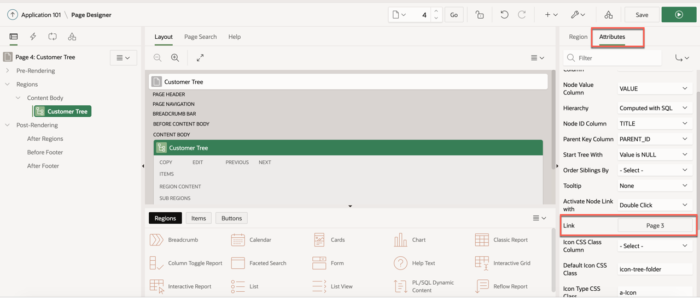

    and specify the values to be passed

    

  10. Save and Run the Page
        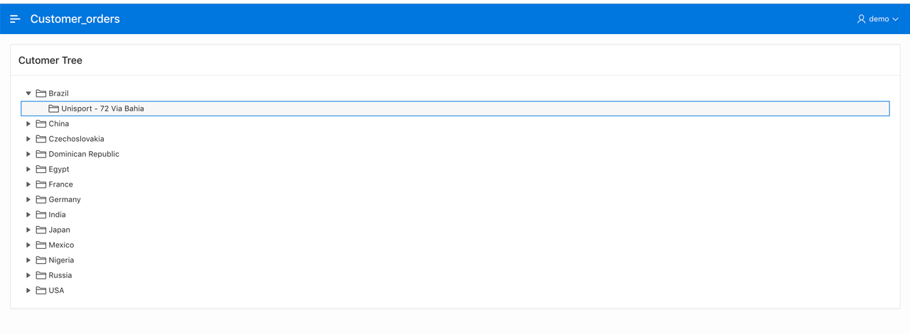

  11. Click on the tree node will open the **Customer Modal Form**
        


  Great Job !! You have successfully completed transforming the **Customer** Form to **Faceted Search Report and Form** in APEX and also recreated the **Tree** Structure similar to **Oracle Forms Structure**.

## Task 8: Additional Enhancements to Customer Form

We can enhance the customer form in APEX page to utilize the user friendly features in APEX.

### Create the **Static LOV** for *Credit Rating*

1. Go to your Application Home Page, Click on **Shared Components** and Click on **List of Values**
  

2. Click on Create and choose **Source** as **From Scratch** and Click next
  

3. Enter the name **CREDIT_RATING_LOV** and Choose **Static** for the list of value type
   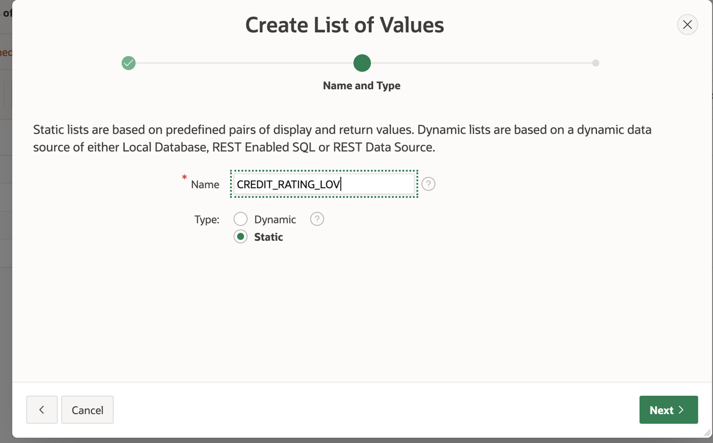

4. Enter the values for Display and Return value as outlined
  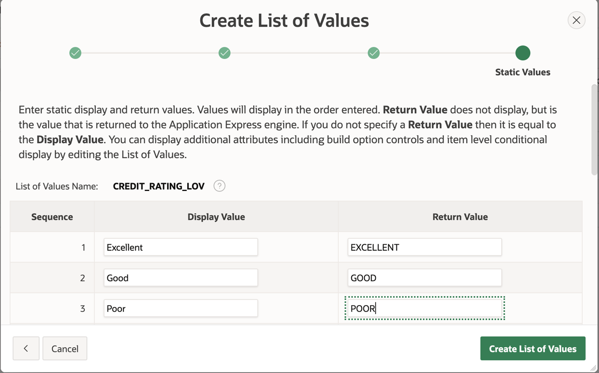

5. Attach to the **Credit Rating ID** field in the Customer Form
  

### Customize the Order and Display of columns in the Customer form
When you create a form using the wizard, it automatically creates an item for each column in the table. Depending on the column type, it creates a Text Field, Textarea, Date Picker or Number Field item.

Once the page is created, you can go to the page and make the changes you need. Select a different type of element, edit the label and more.

1. You can make more than one column to show in the same row by toggling the **Start New Row**
  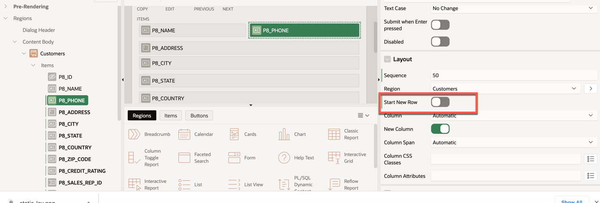

2. You can organize items by dragging and drop them.
  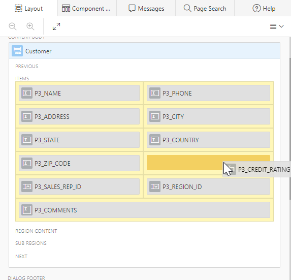

3. Once you finish customizing, when you run the customer form you will see the customized form
  


## Acknowledgements

 - **Author** -  Vanitha Subramanyam, Senior Solution Architect
 - **Contributors** -Abhinav Jain, Staff Cloud Engineer, Sakthikumar Periyasamy Senior Cloud Engineer, Nayan Karumuri Staff Cloud Engineer
 - **Last Updated By/Date** - Andres Quintana, March 2022


