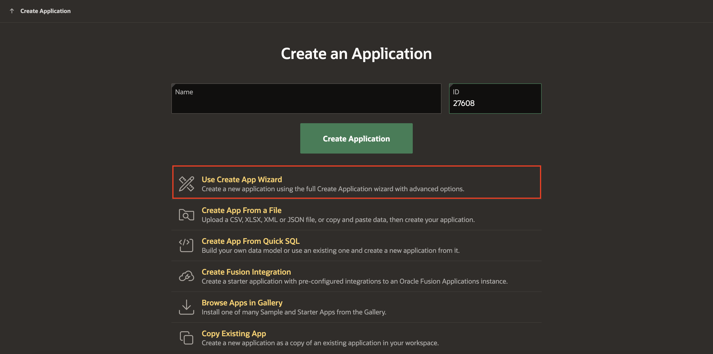
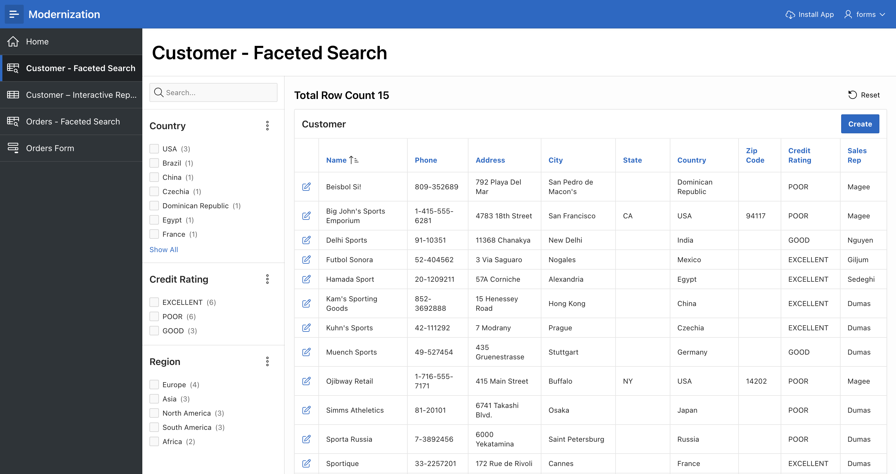

# Create the APEX Application

## Introduction

In this lab, you will create an Oracle APEX application using the create application wizard. This process will help you transition from Oracle Forms to APEX by creating a modern web application interface for your database objects.

Before we begin, let's recap what we have set up so far:

- An Always-Free Autonomous Database.
- An APEX Workspace with the necessary database objects already loaded.

The goal of this lab is to guide you through the steps to create an APEX application with various types of pages such as faceted search, interactive reports and forms. This will showcase the flexibility and power of APEX in building sophisticated web applications with ease.

By the end of this lab, you will have an APEX application with multiple pages, each demonstrating different features and functionalities, ready to be enhanced further in subsequent labs.

Estimated Time: 5 Minutes

### Objectives

In this lab, you:

- Create an Oracle APEX application using the create application wizard.
- Add multiple types of pages such as faceted search, interactive reports and forms to the APEX application.
- Manage and enhance application pages.

## Task 1: Create an Application

1. First, log in to your APEX workspace.

2. Click **App Builder**.

    

3. On **App Builder** page, click **Create a New App**.

    

4. Click **Use Create App Wizard**.

    

5. Since you will create a new application, enter the name **Modernization** and leave the app icon and appearance with default values. Click **Add Page**.

    

    >*Note: Default App Icon could be different in your environment, for simplicity just accept the default.*

6. Select **Faceted Search**.

    

7. On **Add Faceted Search Page**, enter/select the following:

    - Page Name: **Customer - Faceted Search**

    - Table: **S\_CUSTOMER**

    - Check the **Include Form** checkbox

     Click **Add Page**.

   

8. On Create an Application page, click **Add Page** to add another page for customers table (S\_CUSTOMER) and select **Interactive Report**.

    

9. On **Add Report Page**, enter/select the following:

    - Page Name: **Customer – Interactive Report**

    - Table or View: **S\_CUSTOMER**

    Click **Add Page**.

    

10. Add a new page for the S_ORD table. Click **Add Page** and select **Faceted Search**.

    

11. On **Add Faceted Search Page**, enter/select the following:

    - Page Name: **Orders - Faceted Search**

    - Table: **S\_ORD**

    Click **Add Page**.

    

12. Add a new form for the S_ORD table to manage the orders. Click **Add Page** and select **Form**.

    

13. On **Create Form Page**, enter the following:

    - Page Name: **Orders Form**

    - Table: **S\_ORD**

    Click **Add Page**.

    

14. Under **Features**, check **Install Progressive Web App** and click **Create Application**.

    

## Task 2: Run the Application

1. Now let’s run the application from the current page as a developer. Click **Run Application**.

    

2. Enter the credentials. The home page includes a link to the pages created previously. You can edit this page as you need. Click on the hamburger menu on the top to explore all the pages.

    

    

## Summary

You have now created the APEX application with multiple report example scenarios for the Customer, Orders tables.
In the next lab you will undertake Oracle Forms functionalities enhancement steps in APEX.

## Acknowledgements

- **Author** - Monica Godoy, Senior Principal Product Manager ; Ankita Beri, Product Manager; Paolo Paolucci, Data Development Specialist; Victor Mendo, Data Development Specialist
- **Last Updated By/Date** - Ankita Beri, Product Manager, January 2025
