# Create the APEX Application

## Introduction

In this lab, you will create an Oracle APEX application using the create application wizard. This process will help you transition from Oracle Forms to APEX by creating a modern web application interface for your database objects.

Before we begin, let's recap what we have set up so far:

- An Always-Free Autonomous Database
- An APEX Workspace with the necessary database objects already loaded

The goal of this lab is to guide you through the steps to create an APEX application with various types of pages such as faceted search, interactive reports, and master-detail pages. This will showcase the flexibility and power of APEX in building sophisticated web applications with ease.

By the end of this lab, you will have an APEX application with multiple pages, each demonstrating different features and functionalities, ready to be enhanced further in subsequent labs.

Estimated Time: 15 Minutes

### Objectives

In this lab, you:

- Create an Oracle APEX application using the create application wizard.
- Add multiple types of pages such as faceted search, interactive reports, and master-detail pages to the APEX application.
- Manage and enhance application pages.

## Task 1: Create an Application

1. First, log in into your APEX workspace.

2. Click **App Builder**.

    

3. On app builder page, click **Create a New App**.

    

4. Click **Use Create App Wizard**.

    

5. Since you will create a new application, enter the name **Modernization** and leave the app icon and appearance with default values. Click **Add Page**.

    

 *Note: Default App Icon could be different in your environment, for simplicity just accept the default.*

6. Select **Faceted Search**.

    

7. For add faceted search page, enter/ select the following:

    - Page Name: **Customer - Faceted Search**

    - Table: **S\_CUSTOMER**

    - **Check** the **Include Form** checkbox

     Click **Add Page**.

   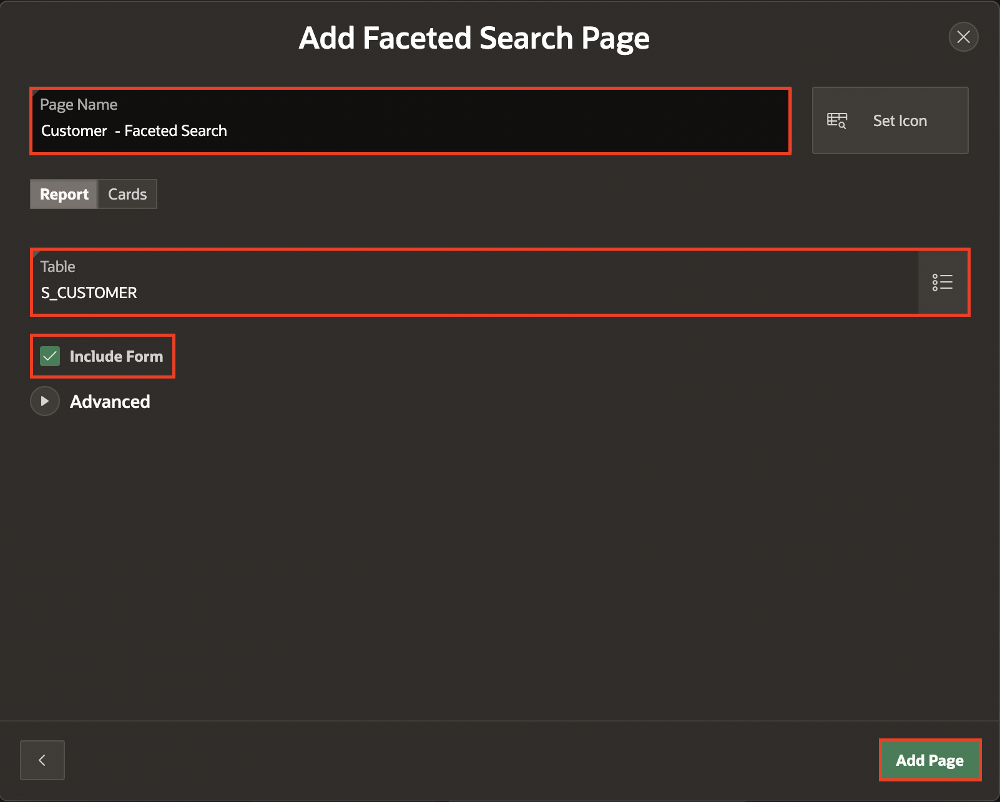

8. On create an application page, click **Add Page** to add another page for customers table (S\_CUSTOMER) and select **Interactive Report**.

    

9. For the add report page, enter/select the following:

    - Page Name: **Customer – Interactive Report**

    - Table or View: **S\_CUSTOMER**

    - **Check** the **Include Form** checkbox

    Click **Add Page**.

    

10. On the create an application page, add another page for the ORDERS table by clicking **Add Page** as done previously and selecting **Master Detail**.

    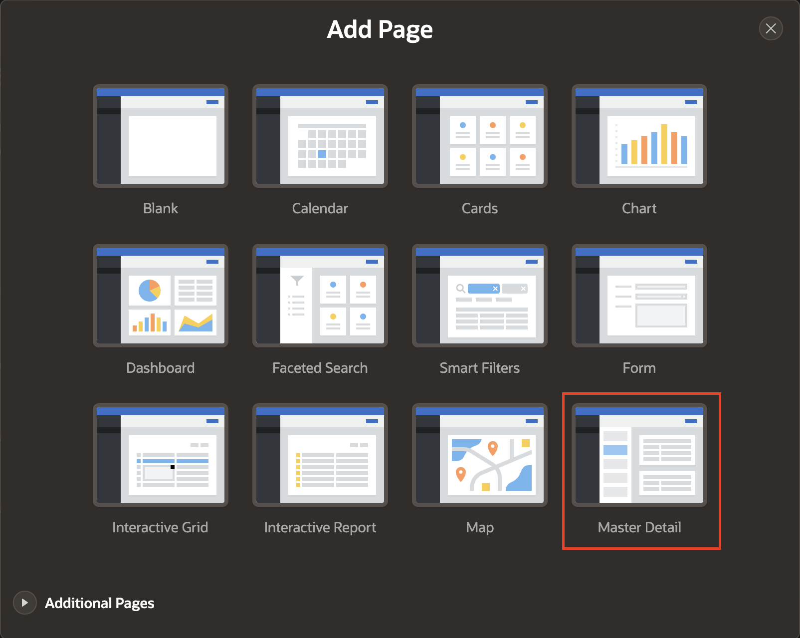

11. For add master detail page, enter/select the following:

    - Page Name: **Orders – Stacked**

    - Select **Stacked** as Master Detail layout page.

    - Table: **S\_ORD**

    - Detail Table: **S\_ITEM**

    Click **Add Page**.

    

12. Add a new form for the S_ORD table. Click **Add Page** and select **Faceted Search**.

    

13. On Add faceted search page, enter/select the following:

    - Page Name: **Orders - Faceted Search**

    - Table: **S\_ORD**

    Click **Add Page**.

    

14. Under features, check **Install Progressive Web App** and click **Create Application**.

    

## Task 2: Run the Application

1. Now let’s run the application from the current page as a developer. Click **Run Application** icon.

    

2. Enter the credentials. The home page includes a link to the pages created previously. You can edit this page as you need. Click on the hamburger menu on the top to explore all the pages.

    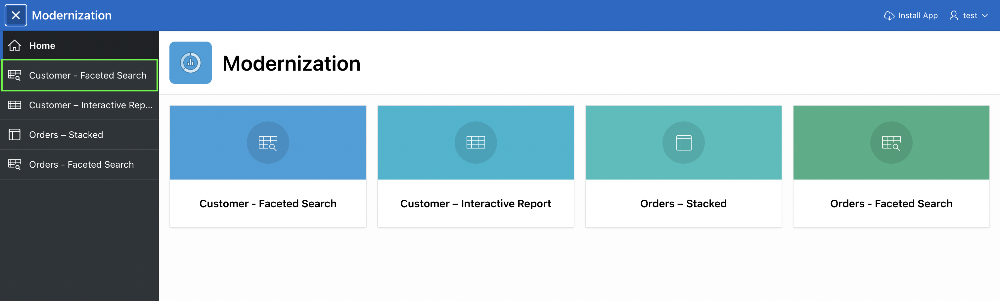

    

## Task 3: Create Side-by-Side Master Detail Page

1. Go back to the application builder to create a new page for orders. Click **Create Page**.

    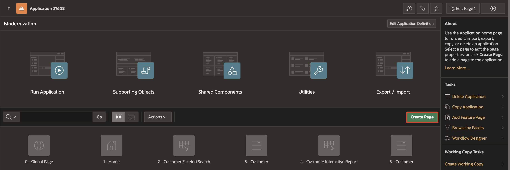

2. On create a page dialog, select **Master Detail**.

    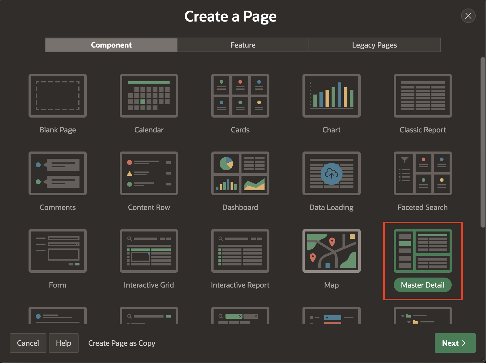

3. Previously, you created a master detail page for orders and items in a stacked style. Now, you will create another type of master detail page in a side-by-side style. For that, click **Side-by-Side** and click **Next**.

    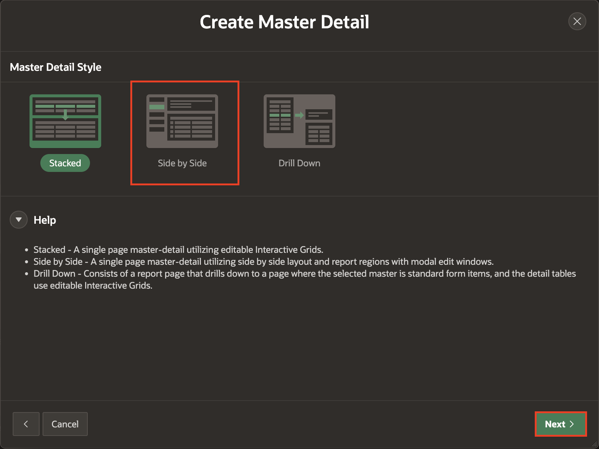

4. On **Create Master Detail** dialog, enter/select the following:

    - Page Definition > Master Detail Page Name: **Orders – Side by Side**

    - Navigation > Breadcrumb Parent Entry: **Home (Page 1)**

    Click **Next**.

  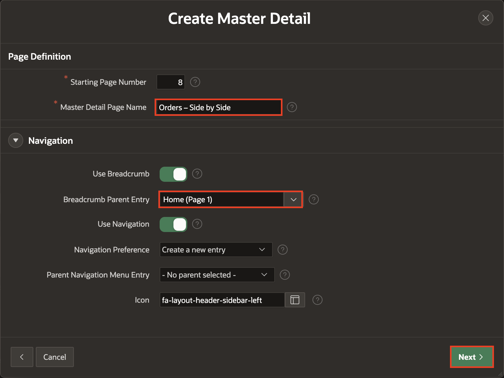

5. Next, on the **Create Master Detail** dialog, enter/select the following:

    - Master Table: **S\_ORD**

    - Primary Display Column: **DATE\_ORDERED (Date)**

    - Secondary Display Column: **PAYMENT\_TYPE (Varchar2)**

    - Detail Table: **S\_ITEM**

    Click **Create Page**.

  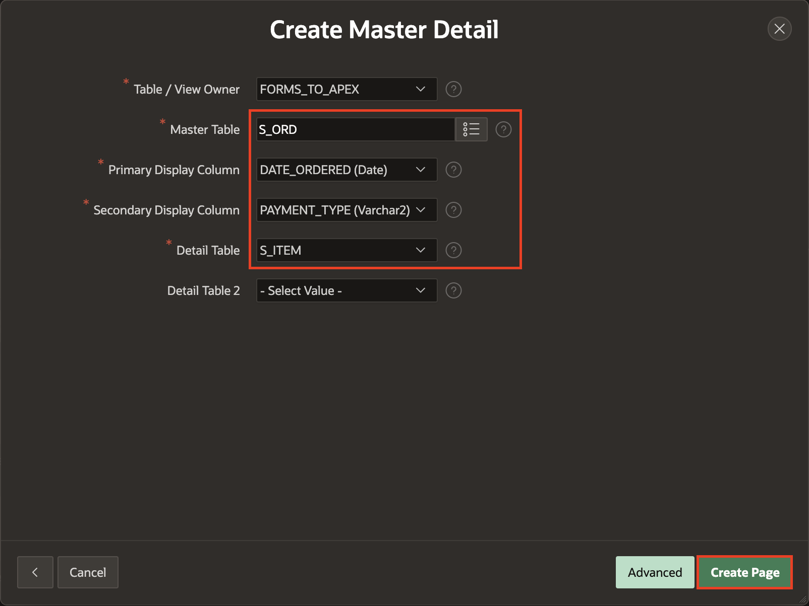

6. Page Designer is shown. Page Designer can maintain and enhance pages within an APEX app. Page Designer is a full featured Integrated Development Environment (IDE) that includes a toolbar and multiple panes:

    - **Left Pane**: Includes four tabs that display as a tree: Rendering, Dynamic Actions, Processing, and Shared Components.

    - **Central Pane**: This pane includes five tabs: Layout, Component View, Messages, Page Search, and Help.

    - **Right Pane**: Displays the property editor. Use the property editor to update attributes for the selected component.

  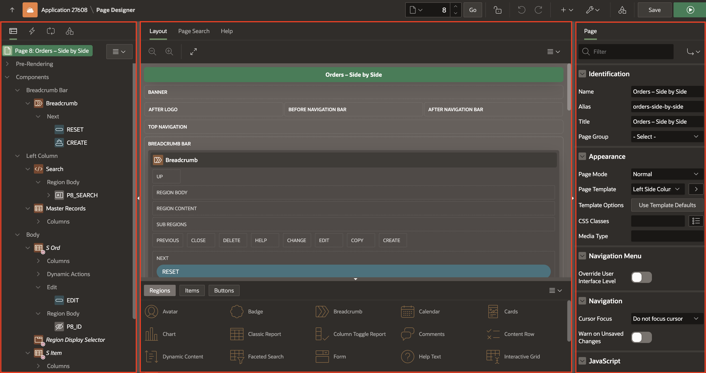

7. Now **Run** this page clicking the green play button at the top right of page Designer and here you see the other master-detail layout, other than stacked one, in which three panel are displayed:

    - **Left vertical Panel**: Here S\_ORD master table primary and secondary display columns (DATE\_ORDERED, PAYMENT\_TYPE) are displayed.

    - **Upper Horizontal Panel**: Here, other S\_ORD master table details are displayed, when the primary and secondary columns are chosen accordingly.

    - **Lower Horizontal Panel**: Here S\_ITEM detail table items are displayed and which displayed values are referenced accordingly to the related Order ID.

  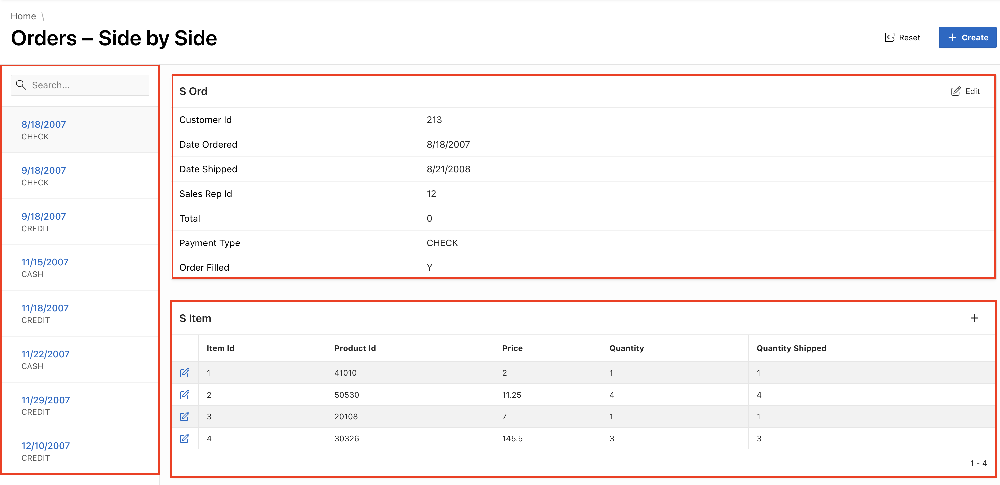

8. If you click on a key element on left vertical panel (example: 9/18/2007 CHECK) you get the details, in a single page, of orders master table and order items detail one.

    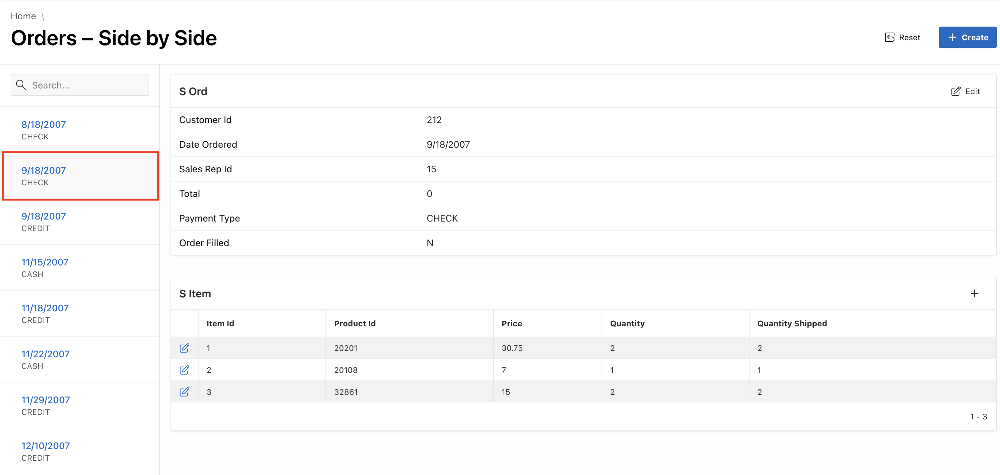

## Task 4: Create Drill-down Master Detail Page

In this task, you will create another master-detail style page for orders with **Drill Down** layout.

1. Navigate back to page designer, navigate to **(+ v)** from page designer toolbar and click **Page**.

    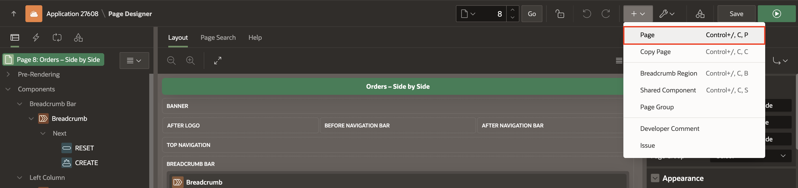

2. Select **Master Detail**.

    

3. For **Master Detail style**, select **Drill Down**.

    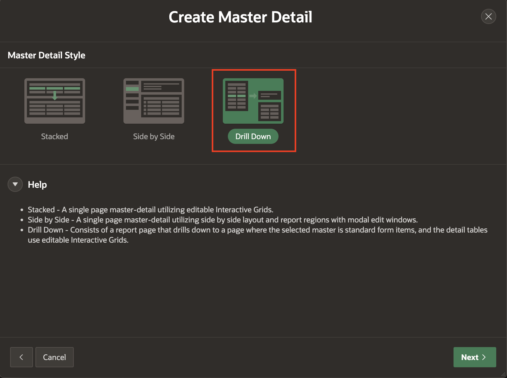

4. On **Create Master Detail** dialogs, enter/select the following:

    - Name: **Orders – Drill Down**

    - Table/View Name: **S\_ORD**

    - Navigation > Breadcrumb Parent Entry:  **No parent entry**

    Click **Next**.

   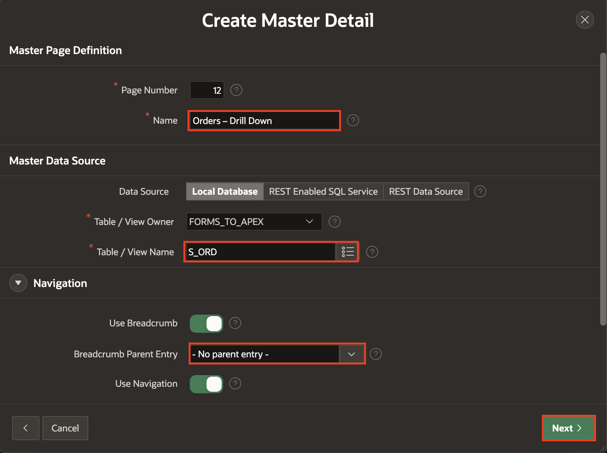

    - Form Navigation Order: **ID (Number)**

    Click **Next**.

   

    - Name: **Order Items – Drill Down**

    - Table/View Name: **S\_ITEM**

    Click **Next**.

   

    - Primary Key Column 1: **ITEM\_ID (Number)**

    - Master Detail Foreign Key: **ID ->ORD\_ID**

    Click **Create Page**.

   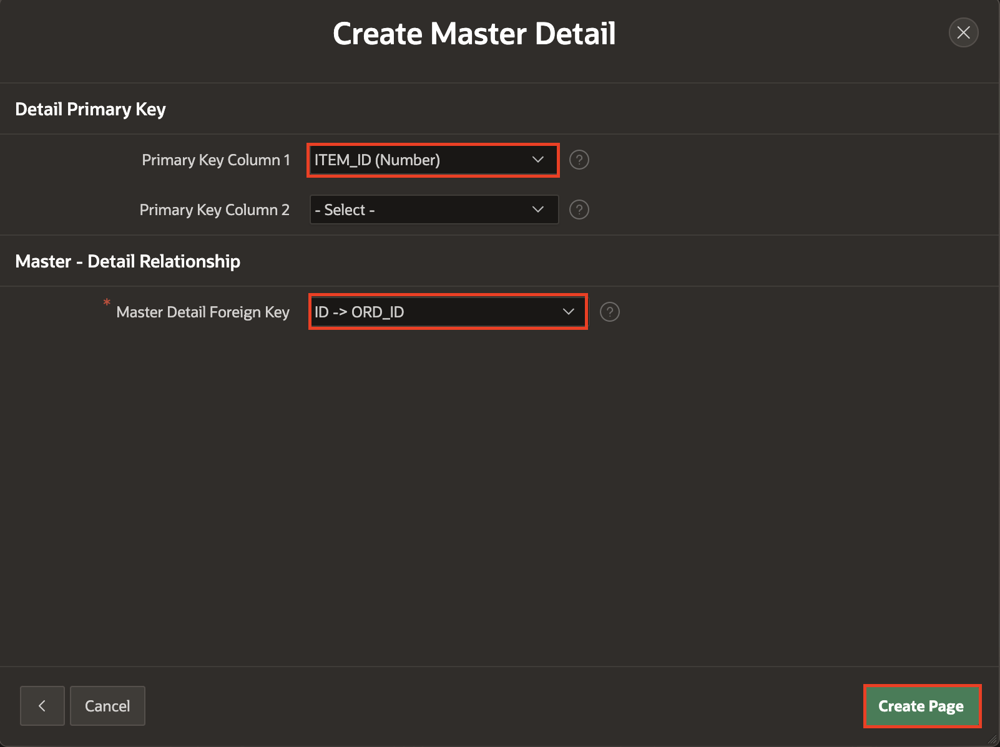

5. **Run** the page by clicking the green arrow button on right upper side.

    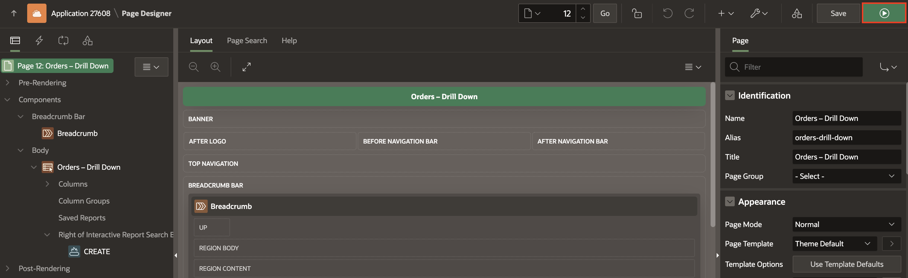

6. The master detail order items drill down shows up in the home menu pane and the report with master orders records. If you try to click on the edit icon of a specific orders record you see the drill-down display of the master-detail report page.

    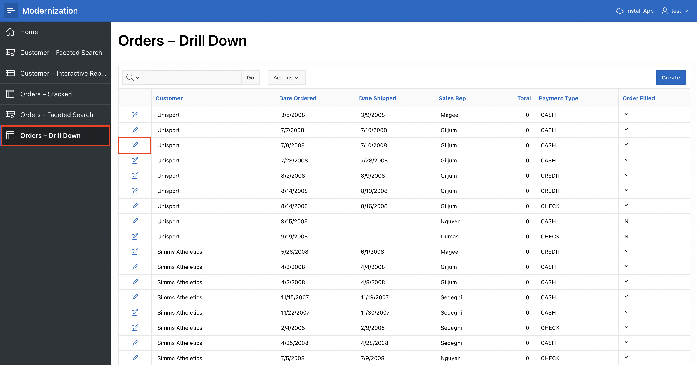

7. If you click on the arrows under the “Form on S\_ORD” panel, you can navigate through the Master orders table rows, and corresponding order items detail rows are displayed accordingly.

    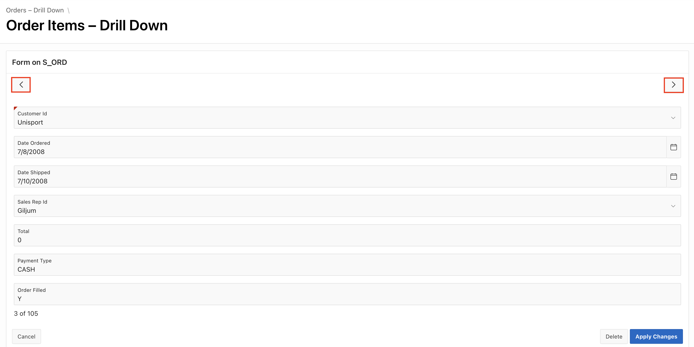

## Summary

You have now created the APEX application with multiple report example scenarios for the Customer, Orders, and Order Items tables.
In the next lab you will undertake Oracle Forms functionalities enhancement steps in APEX.

## Acknowledgements

- **Author** - Monica Godoy, Senior Principal Product Manager ; Ankita Beri, Product Manager; Paolo Paolucci, Data Development Specialist; Victor Mendo, Data Development Specialist
- **Last Updated By/Date** - Ankita Beri, Product Manager, July 2024
