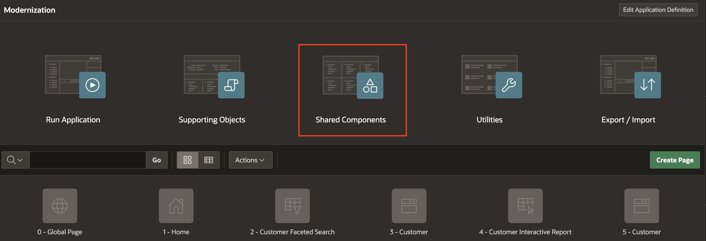
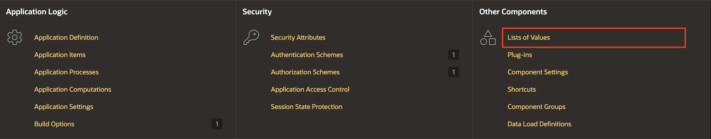
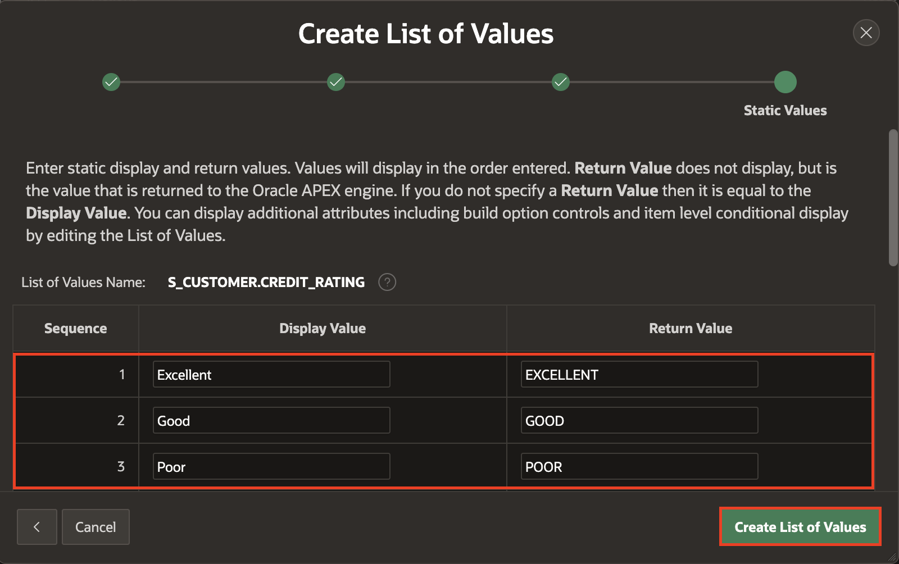
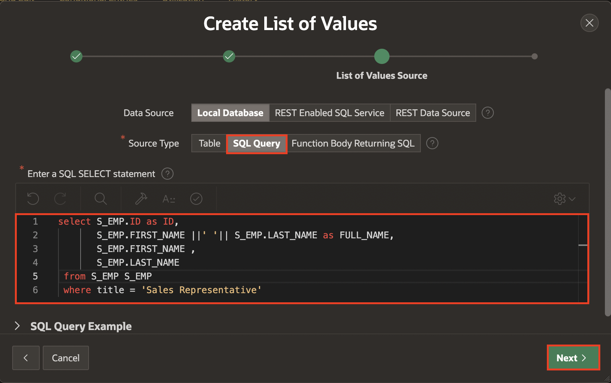
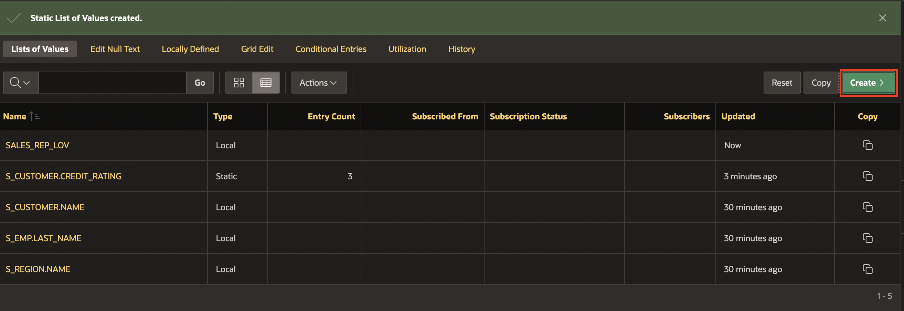

# Configure List of Values

## Introduction

You will create five lists of values that will be useful in the Faceted Search Page and Orders Page:

- **S\_CUSTOMER.CREDIT\_RATING**: The table S\_CUSTOMER has a column named CREDIT\_RATING with a check constraint. The column can only contain the following values: EXCELLENT, GOOD, and POOR. Creating a list of values is important to prevent end-users from entering invalid options.

    

- **SALES\_REP\_LOV**: A dynamic list of values based on the S_EMP table.

- **S\_CUSTOMER.NAME**: A dynamic list of values based on the S_CUSTOMER table. This List of Values has already been created.

- **S\_ORD.PAYMENT\_TYPE**: A static list of values using the following values: CASH, CREDIT, CHECK

- **S\_PRODUCT.NAME**: A dynamic list of values based on the S_PRODUCT table.

Estimated Time: 5 Minutes

### Objectives

In this lab, you will build the list of values needed to help you accelerate the development process.

## Task 1: Configure List of Values

1. To create **List of Values**, click **App Builder** and select your application: **Modernization**.

    

    

2. Click **Shared Components**.

    

3. Under **Other Components**, click **Lists of Values**.

    

4. Click **Create**.

    

5. Create list of values **From Scratch** and click **Next**.

    

6. Under **Name and Type**, enter/select the following:

    - Name: **S\_CUSTOMER.CREDIT\_RATING**

    - Type: **Static**.

    Click **Next**.

    

7. Enter the following display values and return values:

    | Display Value | Return Value |
    |---------------|--------------|
    |Excellent      | EXCELLENT |
    |Good           | GOOD |
    | Poor          | POOR |
    {: title="List of Values"}

    Click **Create List of Values**.

    

8. Click **Create** to create another list of values.

    

9. Create list of values **From Scratch** and click **Next**.

    

10. For **Name**: enter **SALES\_REP\_LOV** and click **Next**.

    

11. Under **List of Values Source**, enter/select the following:

    - Source Type: **SQL Query**

    - Enter a SQL SELECT statement: Copy and Paste the below query into the code editor:

        ```
        <copy>
        select S_EMP.ID as ID,
           S_EMP.FIRST_NAME ||' '|| S_EMP.LAST_NAME as FULL_NAME,
           S_EMP.FIRST_NAME ,
           S_EMP.LAST_NAME
        from S_EMP S_EMP
        where title = 'Sales Representative'
        <copy>
        ```

    Click **Next**.

    

12. Click **Create**.

    

13. Click **Create** to create another list of values.

    

14. Create list of values **From Scratch** and click **Next**.

    

15. Enter/select the following and click **Next**.

    - Name: **S\_ORD.PAYMENT\_TYPE**

    - Type: **Static**

    

16. Enter the following **Display Value** and **Return Value** and click **Create List of Values**.

    | Display Value | Return Value |
    |---------------|--------------|
    |CASH           | CASH         |
    |CREDIT         | CREDIT       |
    |CHECK          | CHECK        |
    {: title="List of Values"}

    

17. Click **Create** to create another list of values.

    

18. Create list of values from scratch and click **Next**.

    

19. Enter/select the following and click **Next**.

    - Name: **S\_PRODUCT.NAME**

    - Type: **Dynamic**

    

20. Under list of values Source, enter the following and click **Next**.

    - Table / View Name: **S\_PRODUCT(table)**

    

21. Click **Create**.

    

## Summary

In this lab, you learned how to create useful list of values that you will use in the next labs.

## Acknowledgements

- **Author** - Monica Godoy, Senior Principal Product Manager ; Ankita Beri, Product Manager; Paolo Paolucci, Data Development Specialist; Victor Mendo, Data Development Specialist
- **Last Updated By/Date** - Ankita Beri, Product Manager, January 2025
