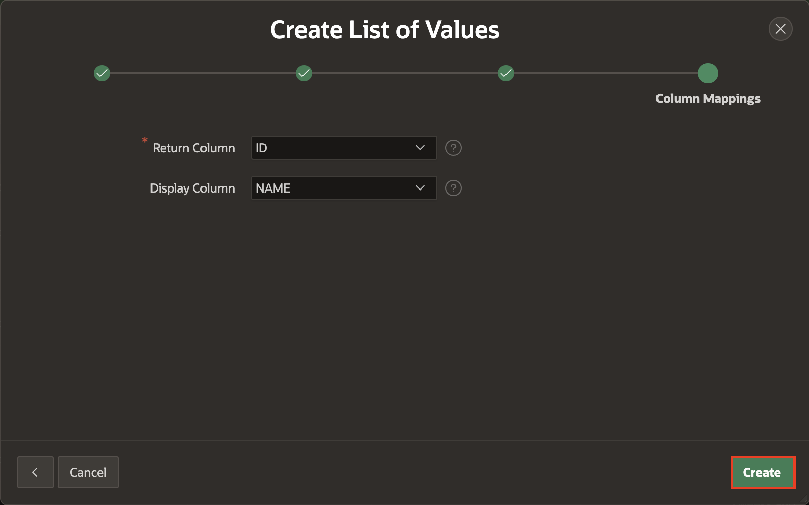
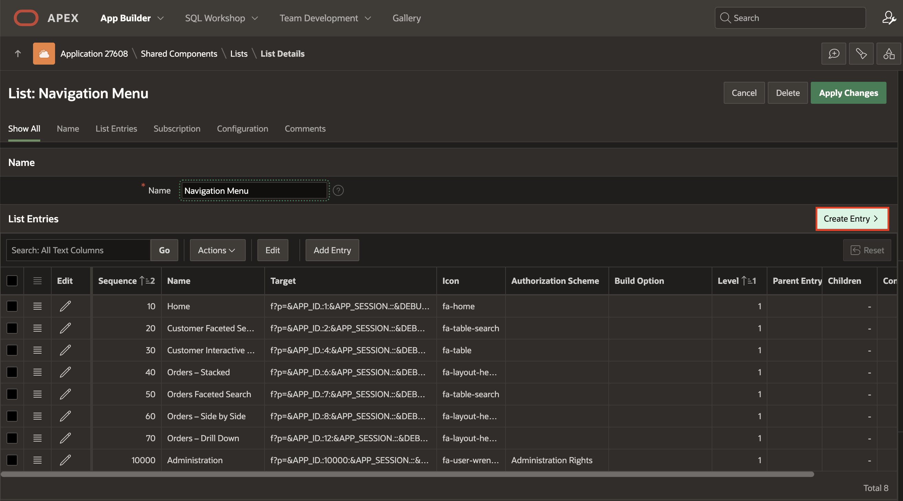
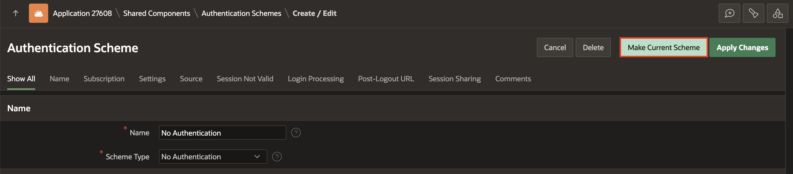

# Enhance Oracle Forms functionalities using APEX

## Introduction

After following the guidelines in the previous labs on best practices to modernize Forms in APEX, let’s see how you can further enhance the applications created with APEX’s functionalities.

In this lab, you will build on the business logic analysis performed on the “Customers’ form” in Lab 1. After migrating and enhancing the business logic, it’s time to modernize the application within APEX.

Estimated Time: 15 Minutes

### Objectives

In this lab, you:

- Configure List of Values
- Define and organize facets for the faceted search page to filter data effectively.
- Define and personalize the interactive report views, allowing end-users to interact with and save their report configurations.
- Create and organize navigation menu entries for customers and orders, and assign appropriate parent list entries to make the menu cleaner and more user-friendly.
- Disable authentication to make the application publicly accessible, suitable for a public-facing application.

## Task 1: Configure List of Values

There are five lists of values that can be useful in the faceted search page and orders Page:

- **S\_CUSTOMER.CREDIT\_RATING**: The table S\CUSTOMER has a column named CREDIT\_RATING with a check constraint. The column can only contain the following values: EXCELLENT, GOOD, POOR. Creating a list of values is important to prevent end-users from entering invalid options.

    

- **SALES\_REP\_LOV**: A dynamic list of values based on the S_EMP table.

- **S\_CUSTOMER.NAME**: A dynamic list of values based on the S_CUSTOMER table. This List of Values has already been created.

- **S\_ORD.PAYMENT\_TYPE**: A static list of values using the following values: CASH, CREDIT, CHECK

- **S\_PRODUCT.NAME**: A dynamic list of values based on the S_PRODUCT table.

1. To create the list of values, click **App Builder** and select your application: **Modernization**.

    

    

2. Click **Shared Components**.

    

3. Under **Other Components**, click **List of Values**.

    

4. Click **Create**.

    

5. Create list of values from scratch and click **Next**.

    

6. Under **Name and Type**, enter/select the following:

    - Name: **S\_CUSTOMER.CREDIT\_RATING**

    - Type: **Static**.

    Click **Next**.

    

7. Enter the following display values and return values:

    | Display Value | Return Value |
    |---------------|--------------|
    |Excellent      | EXCELLENT |
    |Good           | GOOD |
    | Poor          | POOR |
    {: title="List of Values"}

   Click **Create List of Values**.

   

8. Click **Create** to create another list of values.

9. Create list of values **from Scratch** and click **Next**.

    

10. For Name: enter **SALES\_REP\_LOV** and click **Next**.

    

11. Under **List of Values Source**, enter/select the following:

    - Source Type: **SQL Query**

    - Enter a SQL SELECT statement: Copy and Paste the below query into the code editor:

    ```
    <copy>
    select S_EMP.ID as ID,
       S_EMP.FIRST_NAME ||' '|| S_EMP.LAST_NAME as FULL_NAME,
       S_EMP.FIRST_NAME ,
       S_EMP.LAST_NAME
     from S_EMP S_EMP
     where title = 'Sales Representative'
    <copy>
    ```
    Click **Next**.

    

12. Click **Create**.

    

13. Click **Create** to create another list of values.

    

14. Create list of values **from Scratch** and click **Next**.

    

15. Enter/select the following and click **Next**.

    - Name: **S\_ORD.PAYMENT\_TYPE**

    - Type: **Static**

    

16. Enter the following **Display Value** and **Return Value** and click **Create List of Values**.

    | Display Value | Return Value |
    |---------------|--------------|
    |CASH           | CASH         |
    |CREDIT         | CREDIT       |
    |CHECK          | CHECK        |
    {: title="List of Values"}

    

17. Click **Create** to create another list of values.

    

18. Create list of values from scratch and click **Next**.

    

19. Enter/select the following and click **Next**.

    - Name: **S\_PRODUCT.NAME**

    - Type: **Dynamic**

    

20. Under list of values Source, enter the following and click **Next**.

    - Source Type: Table

    - Table / View Name: **S\_PRODUCT**

    

21. Click **Create**.

    

## Task 2: Customize the Customer Form

When the wizard creates a form, an item is automatically created for each column in the table. Depending on the column type, it creates a Text Field, Text area, Date Picker, or Number Field item.

Once the page is created, you can make the changes you need. Select a different type of element, edit the label and more. Moreover, you can organize items by dragging and drop them.

To use the list of values previously created:

1. Navigate to **Application ID** and select your application.

    

2. Select **3 - Customer**.

    

3. Organize items by dragging and dropping them.

    

4. In the left pane, select **P3\_CREDIT\_RATING**. In the property editor, update the following:

    - Identification > Type: **Radio Group**

    - Settings > Number of Columns: **3**

    - Under List of Values:

        - Type: **Shared Component**

        - List of Values: **S\_CUSTOMER.CREDIT\_RATING**

        - Display Extra Values: **Toggle Off**

        - Display Null Value: **Toggle Off**

    Click **Save**.

   

## Task 3: Customize the Faceted Search

You can define which facets to filter the data. Some are defined automatically, but you can create or delete them as needed. You can also drag and drop facets to change their display order.

1. From the page designer, navigate to the **Customer Faceted Search**.

    

2. In the left pane, under **Search**, right-click **Facets** and click **Create Facet**.

    

3. Create the following three facets one after the other:

    | NAME | TYPE | LABEL | LIST OF VALUES TYPE | LIST OF VALUES |
    |----- | ----- | ----- | -------------------- | -------------- |
    |P2\_CITY | Checkbox Group | City | Distinct Values |   |
    | P2\_NAME | Checkbox Group | Name | Distinct Values |   |
    | P2\_SALES\_REP\_ID | Checkbox Group |Sales Rep | Shared Component| SALES\_REP\_LOV|
    {: title="Facets"}

    

4. Now organize the facets in the following order:
    |Facets|
    |------|
    |P2\_CREDIT\_RATING|
    |P2\_REGION\_ID|
    | P2\_COUNTRY |
    | P2\_CITY |
    | P2\_NAME |
    | P2\_SALES\_REP\_ID |
    {: title="Reorder Facets"}

    

5. Click Save.

## Task 4: Customize the Interactive Report

In this task, you will define how end-users can interact with and personalize their report views using Oracle APEX Interactive Reports. Interactive reports offer a powerful way to present data, allowing both developers and end-users to tailor the reports to their needs. Developers can define primary or alternative reports, while end-users can save private reports for their individual use.

1. **Run** the application as a developer.

    

2. Navigate to **Customer Interactive Report**.

    

3. Click **Actions** and select **Columns**.

    

4. Move the columns **Comments, Region, Zip Code** from **Display in Report** region to **Do Not Display** region. There are two ways to do it:
    - Go to the column and double click on the column.
    - Click the column and remove it by clicking the icon Remove (<).

    

5. In **Display in Report** region, select the column **Credit Rating**. Click the icon Up **(↑)** to move it up to the second place and click **Apply**.

    

6. Click **Actions** and select click **Format** > **Control Break**.

    

7. For column, select the column **Name** and click **Apply**.

    

8. To save the primary report, click **Actions** > **Report** > **Save Report**.

    

9. For save, select **As Default Report Settings**.

    

10. For default report type, select **Primary** and click **Apply**.

    

## Task 5: Enhance Navigation Menu

In this lab, you will learn how to manage the navigation menu in an APEX application. By default, an APEX application includes a navigation menu, which can be displayed either on the side or across the top of the application. This menu is customizable, and you also have the option to remove it entirely if desired.

For this task, you will focus on cleaning up the navigation menu by creating two new entries: one for Customers and another for Orders. Follow the steps outlined below to add these new entries to the navigation menu.

1. Navigate to **Shared Components**.

    

2. Under **Navigation and Search**, click **Navigation Menu**.

    

3. Click **Navigation Menu**.

    

4. Click **Create Entry**.

    

5. Enter/select the following:

    - Under Entry:

       - Sequence: **15**

       - Image/Class: **fa-user-circle**

       - List Entry Label: **Customers**

    - Target > Target type: **No Target**

     Click **Create and Create Another**.

     

6. Enter/select the following:

    - Under Entry:

       - Sequence: **20**

       - Image/Class: **fa-forms**

       - List Entry Label: **Orders**

    - Target > Target type: **No Target**

     Click **Create List Entry**.

     

7. Customers and orders entries are created and now you need to define the parent list entry for the rest of the entries. In the desktop navigation menu, go to the Customer and Order options to select the proper parent entry.

8. Click each customer entries. For parent list entry, select **Customers** and click **Apply Changes**.

    

    

9. Click each order entries. For parent List Entry, select **Orders** and click **Apply Changes**.

10. Finally, the menu looks cleaner and easy to use.

    

## Task 6: Set Authentication Scheme

In this lab, you will learn how to disable authentication in an APEX application. Authentication is the process of verifying each user's identity before they can access your application. This typically involves entering a username and password, but can also include the use of digital certificates or secure keys.

Since this application is intended to be public, we will disable the authentication feature. Follow these steps to turn off authentication:

1. Navigate to **Shared Components**.

    

2. Under **Security**, click **Authentication Schemes**.

    

3. Click **Create**.

    

4. For **Create Scheme**, select: **Based on a pre-configured scheme from the gallery** and click **Next**.

    

5. Under Name, enter/select the following:

    - Name: **No Authentication**

    - Scheme Type: **No Authentication**

     Click **Create Authentication Scheme**.

    

6. Click **No Authentication**.

    

7. Click **Make Current Scheme** and click **OK**.

    

    

## Summary

In this lab, you enhanced the functionalities of Oracle Forms using APEX. Building on the business logic analysis from Lab 1, you modernized the application by configuring the credit rating with a static LOV, customizing the customer form, faceted search, and interactive report. Additionally, you improved the navigation menu and authentication scheme, and make various UI enhancements. These steps demonstrate how to leverage Oracle APEX to create a more user-friendly and functional application.

## Acknowledgements

- **Author** - Monica Godoy, Senior Principal Product Manager ; Ankita Beri, Product Manager; Paolo Paolucci, Data Development Specialist; Victor Mendo, Data Development Specialist
- **Last Updated By/Date** - Ankita Beri, Product Manager, July 2024
