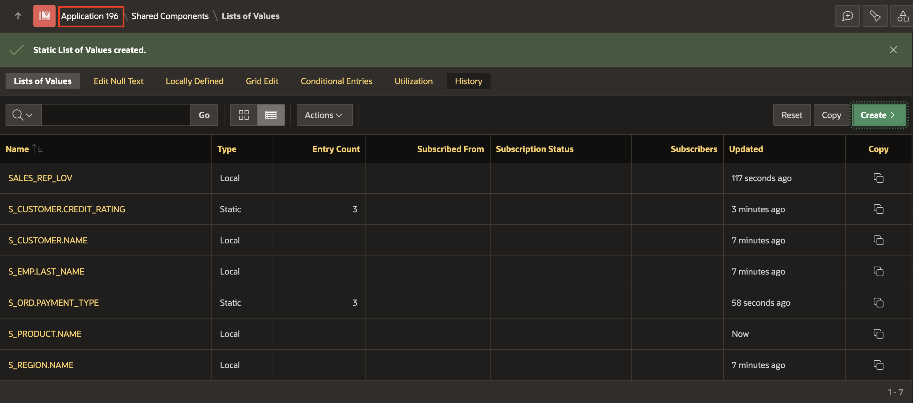
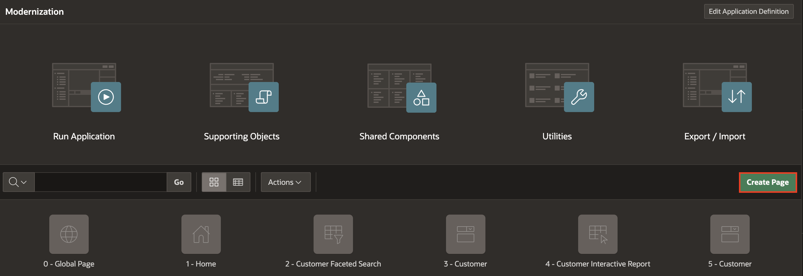
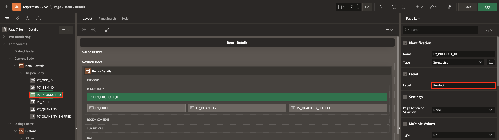
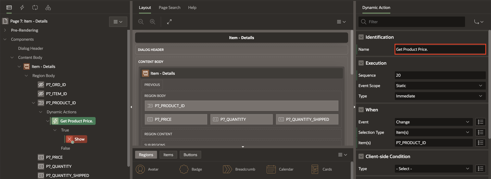
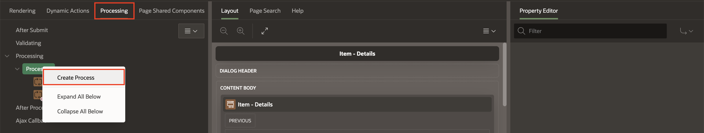
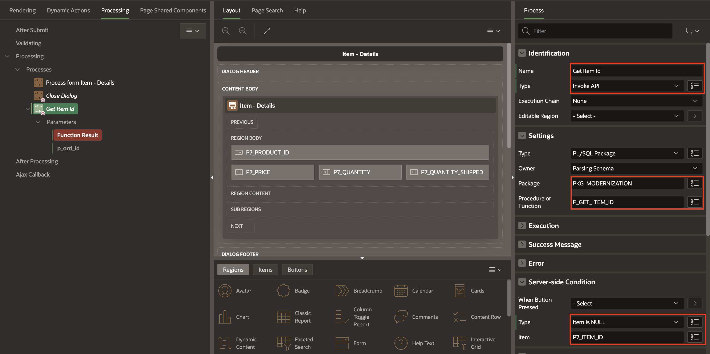
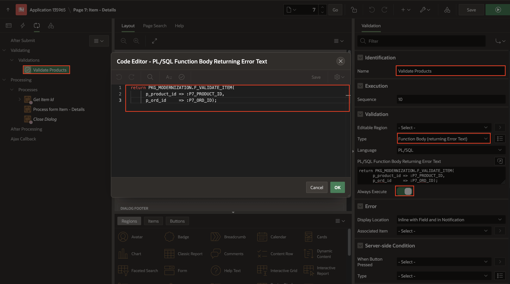

# Create the Items Form

## Introduction

In this lab, you will learn how to create a form for managing items, ensure proper validation of user inputs, implement dynamic actions to enhance user interaction, and create processes to automate backend tasks. By completing these tasks, you will gain hands-on experience in building a functional and user-friendly application interface using Oracle APEX.

Estimated Time: 10 Minutes

### Objectives

In this lab, you:

- Configure the form to interact with the S_ITEM table.
- Implement a dynamic action to automatically set the product price based on the selected product ID.
- Develop a process to automate the retrieval of the item ID.

## Task 1: Create the Items Form

1. Click **Application ID** to go to the application home page.

    

2. Click **Create Page**.

    

3. Select **Form**.

    

4. On **Create Form** wizard, enter/select the following:

    - Under Page Definition:

        - Page Number: **7**

        - Name: **Item - Details**

        - Page Mode: **Drawer**

    - Data Source > Table/View Name: **S_ITEM**

    Click **Next**.

   

5. Under Primary Key:

    - Primary Key Column 1: **ORD\_ID (Number)**

    - Primary Key Column 2: **ITEM\_ID (Number)**

     Click **Create Page**.

    

6. In the left pane, navigate to **Items - Details** region and expand the columns. Select **P7\_PRODUCT\_ID**. In the property editor, enter/select the following:

    - Label > Label: **Product**    

    

## Task 2: Create Validations

The S_ITEM table has five columns required: ORD\_ID, ITEM\_ID, PRODUCT\_ID, PRICE, and QUANTITY. You must ensure that end-users enter or select a value for these items.

1. In the left pane, select **Items - Details** region and expand the columns. While holding down the Ctrl key, click the columns: P7\_PRODUCT\_ID, P7\_PRICE, and P7\_QUANTITY.

    

2. In the property editor, apply the following changes:

    - Appearance > Template: **Required - Floating**

    - Validation > Value Required: **Toggle On**

   

## Task 3: Create a Dynamic Action

1. Navigate to **Item - Details** region, select **P7\_PRODUCT\_ID**, right-click and select **Create Dynamic Action**.

    

2. In the property editor, under Identification > Name: enter **Get Product Price**.

    

3. Navigate to the **Show** action,  and enter/select the following:

    - Identification > Action: **Set Value**

    - Under Settings:

        - Set Type: **PL/SQL Function Body**

        - PL/SQL Function Body: Copy and paste the below code:

         ```
         <copy>
         return PKG_MODERNIZATION.F_GET_PRODUCT_PRICE(p_product_id => :P7_PRODUCT_ID);
         </copy>
        ```

        - Items to submit: **P7\_PRODUCT\_ID**

    - Affected Elements > Item(s): **P7\_PRICE**

    

## Task 4: Create a Process

1. Navigate to the **Processing** tab and right-click **Processes** and select **Create Process**.

    

2. In the property editor, enter/select the following:

    - Under Identification:

        - Name: **Get Item Id**

        - Type: **Invoke API**

    - Under the Settings:

        - Package: **PKG\_MODERNIZATION**

        - Procedure or Function: **F\_GET\_ITEM\_ID**

    - Under the Server-side Condition:

        - Type: **Item is NULL**

        - Item: **P7\_ITEM\_ID**

   

3. Under **Get Item Id** process, navigate to **Parameters**, and click **Function Result**. Update the following:

    - Value > Item: **P7\_ITEM\_ID**

   

4. Click **p\_ord\_id**, and verify this information:

    - Value > Type: Item

    - Value > Item: **P7\_ORD\_ID**

    

5. This new process should be the first process to be executed, drag and drop it before **Process from Item - Details**.

    

5. Lastly, navigate to **Rendering** tab, organize the items in the layout by dragging and dropping the items as per your preference.

    

## Task 5: Create a Validation Process

1. In the **Processing** tab, right-click **Validating** and select **Create Validation**.

    

2. In the property editor, enter/select the following:

    - Under Identification:

        - Name: **Validate Products**

    - Under the Validation:

        - Type: **Function Body (returning Error Text)**

        - PL/SQL Function Body Returning Error Text: Copy and paste the below code:

        ```
         <copy>
         return PKG_MODERNIZATION.F_VALIDATE_ITEM(
         p_product_id => :P7_PRODUCT_ID,
         p_ord_id     => :P7_ORD_ID);
         </copy>
        ```

        - Always Execute: **Toggle On**

   

3. Click **Save**.

## Summary

In this lab, you created a functional form for managing items in Oracle APEX by configuring it to interact with the 'S\_ITEM' table. You implemented necessary validations to ensure required fields are completed by users and created a dynamic action to automatically set the product price based on the selected product ID using PL/SQL. Additionally, you developed a process to automate the retrieval of the item ID, ensuring it runs conditionally when the item ID is null. These tasks enhanced our skills in building user-friendly and efficient application interfaces.

## Acknowledgements

- **Author** - Monica Godoy, Senior Principal Product Manager ; Ankita Beri, Product Manager; Paolo Paolucci, Data Development Specialist; Victor Mendo, Data Development Specialist
- **Last Updated By/Date** - Ankita Beri, Product Manager, January 2025
