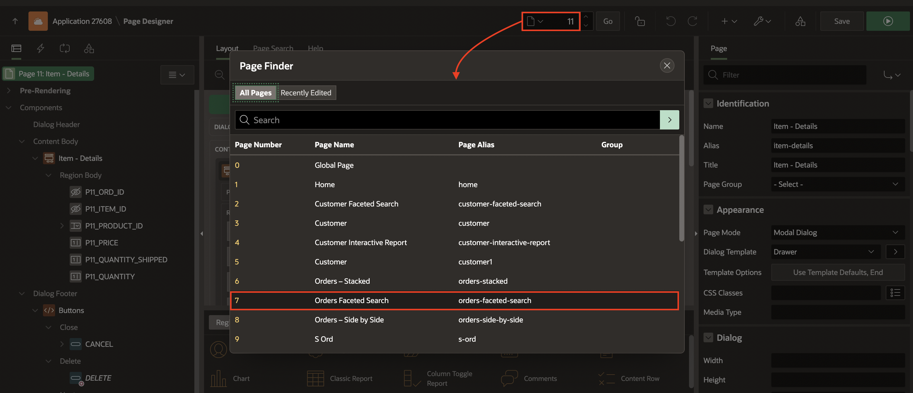
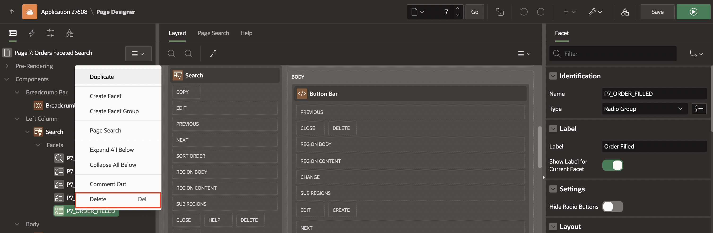
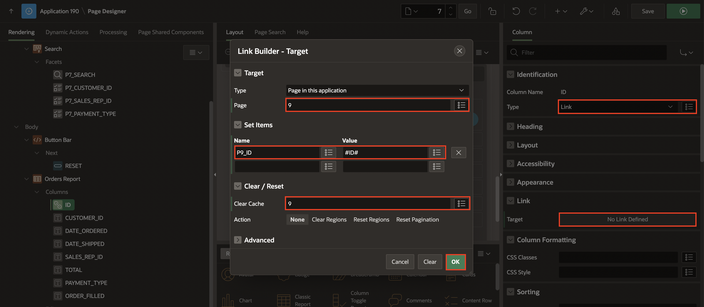
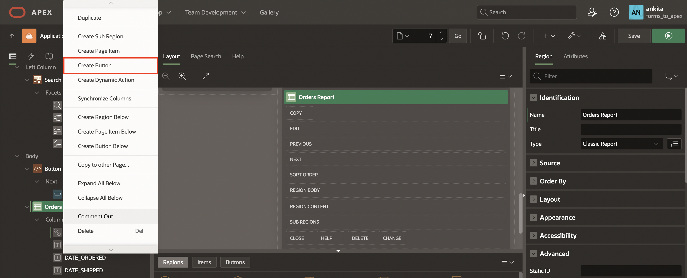

# Enhance the Orders Faceted Search Page

## Introduction

Let's recap what you have built so far for the Orders form. In Lab 4, you created a Faceted Search + Classic Report Page, and in this lab, you will enhance that page and link it to the recent items page you created.

Please note that other options you can create are available in the wizard:

- Option 1 - Master Detail - Stacked
- Option 2 - Master Detail - Side by Side
- Option 3 - Master Detail - Drill Down

Run this sample app to see the above options.

Estimated Time: 5 Minutes

### Objectives

In this lab, you:

- Remove an unnecessary facet from the Orders Faceted Search page.
- Rename and customize the Orders Report region.
- Configure the ID column to link to the Order Details page.
- Create a button to facilitate the creation of new orders and link it to the Order Details page.

## Task 1: Enhance the Orders Faceted Search Page

The Faceted Search Page was created with four facets:

- Sales Representative
- Customer
- Payment Type
- Order Filled

Since order filled is not a key facet search, let's remove it by following these steps:

1. Navigate to the Page Finder and select the **Orders Faceted Search**.

    

2. In the left pane, select **Search** region. Right-click **P7\_ORDER\_FILLED** and click **Delete**.

    

3. Now, Navigate to the **Ord** region. In the property editor, update the following:

    - Identification > Name: **Orders Report**

    - Under Appearance:

        - Click **Template Options** : Header > **Visible: Default**

        Click **OK**.

    

4. Expand the columns of the Orders Report region. Click **ID** column and update the following:

    - Identification > Type: **Link**

    - Under Link:

        - Target > click **No Link Defined**

             - Page: **9**

             - Set Items > Name: **P9\_ID**, Value: **#ID#**

             - Clear Cache: **9**

             Click **OK**.

     

5. Right-click **Orders Report** region and select **Create Button**.

     

6. In the property editor, enter/select the following:

    - Identification > Button Name: **NEW_ORDER**

    - Layout > Slot: **Edit**

    - Appearance > Hot: **Toggle On**

    - Under Behavior:

        - Action: **Redirect to Page in this Application**

        - Target: click **No Link Defined**

            - Page: **9**

            - Set Items > Name: **P9\_ID**, Value: **&P9\_ID.**

            - Clear Cache: **9**

            Click **OK**.

    

7. Click **Save**.

## Summary

In this lab, you learned how to enhance the Orders Faceted Search Page by removing non-essential facets and improving the overall functionality and appearance.Additionally, you configured the ID column to act as a link to another page and created a button for easy navigation to the order creation page.

## Acknowledgements

- **Author** - Monica Godoy, Senior Principal Product Manager ; Ankita Beri, Product Manager; Paolo Paolucci, Data Development Specialist; Victor Mendo, Data Development Specialist
- **Last Updated By/Date** - Ankita Beri, Product Manager, July 2024
