# Enhance the Orders Form Page

## Introduction

In this lab, you will review specific updates to form items, including hiding certain fields, configuring validation and appearance settings, and organizing the layout for a better user experience.

Estimated Time: 5 Minutes

### Objectives

In this lab, you:

- Enhance the Orders Form Page with hidden fields, validation, and layout improvements.
- Create a validation to ensure correct order and ship dates.
- Add an interactive report for order items.
- Implement dynamic actions to refresh the report.

## Task 1: Enhance the Orders Form Page

1. Navigate to page **9**. Under the **S Ord** region, select  **P9\_TOTAL** and **P9\_ORDER\_FILLED** and update type to **Hidden**. Also, drag **P9\_TOTAL** and drop under **P9\_PAYMENT_TYPE**.

    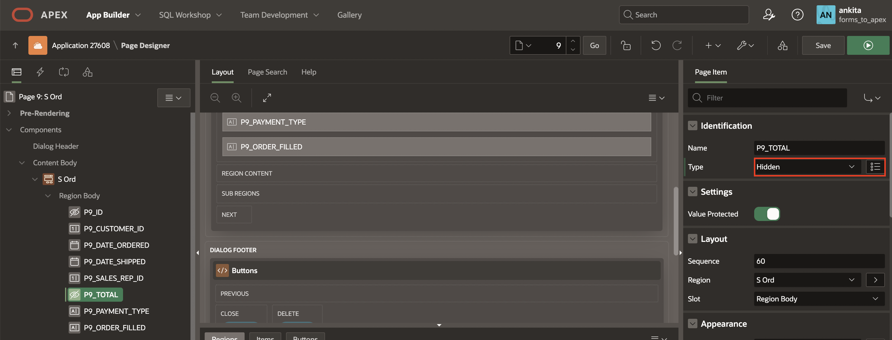

2. While holding down the Ctrl key, click the items: P9\_DATE\_ORDERED, P9\_DATE\_SHIPPED, P9\_SALES\_REP\_ID and P9\_PAYMENT\_TYPE and in the property editor,update the following:

    - Appearance > Template: **Required-Floating**

    - Validation > Value Required: **Toggle On**

    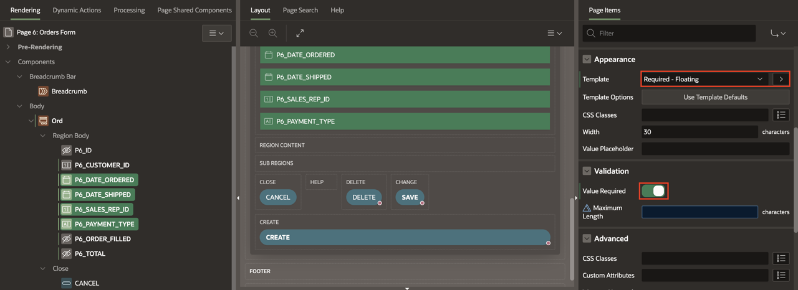

3. Select **P9\_PAYMENT\_TYPE** and enter/select the following:

    - Identification > Type: **Radio Group**

    - Settings > Number of Columns: **3**

    - Under Appearance:

        - Template Options: Click **Use Template Defaults**

        - Item Group Display: **Display as Pill Button**

     Click **OK**.

    - Under List of Values:

        - Type: **Shared Component**

        - List of Values: **S\_ORD.PAYMENT\_TYPE**

        - Display Extra Values attribute: **Toggle Off**

        - Display Null Value attribute: **Toggle Off**

    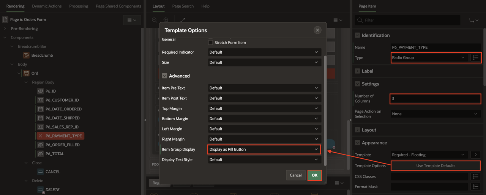

    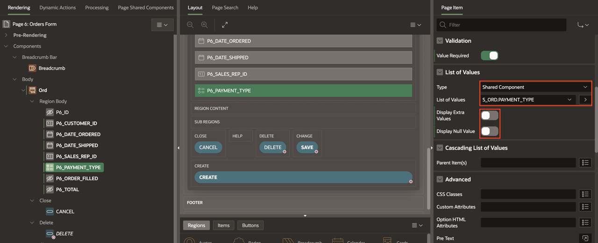

4. To organize the items, drag and drop them like in the screenshot below and click **Save**.

    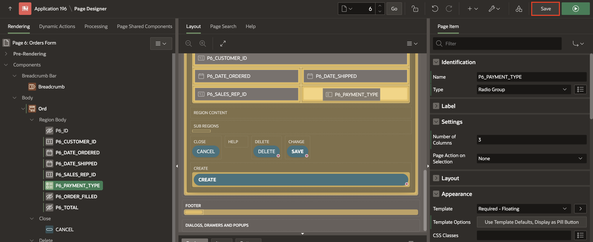

## Task 2: Create Validations

In this task, you will create a validation in the Orders Form, to validate that the ship date is not happening before the order date.

1. In the left pane, go to the **Processing** tab. Right-click **Validating** and select **Create Validation**.

    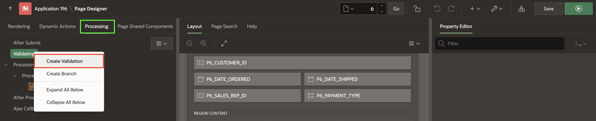

2. In the Property editor, enter/select the following:

    - Identification > Name: **Validate Order Dates**

    - Under Validation:

        - Type: **Expression**

        - Language: **SQL**

        - SQL Expression: **:P9\_DATE\_SHIPPED > :P9\_DATE\_ORDERED**

    - Under Error:

       - Error Message: **Ship date is before order date!**

       - Associated Item: **P9\_DATE\_SHIPPED**

   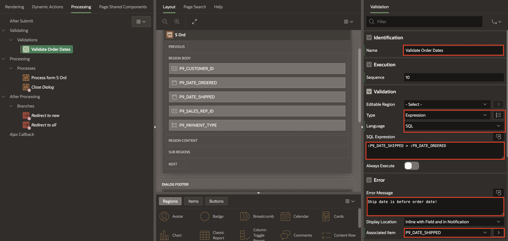

3. Click **Save**.

## Task 3: Create the Items Report

1. Navigate to **Rendering** pane, and right-click **S Ord** region and select **Create Sub Region**.

   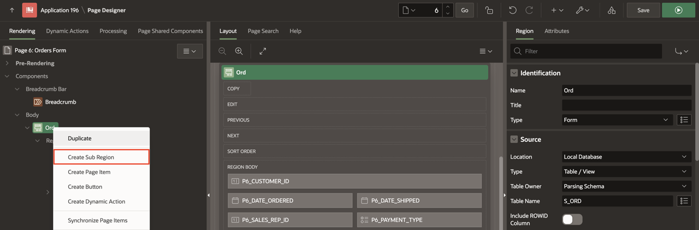

2. In the Property Editor, enter/select the following:

    - Under Identification:

        - Name: **Items**

        - Type: **Interactive Report**

    - Under Source:

        - Table Name: **S\_ITEM**

        - Where Clause: **ORD\_ID = :P9\_ID**

        - Page Items to Submit: **P9\_ID**

    - Under Server-side Condition:

        - Type: **Item is NOT NULL**

        - Item: **P9\_ID**

    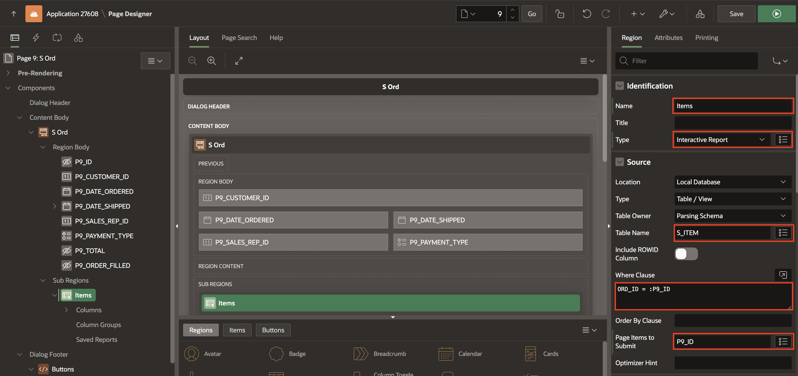

    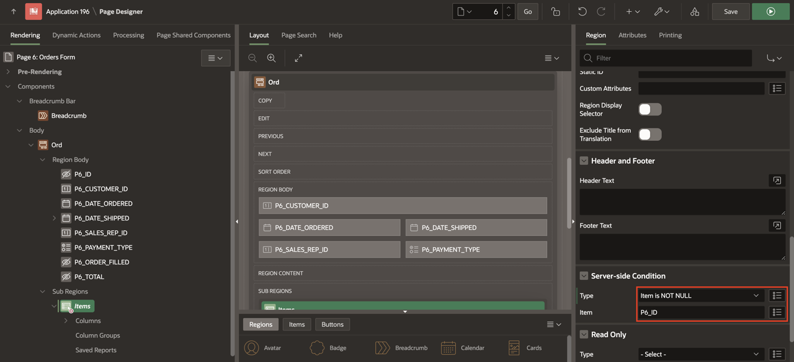

3. Expand the columns for the **Items** region.
Hold the Ctrl key while you click **ORD\_ID** and **ITEM\_ID** and change the type to **Hidden**.

    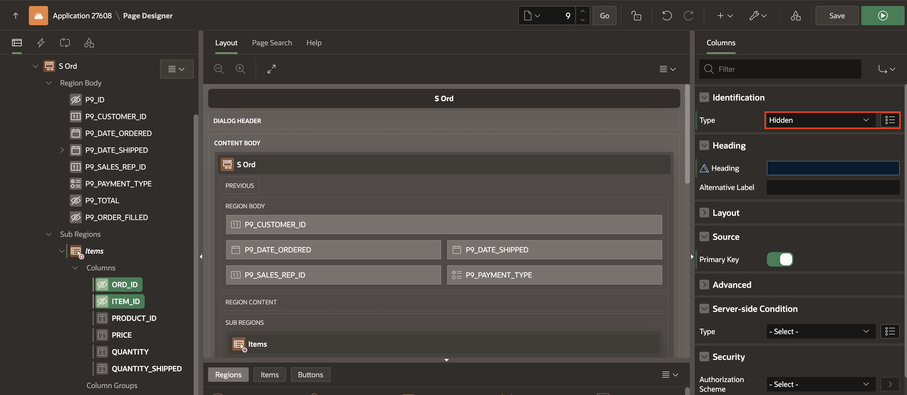

4. Right-click **Items** region and select **Create Button**.

    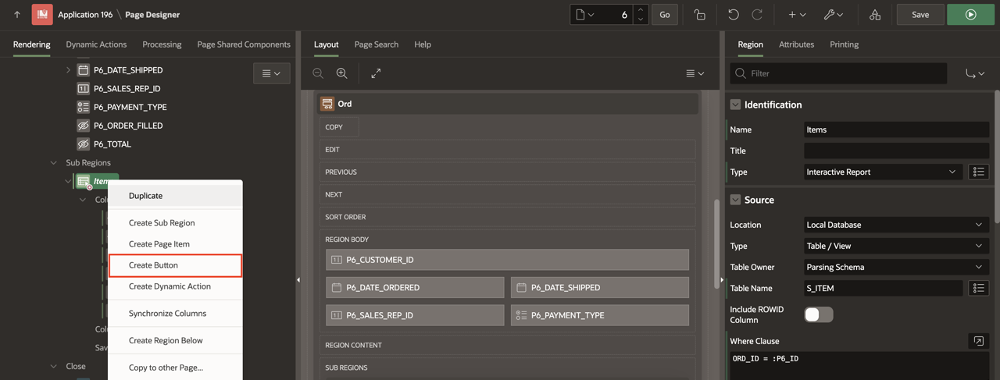

5. In the property editor, enter/select the following:

    - Identification > Button Name: **ADD\_ITEM**

    - Layout > Slot: **Right of Interactive Report Search Bar**

    - Under Appearance:

        - Button Template: **Text with Icon**

        - Hot: **Toggle On**

        - Icon: **fa-plus-circle**

    - Under Behavior:

        - Action: **Redirect to Page in this Application**

        - Target: click **No Link Defined**

            - Page: **10**

            - Set Items > Name: **P10\_ORD\_ID** , Value: **&P10\_ID.**

            - Clear Cache: **10**

            Click **OK**.

    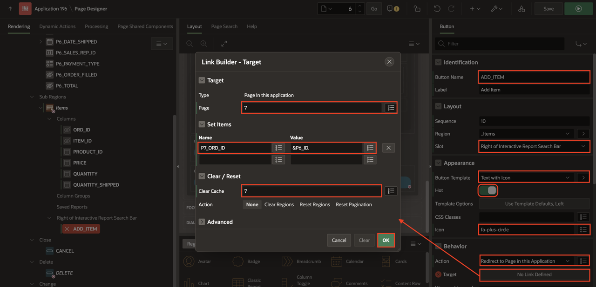

6. Select **Items** region, navigate to the **Attributes** pane and enter/select the following:

    - Under Link:

        - Link Column: **Link to Custom Target**

        - Target: click **No Link Defined**

            - Page: **10**

            - Set Item as follows:

             | Name | Value |
             | ---- | ----- |
             | P10\_ORD\_ID | #ORD_ID#  |
             | P10\_ITEM\_ID| #ITEM_ID# |

            - Clear cache: **10**

            Click **OK**.

    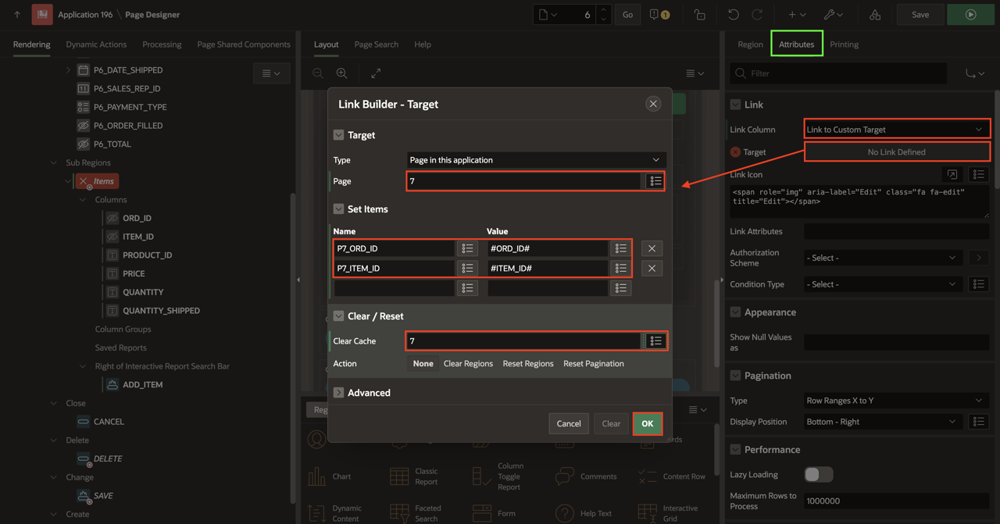

7. Under **Items** region, click **PRODUCT_ID** Column and enter/select the following:

    - Identification > Type: **Plain Text (based on List of Values)**

    - List of Values > List of Values: **S_PRODUCT.NAME**

    - Heading > Heading: **Product**

    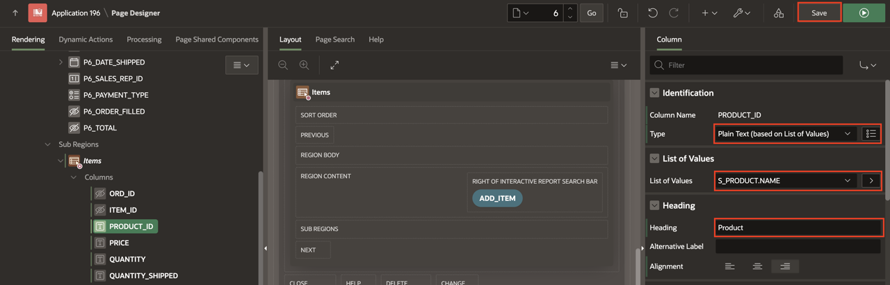

8. Click **Save**.

## Task 4: Create Dynamic Action

1. In the left pane, go to the **Dynamic Actions** tab. Right-click **Dialog Closed** and select **Create Dynamic Action**.

    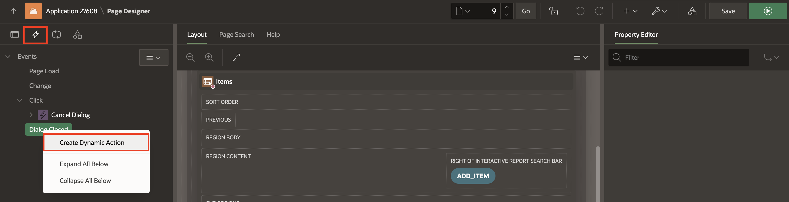

2. In the property editor, enter/select the following:

    - Identification > Name: **Refresh Items Report**

    - Under When:

        - Selection Type > **Region**

        - Region > **Items**

    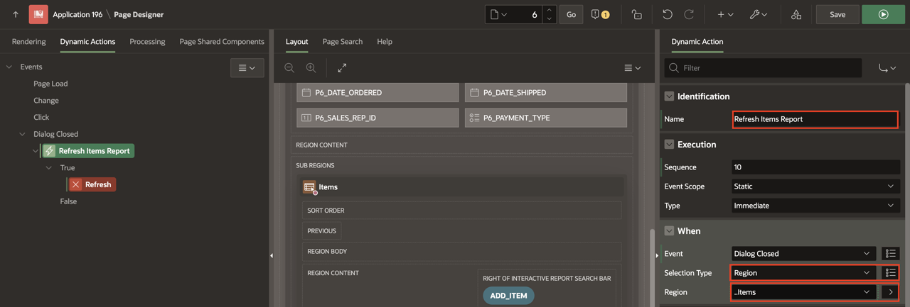

3. Click **Refresh** action and select the following:

    - Affected Elements > Region: **Items**

    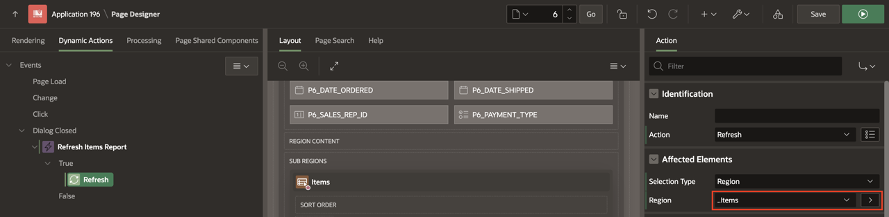

4. Click **Save**.

## Task 5: Enhance the Button

1. Navigate to **Rendering** pane, under **Buttons** region, click **Cancel** and in the property editor, update the following:

    - Under Behavior:

        - Action: **Redirect to Page in this Application**

        - Target: Click **No Defined Link**

            - Page: **7**

        Click **OK**.

    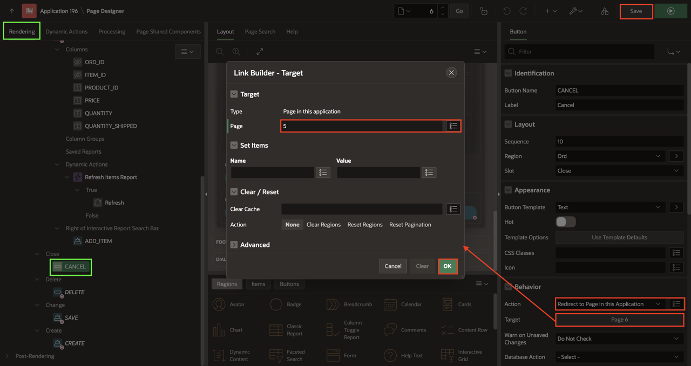

2. Click **Save**.

## Task 6: Run the Application

1. Run the Application and go to the **Orders - Faceted Search**. Click any **ID** of the orders created.

    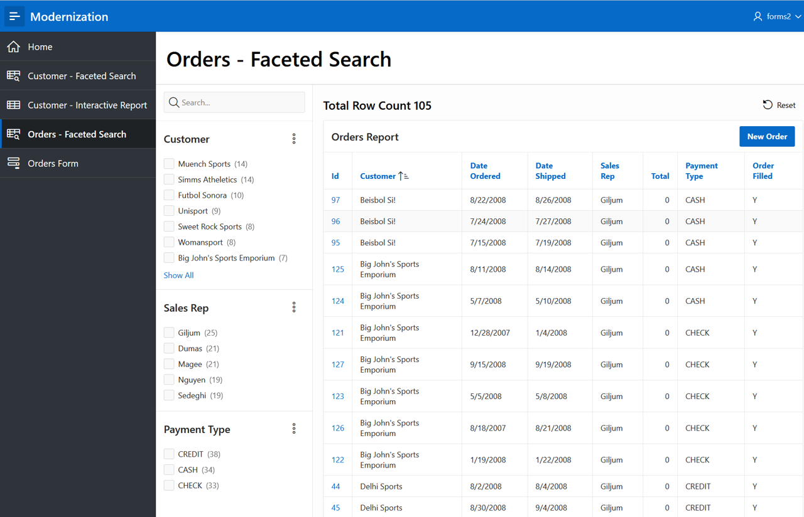

2. Click **Actions**. Select **Data > Compute**.

    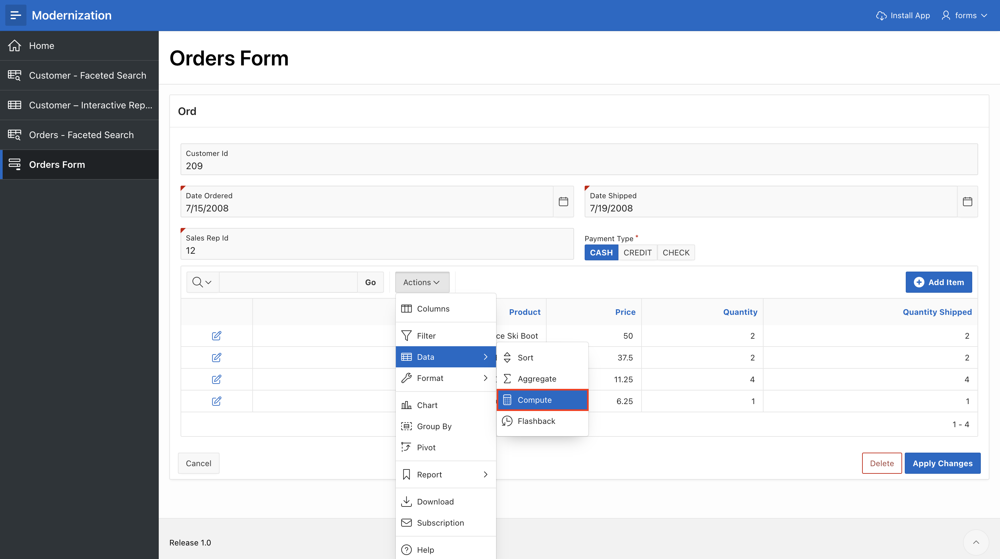

3. Enter/select the following:

    - Column Label: **Item Total**

    - Format Mask: **FML999G999G999G999G990D00**

    - Computation Expression: **D*E**

    Click **Apply**.

    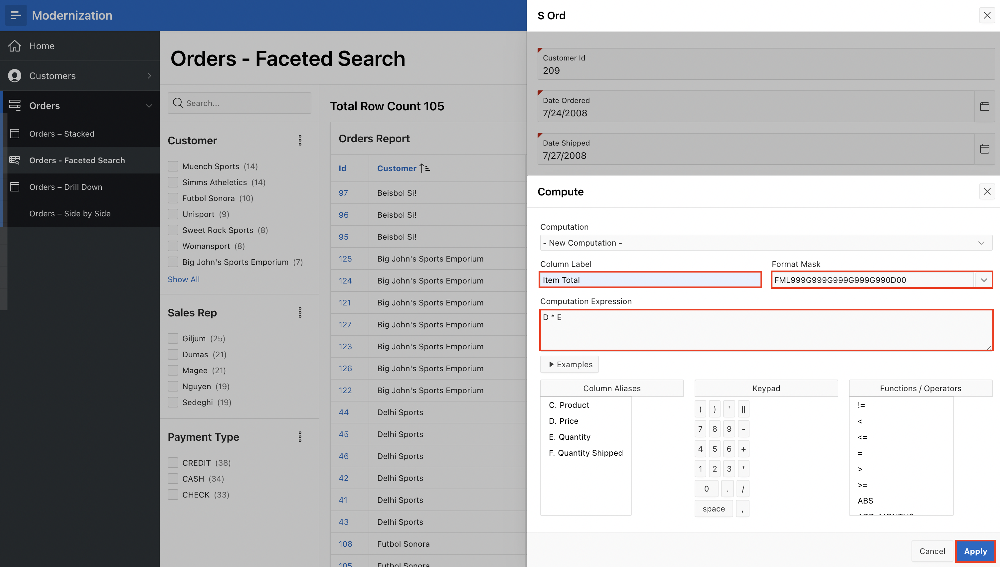

    

3. Click **Actions** Menu. Select **Data > Aggregate**

    - Function: **Sum**

    - Column: **Item Total**

    Click **Apply**.

    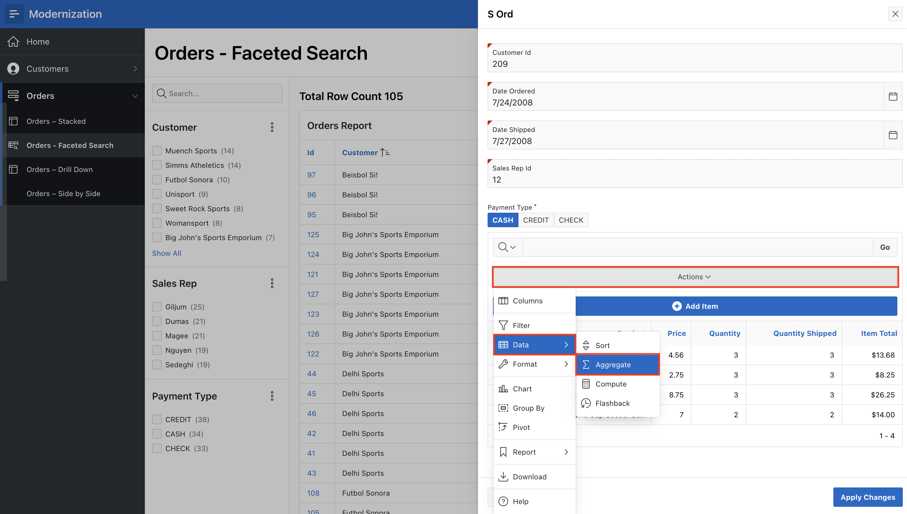

    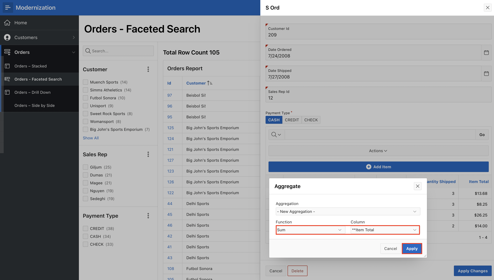

    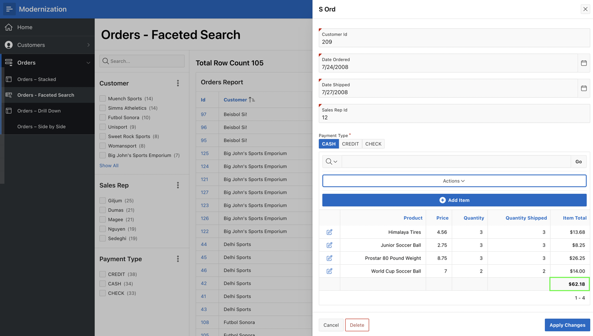

4. Click **Actions** Menu. Select **Report > Save Report**

    - Default Report Type: **Primary**

    Click **Apply**.

    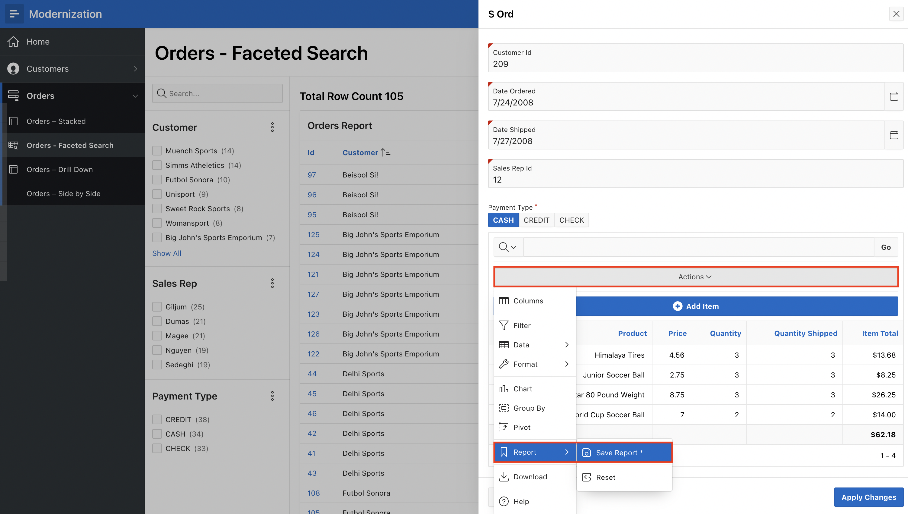

    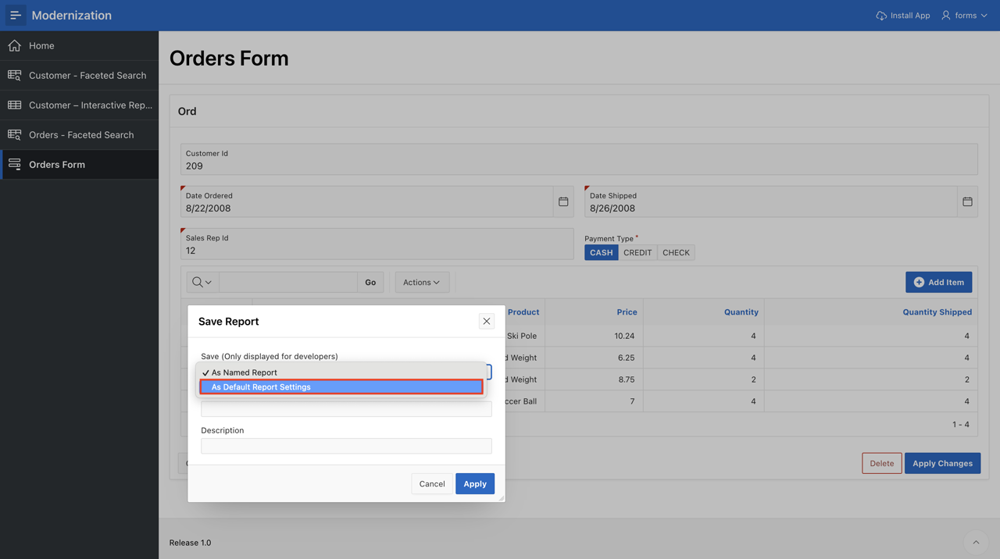

## Summary

In this lab, we enhanced the Orders Form Page. You converted the payment type selection into a visually appealing Radio Group and created validations to ensure the ship date is not before the order date. Additionally, you added an interactive report for items, a dynamic action to refresh the report, and configured buttons for better navigation and functionality.

## Acknowledgements

- **Author** - Monica Godoy, Senior Principal Product Manager ; Ankita Beri, Product Manager; Paolo Paolucci, Data Development Specialist; Victor Mendo, Data Development Specialist
- **Last Updated By/Date** - Ankita Beri, Product Manager, July 2024
