# Enhance the Orders Form Page

## Introduction

In this lab, you will review specific updates to form items, including hiding certain fields, configuring validation and appearance settings, and organizing the layout for a better user experience.

Estimated Time: 5 Minutes

### Objectives

In this lab, you will:

- Enhance the orders form page with hidden fields, validation, and layout improvements.
- Create a validation to ensure correct order and ship dates.
- Add an interactive report for order items.
- Implement dynamic actions to refresh the report.

## Task 1: Enhance the Orders Form Page

1. Navigate to the page finder and select the **Orders Form**.

    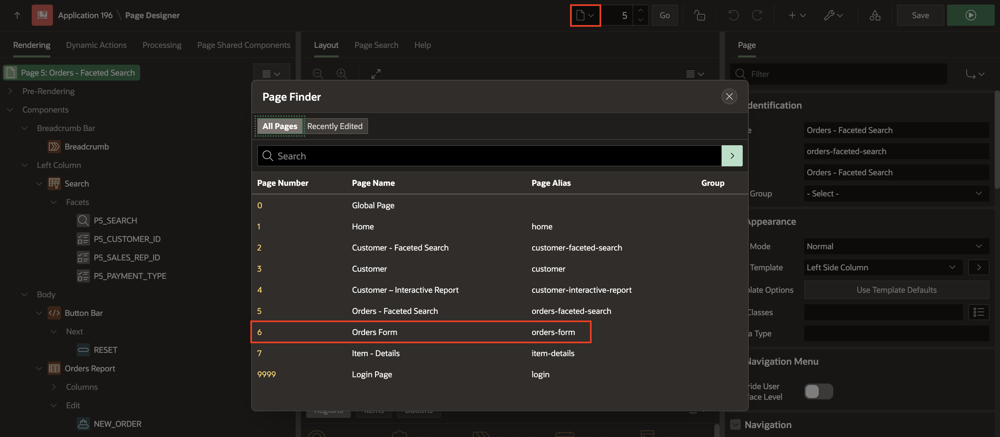

2. Navigate to the **Ord** region and while holding down the Ctrl key, click the columns: **P6\_TOTAL** and **P6\_ORDER\_FILLED** and update type to **Hidden**. Drag **P6\_TOTAL** and drop under **P6\_ORDER\_FILLED**.

    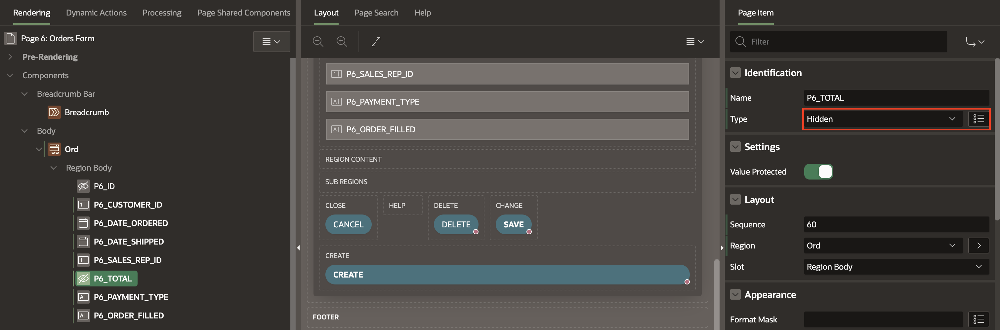

3. While holding down the Ctrl key, select the items: **P6\_DATE\_ORDERED, P6\_DATE\_SHIPPED, P6\_SALES\_REP\_ID and P6\_PAYMENT\_TYPE** and in the property editor, update the following:

    - Appearance > Template: **Required-Floating**

    - Validation > Value Required: **Toggle On**

    

4. Select **P6\_PAYMENT\_TYPE** and enter/select the following:

    - Identification > Type: **Radio Group**

    - Settings > Number of Columns: **3**

    - Under Appearance:

        - Template Options: Click **Use Template Defaults**

        - Item Group Display: **Display as Pill Button**

        - Click **OK**.

    - Under List of Values:

        - Type: **Shared Component**

        - List of Values: **S\_ORD.PAYMENT\_TYPE**

        - Display Extra Values attribute: **Toggle Off**

        - Display Null Value attribute: **Toggle Off**

    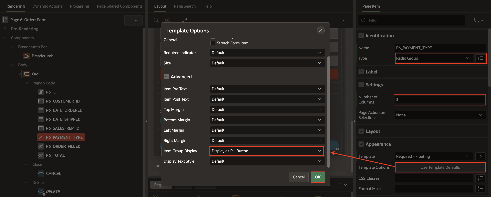

    

5. Select **P6\_CUSTOMER\_ID** and enter/select the following:

    - Identification > Type: **Select List**

    - Label > Label: **Customer**

    - Under List of Values:

        - Type: **Shared Component**

        - List of Values: **S\_CUSTOMER.NAME**

        - Null Display Value: **- Select a customer -**

    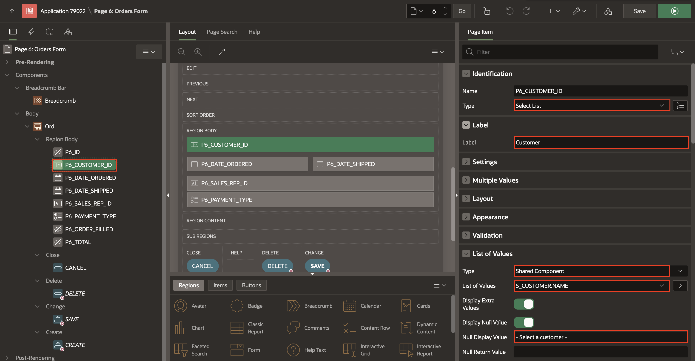

6. Select **P6\_SALES\_REP\_ID** and enter/select the following:

    - Identification > Type: **Popup LOV**

    - Label > Label: **Sales Rep**

    - Under List of Values:

        - Type: **Shared Component**

        - List of Values: **SALES\_REP\_LOV**

        - Display Extra Values attribute: **Toggle Off**

        - Null Display Value: **- Select a Sales Rep -**

    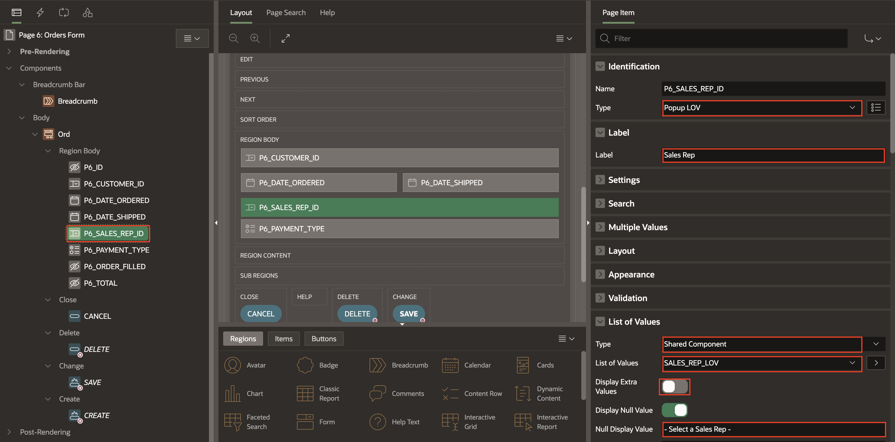

7. To organize the items, drag and drop them like in the screenshot below and click **Save**.

    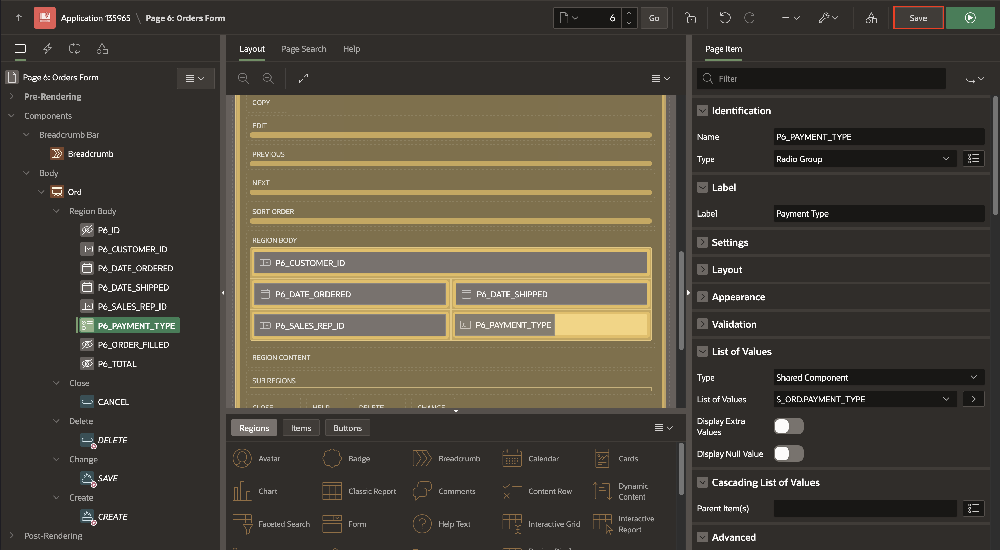

## Task 2: Create Validations

In this task, you will create a validation in the orders form to validate that the ship date is not happening before the order date. Please see the validation in the Orders sample form.

   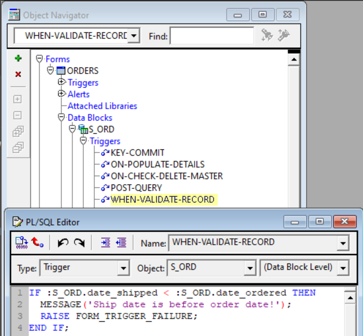

1. Go to the **Processing** tab in the left pane. Right-click **Validating** and select **Create Validation**.

    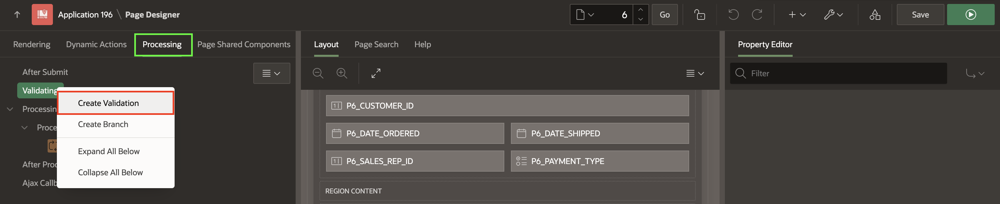

2. In the property editor, enter/select the following:

    - Identification > Name: **Validate Order Dates**

    - Under Validation:

        - Type: **Expression**

        - Language: **SQL**

        - SQL Expression: **:P6\_DATE\_SHIPPED > :P6\_DATE\_ORDERED**

    - Under Error:

        - Error Message: **Ship date is before order date!**

        - Associated Item: **P6\_DATE\_SHIPPED**

    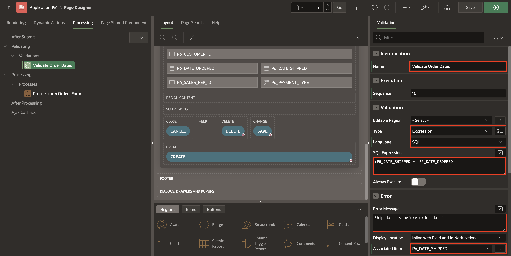

3. Click **Save**.

## Task 3: Create the Items Report

1. Navigate to **Rendering** pane, and right-click **Ord** region and select **Create Sub Region**.

    

2. In the property editor, enter/select the following:

    - Under Identification:

        - Name: **Items**

        - Type: **Interactive Report**

    - Under Source:

        - Table Name: **S\_ITEM**

        - Where Clause: **ORD\_ID = :P6\_ID**

        - Page Items to Submit: **P6\_ID**

    - Under Server-side Condition:

        - Type: **Item is NOT NULL**

        - Item: **P6\_ID**

    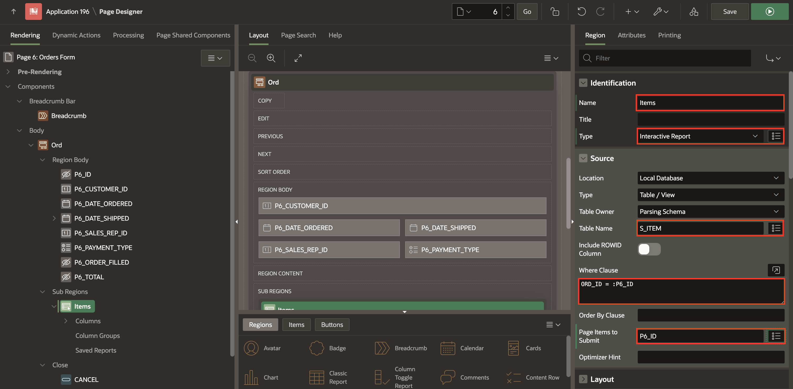

    

3. Expand the columns for the **Items** region.
Hold the ctrl key while you click **ORD\_ID** and **ITEM\_ID** and change the type to **Hidden**.

    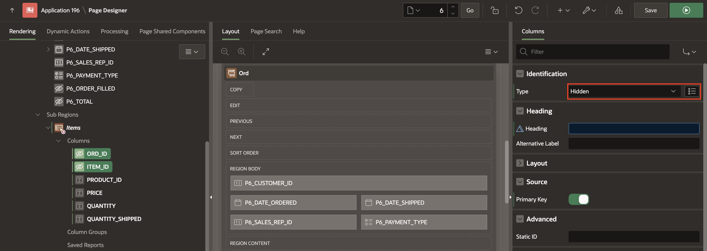

4. Right-click **Items** region and select **Create Button**.

    

5. In the property editor, enter/select the following:

    - Identification > Button Name: **ADD\_ITEM**

    - Layout > Slot: **Right of Interactive Report Search Bar**

    - Under Appearance:

        - Button Template: **Text with Icon**

        - Hot: **Toggle On**

        - Icon: **fa-plus-circle**

    - Under Behavior:

        - Action: **Redirect to Page in this Application**

        - Target: click **No Link Defined**

            - Page: **7**

              |Name | Value |
              | ---| ------ |
              |P7\_ORD\_ID | P6\_ID |
              {: title="Set Items"}

            - Clear Cache: **7**

            Click **OK**.

    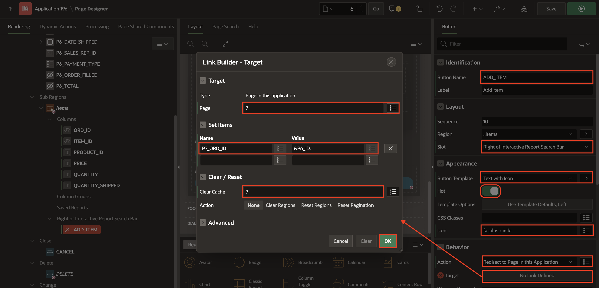

6. Select **Items** region, navigate to the **Attributes** pane and enter/select the following:

    - Under Link:

        - Link Column: **Link to Custom Target**

        - Target: Click **No Link Defined**

            - Page: **7**

            - Set Item as follows:

            | Name | Value |
            | ---- | ----- |
            | P7\_ORD\_ID | #ORD_ID#  |
            | P7\_ITEM\_ID| #ITEM_ID# |
            {: title="Set Items"}

            - Clear cache: **7**

            Click **OK**.

    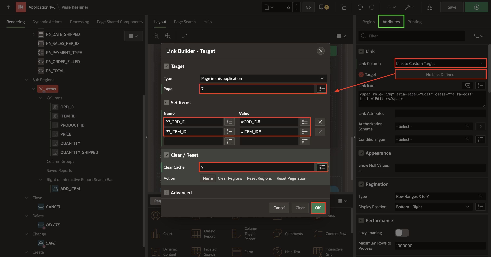

7. Under **Items** region, click **PRODUCT_ID** column and enter/select the following:

    - Identification > Type: **Plain Text (based on List of Values)**

    - List of Values > List of Values: **S_PRODUCT.NAME**

    - Heading > Heading: **Product**

    

8. Click **Save**.

## Task 4: Create Dynamic Action

1. In the left pane, go to the **Dynamic Actions** tab. Right-click **Dialog Closed** and select **Create Dynamic Action**.

    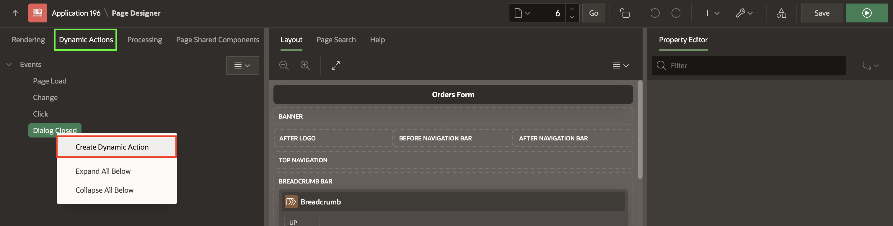

2. In the property editor, enter/select the following:

    - Identification > Name: **Refresh Items Report**

    - Under When:

        - Selection Type > **Region**

        - Region > **Items**

    

3. Click **Refresh** action and select the following:

    - Affected Elements > Region: **Items**

    

4. Click **Save**.

## Task 5: Enhance the Cancel Button

1. Navigate to **Rendering** pane, under **Buttons** region, click **Cancel** and in the property editor, update the following:

    - Under Behavior:

        - Action: **Redirect to Page in this Application**

        - Target: Select Page **5**

        - Click **OK**.

    

2. Click **Save**.

## Task 6: Run the Application

1. Run the application and go to the **Orders - Faceted Search** page. Click any **ID** of the orders created.

    

2. Click **Actions**. Select **Data > Compute**.

    

3. Enter/select the following:

    - Column Label: **Item Total**

    - Format Mask: **FML999G999G999G999G990D00**

    - Computation Expression: **D*E**

    Click **Apply**.

    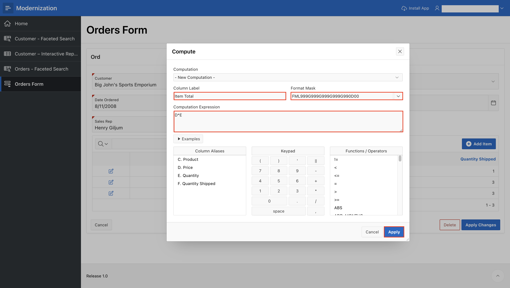

4. Click **Actions** menu. Select **Data > Aggregate**

    - Function: **Sum**

    - Column: **Item Total**

    Click **Apply**.

    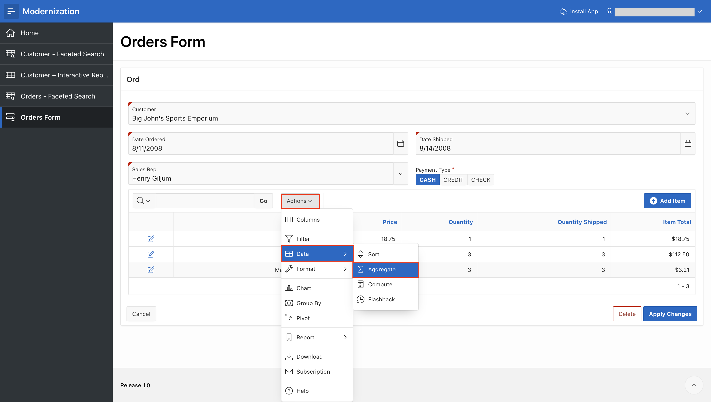

    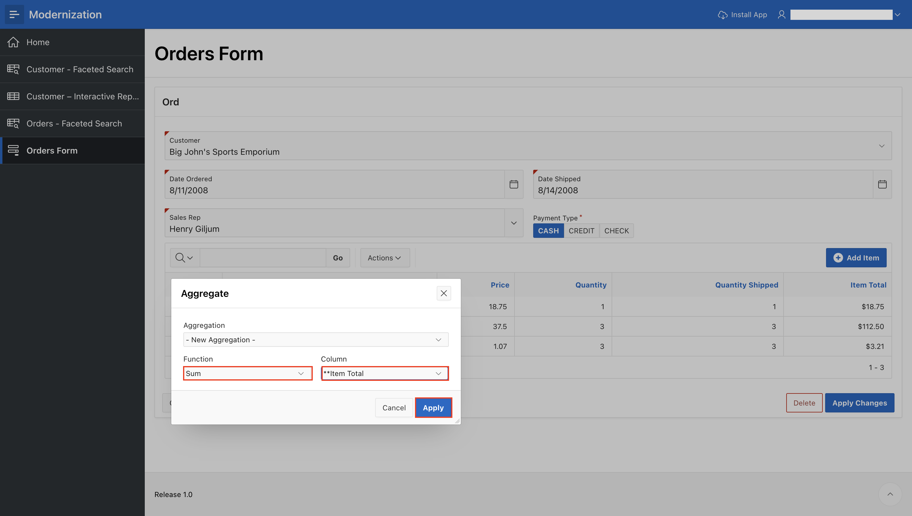

    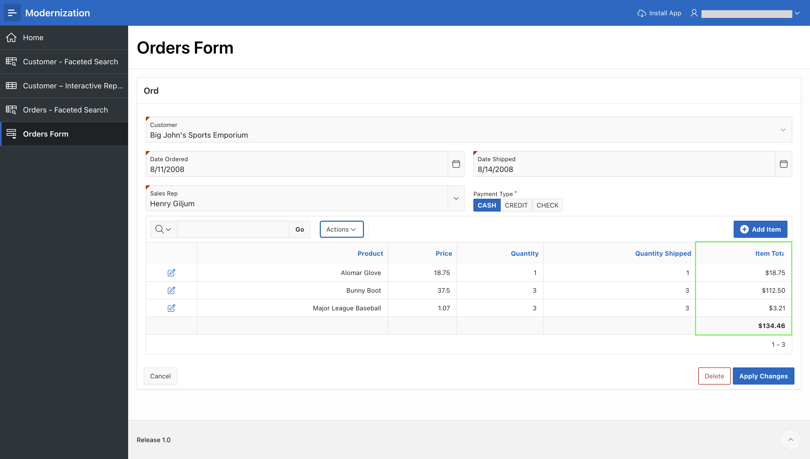

5. Click **Actions** menu. Select **Report > Save Report**

    - For save, select As **Default Report Settings**.

    - Default Report Type: **Primary**

    Click **Apply**.

    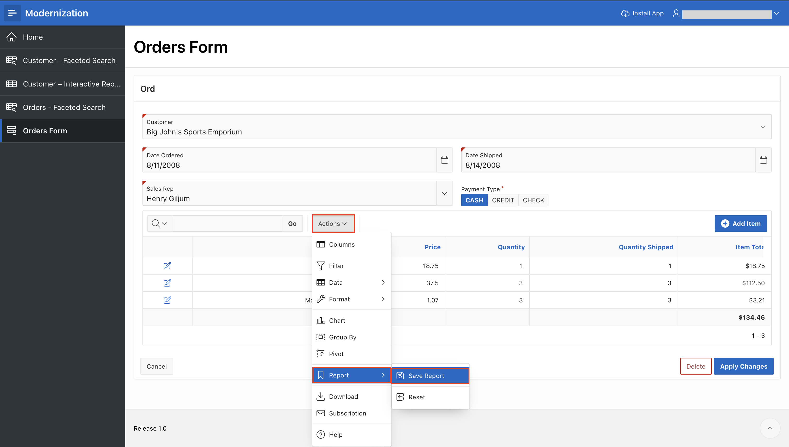

    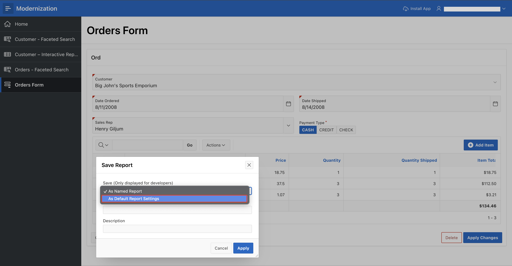

    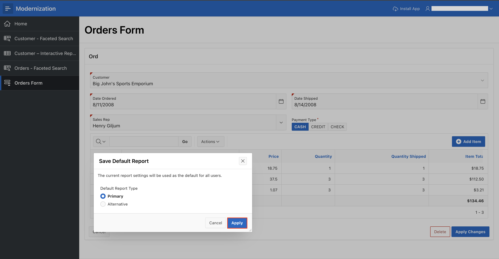

## Summary

In this lab, we enhanced the orders form page. You converted the payment type selection into a visually appealing radio group and created validations to ensure the ship date is not before the order date. Additionally, you added an interactive report for items, a dynamic action to refresh the report and configure buttons for better navigation and functionality.

## Acknowledgements

- **Author** - Monica Godoy, Senior Principal Product Manager ; Ankita Beri, Product Manager; Paolo Paolucci, Data Development Specialist; Victor Mendo, Data Development Specialist
- **Last Updated By/Date** - Ankita Beri, Product Manager, January 2025
