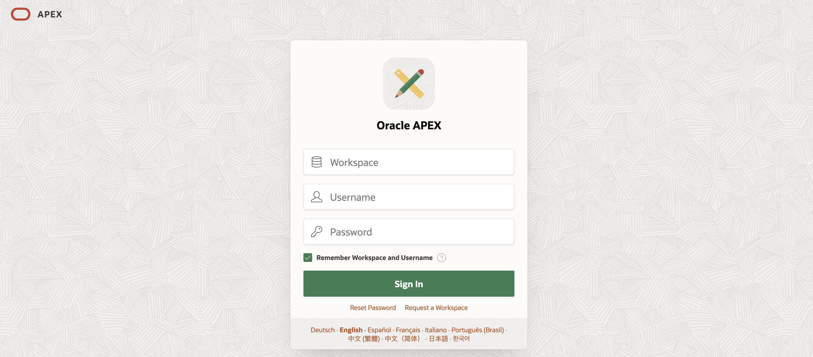

# Configure the OCI API keys

## Introduction

In this lab, you learn how to configure the OCI API keys. In Oracle Cloud Infrastructure (OCI), API keys are used for secure authentication when accessing OCI resources through REST APIs.

OCI API keys consist of two parts: a **Public key** and a **Private key**. You use the OCI console to generate the Private/Public key pair.

Estimated Time: 10 Minutes

### Objectives

In this lab, you:

- Generate API Keys using OCI Console

- Create Credentials in Oracle APEX

## Task 1: Generate API Keys using OCI Console

To Generate the API Keys using OCI Console:

1. Login into your OCI Account.

   

2. Click **My Profile** at the top-right corner and select **User settings**.

    

3. Under **Tokens and keys** tab and click **Add API key**.

    

4. The Add API Key dialog is displayed. Select **Generate API Key Pair** to create a new key pair.

5. Click **Download Private Key**. A *.pem* file is saved to your local device. You do not need to download the public key.

   *Note: You will use this private key while configuring the credentials in Oracle APEX in the upcoming lab.*

6. Click **Add**.

    

7. The key is added, and the Configuration file preview is displayed. Copy and save the configuration file snippet from the text box into a notepad. You will use this information to create Oracle APEX Credentials.

    

## Task 2: Create Credentials in Oracle APEX

 Credentials are used to authenticate connection to external REST services, or REST Enabled SQL services from APEX.

To create a Credential in Oracle APEX:

1. Login into your Oracle APEX workspace.

   

2. On the APEX Homepage, navigate to SQL Workspace > **SQL Commands**, to create credentials of your user to access the Object storage bucket.

    

3. Copy and paste the following code by replacing the password with the API Fingerprint ID saved from Task 1. (Your Fingerprint ID looks similar to **a8:8e:c2:8b:fe:\*\*\*\*:ff:4d:40** )

    ```
     <copy>
     BEGIN
     dbms_cloud.create_credential (
     credential_name => 'onnx_obj_store_cred_image',
     username        => '<Your username>',
     password        => '<Fingerprint ID>'
     );
     END;
     </copy>
    ```

    Click **Run**.

   

## Summary

You now know how to generate API Keys using OCI console. Furthermore, you know how to create credentials to access the object storage bucket in Oracle APEX.

You may now **proceed to the next lab**.

## Acknowledgments

- **Author** - Sahaana Manavalan, Senior Product Manager, May 2025
- **Last Updated By/Date** - Sahaana Manavalan, Senior Product Manager, May 2025
