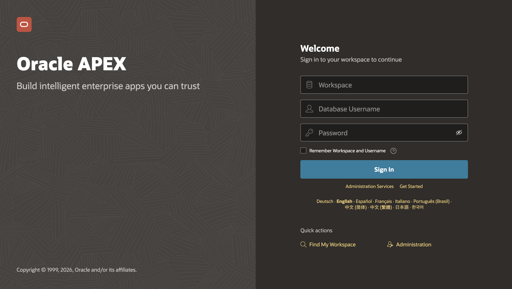
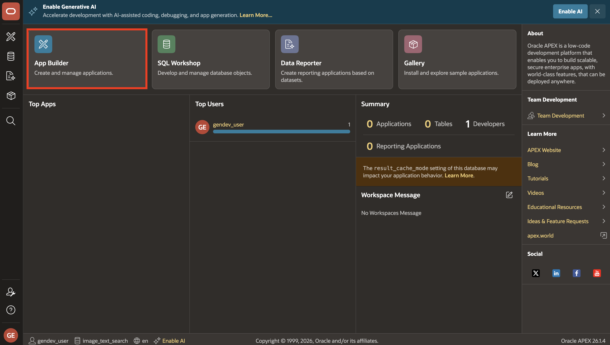
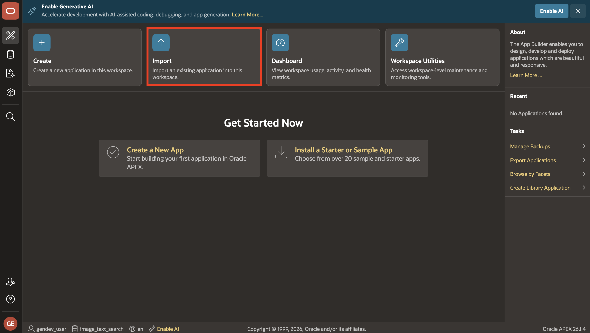
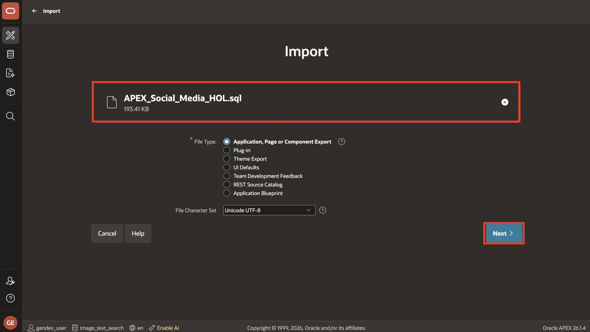
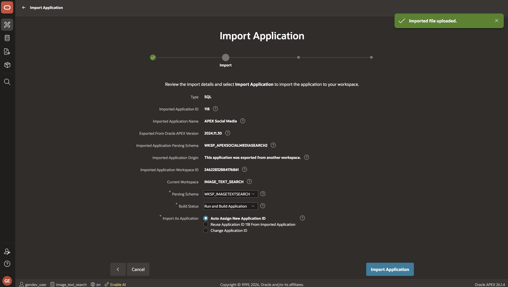
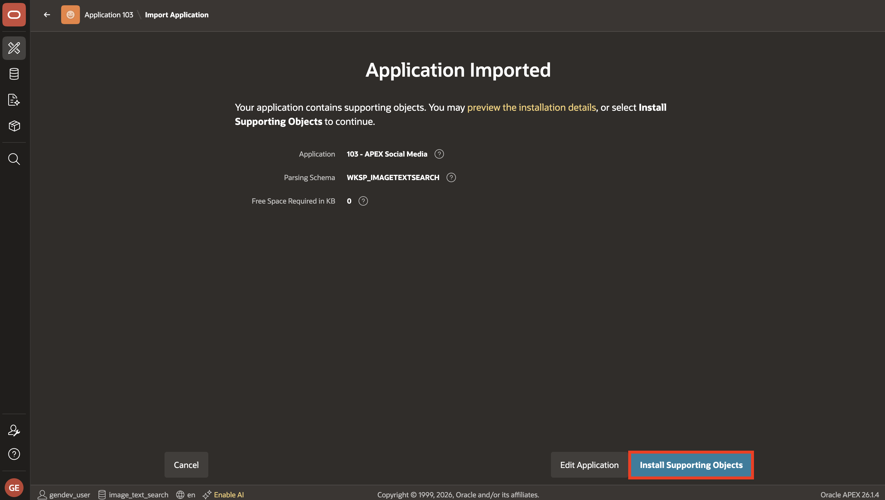
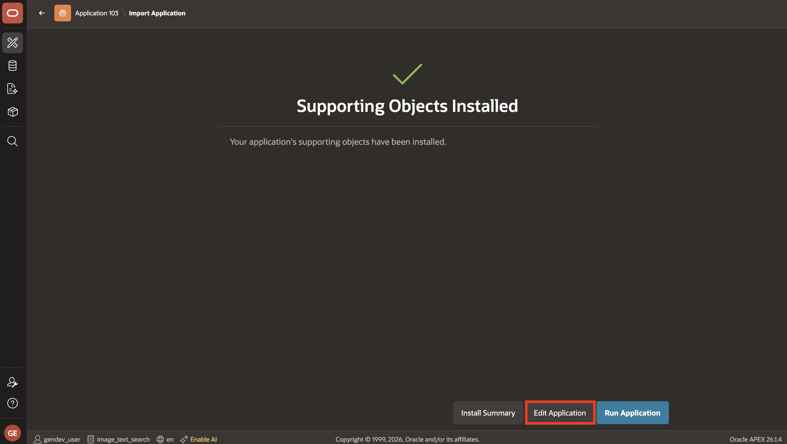

# Import the Social Media Application

## Introduction

In this lab, you will import the Social Media application into your Oracle APEX 26.1 workspace. This imported application will serve as the foundation for the remaining modules.

You can download the Social Media Application [here](images/APEX_Social_Media_HOL.sql).

Estimated Time: 5 Minutes

Watch the video below for a quick walk-through of the lab.
[Import Social Media App](videohub:1_8x5tzjbo)

### Objectives

In this lab, you:

- Import the Social Media Application into your APEX workspace

## Task 1: Import the Social Media Application

1. Login into your **Oracle APEX Workspace**.

   

2. On the Workspace home page, click **App Builder.**

    

3. Click **Import**.

    
4. The Import dialog displays. Drag and drop, or navigate to the file. (Click [here](images/APEX_Social_Media_HOL.sql) to download the application.)

    Click **Next**.

    

5. Accept the defaults, click **Install Application**.

    
6. Click **Install Supporting Objects** to set up the required tables for the application to function properly.

    

7. Click **Edit Application**.

   

## Summary

You now know how to import an Oracle APEX application.

## References

- [Understanding App Builder in Oracle APEX 26.1](https://docs.oracle.com/en/database/oracle/apex/26.1/htmdb/understanding-app-builder.html)
- [Exporting and Importing from App Builder](https://docs.oracle.com/en/database/oracle/apex/26.1/htmdb/exporting-and-importing-from-app-builder.html)

## Acknowledgments

- **Author** - Sahaana Manavalan, Senior Product Manager, May 2025
- **Last Updated By/Date** - Sahaana Manavalan, Senior Product Manager, September 2026
