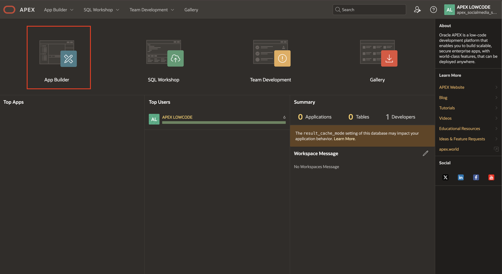

# Import the Social Media Application

## Introduction

In this lab, you will import the Social Media application into your APEX workspace. This imported application will serve as the foundation for subsequent labs.

You can download the Social Media Application [here](https://c4u04.objectstorage.us-ashburn-1.oci.customer-oci.com/p/EcTjWk2IuZPZeNnD_fYMcgUhdNDIDA6rt9gaFj_WZMiL7VvxPBNMY60837hu5hga/n/c4u04/b/livelabsfiles/o/labfiles/APEX_Social_Media_HOL.sql).

Estimated Time: 5 Minutes

### Objectives

In this lab, you:

- Import the Social Media Application into your APEX workspace

## Task 1: Import the Social Media Application

1. Login into your **Oracle APEX Workspace**.

   

2. On the Workspace home page, click **App Builder.**

    

3. Click **Import**.

    
4. The Import dialog displays. Drag and drop, or navigate to the file. (Click [here](https://c4u04.objectstorage.us-ashburn-1.oci.customer-oci.com/p/EcTjWk2IuZPZeNnD_fYMcgUhdNDIDA6rt9gaFj_WZMiL7VvxPBNMY60837hu5hga/n/c4u04/b/livelabsfiles/o/labfiles/APEX_Social_Media_HOL.sql) to download the application.)

    Click **Next**.

    

5. Accept the defaults, click **Install Application**.

    
6. Click **Install Supporting Objects** to set up the required tables for the application to function properly.

    

7. Click **Edit Application**.

   

## Summary

You now know how to import an Oracle APEX application.

You may now **proceed to the next lab**.

## Acknowledgments

- **Author** - Sahaana Manavalan, Senior Product Manager, May 2025
- **Last Updated By/Date** - Sahaana Manavalan, Senior Product Manager, August 2025
