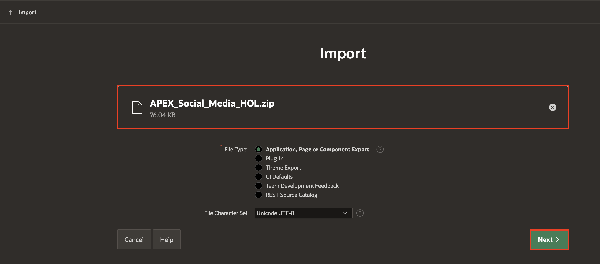
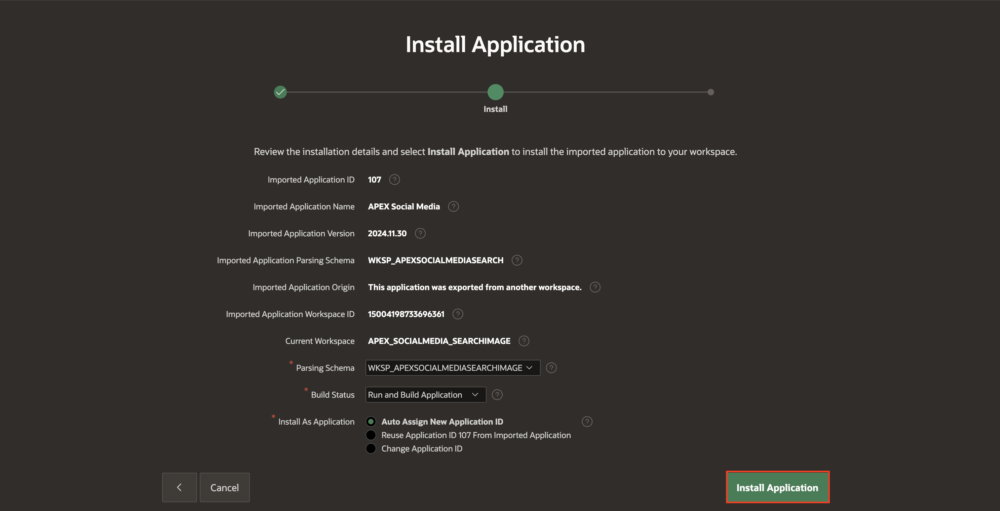
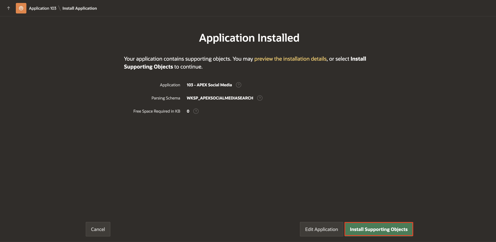
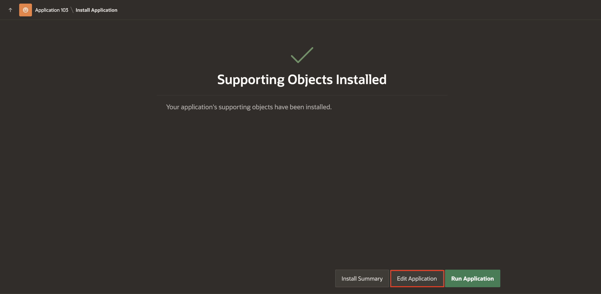
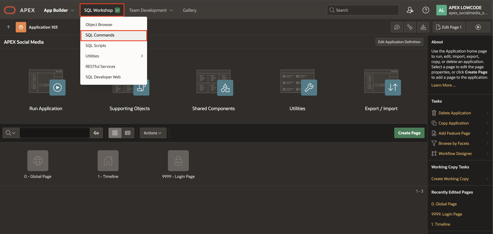
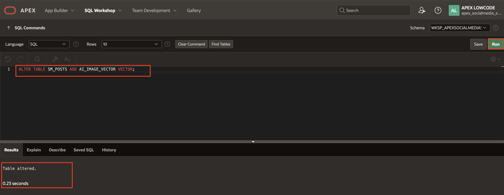

# Import the Social Media Application

## Introduction

In this lab, you import the Social Media application into your APEX workspace. You use this imported app to integrate with the OCI Vision service.

You can download the Social Media Application [here](https://c4u04.objectstorage.us-ashburn-1.oci.customer-oci.com/p/EcTjWk2IuZPZeNnD_fYMcgUhdNDIDA6rt9gaFj_WZMiL7VvxPBNMY60837hu5hga/n/c4u04/b/livelabsfiles/o/APEX_Social_Media_HOL.zip).

Estimated Time: 10 Minutes

### Objectives

In this lab, you:

- Import the Social Media Application into your APEX workspace

- Add a Column to the Table using SQL Commands to store the AI response

## Task 1: Import the Social Media Application

1. Navigate to the **App Builder** and click **Import**.

    

2. The Import dialog displays. Drag and drop, or navigate to the file. (Click [here](https://c4u04.objectstorage.us-ashburn-1.oci.customer-oci.com/p/EcTjWk2IuZPZeNnD_fYMcgUhdNDIDA6rt9gaFj_WZMiL7VvxPBNMY60837hu5hga/n/c4u04/b/livelabsfiles/o/APEX_Social_Media_HOL.zip) to download the application.)

    Click **Next**.

    

3. Accept the defaults, click **Install Application**.

    

4. Click **Install Supporting Objects** to set up the required tables for the application to function properly.

    

5. Click **Edit Application**.

   

## Task 2: Add a Column to the Table using SQL Commands

To store the embeddings generated by the ONNX Model, you add a new column in the SM\_POSTS Table. This addition enables you to store and retrieve the relevant information seamlessly.

To Add a new column to the SM\_POSTS Table:

1. Navigate to **SQL Commands** via **SQL Workshop**.

    

2. Copy and paste the below SQL command into the Editor to create new column AI\_IMAGE\_VECTOR and click **Run**.
    ```
     <copy>
     ALTER TABLE SM_POSTS ADD AI_IMAGE_VECTOR VECTOR;
     </copy>
    ```

    

    The table has been successfully altered to store the Vector embeddings.

## Summary

You now know how to import an Oracle APEX application, add a new column to a table.

You may now **proceed to the next lab**.

## Acknowledgments

- **Author** - Sahaana Manavalan, Senior Product Manager, May 2025
- **Last Updated By/Date** - Sahaana Manavalan, Senior Product Manager, May 2025
