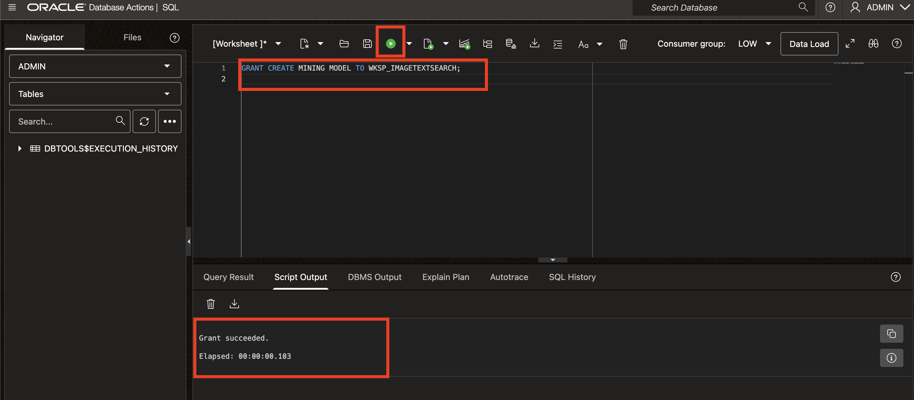
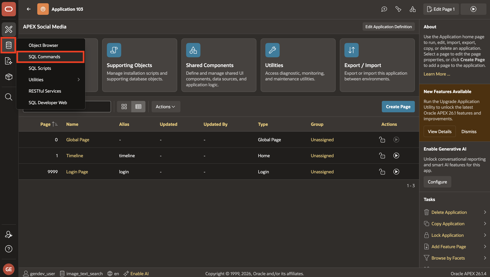
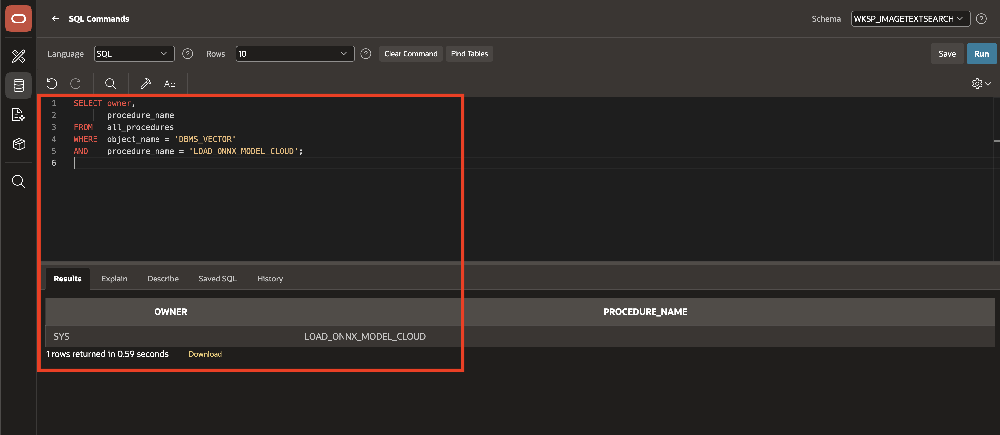
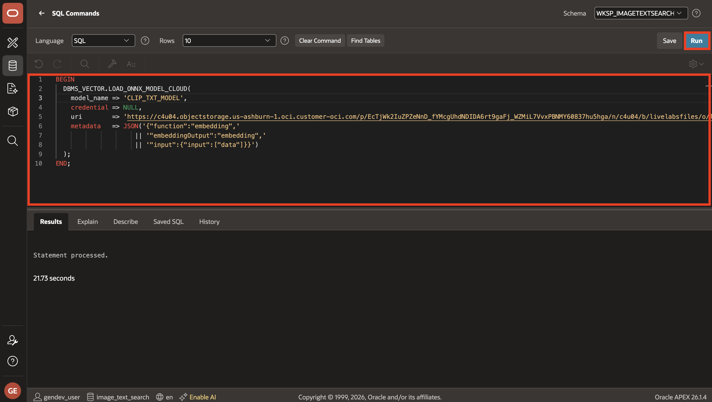
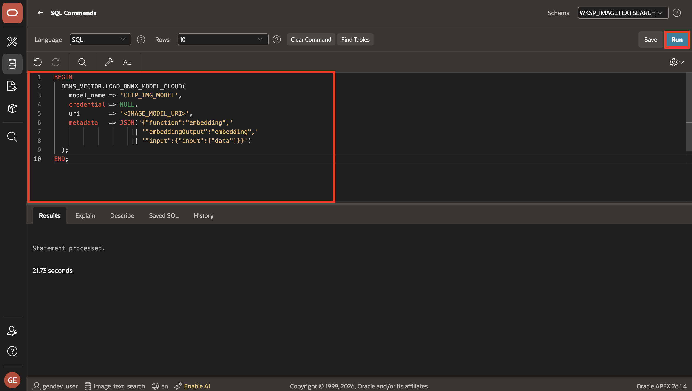
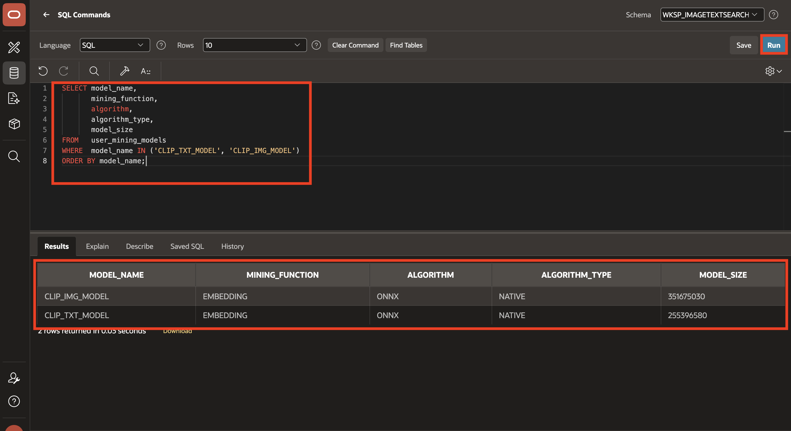

# Load CLIP ONNX Models into Oracle AI Database

## Introduction

In this lab, you will grant the privilege required to create ONNX model objects, load the text and image CLIP models directly from Object Storage and verify their metadata.

This revision uses `DBMS_VECTOR.LOAD_ONNX_MODEL_CLOUD`, the direct database API for loading ONNX models from Object Storage. The workshop continues to use the existing pre-authenticated request (PAR) URLs, so no OCI user credentials or authentication tokens are placed in the lab instructions.

Estimated Time: 10 Minutes

Watch the video below for a quick walk-through of the lab.
[Load CLIP ONNX Models](videohub:1_27kd0wmg)

### Objectives

In this lab, you will:

- Grant the privilege required to create ONNX model objects.
- Confirm that the direct cloud-loading procedure is available.
- Load the CLIP text and image models from Object Storage.
- Verify model metadata and attributes.

### Prerequisites

- You have imported the workshop application from Lab 1.
- Your database supports ONNX pipeline models and AI Vector Search.

For a production deployment, prefer a private Object Storage location with a database credential or an enabled OCI resource principal. If an ONNX model uses external initializers, the PAR or credential must allow access to the entire bucket or to the prefix containing the `.onnx`, `.json`, and `.data` files.

## Task 1: Grant the Model Creation Privilege

To enable your schema to load the mining models, you must grant the necessary privileges while logged in as a SYS or Admin user in SQL Actions.

1. Login as SYS/Admin User and execute the below command.

   ```sql
   <copy>
   GRANT CREATE MINING MODEL TO <YourSchemaName>;
   </copy>
   ```

Replace `<YourSchemaName>` with the parsing schema used by the application.

The PAR-based `DBMS_VECTOR.LOAD_ONNX_MODEL_CLOUD` path does not require `EXECUTE ON DBMS_CLOUD` in the application schema. `DBMS_CLOUD.GET_OBJECT` is not used by this lab.



## Task 2: Check the Cloud Model-Loading Procedure

1. From your **Application Homepage**, in the left navigation bar, navigate to **SQL Workshop** > **SQL Commands**.

    

2. Run the following query as the application schema:

```sql
<copy>
SELECT owner,
       procedure_name
FROM   all_procedures
WHERE  object_name = 'DBMS_VECTOR'
AND    procedure_name = 'LOAD_ONNX_MODEL_CLOUD';
</copy>
```



The query should return a row. If it returns no rows, the database release is too old for this version of the lab; upgrade the database or use the workshop's documented legacy loading path.

## Task 3: Load the CLIP Models from Object Storage

Use the full URI of each ONNX file. The following are the existing workshop PAR URIs; keep them unchanged.

1. Copy and run the following block to load the CLIP text model:

    ```sql
    <copy>
    BEGIN
      DBMS_VECTOR.LOAD_ONNX_MODEL_CLOUD(
        model_name => 'CLIP_TXT_MODEL',
        credential => NULL,
        uri        => 'https://c4u04.objectstorage.us-ashburn-1.oci.customer-oci.com/p/EcTjWk2IuZPZeNnD_fYMcgUhdNDIDA6rt9gaFj_WZMiL7VvxPBNMY60837hu5hga/n/c4u04/b/livelabsfiles/o/labfiles%2Fclip_vit_base_patch32_txt.onnx',
        metadata   => JSON('{"function":"embedding",'
                         || '"embeddingOutput":"embedding",'
                         || '"input":{"input":["data"]}}')
      );
    END;
    /
    </copy>
    ```

    

2. Copy and run the following block to load the CLIP image model:

    ```sql
    <copy>
    BEGIN
      DBMS_VECTOR.LOAD_ONNX_MODEL_CLOUD(
        model_name => 'CLIP_IMG_MODEL',
        credential => NULL,
        uri        => 'https://c4u04.objectstorage.us-ashburn-1.oci.customer-oci.com/p/EcTjWk2IuZPZeNnD_fYMcgUhdNDIDA6rt9gaFj_WZMiL7VvxPBNMY60837hu5hga/n/c4u04/b/livelabsfiles/o/labfiles%2Fclip_vit_base_patch32_img.onnx',
        metadata   => JSON('{"function":"embedding",'
                         || '"embeddingOutput":"embedding",'
                         || '"input":{"input":["data"]}}')
      );
    END;
    /
    </copy>
    ```

    

*Note: The object\_uri link provided above will expire on September 30, 2027.*

The two models use the same metadata shape because both are embedding models and both expose the `data` input and `embedding` output expected by this workshop.

## Task 4: Verify the Models

Verify that both model objects were created:

```sql
<copy>
SELECT model_name,
       mining_function,
       algorithm,
       algorithm_type,
       model_size
FROM   user_mining_models
WHERE  model_name IN ('CLIP_TXT_MODEL', 'CLIP_IMG_MODEL')
ORDER BY model_name;
</copy>
```

The result should contain two rows with `MINING_FUNCTION` set to `EMBEDDING` and `ALGORITHM` set to `ONNX`.



### Reloading After a Failed Attempt

Model names must be unique in the schema. Only run the following blocks if you need to remove models created by a previous failed attempt and reload them. Dropping a model removes that database model object.

```sql
<copy>
BEGIN
  DBMS_VECTOR.DROP_ONNX_MODEL(
    model_name => 'CLIP_TXT_MODEL',
    force      => TRUE
  );
END;
/

BEGIN
  DBMS_VECTOR.DROP_ONNX_MODEL(
    model_name => 'CLIP_IMG_MODEL',
    force      => TRUE
  );
END;
/
</copy>
```

After the blocks complete, rerun Tasks 3 and 4.

## Summary

You have granted the required model-creation privilege, loaded both CLIP ONNX models from the existing Object Storage PAR URLs, verified their metadata, and confirmed that the text model can generate an embedding.

## References

- [DBMS_VECTOR Package — Oracle AI Database 26ai](https://docs.oracle.com/en/database/oracle/oracle-database/26/arpls/dbms_vector1.html)
- [SQL Quick Start Using a Vector Embedding Model Uploaded into the Database](https://docs.oracle.com/en/database/oracle/oracle-database/26/vecse/sql-quick-start-using-vector-embedding-model-uploaded-database.html)
- [Oracle AI Vector Search User's Guide](https://docs.oracle.com/en/database/oracle/oracle-database/26/vecse/ai-vector-search-users-guide.pdf)

## Acknowledgments

- **Author** - Sahaana Manavalan, Senior Product Manager, May 2025
- **Last Updated By/Date** - Sahaana Manavalan, Senior Product Manager, September 2026
