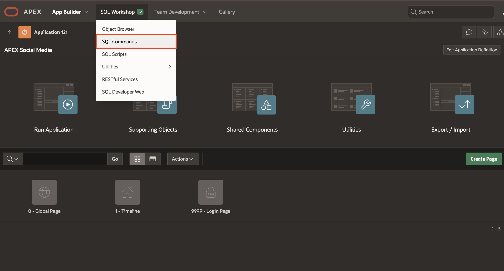
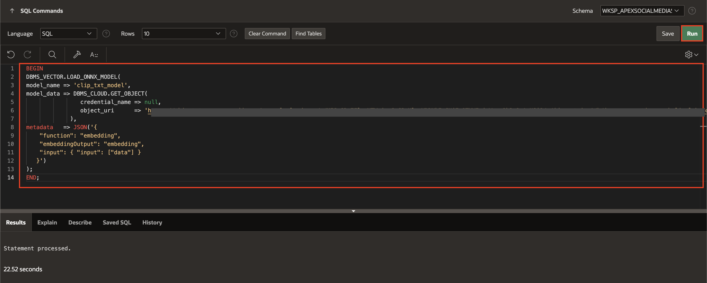

# Load CLIP ONNX Models into Oracle Database

## Introduction

In this lab, you will learn how to set up the necessary database privileges and load CLIP ONNX models into your Oracle Database environment. You'll grant essential permissions for mining models, then use Oracle APEX to load pre-exported CLIP text and image models from object storage. This step is pivotal for enabling semantic search capabilities in applications, where users can search using both text and images.

By the end of this lab, you will have a CLIP model integrated into your Oracle Database environment, ready to generate embeddings for both images and text, facilitating advanced semantic search functionalities.

Estimated Time: 10 Minutes

### Objectives

In this lab, you will:

- Grant necessary database privileges for mining models.

- Load ONNX models (CLIP text and image models) into your Oracle Database using APEX.

## Task 1: Grant Database Privileges

To enable your schema to load the mining models, you must grant the necessary privileges while logged in as a SYS or Admin user in **SQL Actions.**

1. Login as SYS/Admin User and execute the below command.

    ```sql
     <copy>
     GRANT EXECUTE ON DBMS_CLOUD TO <YourSchemaName> ;
     GRANT CREATE MINING MODEL TO <YourSchemaName>;
     </copy>
    ```

    

## Task 2: Load ONNX Model to Oracle Database

In this lab, you will load the ONNX Models into your database.

1. From your **Application Homepage**, Navigate to **SQL Workshop** > **SQL Commands**.

   

2. Copy and paste the below code to load the CLIP text model and click **Run**.

    ```sql
     <copy>
     BEGIN
     DBMS_VECTOR.LOAD_ONNX_MODEL(
     model_name => 'clip_txt_model',
     model_data => DBMS_CLOUD.GET_OBJECT(
                     credential_name => null,
                     object_uri      => 'https://objectstorage.us-ashburn-1.oraclecloud.com/p/MIJaGRt7FlqvNTWxie-6sC2vUlcxVDDNkIu6HjFeOTUYIsjzWnmo9k2o9x1cUSj8/n/idmypotriwr1/b/image-semanticsearch_livelabs/o/clip_vit_base_patch32_txt.onnx '
                  ),
     metadata   => JSON('{
         "function": "embedding",
         "embeddingOutput": "embedding",
         "input": { "input": ["data"] }
        }')
     );
     END;
     </copy>
    ```

    

3. Copy and paste the below to load the CLIP image model and click **Run**.

    ```sql
     <copy>
     BEGIN
     DBMS_VECTOR.LOAD_ONNX_MODEL(
        model_name => 'clip_img_model',
        model_data => DBMS_CLOUD.GET_OBJECT(
                     credential_name => null,
                     object_uri      => 'https://objectstorage.us-ashburn-1.oraclecloud.com/p/xkFZ3O-rFst30gDNh1L7SC_E89y2AedmAcLU7jD4szAilXhW7qSda4x3WCh53dE9/n/idmypotriwr1/b/image-semanticsearch_livelabs/o/clip_vit_base_patch32_img.onnx'
                  ),
     metadata   => JSON('{
        "function": "embedding",
         "embeddingOutput": "embedding",
         "input": { "input": ["data"] }
        }')
     );
     END;
     </copy>
    ```

    

Here, you assign the name **clip\_txt\_model** to the Text model and **clip\_img\_model** to the Image model being imported.

## Summary

You have successfully granted the necessary database privileges and loaded CLIP text and image models into your Oracle Database. These ONNX models are now available for generating embeddings from text and image data, which will be essential for implementing Semantic Searches in your applications in the upcoming labs.

You may now **proceed to the next lab**.

## Acknowledgments

- **Author** - Sahaana Manavalan, Senior Product Manager, May 2025
- **Last Updated By/Date** - Sahaana Manavalan, Senior Product Manager, August 2025
