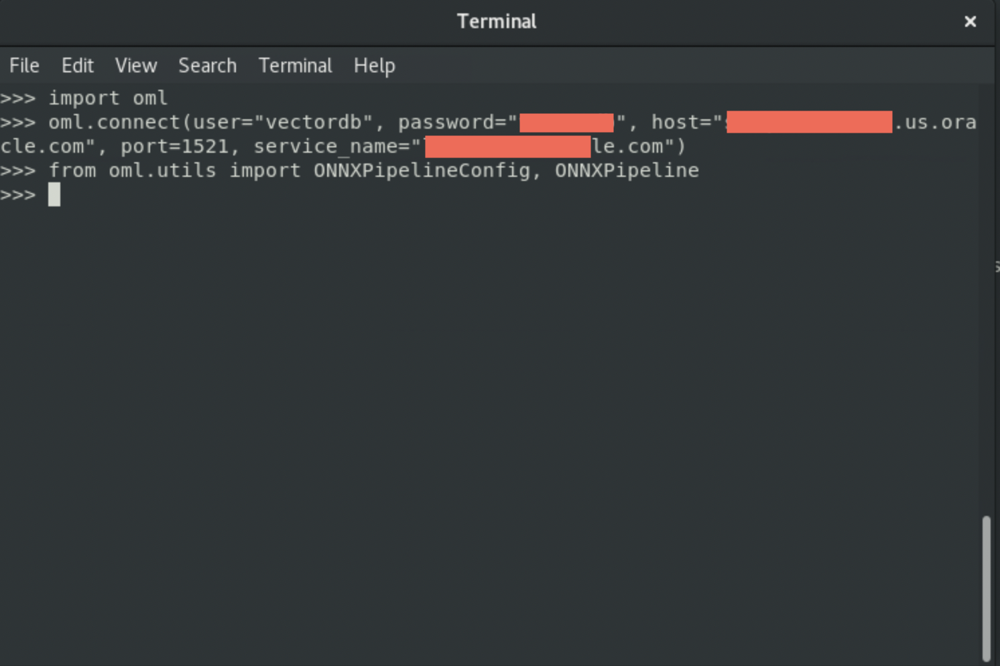
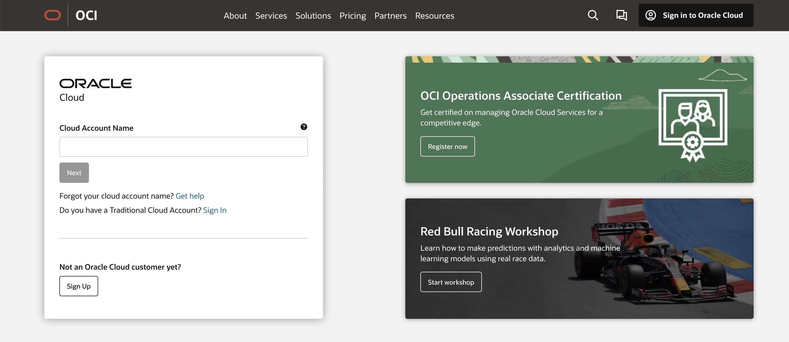
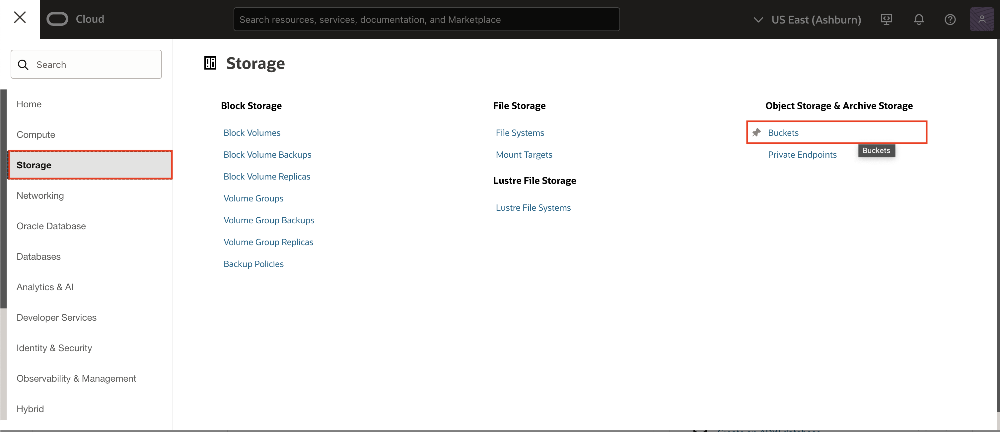

# Export and Load the CLIP ONNX Pipeline Model

## Introduction

In this lab, you'll learn how to export a CLIP multi-modal ONNX pipeline model using the OML4Py client. This model is pivotal for enabling semantic search capabilities in applications, where users can search using both text and images.​

The lab will guide you through:​

- Exporting the ONNX pipeline model using the OML4Py client.

- Uploading the exported model to Oracle Cloud Object Storage.

- Importing the ONNX model into Oracle Database using DBMS\_CLOUD\_AI.IMPORT\_MODEL.

By the end of this lab, you'll have a CLIP model integrated into your Oracle Database environment, ready to generate embeddings for both images and text, facilitating advanced semantic search functionalities.

Estimated Time: 20 Minutes

### Objectives

In this lab, you:

- Export CLIP ONNX Pipeline model
- Upload the exported model to Object Storage
- Load the CLIP ONNX Model onto the Database

## Task 1: Export ONNX Pipeline Model

In this task, you will export the CLIP ONNX Pipeline Model using the OML4Py Client

**Note:** These instructions assume you have configured your Oracle Linux 8 repo in /etc/yum.repos.d, configured a Wallet if using an Autonomous Database, and set up a proxy if needed,and OML4PY client is installed.

1. Navigate to terminal where you have installed the OML4PY client and to start Python, copy paste the following:

    ```
     <copy>
     Python
     </copy>
    ```

   

2. Import OML and connect to a local database/ADB:

    ```
     <copy>
     import oml
     oml.connect(user="USERNAME", password="PASSWORD", host="host.oracle.com", port=1521, service_name="service.oracle.com")
     </copy>
    ```

   

3. To get a list of all preconfigured models, import ONNXPipelineConfig from oml.utils

    ```
     <copy>
     from oml.utils import ONNXPipelineConfig, ONNXPipeline
     print(ONNXPipelineConfig.show_preconfigured())
     </copy>
    ```

   

4. Export the CLIP  preconfigured embedding model to a local folder
    ```
     <copy>
     em = ONNXPipeline("openai/clip-vit-base-patch32",settings={"ignore_checksum_error":True})
     em.export2file("model_Clip_Test",output_dir="/scratch/")
     </copy>
    ```

   

14. Click **Apply Changes**.

    

## Task 2: Upload Models to Object Storage

In this task, you will upload the exported models in the previous task, to object storage.

1. Login into your OCI Account.

   

2. Click on the navigation bar and select Storage > Object Storage & Archive Storage > Buckets.

   

3. Select **Create Bucket**.

   

4. In the Property Editor, enter the Bucket Name as **ONNX Pipeline Model Export** and click Create:

   

5. Navigate to the **Processing** Tab (left pane), right-click **Processes** and select **Create Process**.

   

6. In the Property Editor, enter the following:

    - Under Identification:

        - Name: **Analyze Image**

        - Type: **Execution Chain**

    - Settings > Enable **Run in Background**.

    

7. Right click on the **Analyze Image** process and select **Add Child Process**.

    

8. In the Property Editor, enter the following:

    - Under Identification:

        - Name: **Image Classification**

        - Type: **Invoke API**

    - Under Settings:

        - Type: **REST Source**

        - REST Source: **OCI Vision**

        - Operation: **POST**

    

9. Expand Parameters and Select **COMPARTMENT\_ID** and enter the following:

    - Under Value:

        - Type: **Static Value**

        - Value: **Enter the Compartment ID.**

   *Note: If using the root compartment, enter the tenancy OCID from the configuration preview file generated during API Key creation. If you use a different compartment, you can find the corresponding compartment OCID from the OCI Console.*

   

10. Select **FEATURE_TYPE** and enter the following:

    - Under Value:

        - Type: **Static Value**

        - Value: **IMAGE_CLASSIFICATION**

    

11. Select **FILE_DATA** and enter the following:

    - Under Value:

        - Type: **SQL Query (Return Single Value)**

        - SQL Query: Copy and paste the below code in the SQL Code editor:

            ```
             <copy>
             select replace(replace(apex_web_service.blob2clobbase64(file_blob), chr(10),''),chr(13),'')
             from SM_posts
             where ID = :P1_ID;
             </copy>
            ```

    

12. Select **RESPONSE** and enter the following:

    - Parameter > Disable **Ignore Output**

    - Value > Item: Select **P1\_RESPONSE**

    

13. Right click on the **Analyze Image** process and select **Add Child Process**.

    

14. In the Property Editor, enter the following:

    - Identification > Name: **Parse Image Classification Response**

    - Source > PL/SQL Code: Copy and paste the below code in the PL/SQL Code editor:

        ```
         <copy>
         UPDATE SM_POSTS
         SET
         AI_OUTPUT = (
            SELECT
                LISTAGG(obj_name, ',') WITHIN GROUP(
                ORDER BY
                    obj_name
                )
            FROM
                JSON_TABLE ( :P1_RESPONSE, '$.labels[*]'
                    COLUMNS
                        obj_name VARCHAR2 ( 100 ) PATH '$.name[*]'
                )
         )
         WHERE
         ID = :P1_ID;
         </copy>
        ```

    

15. Click **Save**.

## Task 3: Invoke the OCI Vision REST Data Source for Text Detection

In this task, you duplicate the page process to invoke the OCI Vision REST Data Source for text detection.

1. Under Processing, right-click **Image Classification** and select **Duplicate**. Drag and drop it under Parse Image classification Response.

    

    

2. In the Property Editor, enter the following:

    - Identification > Name: **Text Detection**

    

3. Expand Parameters, select **FEATURE_TYPE** and enter the following:

    - Under Value :

        - Type: **Static Value**

        - Value: **TEXT_DETECTION**

    

4. Right click on the **Parse Image classification Response** child process and select **Duplicate**. Drag and drop it after **Text Detection**.

    

    

5. In the Property Editor, enter the following:

    - Identification > Name : **Parse Text Detection Response**

    - Source > PL/SQL Code: Update the below code in the PL/SQL Code editor:

        ```
         <copy>
         UPDATE SM_POSTS
         SET
         AI_OUTPUT_TD = (
            SELECT
                LISTAGG(obj_name, ',') WITHIN GROUP(
                ORDER BY
                    obj_name
                )
            FROM
                JSON_TABLE ( :P1_RESPONSE, '$.imageText.words[*]'
                    COLUMNS
                        obj_name VARCHAR2 ( 100 ) PATH'$.text[*]'
                )
         )
         WHERE
         ID = :P1_ID;
         </copy>
        ```

        

6. Click **Save**.

## Task 4: Enhance Timeline Region to include AI Search

In this task, you create a search bar where the end user can enter the search terms and search through the images and texts.

1. Go to the Rendering tab, right-click **After Logo** and select **Create Page Item**.

    

2. In the property editor, enter the following:

    - Identification > Name: **P1\_AI\_SEARCH**

    - Label > Label: **AI Search**

    - Settings > Enable **Submit when Enter pressed**

    - Appearance > Width: **100**

   

3. Select the **Timeline** region in the property editor and enter the following:

    ```
     <copy>
     select
     p.id,
     p.created_by AS user_name,
     p.post_comment AS comment_text,
     p.file_blob,
     p.file_mime,
     apex_util.get_since(p.created) post_date,
     (
     select count(*) from SM_REACTIONS smr
     where smr.post_id=p.id
     ) as REACTIONS,
     (
     select 'user-has-liked' from SM_REACTIONS smr
     where smr.post_id=p.id and created_by=UPPER(:APP_USER)
     ) USER_REACTION_CSS
     from SM_POSTS p
     where (:P1_AI_SEARCH IS NOT NULL AND
     (upper(ai_output) like upper('%'||:P1_AI_SEARCH||'%') OR upper(ai_output_td) like upper('%'||:P1_AI_SEARCH||'%')
     )
     )OR :P1_AI_SEARCH IS NULL
     order by p.created desc;
     <copy>
    ```

    - Page items to Submit: Select **P1\_AI\_SEARCH**

    

4. Click **Save and Run**.

## Summary

You now know how to integrate OCI AI Vision into Oracle APEX through a REST API Call.

You may now **proceed to the next lab**.

## Acknowledgments

- **Author** - Roopesh Thokala, Senior Product Manager
- **Co-Author** - Ankita Beri, Product Manager
- **Last Updated By/Date** - Sahaana Manavalan,Senior Product Manager, January 2025
