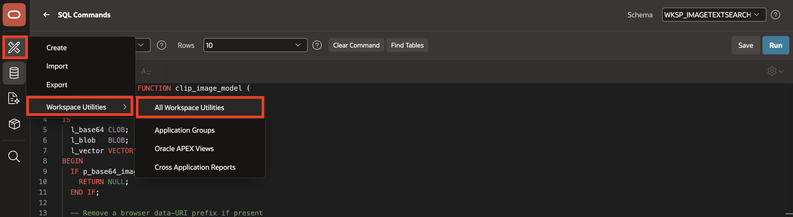
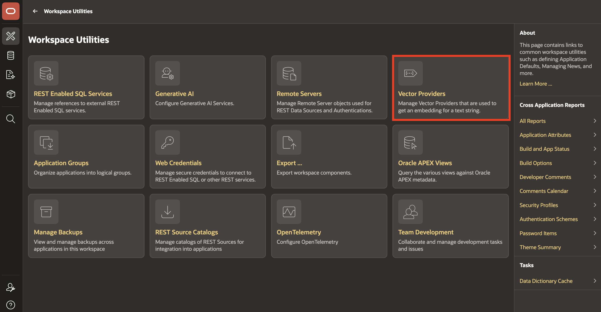
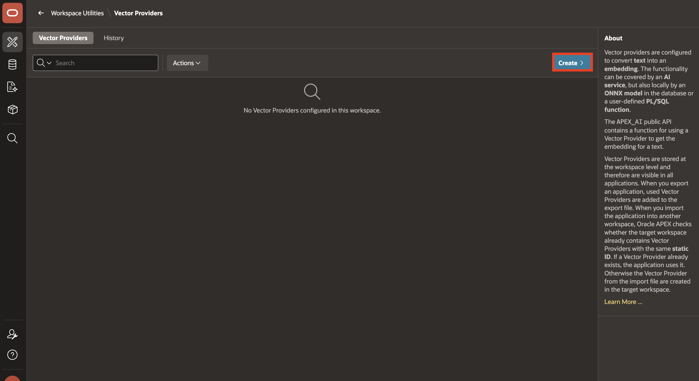
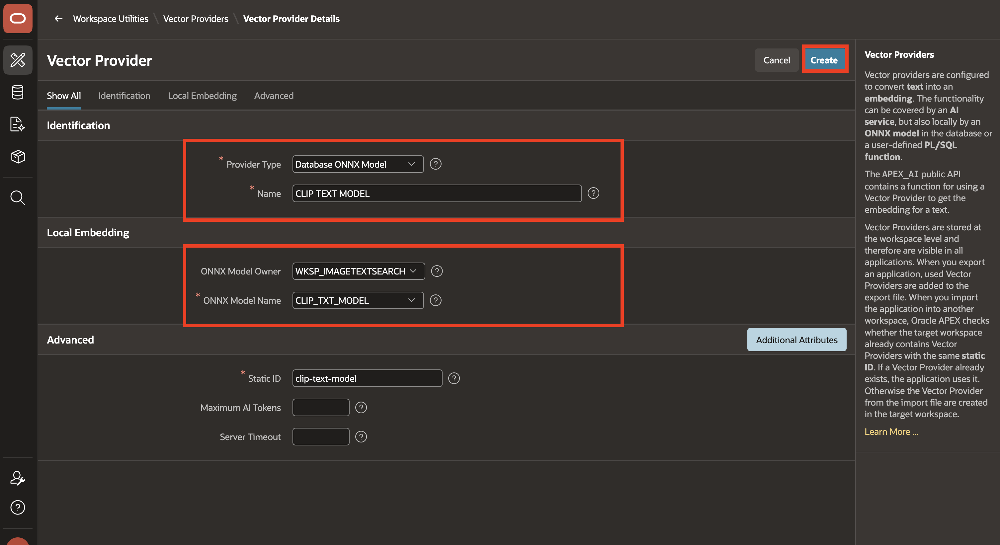
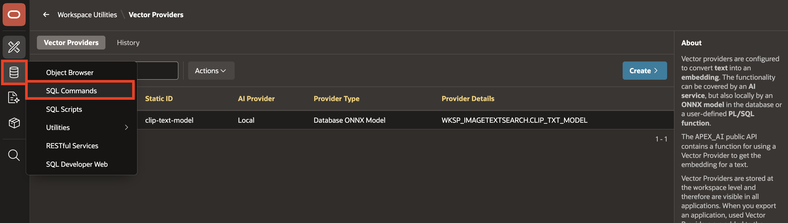
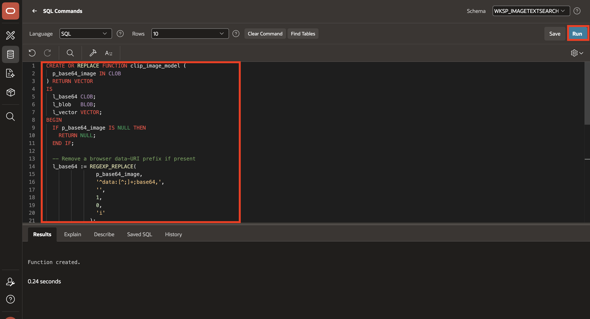
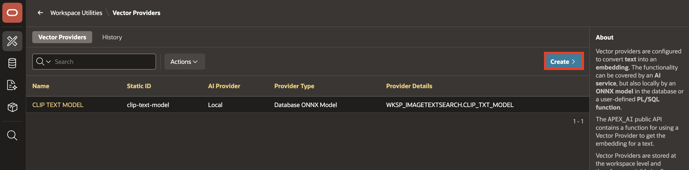
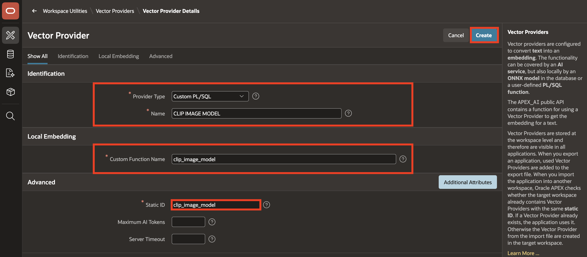
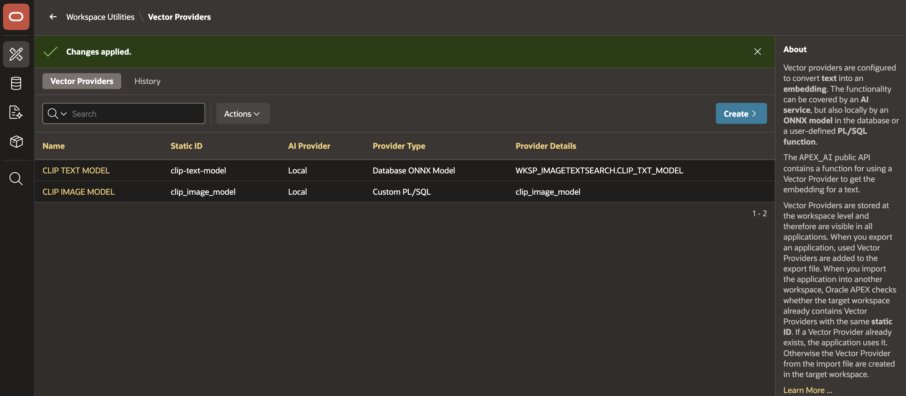

# Create Vector Providers

## Introduction

In this lab, you will create Vector Providers in Oracle APEX 26.1 for both the CLIP text model and the CLIP image model. These vector providers act as bridges between your APEX application and the underlying ONNX models stored in Oracle AI Database 26ai. They allow you to generate and use vector embeddings for both text inputs and image inputs as part of a semantic search experience.

Estimated Time: 10 minutes

Watch the video below for a quick walk-through of the lab.
[Create Vector Providers](videohub:1_x4l4dblf)

### Objectives

In this lab, you:

- Create a Database-based Vector Provider using the CLIP text model

- Create a PL/SQL Function

- Create a Custom PL/SQL Vector Provider using the CLIP image model.

## Task 1: Create a Vector Provider for Text Search

 In this task, you configure a vector provider to generate embeddings from text input using the CLIP text model stored in the database.

1. Navigate to **App Builder** > **Workspace Utilities** > **All Workspace Utilities**.

    

2. Select **Vector Providers**.

    

3. Click **Create**.

    

4. Enter/Select the following in the create window:

    - Under Identification:

        - Provider Type: **Database ONNX Model**
        - Name: **CLIP TEXT MODEL**

    - Under Local Embedding:

        - ONNX Model Owner: **-Select your schema-**
        - ONNX Model Name: **CLIP\_TXT\_MODEL**

    - Under Advanced:
        - Static ID: **clip\_text\_model**

    Click **Create**.

    

## Task 2: Create a Custom PL/SQL Vector Provider for Image Search

In this task, you will write a PL/SQL function that uses the CLIP image model to generate vector embeddings from image BLOBs. You’ll then create a custom vector provider in APEX that leverages this function to support semantic image search in your app.

1. Navigate to the **SQL Workshop** > **SQL Commands** page.

    

2. In SQL Commands, enter the following:

    ```sql
     <copy>
    CREATE OR REPLACE FUNCTION clip_image_model (
      p_base64_image IN CLOB
    ) RETURN VECTOR
    IS
      l_base64 CLOB;
      l_blob   BLOB;
      l_vector VECTOR;
    BEGIN
      IF p_base64_image IS NULL THEN
        RETURN NULL;
      END IF;

      -- Remove a browser data-URI prefix if present.
      l_base64 := REGEXP_REPLACE(
                    p_base64_image,
                    '^data:[^;]+;base64,',
                    '',
                    1,
                    0,
                    'i'
                  );

      l_blob := APEX_WEB_SERVICE.CLOBBASE642BLOB(l_base64);

      SELECT VECTOR_EMBEDDING(
               CLIP_IMG_MODEL USING l_blob AS data
             )
      INTO   l_vector
      FROM   dual;

      RETURN l_vector;
    END;
    /
    </copy>
    ```

    `CLOBBASE642BLOB` converts the Base64 CLOB to a BLOB, and `VECTOR_EMBEDDING` already returns a `VECTOR`, so no `TO_VECTOR` conversion is needed.

    Click **Run**.

    
3. In the Navigation bar, navigate to **App Builder** > Workspace Utilities > **All Workspace Utilities**.

    

4. Select **Vector Providers**.

    

5. Click **Create**.

    

6. In the Property Editor, enter/select the following properties:

    - Under Identification:

        - Provider Type: **Custom PL/SQL**
        - Name: **CLIP IMAGE MODEL**

    - Local Embedding > Custom Function Name: **clip\_image\_model**

    - Advanced >  Static ID: **clip\_image\_model**

     Click **Create**.

    

    

## Summary

You now know how to create a Database ONNX vector provider for text and a Custom PL/SQL vector provider for images, enabling powerful hybrid semantic search in your APEX application.

## References

- [Managing Vector Providers in Oracle APEX 26.1](https://docs.oracle.com/en/database/oracle/apex/26.1/htmdb/managing-vector-providers.html)
- [APEX_AI.GET_VECTOR_EMBEDDINGS Function](https://docs.oracle.com/en/database/oracle/apex/26.1/aeapi/APEX_AI.GET_VECTOR_EMBEDDINGS-Function-Signature-1.html)
- [Oracle APEX API Reference](https://docs.oracle.com/en/database/oracle/apex/26.1/aeapi/oracle-apex-api-reference.pdf)

## Acknowledgments

- **Author** - Sahaana Manavalan, Senior Product Manager, May 2025
- **Last Updated By/Date** - Sahaana Manavalan, Senior Product Manager, September 2026
