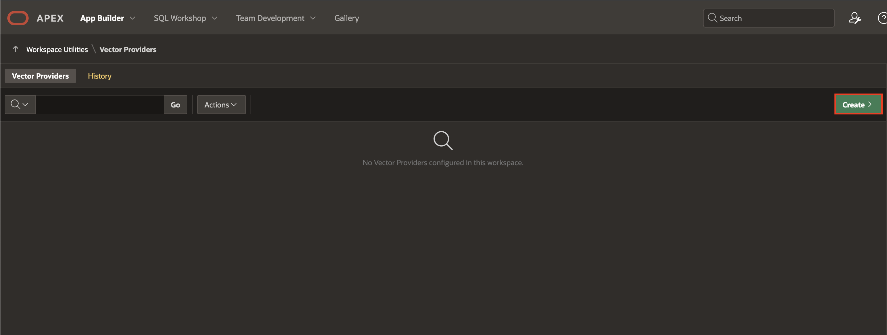
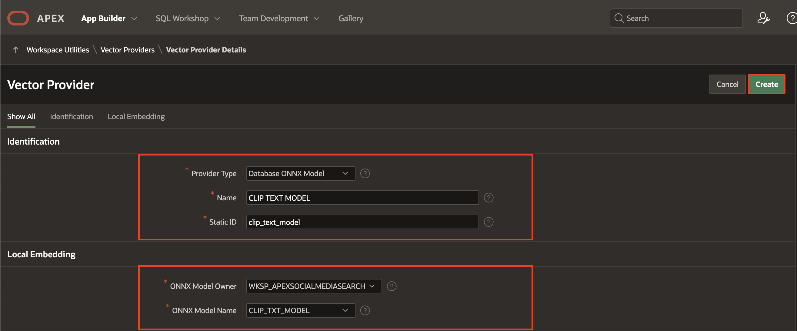
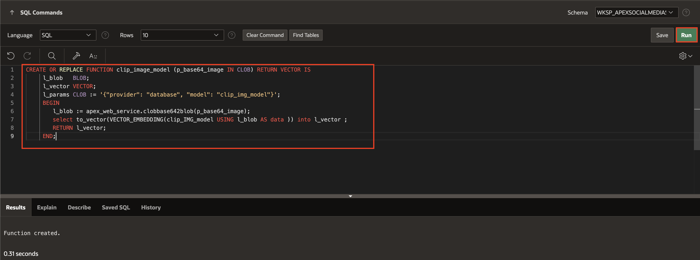
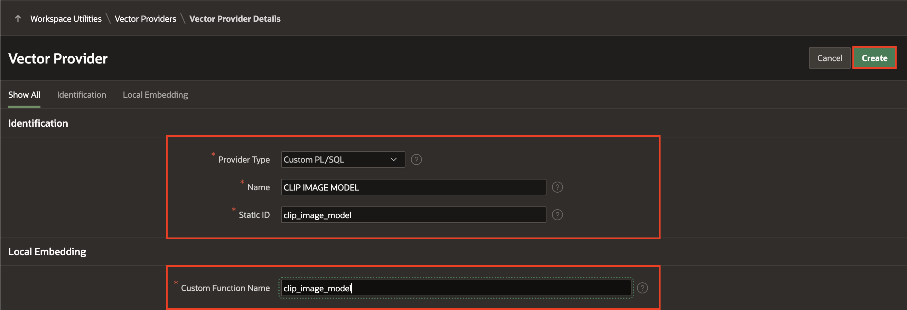

# Create Vector Providers

## Introduction

In this lab, you will create Vector Providers in Oracle APEX for both the CLIP text model and the CLIP image model. These vector providers act as bridges between your APEX application and the underlying ONNX models stored in Oracle Database 23ai. They allow you to generate and use vector embeddings for both text inputs and image inputs as part of a semantic search experience.

Estimated Time: 10 minutes

### Objectives

In this lab, you:

- Create a Database-based Vector Provider using the CLIP text model

- Create a PL/SQL Function

- Create a Custom PL/SQL Vector Provider using the CLIP image model.

## Task 1: Create a Vector Provider for Text Search

 In this task, you configure a vector provider to generate embeddings from text input using the CLIP text model stored in the database.

1. Navigate to **App Builder** > **Workspace Utilities** > **All Workspace Utilities**.

    

2. Select **Vector Providers**.

    

3. Click **Create**.

    

4. Enter/Select the following in the create window:

    - Under Identification:

        - Provider Type: **Database ONNX Model**
        - Name: **CLIP TEXT MODEL**
        - Static ID: **clip\_text\_model**

    - Under Local Embedding:

        - ONNX Model Owner: **-Select your schema-**
        - ONNX Model Name: **CLIP\_TXT\_MODEL**

    Click **Create**.

    

    

## Task 2: Create a Custom PL/SQL Vector Provider for Image Search

In this task, you will write a PL/SQL function that uses the CLIP image model to generate vector embeddings from image BLOBs. You’ll then create a custom vector provider in APEX that leverages this function to support semantic image search in your app.

1. Navigate to the **SQL Workshop** > **SQL Commands** page.

    

2. In SQL Commands, enter the following:

    ```sql
     <copy>
     CREATE OR REPLACE FUNCTION clip_image_model (p_base64_image IN CLOB) RETURN VECTOR IS
     l_blob   BLOB;
     l_vector VECTOR;
     l_params CLOB := '{"provider": "database", "model": "clip_img_model"}';
     BEGIN
        l_blob := apex_web_service.clobbase642blob(p_base64_image);
        select to_vector(VECTOR_EMBEDDING(clip_img_model USING l_blob AS data )) into l_vector ;
        RETURN l_vector;
     END;
     </copy>
    ```

    Click **Run**.

    
3. In the Navigation bar, navigate to **App Builder** > Workspace Utilities > **All Workspace Utilities**.

    

4. Select **Vector Providers**.

    

5. Click **Create**.

    

6. In the Property Editor, enter/select the following properties:

    - Under Identification:

        - Provider Type: **Custom PL/SQL**
        - Name: **CLIP IMAGE MODEL**
        - Static ID: **clip\_image\_model**

    - Local Embedding > Custom Function Name: **clip\_image\_model**

     Click **Create**.

    

    

## Summary

You now know how to create a Database ONNX vector provider for text and a Custom PL/SQL vector provider for images, enabling powerful hybrid semantic search in your APEX application.

## Acknowledgments

- **Author** - Sahaana Manavalan, Senior Product Manager, May 2025
- **Last Updated By/Date** - Sahaana Manavalan, Senior Product Manager, August 2025
