# Export and Load the CLIP ONNX Pipeline Model

## Introduction

In this lab, you will learn how to export a CLIP multi-modal ONNX pipeline model using the OML4Py client and how to load the exported ONNX Model to your Oracle Database.This step is pivotal for enabling semantic search capabilities in applications, where users can search using both text and images.

By the end of this lab, you will have a CLIP model integrated into your Oracle Database environment, ready to generate embeddings for both images and text, facilitating advanced semantic search functionalities.

Estimated Time: 15 Minutes

### Objectives

In this lab, you:

- Export CLIP ONNX Pipeline model
- Upload the exported model to Object Storage
- Load the CLIP ONNX Model onto the Database

## Task 1: Export ONNX Pipeline Model

In this task, you will export the CLIP ONNX Pipeline Model using the OML4Py Client

*Note: You can skip this task if you already have the CLIP multimodal ONNX model (with both text and image pipelines) exported and ready to use.*

**Note:** These instructions assume you have configured your Oracle Linux 8 repo in /etc/yum.repos.d, configured a Wallet if using an Autonomous Database, and set up a proxy if needed,and OML4Py client is installed. For more info, click [here](https://docs.oracle.com/en/database/oracle/oracle-database/23/vecse/generate-multi-modal-embeddings-using-clip.html#GUID-F3F77239-15DB-45A1-9288-768F0AF8F0D2).

1. Navigate to terminal where you have installed the OML4Py client and to start Python, copy paste the following:

    ```
     <copy>
     Python
     </copy>
    ```

   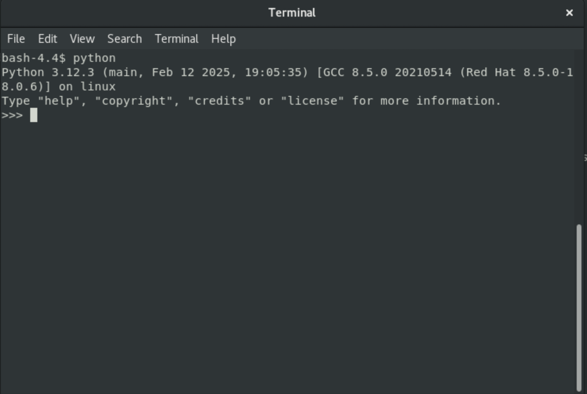

2. Import OML and connect to a local database/ADB:

    ```
     <copy>
     import oml
     oml.connect(user="USERNAME", password="PASSWORD", host="host.oracle.com", port=1521, service_name="service.oracle.com")
     </copy>
    ```

   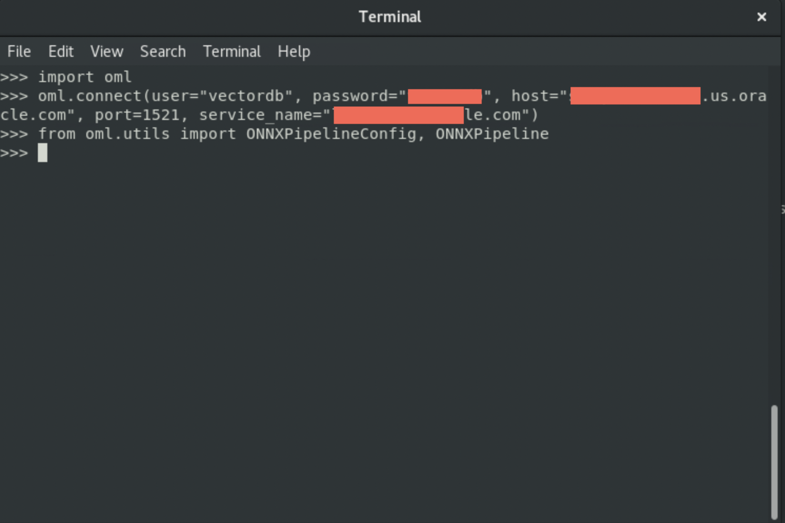

3. To get a list of all pre-configured models, import ONNXPipelineConfig from oml.utils. Copy and paste the following:

    ```
     <copy>
     from oml.utils import ONNXPipelineConfig, ONNXPipeline
     print(ONNXPipelineConfig.show_preconfigured())
     </copy>
    ```

   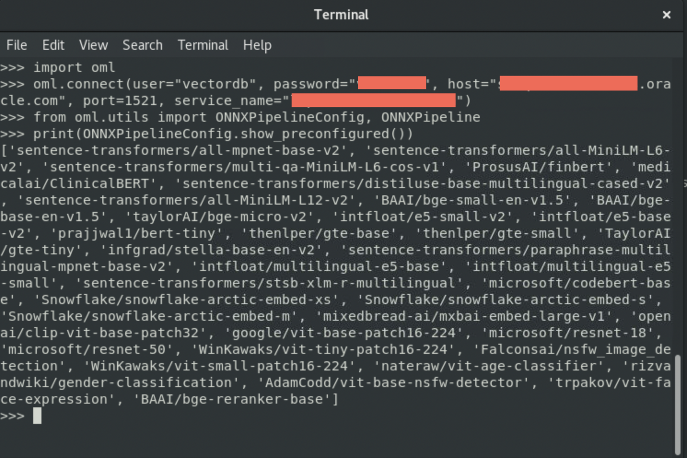

4. Export the CLIP pre-configured embedding model to a local folder. Copy and paste the following:

    ```
     <copy>
     from oml.utils import ONNXPipeline,ONNXPipelineConfig
    em = ONNXPipeline("openai/clip-vit-large-patch14",config=config)
    em.export2file("clip-vit-large-patch14","/scratch/")
     </copy>
    ```

   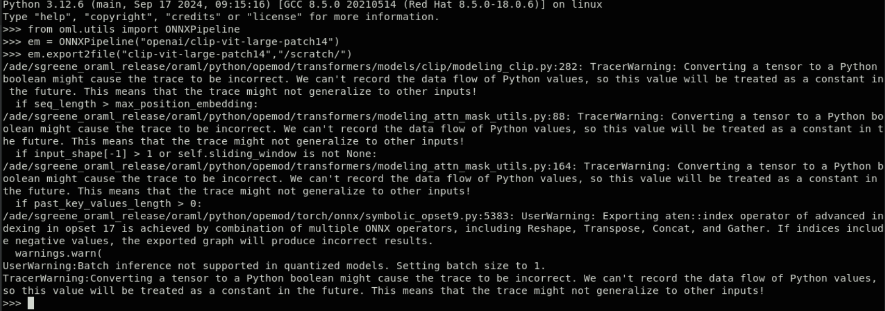

    *Note:* You can work with any available pre-configured CLIP Models in the OML4Py Client.

5. The previous step, CLIP models produces 2 files - 1 for image and 1 for text. You can verify that the files were produced in python or using file explorer.

    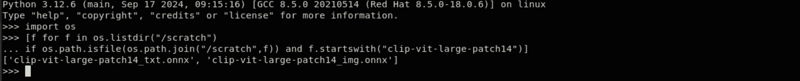

## Task 2: Upload the Model to Object Storage

In this task, you will upload the exported models in the previous task, to object storage.

1. Login into your OCI Account.

   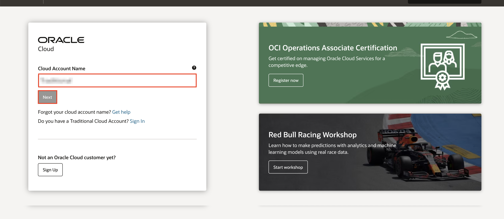

2. Click on the navigation bar and select **Storage > Object Storage & Archive Storage > Buckets**.

   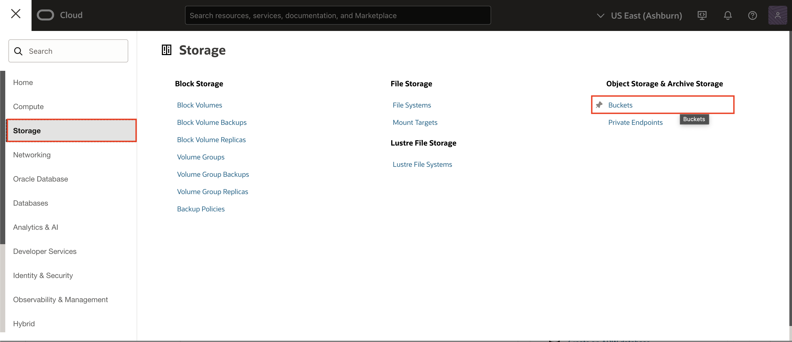

3. Select **Create Bucket**.

   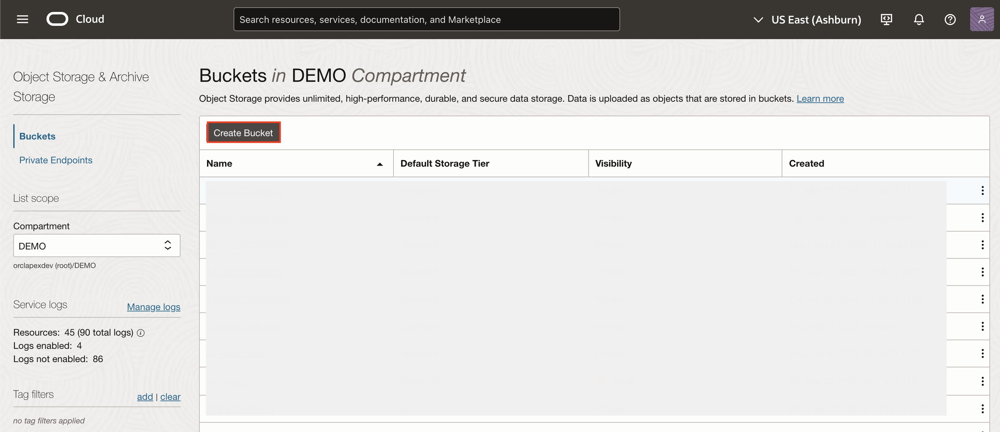

4. Enter the Bucket Name as **ONNX-Pipeline-Model-Export** and click **Create**.

   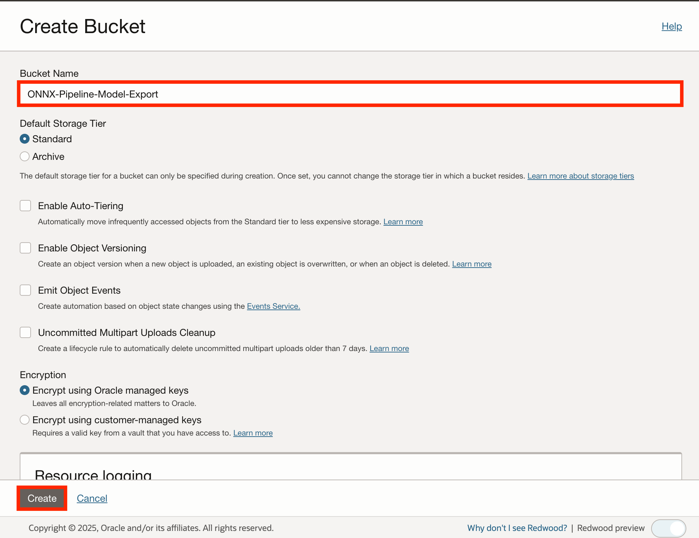

5. Navigate to the Bucket details and select **Upload**.

   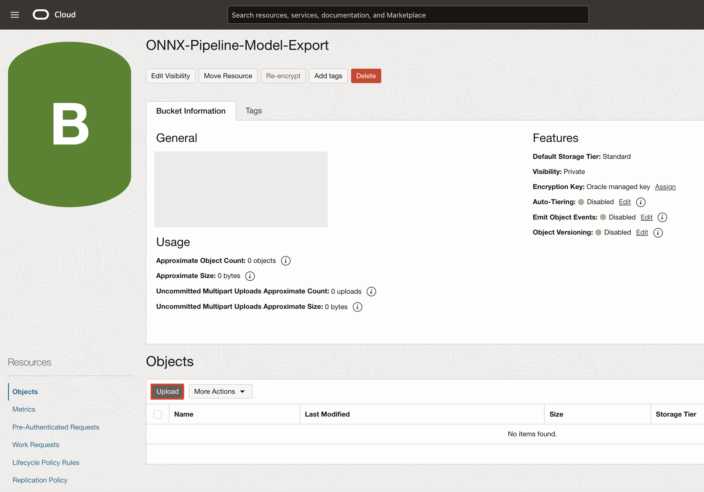

6. Drag and drop both the exported model files into the Upload Objects wizard and click **Upload**.

    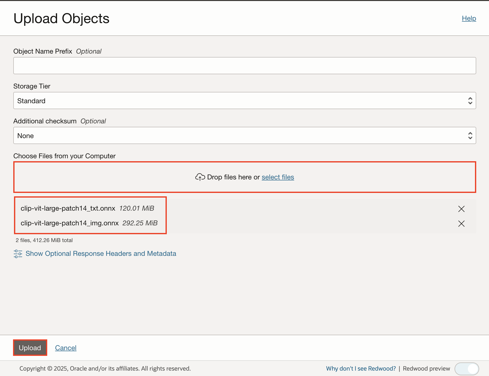

7. Once both the files are uploaded and the status shows **Finished**, click **Close**.

    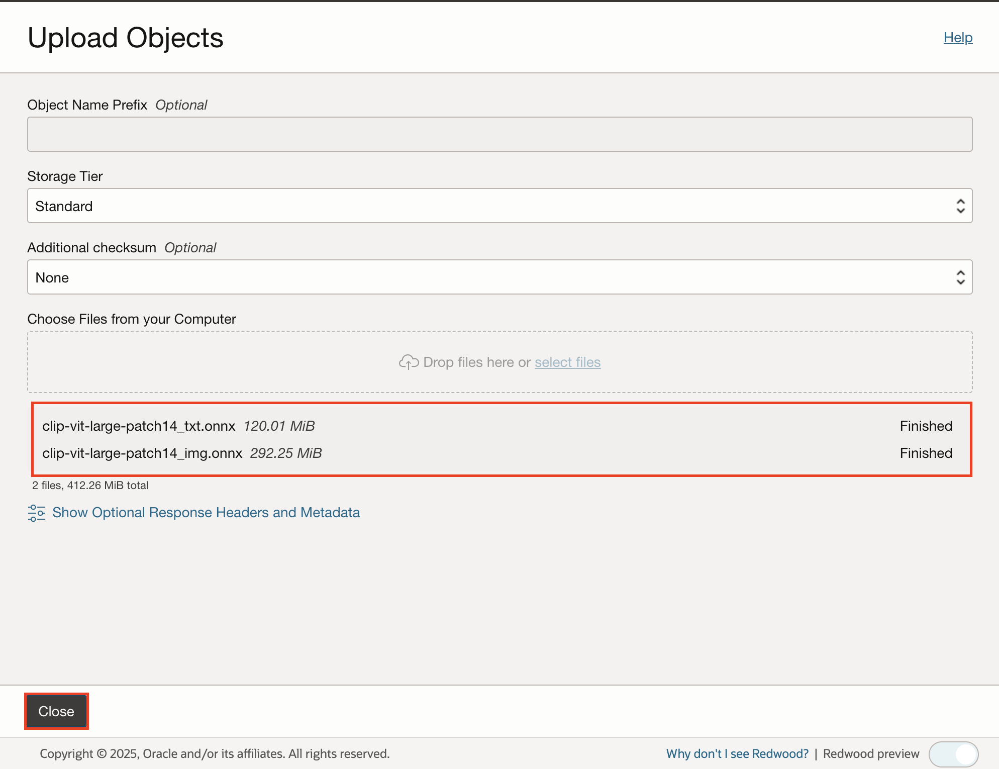

## Task 3: Create Pre-Authenticated Request for the objects

In this task, you will generate Pre-Authenticated Requests (PARs) for both the uploaded files, the image model and the text model, in Oracle Cloud Object Storage.

1. Click the **three dots** in the right corner of the clip-vit-large-patch14\_img.onnx model object and select **Create Pre-Authenticated Request**.

    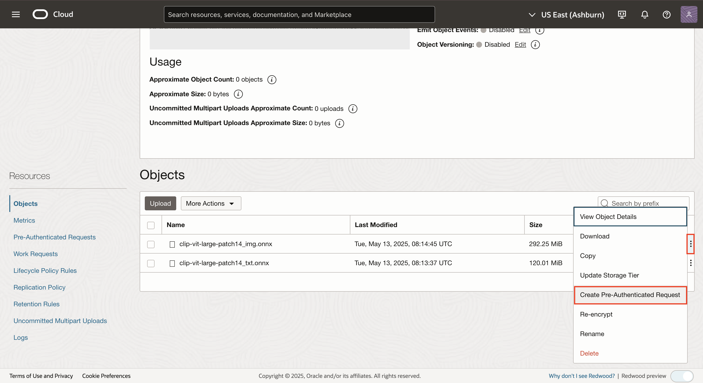

2. In the Create Pre-Authenticated Request window, select the following:

    - Create Pre-Authenticated Request Target: **Object**

    - Access Type: **Permit object reads**

     Click **Create Pre-Authenticated Request** button.

   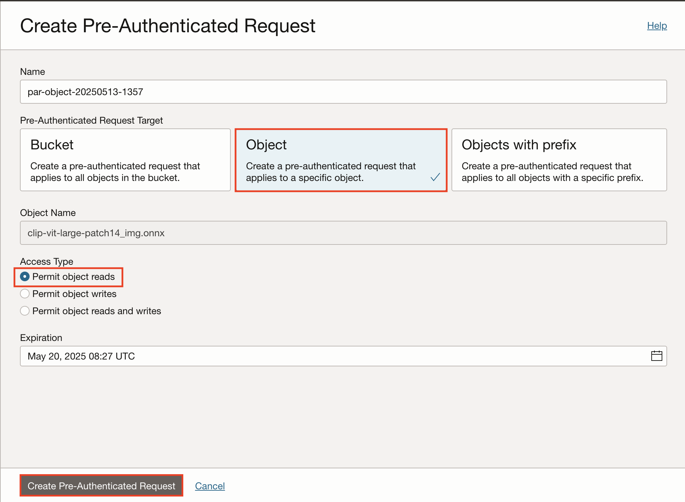

3. **Copy** the dedicated endpoint PAR Request URL and click **Close**.

   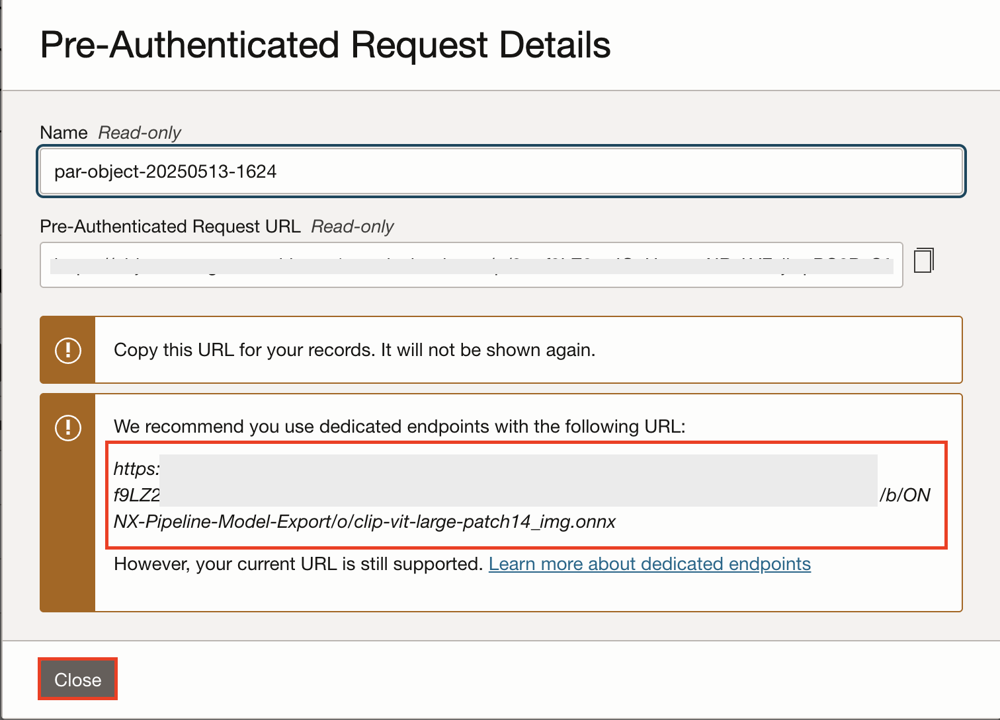

4. Repeat the steps 1-3 to generate PAR for the text model and store the PAR, which is going to be used in later labs.

## Task 4: Load ONNX Model to Oracle Database

In this lab, you will load the ONNX Models into your database.

1. Copy and paste the below to load the CLIP text model, by replacing the object_uri with PAR URL created in Task 3.

    ```
     <copy>
     BEGIN
     DBMS_VECTOR.LOAD_ONNX_MODEL(
     model_name => 'clip_txt_model',
     model_data => DBMS_CLOUD.GET_OBJECT(
                     credential_name => 'onnx_obj_store_cred_image',
                     object_uri      => '<Enter your PAR URL for the text model>'
                  ),
     metadata   => JSON('{
         "function": "embedding",
         "embeddingOutput": "embedding",
         "input": { "input": ["data"] }
        }')
     );
     END;
     </copy>
    ```

    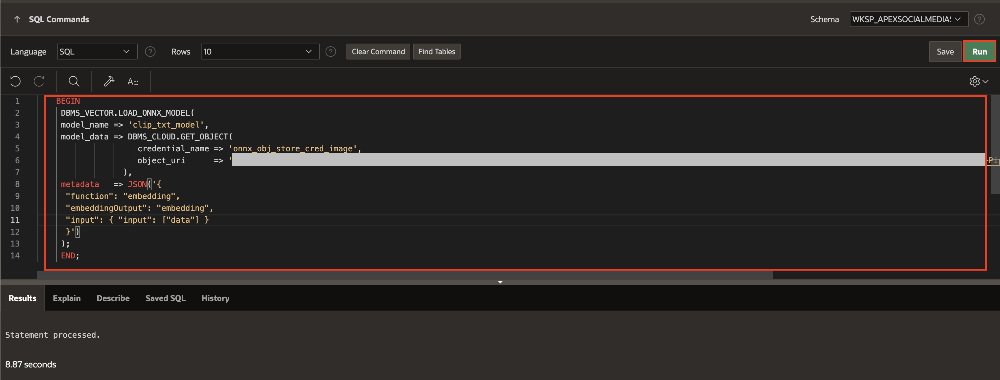

2.  Copy and paste the below to load the CLIP image model, by replacing the object_uri with PAR URL created in Task 3.

    ```
     <copy>
     BEGIN
     DBMS_VECTOR.LOAD_ONNX_MODEL(
        model_name => 'clip_img_model',
        model_data => DBMS_CLOUD.GET_OBJECT(
                     credential_name => 'onnx_obj_store_cred_image',
                     object_uri      => '<Enter your PAR URL for the image model>>'
                  ),
     metadata   => JSON('{
        "function": "embedding",
         "embeddingOutput": "embedding",
         "input": { "data": ["data"] }
        }')
     );
     END;
     </copy>
    ```

    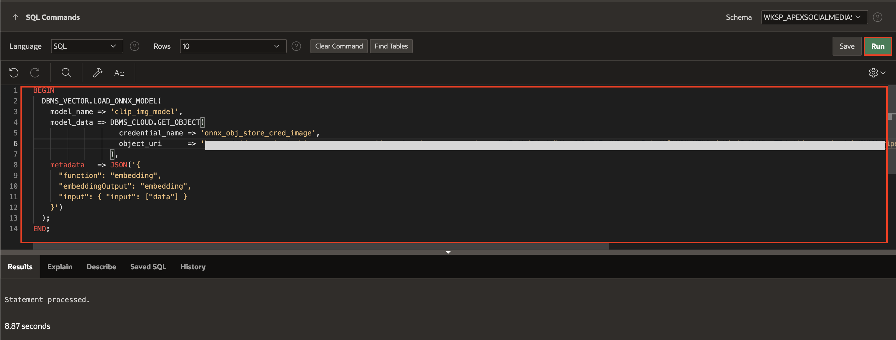

Here, you assign the name "clip\_txt\_model" to the Text model and "clip\_img\_model" to the Image model being imported.

## Summary

You now know how to export and load ONNX Pipeline Models to your Oracle Database.

You may now **proceed to the next lab**.

## Acknowledgments

- **Author** - Sahaana Manavalan, Senior Product Manager, May 2025
- **Last Updated By/Date** - Sahaana Manavalan, Senior Product Manager, May 2025
