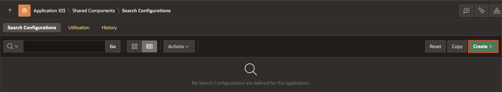
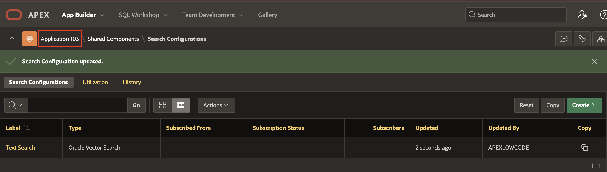
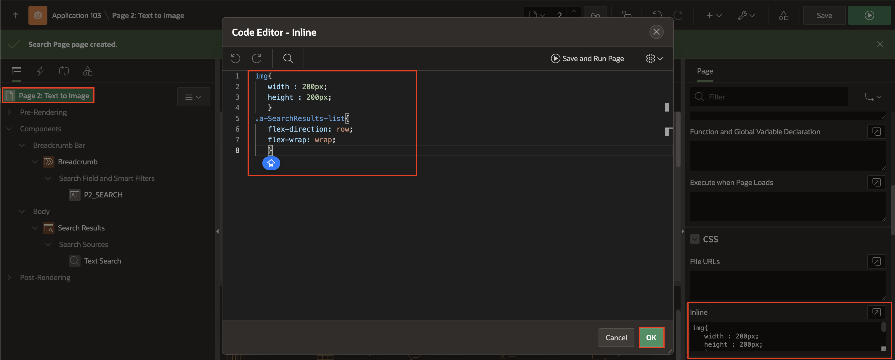
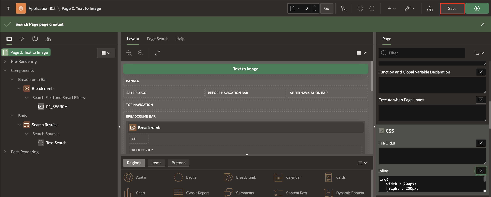
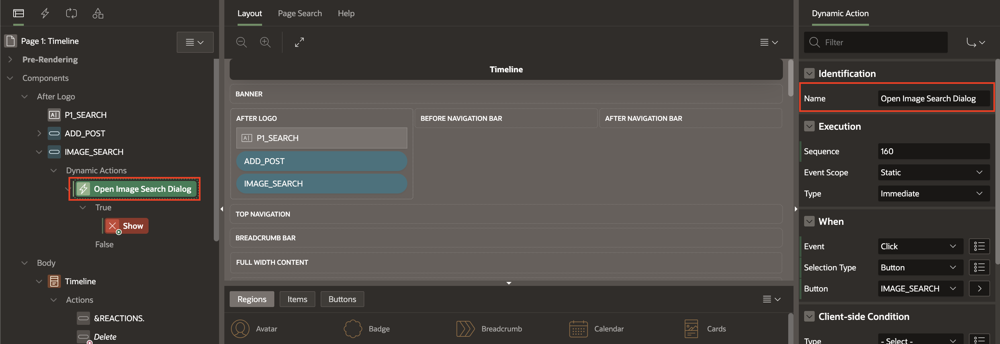

# Implement Image and Text Search

## Introduction

In this lab, you will integrate semantic search capabilities directly into the user interface of your APEX Social Media app. Instead of relying on basic keyword filtering, users will be able to search for posts using text or images based on meaning and similarity. Whether it’s finding visually similar images or posts related to a phrase, your app will deliver intelligent, context-aware results.

By the end of this lab, your APEX application will be ready to handle real-time image-based queries with ease.

Estimated Time: 20 minutes

### Objectives

In this lab, you:

- Add an Image Upload item to the APEX app for users to perform image-based search.

- Create an Upload button to trigger the search functionality using the uploaded image.

- Add a Reset button to clear the uploaded image and search results, allowing users to start a new search.

- Edit the Timeline region to dynamically reflect results matching the uploaded image or query, ensuring users see only contextually similar posts.

## Task 1:  Create Search Configuration and Page for Text-Based Search

In this task, you will create a search configuration in Oracle APEX using the CLIP text vector provider, and then build a search page that allows users to perform semantic searches based on text input.

1. Navigate to **App Builder.**

    

2. Select the **APEX Social Media** application.

    

3. Select **Shared Components**.

    

4. Under Navigation and Search, Select **Search Configurations**.

    

5. Click **Create**.

    

6. In the Create Search Configuration Wizard, enter the following:

    - Name: **TEXT SEARCH**
    - Search Type: **Oracle Vector Search**

    Click **Next**.

    

7. Enter/Select the following:

    - Vector Provider: **CLIP TEXT MODEL**
    - Source Type: **Table**
    - Table / View Owner: **select your schema**
    - Table / View Name: **SM_POSTS**

    Click **Next**.

    

8. Select the following:

    - Primary key Column: **ID**
    - Vector Column: **AI\_IMAGE\_VECTOR**
    - Title Column: **UPDATED_BY**

    Click **Create Search Configuration**.

    

9. In the Search Configuration Page, enter/select the following:

    - Under Icon and Display:
        - Icon Source: **Image bLOB Column**
        - Icon BLOB Column Name: **FILE_BLOB**
        - Default Result Row Template: Copy and paste the following code:

            ```
             <copy>
             <div class="a-ResultsItem &RESULT_CSS_CLASSES!ATTR.">
              {if ?ICON_VALUE/}
                {case ICON_TYPE/}
                {when INITIALS/}
                    <div class="a-ResultItem-initials u-color-var">&ICON_VALUE.</div>
                {when URL/}
                    <div class="a-ResultItem-image"></div>
                {when CLASS/}
                    <div class="a-ResultItem-icon u-color-var"><span class="fa &ICON_VALUE!ATTR." aria-hidden="true"></span></div>
                {endcase/}
             {endif/}
             </div>
             </copy>
            ```

        Click **Apply Changes**.

    

## Task 2: Add Search Page for Text

In this task, we will create a Search page for Text based search.

1. Navigate to the Application homepage.

    

2. Click **Create Page**.

    

3. In the Create a Page Wizard, Select **Search Page**.

    

4. In the Create Page Wizard, enter/select the following:

    - Page Definition > Name: **Text to Image**

    - Search Configurations > **Click the check box for Text Search**.

    

5. In the Rendering Tree, select **Page:Text to Image** and in the property  editor, copy paste the following under CSS > Inline.

    ```
     <copy>
     img{
        width : 200px;
        height : 200px;
        }
     .a-SearchResults-list{
        flex-direction: row;
        flex-wrap: wrap;
        }
     </copy>
    ```

    

6. Save and Run the Page.

    

7. 


## Task 2: Image upload

4. In the rendering tree, right-click on the Image Search Region and select **Create Page Item**.

    

5. In the Property editor, enter the following:

    - Under Identification:

        - Name: **P1\_IMAGE\_SEARCH\_BLOB**
        - Type: **Image Upload**

    - Label > Label: **Search Image**

    - Display > Display As: **Block Dropzone**

    - Storage > Type: **Table APEX\_APPLICATION\_TEMP\_FILES**

    

6. In the rendering tree, right-click on the Image Search Region and select **Create Page Item**.

     

7. In the Property editor, enter the following:

    - Under Identification:

        - Name: **P1_FILENAME**
        - Type: **Hidden**

    - Settings > Value Protected: **Toggle Off**

    

8. Right click on the P1_FILENAME Page item and Select **Create Computation**

    

9. In the Property editor, enter the following:

    - Under Computation:

        - Type: **SQL Query(return single value)**
        - SQL Query: Copy and Paste the below code

        ```
         <copy>
         SELECT FILENAME FROM APEX_APPLICATION_TEMP_FILES
         WHERE NAME =:P1_IMAGE_SEARCH_BLOB;
         </copy>
        ```

    

10. Right click on the Image Search Region, and click **Create Button**

    

11. In the property editor, enter the following:

    - Identification > Button Name: **Search**

    - Layout > Slot: **Create**

    - Under Appearance:

        - Template Option > Type : **Primary**

        Click **Ok**

       

12. Save the page.

    

## Task 2: Add Image Upload Button

In this task, you will create a new button to open the image search region.

1. In the Timeline page, navigate to the After logo region in the rendering tree.
Right-click on the After Logo region, and click **Create Button**.

    

2. In the Property editor, enter the following:

    - Under Identification:

        - Button Name: **IMAGE_SEARCH**
        - Label: **Image Search**

    - Under Appearance:

        - Button Template: **Text with Icon**
        - CSS Classes: **nav-bar**
        - Icon: **fa-image**

    - Behavior > Action: **Defined by Dynamic Action**

    

3. Right click on the IMAGE_SEARCH button and select **Create Dynamic Action**.

    

4. In the Property Editor of the New action, enter Identification > Name : **Open Image Search Dialog**

    

5. In the True Actions, select the show and enter the following in the property editor:

    - Identification > Action: Execute Javascript code

    - Settings > Code : copy and paste the below code

        ```
         <copy>
         apex.item('P1_SEARCH').setValue('');
         </copy>
        ```

    

6. In the rendering tree, under the created dynamic action, right click on the True Action and click Create True Action.

    

7. In the property editor, select the following:

    - Identification > Action: **Open Region**

    - Under Affected Elements:
        - Selection Type: **Region**
        - Region: **Image Search**

    Click **Save**.

    

## Task 3: Add a Reset Button

In this task, you will create a new button to clear the text and image search Page items.

1. In the rendering tree under After Logo component, right click and select **Create Button**

    

2. In the property editor, enter the following:

    - Under Identification:

        - Button Name: **RESET**

        - Label: **Reset**

    - Appearance > CSS Classes: **nav-bar**

    - Behavior > Action: **Defined by Dynamic Action**

    

3. Right click on the RESET button and select **Create Dynamic Action**.

    

4. In the Property Editor of the New action, enter Identification > Name : **Clear search item values**

    

5. In the True Actions, select the show and enter the following in the property editor:

    - Identification > Action: Execute Server-side code

    - Under Settings:

        - Language: **PL/SQL**
        - Code : Copy and paste the below code

        ```
         <copy>
         DELETE FROM apex_application_temp_files;
         </copy>
        ```

    

6. In the rendering tree, right click on the True Action and click **Create TRUE Action**.

    

7. Click on the Show and enter the following in the Property Editor:

    -  Identification > Action: **Clear**

    - Under Affected Elements:

        - Selection Type: **Item(s)**
        - Items(s): **P1_IMAGE_SEARCH_BLOB,P1_SEARCH,P1_FILENAME**

    

8. Create another TRUE action by repeating step 6, and enter the following in the property editor:

    - Identification > Action: **Refresh**

    - Under affected Elements:

        - Selection Type: **Region**
        - Region: **Timeline**

    

## Task 4: Edit the Timeline Region

In this task, you will edit the Timeline region to refer the ONNX models we loaded in Lab 2. 


1. Navigate to the Timeline page and Select the **Timeline** region. In the property editor, enter the following:
    - Source > SQL Query: Copy paste the below code:

        ```
         <copy>
         WITH uploaded_image AS (
            SELECT blob_content AS image_blob
            FROM apex_application_temp_files
            WHERE filename = :P1_FILENAME
            ORDER BY created_on DESC
            FETCH FIRST 1 ROWS ONLY
            )
            SELECT A.*,
                TO_CHAR(ROUND(vector_distance, 3), '0.999') AS vector_distance_display
            FROM (
                SELECT
                    p.id,
                    p.post_comment,
                    p.file_blob,
                    p.file_mime,
                    p.file_name,
                    p.created,
                    p.created_by,
                    p.updated,
                    p.updated_by,
                    CASE
                        -- If TEXT search is entered
                        WHEN :P1_SEARCH IS NOT NULL THEN
                            COSINE_DISTANCE(
                                TO_VECTOR(VECTOR_EMBEDDING(clip_txt_model USING :P1_SEARCH AS data)),
                                p.ai_image_vector
                            )

                        -- If IMAGE is uploaded
                        WHEN EXISTS (SELECT 1 FROM uploaded_image) THEN
                            COSINE_DISTANCE(
                                TO_VECTOR(VECTOR_EMBEDDING(
                                    clip_img_model USING (SELECT image_blob FROM uploaded_image) AS data
                                )),
                                p.ai_image_vector
                            )

                        -- Otherwise, don't compute distance
                        ELSE NULL
                    END AS vector_distance
                    FROM sm_posts p
                    ) A

         ORDER BY  A.vector_distance, A.created DESC;
         </copy>
        ````

        And click **Ok**.

    

2. In the Property Editor, update the following properties:

    - Under Identification:

        - Type: **Button**

        - Label: **Share**

    - Under Link:

        - Type: **Redirect to URL**

        - Target:

            - Type: **URL**

            - URL: **#action$share?id=&ID.**

            Click **Ok**.

    
3. In the Property Editor, under the **Appearance** group, update the following properties:

    - Display Type: **Icon**

    - Icon: **fa-share-alt**

    
4. In the Rendering Tree on the left pane, select **Page 1: Timeline**. In the Property Editor, update **Javascript > Execute When Page Loads** with the following code snippet:

    ```
     <copy>
        apex.actions.add([{
        name: "like",
        action: (event, element, args) => {
            apex.items.P1_ACTION_ID.value = args.id;
            apex.event.trigger(document, 'action-like');
        }
        }, {
        name: "delete",
        action: (event, element, args) => {
            apex.items.P1_ACTION_ID.value = args.id;
            apex.event.trigger(document, 'action-delete');
        }
        }, {
        name: "open-map",
        action: () => {
            apex.event.trigger(document, 'action-open-map');
        }
        }, {
        name: "open-about",
        action: () => {
            apex.event.trigger(document, 'action-open-about');
        },
        },
        {
        name: "share",
        action: (event, element, args) => {
            apex.items.P1_ACTION_ID.value = args.id;
            apex.event.trigger(document, 'action-share');
            }
        }]);
     </copy>
    ```

    

    

5. In the Rendering Tree, click on the **Dynamic Actions** tab. Right-click on **Custom** and select **Create Dynamic Action**.

    

6. In the Property Editor, enter/select the following properties:

    - Identification > Name: **action-share**

    - Under When:

        - Event: **Custom**

        - Custom Event: **action-share**

        - Selection Type: **Javascript Expression**

        - Javascript Expression: **document**

    

7. In the left pane, under **action-share**, click on the **True** action. Now, in the property editor, update the following properties:

    - Identification > Action: **Share**

    - Under Settings:

        - Title: **Image Shared on Social Media App**

        - Text: **&APP_USER. is sharing a file.**

        - Share Type: **File(s)**

        - File(s) Source: **SQL Query**

        - SQL Query:

            ```
             <copy>
             SELECT FILE_BLOB, FILE_NAME, FILE_MIME
             FROM SM_POSTS WHERE ID = :P1_ACTION_ID;
             </copy>
            ```

        - Items to Submit: **P1\_ACTION\_ID**

    

8. **Save and Run** the page. You can see a Share button for each post. Click on **Share** to open a context menu and choose the app you want to share with. In this example, choose **Mail** and the post is attached as an image in an email draft with an associated text.

    

    

## Summary

You have successfully enhanced the Social Media app by integrating semantic image search features. You added an image upload interface, created buttons to trigger and reset searches, and updated the timeline region to display results that closely match the uploaded image or query. Your APEX app can now deliver intelligent, visually driven search experiences powered by AI.

## Acknowledgments

- **Author** - Sahaana Manavalan,Senior Product Manager, May 2025
- **Last Updated By/Date** - Sahaana Manavalan,Senior Product Manager, May 2025
