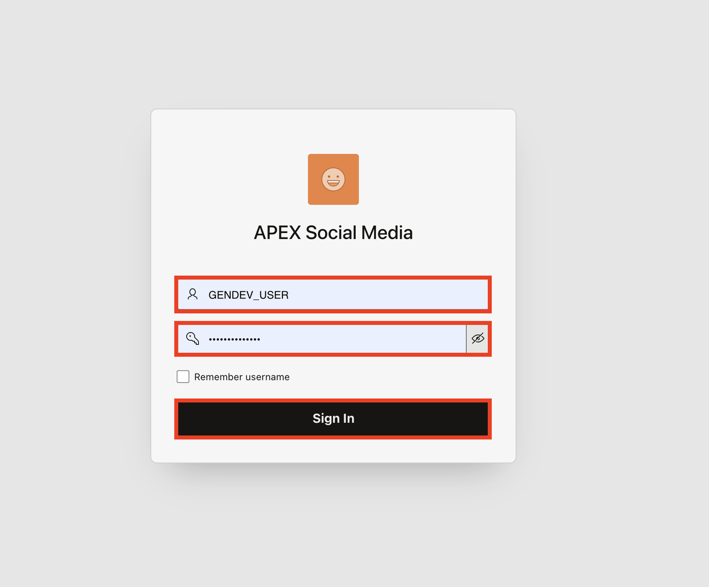
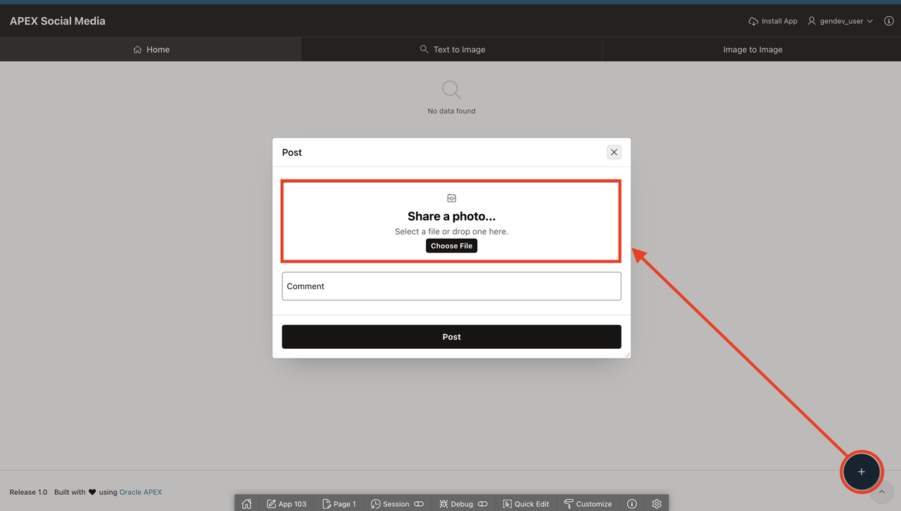
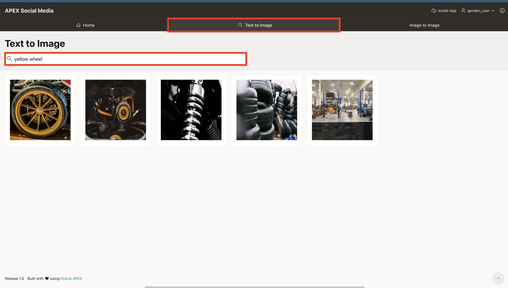
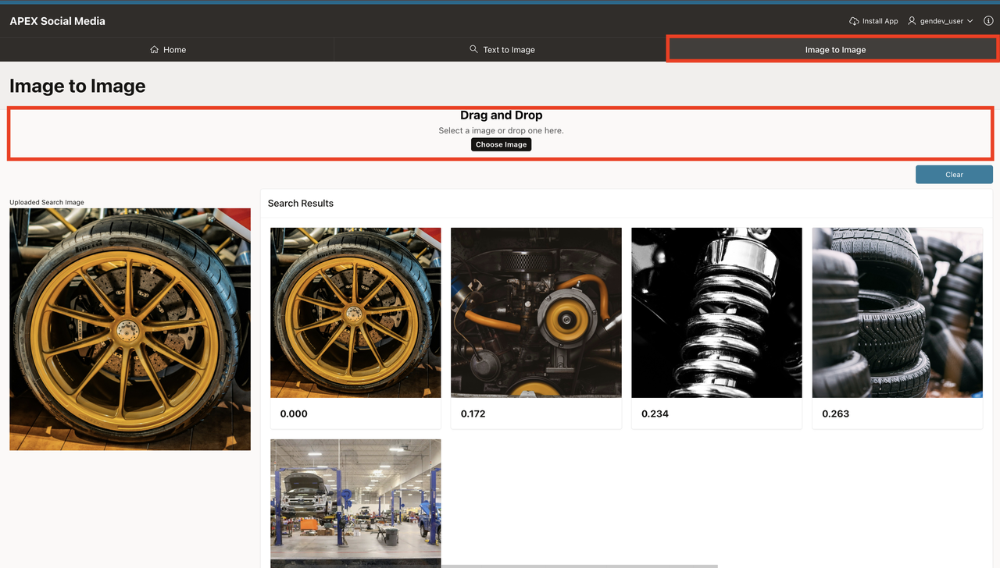

# Run the Application

## Introduction

In this lab, you run the Oracle APEX 26.1 Social Media application and perform searches on uploaded images with text or image input queries.

Estimated Time: 5 Minutes

Watch the video below for a quick walk-through of the lab.
[Run the App](videohub:1_utzfuc9n)

### Objectives

In this lab, you:

- Run the Application

## Task 1: Run the Application

1. Login to the application. The username and password are the same as your APEX workspace user credentials.

    

2. Click **Add Post +** on the bottom right corner.

3. Drag and Drop the image from your local system or use the **Choose File** button to upload an image from your local system. Then, click **Post**.

    

    The image has been posted on your timeline. Similarly, add as many posts as you would like.

    *Note: Use standalone baseline 8-bit lossy JPEG (image/jpeg\) files for uploads. The in-database image embedding pipeline does not support PNG, WebP, HEIC, or other unsupported formats; these may result in a NULL embedding.*

4. Now, click on the **Text to Image** tab and enter your Search Term in the Search Bar and then press **Enter**. The app searches for and displays all the images that contain the corresponding search term.

    In the following example, for text to image search, when you enter "Yellow wheel" in the Search bar, the app displays all the images that contain or relate to a yellow wheel.

    

5. To perform an Image to Image search, navigate to the  **Image to Image** tab, upload the image you want to find similar matches for. The app will then search and display all posted images that closely resemble the uploaded image.

    In the following example, for image based search, when you upload an image of a 'yellow wheel', the app displays all posted images that are visually similar or related to the uploaded image.

    

    *Note: The vector distance is displayed for each result. A lower vector distance indicates a closer match to the uploaded image.*

## Summary

You have now learned how to post images and perform AI powered searches on uploaded images using either text or image queries as input.

## References

- [Finding Meaning with Vector Search in Oracle APEX 26.1](https://docs.oracle.com/en/database/oracle/apex/26.1/apxdc/finding-meaning-vector-search.html)
- [ONNX Pipeline Models: Image Embedding](https://docs.oracle.com/en/database/oracle/oracle-database/26/vecse/onnx-pipeline-models-image-embedding.html)
- [Temporary Files in Oracle APEX](https://docs.oracle.com/en/database/oracle/apex/26.1/apxdc/temporary-files.html)

## Acknowledgments

- **Author** - Sahaana Manavalan, Senior Product Manager, June 2025
- **Last Updated By/Date** - Sahaana Manavalan, Senior Product Manager, September 2026

## Acknowledgements

* **Author** - TODO: Your Name, Your Title, Your Organization
* **Last Updated By/Date** - TODO: Your Name, Month Year
