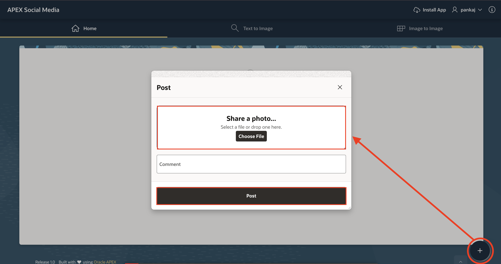
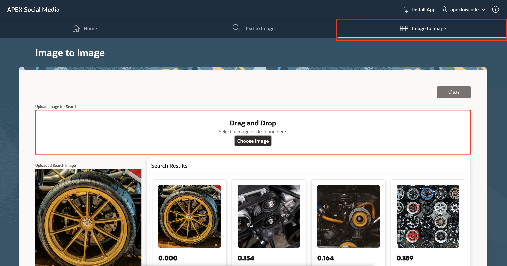

# Run the Application

## Introduction

In this lab, you run the APEX Social Media application and perform AI Search on the uploaded images.

Estimated Time: 5 Minutes

### Objectives

In this lab, you:

- Run the Application

## Task 1: Run the Application

1. Login to the application. The username and password are the same as your APEX workspace user credentials.

    

2. Click **Add Post +** on the bottom right corner.

3. Drag and Drop the image from your local system or use the **Choose File** button to upload an image from your local system. Then, click **Post**.

    

    The image has been posted on your timeline. Similarly, add as many posts as you would like.

4. Now, click on the **Text to Image** tab and enter your Search Term in the Search Bar and then press **Enter**. The app searches for and displays all the images that contain the corresponding search term.

    In the following example, for text to image search, when you enter "yellow wheel" in the Search bar, the app displays all the images that contain or relate to a yellow wheel.

    

5. To perform an image-to-image search, navigate to the Image to Image tab, upload the image you want to find similar matches for. The app will then search and display all posted images that closely resemble the uploaded image.

    In the following example, for image-based search, when you upload an image of a 'yellow wheel', the app displays all posted images that are visually similar or related to the uploaded image.

    

## Summary

You have now learned how to post images and perform AI-powered searches on uploaded images using either text or image queries as input.

## Acknowledgments

- **Author** - Sahaana Manavalan, Senior Product Manager, June 2025
- **Last Updated By/Date** - Sahaana Manavalan, Senior Product Manager, June 2025
