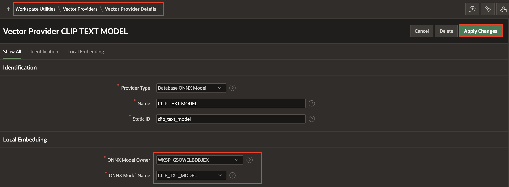

# Introduction

## About this Workshop

In today's digital landscape, visual content is everywhere—from product photos and social media posts to scanned documents and user-generated media. The ability to search and understand images meaningfully, not just by filenames or tags, has become a powerful differentiator for modern applications. Traditional search methods often miss the context or content of images, limiting their effectiveness in image-rich environments.

In this workshop, you will learn how to implement image and text semantic search in Oracle APEX using ONNX models and Oracle Database 23ai’s built-in AI Vector Search. You will enhance a Social Media APEX application to intelligently interpret and search image using both text and image queries. By combining deep learning models with APEX, you’ll unlock next-generation search experiences that go beyond keywords—empowering your apps to truly understand what users are looking for.

Estimated Time: 45 minutes

### Objectives

In this workshop, you:

- Export and load ONNX Pipeline models that can understand the content of images and text by converting them into vector representations.

- Integrate these models into your Oracle Database so they can be used directly from within your APEX application.

- Enhance a Social Media APEX application to automatically extract meaning from uploaded images.

- Enable users to perform intelligent searches,such as finding similar images or related posts—based on visual or textual similarity.

- Build a seamless user experience where image and text search feels natural, accurate, and fast.

### Prerequisites for Building this App

- A paid Oracle Cloud Infrastructure (OCI) account or a FREE Oracle Cloud account with $300 credits for 30 days to use on other services. Read more about it at: [oracle.com/cloud/free/](https://www.oracle.com/cloud/free/).

- The logged-in user should have the necessary privileges to create and manage Autonomous Database instances in this compartment. You can configure these privileges via an OCI IAM Policy. If you are using a Free Tier account, it is likely that you already have all the necessary privileges.

- Database Version : This workshop requires Autonomous Database 23ai, version 23.7 or later.

*Note: This workshop assumes you are using Oracle APEX 24.2. Some of the features might not be available in prior releases and the instructions, flow, and screenshots might differ if you use an older version of Oracle APEX.*

## Downloads

If you are stuck or the App is not working as expected, you can download and install the completed App as follows:

1. Click [here](https://c4u04.objectstorage.us-ashburn-1.oci.customer-oci.com/p/EcTjWk2IuZPZeNnD_fYMcgUhdNDIDA6rt9gaFj_WZMiL7VvxPBNMY60837hu5hga/n/c4u04/b/livelabsfiles/o/image_semantic_search.sql) to download the completed application file.

2. Import the **Image\_semantic\_search.sql** file into your workspace. Follow the steps in the Install Application wizard to install the app along with the Supporting Objects.

3. Once the application is installed,
    - Follow **Lab 1** to load the ONNX Models to your database.

    - In the **App Builder homepage**, navigate to **Workspace Utilities > Vector Providers > CLIP TEXT MODEL**. In the Vector Provider Details page, select the following:

        - Under Local Embedding:

            - ONNX Model Owner: **-Select your schema-**
            - ONNX Model Name: **CLIP\_TXT\_MODEL**

        Click **Apply Changes**.

    

4. All set. Now, run the application and see it in action!

## Labs

| Lab |  Module | Est. Time |
| --- | --- | --- |
| 1 | [Load ONNX Models](?lab=1-load-model) | 10 minutes |
| 2 | [Import and Edit Social Media App](?lab=2-import-app) | 5 minutes |
| 3 | [Create Vector Providers](?lab=3-create-vector-providers) | 10 minutes |
| 4 | [Implement Text and Image Search](?lab=4-edit-application) | 15 minutes |
| 5 | [Run the Application](?lab=5-run-app) | 5 minutes |

## Learn More - *Useful Links*

- [OCI Generative AI](https://www.oracle.com/artificial-intelligence/generative-ai/large-language-models/)
- [APEX on Autonomous](https://apex.oracle.com/autonomous)
- [APEX Collateral](https://www.oracle.com/database/technologies/appdev/apex/collateral.html)
- [Tutorials](https://apex.oracle.com/en/learn/tutorials)
- [Community](https://apex.oracle.com/community)
- [External Site + Slack](http://apex.world)

## Acknowledgments

- **Author** - Sahaana Manavalan, Senior Product Manager, May 2025
- **Last Updated By/Date** - Sahaana Manavalan, Senior Product Manager, May 2025
