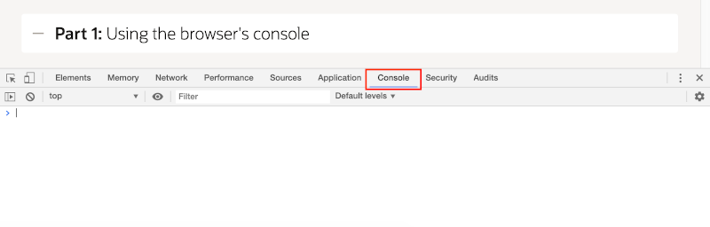
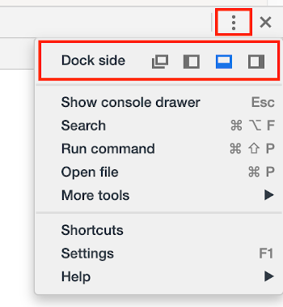
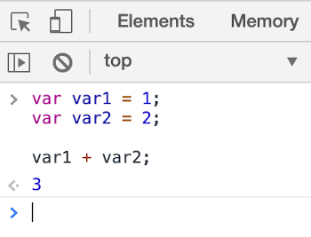

# JavaScript Basics

## Introduction

In this lab, you will start working with the basics of JavaScript, including variables, operators, and functions - all from the console in your browser's developer tools.

This lab is based on <a href="https://developers.google.com/web/tools/chrome-devtools/" target="\_blank">Google Chrome's DevTools</a>, so use that browser if possible. You may use a different browser if you wish, but you will need to adapt the instructions that follow as needed.

Play the video below to learn about this lab.

[](youtube:02thxqv-m_c)

 <a href="https://www.slideshare.net/DanielMcGhan/module-1-javascript-basics" target="\_blank">Click here</a> to view the slides.

## Task 1: Using the browser's console

In this part, you will learn how to declare variables and work with different operators in your web browser's console.

1.  In Chrome, press **Command+Option+J** (Mac) or **Control+Shift+J** (Windows/Linux) to open the DevTools Console tab.

    

2.  The developer tools window can be docked to the browser in different ways or completely undocked. Take a moment to practice resizing and changing the position of the developer tools window using the customization menu.

    Go to the next step when you have the developer tools window positioned as you like it.

    

3.  Type the following code into the **Console** tab. Try typing it out, rather than copy-pasting it. Note that pressing **Enter** will execute the code in the console. Use **Shift+Enter** to add new lines.

    ```
    <copy>
    var var1 = 1;
    var var2 = 2;

    var1 + var2;
    </copy>
    ```

4.  Press **Enter** to execute the code entered in the previous step. You should see the number `3` output to the console.

    

    As you can see, the console is an implementation of a Read-Eval-Print-Loop (REPL). It reads your code, executes it, prints the output from the last expression, and then returns control to you to do it all over again.

5.  Press the **Up Arrow** to load the previously executed block of code. Note that the **Up Arrow** and **Down Arrow** can be used to cycle through the console's execution history. Modify the code so that it appears as follows.

    ```
    <copy>
    var var1 = 1;
    var var2 = 2;

    console.log(var2 - var2);
    console.log(var1 + var2);
    </copy>
    ```

6.  Press **Enter** to execute the code. You should see output like the following in the console.

    

    As you can see, the `console.log` method provides a means of getting output from JavaScript code. This can be useful for simple debugging.

    `undefined` is shown at the end because the last statement (a call to `console.log`) did not return a value. It's as though it returned `undefined`.

7.  Return to the console and begin typing the name of one of the variables declared in the previous code (e.g. `var1`). You should see an autocomplete popup window that shows the names of both variables.

    

    Note that if you type the full name of a variable and press **Enter**, the value of the variable will be displayed in the console.

8.  Refresh the web page and try typing the name of a variable again. They will not show up because each time a page is loaded in the browser, it gets its own new JavaScript context.

## Task 2: Variables, data types, and operators

Now that you have a basic working knowledge of the console, it's time to get your hands dirty working with JavaScript.

1.  Enter the following code in the console. Then use the declarations as a guide to add four new variables, one of each type. Press **Enter** and use the console to see the values of the variables.

    ```
    <copy>
    var msg = 'Hello';
    var id = 123;
    var fun = true;
    var things = ['car', 'laptop', msg];
    </copy>
    ```

2.  Add on to the code from the previous step by writing statements that use the following operators. Choose at least 2 operators from each of the 4 types for a minimum of 8 statements.

    | Operator Type | Operators |
    | --- | --- |
    | Assignment | `=`, `+=`, `-=`, `*=`, `/=`, `%=` |
    | Arithmetic | `+`, `-`, `*`, `/`, `%`, `++`, `--` |
    | Comparison | `==`, `===`, `!=`, `!==`, `>`, `<`, `>=`, `<=` |
    | Logical | `&&`, `||`, `!` |

## Task 3: Conditionals and loops

Programming wouldn't be possible without conditionals and loops. The basic `if` statement and `for` loop are all you really need to get going with JavaScript.

1.  Add on to the code from the previous part by writing an `if` statement of your choosing. Use the following code as a guide.

    ```
    <copy>
    if (msg === 'bye') {
      fun = false;
    }
    </copy>
    ```

    Run your code to test it as needed. For extra practice, write an `if-then-else` statement.

2.  Add on to the code from the previous step by writing a loop that displays the values in the array you declared in Step 1. Use the following code as a guide.

    ```
    <copy>
    for (var x = 0; x < things.length; x += 1) {
      console.log(things[x]);
    }
    </copy>
    ```

    Run your code to test it as needed.

## Task 4: Objects and functions

Objects and functions are used to compose and organize code in JavaScript. It's important to have a basic understanding of how they work before moving on to more complex topics.

1.  Enter the following code into the console and execute it.

    ```
    <copy>
    var person = {
      first: '',
      last: ''
    };

    function sayHello(p) {
      console.log('Hi ' + p.first + ' ' + p.last);
    }
    </copy>
    ```

2.  Using the console, type and execute code that sets the values of the `first` and `last` attributes of the `person` variable.

3.  Using the console, type and execute code that invokes the `sayHello` function while passing it the `person` variable.

4. If time permits, consider making the following enhancements:

    * Add a new function named `sayHello2` that accepts an array of people and loops over them to say hello to each one.
    * Update `sayHello2` so that if a person's first or last name is an empty string (`''`), `null`, or `undefined`, it does not say hello.

## **Summary**

This completes Lab 1. At this point, you should be getting comfortable working with the console and some of JavaScript's core concepts. Please proceed to Lab 2.

## **Acknowledgements**
 - **Author** -  Dan McGhan, Database Product Management
 - **Contributors** - Arabella Yao, Jeffrey Malcolm Jr, Robert Ruppel, LiveLabs QA
 - **Last Updated By/Date** - Jeffrey Malcolm Jr, LiveLabs QA, June 2020
