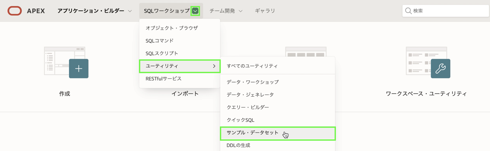
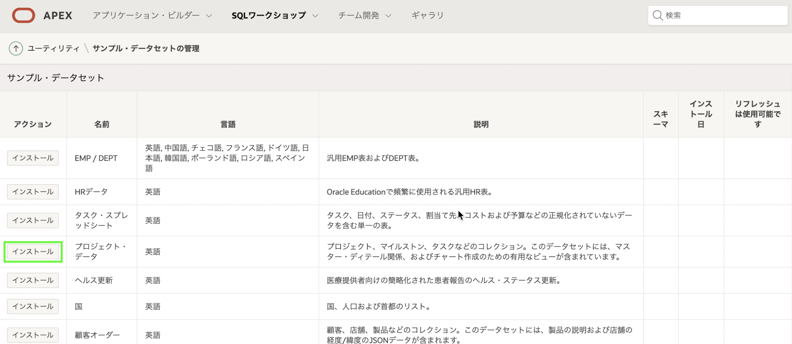
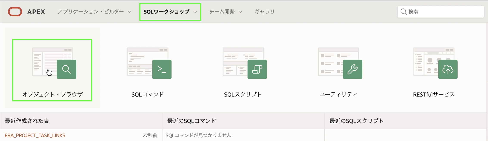
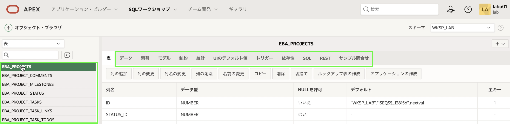

# テーブルとビューの構築 - サンプル テーブルのインストール

## 紹介
このラボでは、サンプル データを含むサンプル データセットからサンプル テーブルとビューをインストールする方法を学習します。

## タスク 1: プロジェクト テーブルの作成

1.  APEX ワークスペースのホームページから、[**SQL ワークショップ**] を選択し、[**ユーティリティ**] をクリックしてから、[**サンプル データセット**] をクリックします。

    

2. [**プロジェクト データ**] 行で、[**インストール**] をクリックします。

    

3. **次へ**をクリックします。
4. [**データセットのインストール**] をクリックします。
5. [**終了**] をクリックします。    
    *注: アプリケーションを手動で作成するため、_Create Application_ をクリックしないでください*

## タスク 2: データベース オブジェクトを確認する

1. App Builder メニューで、**SQL Workshop** をクリックします。
2. **オブジェクト ブラウザ**をクリックします。

    

3. **EBA** で始まるテーブルをクリックし、[データ]、[制約] などのさまざまなタブをクリックして、テーブルの詳細を確認します。

    

## **まとめ**

これでラボ 1 は完了です。これで、サンプル データセットをインストールする方法がわかりました。 [ラボ 2 に移動するには、ここをクリックしてください](?lab=lab-2-creating-application)

## **謝辞**

  - **著者** - Salim Hlayel, Principle Product Manager
  - **寄稿者** - LiveLabs QA Team (Arabella Yao, Product Manager Intern | Dylan McLeod, QA Intern)
  - **最終更新者/日付** - Madhusudhan Rao, Apr 2022

