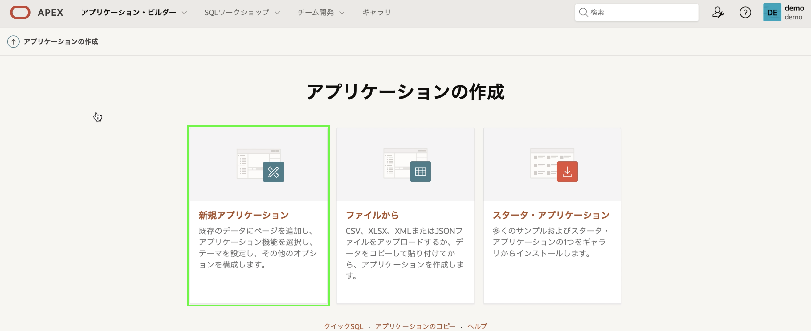
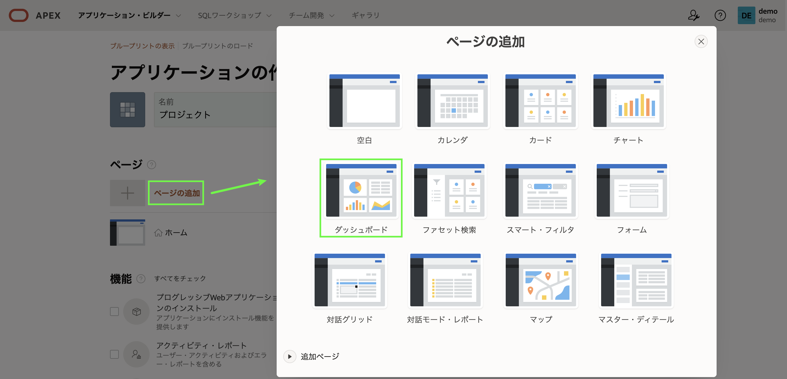
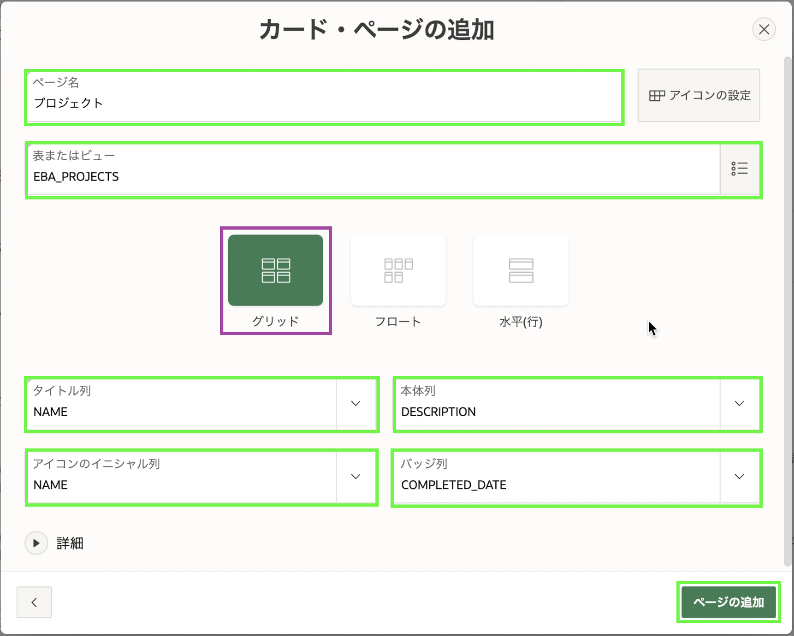

# アプリの構築 - アプリケーションの作成ウィザードの使用

## 紹介

このラボでは、Oracle データベースの既存のテーブルに基づいて初期アプリを作成する方法を学習します。 実際には、通常は 1 つまたは 2 つのページから開始し、ページ作成ウィザードを使用してページをアプリに追加します。

## タスク1：アプリケーションの作成

1. アプリケーション・ビルダー メニューで、**アプリケーション・ビルダー**をクリックします。
2. [**作成**]をクリックします。

    

3. [**新規アプリケーション**]をクリックします。

    

## タスク2: アプリに名前を付ける
1. アプリケーションの作成ウィザードで、[名前]に**プロジェクト**を入力します。
2. [**アイコンの設定**]をクリックします。

    

3. [アプリケーション・アイコンの選択] ダイアログで、アイコンの色と選択したアイコンを選択します。

    [**アイコンの保存**]をクリックします。

    

## タスク3: ダッシュボードページを追加する

ダッシュボードページは、さまざまなグラフを使用して重要な情報を表示する優れた方法です。 サンプル・データセットを作成すると、さまざまな表のデータを結合するビュー **EBA\_PROJECTS\_V** も作成されます。 このビューは、ダッシュボードチャートの基礎として理想的です。

1. アプリケーションの作成ウィザードで、[**ページの追加**]をクリックします。
2. **ダッシュボード**をクリックします。

    

3. **チャート1** では、次のように入力します。
      - グラフの種類 – **棒**を選択します
      - グラフ名 – **予算対コスト**を入力します
      - 表またはビュー – **EBA\_PROJECTS\_V**を選択します
      - ラベル列 – **NAME**を選択します
      - 値列 – **BUDGET\_V\_COST**を選択します

    

4. **チャート2**をクリックし、次のように入力します。
      - グラフの種類 – **円**を選択します
      - グラフ名 – **プロジェクトステータス**を入力します
      - 表またはビュー – **EBA\_PROJECTS\_V**を選択します
      - ラベル列 – **STATUS**を選択します
      - タイプ – **件数**を選択します

      

5. **チャート3**をクリックし、次のように入力します。
      - グラフの種類 – **棒**を選択します
      - グラフ名 – **プロジェクトリーダー**を入力します
      - 表またはビュー – **EBA\_PROJECTS\_V**を選択します
      - ラベル列 – **PROJECT\_LEAD**を選択します
      - タイプ – **件数**を選択します

6. [**ページの追加**]をクリックします。

      

    *注意: _チャート4_ には値が設定していませんから、プロジェクト・データではなく、デモ データに基づくチャート4 が生成されます。 後ろのラボでは、_チャート4_ の削除のタスクがあります。*

## タスク4: プロジェクトページを追加する
カードページは、膨大な数のレコードがなく、いくつかの詳細のみを表示する場合に特に適しています。 **EBA\_PROJECTS**表には12レコードしかなく、カードページとして適切に機能します。

1. アプリケーションの作成ウィザードで、[**ページの追加**]をクリックします。
2. [**カード**]をクリックします。

    

3. [カードの追加] ページで、次のように入力します。
      - ページ名 - **プロジェクト** を入力します
      - 表またはビュー - **EBA\_PROJECTS**を選択します
      - タイトル列 - **NAME**を選択します
      - 本文列 - **DESCRIPTION**を選択します
      - アイコンのイニシャル列 - **NAME**を選択します
      - バッジ列 - **COMPLETED\_DATE**を選択します

4. [**ページの追加**]をクリックします。

    

## タスク5: マイルストーンページを追加する
**EBA\_MILESTONES**内に30レコードがあります。 これからレポートページと関連するフォームページを追加します。

1. アプリケーションの作成ウィザードで、[**ページの追加**]をクリックします。
2. **対話モード・レポート**をクリックします。

    

3. [レポート・ページの追加] ページで、次のように入力します。
      - ページ名 - **マイルストーン**を入力します
      - 表またはビュー - **EBA\_PROJECT\_MILESTONES**を選択します
      - **フォームを含める**にチェックを入れます

4. [**ページの追加**]をクリックします。

    

## タスク6: タスクページを追加する
**EBA\_PROJECT\_TASKS**表はレコードの確認と更新が最も多く行われる表です。これからこの表にファセット検索ページ、レポートとフォームのページ、カレンダーのページを追加します。

1. アプリケーションの作成ウィザードで、[**ページの追加**]をクリックします。
2. **ファセット検索**をクリックします。

    

3. [ファセット検索の追加] ページで、次のように入力します。
      - ページ名 - **タスク検索**を入力します
      - 表 - **EBA\_PROJECT\_TASKS**を選択します
4. [**ページの追加**]をクリックします。
    

5. **タスク検索**ページを**ダッシュボード**ページの下に配置することをお勧めします。

    **タスク検索**では、[編集] ボタンの後ろにあるハンバーガー(4本の平行棒)をクリックしたままにします。
    **ダッシュボード**ページと**プロジェクト**ページの間に表示されるまで、ページを上にドラッグします。
    マウスを放します。

    

6. 次に、レポートページとフォームページを追加します。  
    アプリケーションの作成ウィザードで、[**ページの追加**]をクリックします。
7. **対話モード・レポート**をクリックします。
8. [レポート・ページの追加]ページで、次のように入力します。
      - ページ名 - **タスクレポート**を入力します
      - 表またはビュー - **EBA\_PROJECT\_TASKS**を選択します
      - **フォームを含める**にチェックを入れます
9.  [**ページの追加**]をクリックします。  

    

10. 最後にカレンダーを追加します。  
    アプリケーションの作成ウィザードで、[**ページの追加**]をクリックします。
11. **カレンダー**をクリックします。
12. [カレンダー・ページの追加] ページで、次のように入力します。
       - ページ名 - **タスクカレンダー**を入力します
       - 表またはビュー - **EBA\_PROJECT\_TASKS**を選択します
       - 表示列 - **NAME**を選択します
       - 開始日列 - **START_DATE**を選択します
       - 終了日列 - **END_DATE**を選択します

13. [**ページの追加**]をクリックします。

    

*注意：[SQLワークショップ] > [オブジェクトブラウザ]で[EBA\_PROJECT\_TASKS]を選択し、[アプリケーションの作成]をクリックすると、選択したテーブルに基づいてダッシュボードページ、ファセット検索ページ、レポートとフォームページ、カレンダーページ（必要に応じて）を含むアプリが作成されます。このテクニックは、特にどのようなページが必要かわからない場合、アプリを作成するための素晴らしい出発点となります。*

## タスク7: アプリを生成する

すべてのページを追加したので、アプリを生成して確認します。

1. ページの一番下までスクロールし、**アプリケーションの作成**をクリックします。

    

2. アプリケーションが生成されると、新しいアプリがアプリケーションのホームページに表示されます。

    [**アプリケーションの実行**]をクリックします。

    

## タスク8: ランタイムアプリ

1. ユーザーIDとパスワードを入力します。 [**サインイン**]をクリックします。

    

2. これが*ランタイム環境*です。 新しいアプリケーションで遊んでください!

    

## まとめ

これでラボ2は終了です。これで、既存のデータベース オブジェクトに基づいて、多数の異なるページ タイプを持つアプリケーションを作成する方法がわかりました。[ラボ 3 に移動するには、ここをクリックしてください](?lab=lab-3-regenerating-app)

## さらに詳しく / トラブルシューティング: ページ名を変更する方法
アプリケーションを作成した後でページの名前を変更する場合は、プロセスが関与します。 最初にページに正確な名前を付けることをお勧めしますが、ここではページの名前を変更する方法について説明します。

1. *アプリケーション・ビルダー* で、プロジェクトをクリックします。 プロジェクトのホームページで、編集するページをクリックします。 *ページ・デザイナ* で、**識別 > 名前** と **識別 > タイトル**を新しい名前に変更します。 [**ページを保存して実行**]をクリックします。 ランタイム環境で、タブの名前が更新されていることがわかります。

    

2. プロジェクトのホームページで、開発ツールバーの **共有コンポーネント**をクリックします。
    

    共有コンポーネントのホームページで、[ナビゲーションと検索] の下にある [ブレッドクラム]をクリックします。 [**ブレッドクラム**]をもう一度クリックし、編集するページをクリックします。
    

    **短縮名**を新しい名前に変更します。 [**変更の適用**]をクリックします。 ランタイム環境では、ページのタイトルが更新されていることがわかります。
    

3. 共有コンポーネントのホームページで、[ナビゲーションと検索] の下にある [ナビゲーション・メニュー]をクリックし、[ナビゲーション・メニュー]をクリックします。 編集するページをクリックし、**リスト・エントリ・ラベル**を新しい名前に変更します。 [**変更の適用**]をクリックします。 ページの名前が左側のナビゲーション メニューで更新されていることがわかります。

    

4. 共有コンポーネントのホームページで、[ナビゲーションと検索] の下の [リスト]をクリックし、[ページ・ナビゲーション]をクリックします。 編集するページをクリックし、**リスト・エントリ・ラベル**を新しい名前に変更します。 [**変更の適用**]をクリックします。 アプリケーションのホームページでページの名前が更新されていることがわかります。

    

## **謝辞**

  - **著者** - Salim Hlayel, Principle Product Manager
  - **寄稿者** - Arabella Yao, Product Manager Intern, DB Product Management
  - **最終更新者/日付** - Salim Hlayel, Principle Product Manager, November 2020
