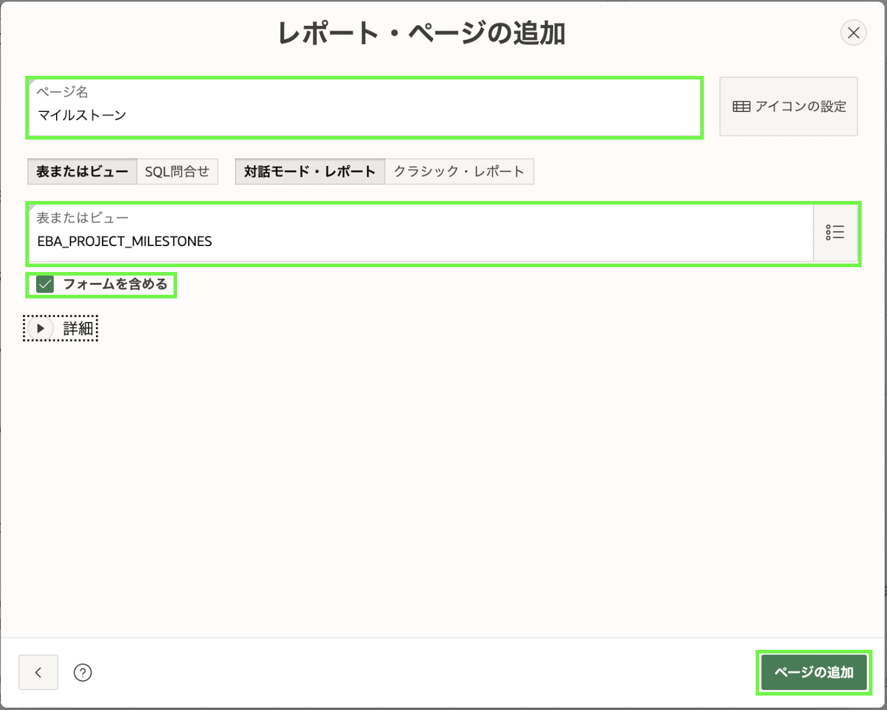
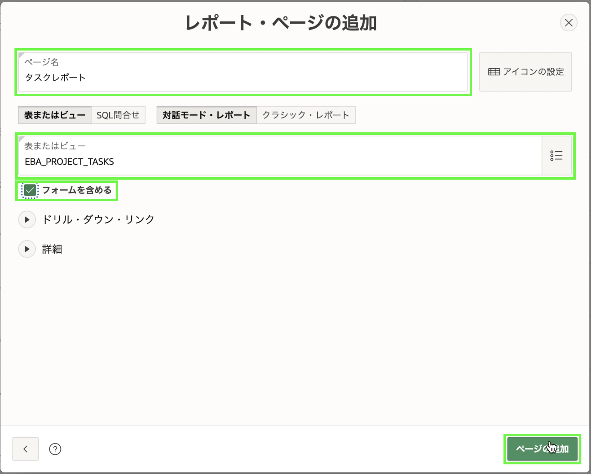

# アプリの構築 - アプリケーションの作成ウィザードの使用

## 紹介
このラボでは、Oracle データベースの既存のテーブルに基づいて初期アプリを作成する方法を学習します。 実際には、通常は 1 つまたは 2 つのページから開始し、ページの作成ウィザードを使用してページをアプリに追加します。

## タスク 1: アプリの作成

1. App Builder メニューで、**App Builder** をクリックします。
2. [**作成**] をクリックします。

    

3. [**新規アプリケーション**] をクリックします。

    

## タスク 2: アプリに名前を付ける
1. アプリケーションの作成ウィザードで、[名前] に **Projects** と入力します。
2. Appearance の **Set Appearance** ボタンをクリックします。 

    

3. 外観ダイアログで、テーマ スタイルに **Vita – Slate** を選択します。
4. [**新しいアイコンを選択**] をクリックします。

    

5. [Choose Application Icon] ダイアログで、アイコンの色と選択したアイコンを選択します。

    [**アプリケーション アイコンの設定**] をクリックします。

    

6. [**変更を保存**] をクリックします。

    

## タスク 3: ダッシュボード ページを追加する

ダッシュボード ページは、さまざまなグラフを使用して重要な情報を表示する優れた方法です。 サンプル データセットを作成すると、さまざまなテーブルのデータを結合するビュー **EBA\_PROJECTS\_V** も作成されます。 このビューは、ダッシュボード チャートの基礎として理想的です。

1. アプリケーションの作成ウィザードで、[**ページの追加**] をクリックします。
2. **ダッシュボード**をクリックします。

    

3. **グラフ 1** では、次のように入力します。
      - グラフの種類 – **棒**を選択
      - チャート名 – **予算対コスト**を入力
      - テーブルまたはビュー – **EBA\_PROJECTS_V** を選択します
      - ラベル列 – **NAME** を選択
      - 値列 – **BUDGET\_V_COST** を選択

    

4. **Chart 2** をクリックし、次のように入力します。
      - グラフの種類 – **円**を選択
      - チャート名 – **プロジェクト ステータス**を入力
      - テーブルまたはビュー – **EBA\_PROJECTS\_V** を選択します
      - ラベル列 – **ステータス**を選択
      - タイプ – **カウント**を選択します

      

5. **グラフ 3** をクリックし、次のように入力します。
      - グラフの種類 – **棒**を選択
      - チャート名 – **Project Leads** を入力します
      - テーブルまたはビュー – **EBA\_PROJECTS\_V** を選択します
      - ラベル列 – **PROJECT\_LEAD** を選択
      - タイプ – **カウント**を選択します

6. [**ページを追加**] をクリックします。

      

    *注意: _Chart 4_ には値を設定していません。 したがって、デモ データに基づくチャートで生成されます。 後のラボでは、この追加のグラフを削除します。*

## タスク 4: プロジェクト ページを追加する
カード ページは、膨大な数のレコードがなく、いくつかの詳細のみを表示する場合に特に適しています。 **EBA_PROJECTS** テーブルには 12 レコードしかなく、カード ページとして適切に機能します。

1. アプリケーションの作成ウィザードで、[**ページの追加**] をクリックします。
2. [**カード**] をクリックします。

    

3. [カードの追加] ページで、次のように入力します。
      - ページ名 - **Projects** と入力します
      - テーブルまたはビュー - **EBA_PROJECTS** を選択します
      - タイトル列 - **NAME** を選択
      - 本文列 - **説明**を選択します
      - アイコン イニシャル列 - **NAME** を選択
      - バッジ列 - **COMPLETED_DATE** を選択します

4. [**ページを追加**] をクリックします。

    

## タスク 5: マイルストーン ページを追加する
**EBA\_MILESTONES** 内に 30 のレコードがあります。 したがって、レポート ページと関連するフォーム ページを追加します。

1. アプリケーションの作成ウィザードで、[**ページの追加**] をクリックします。
2. **インタラクティブ レポート**をクリックします。

    

3. [レポートの追加] ページで、次のように入力します。
       - ページ名 - **マイルストーン**を入力
       - テーブルまたはビュー - **EBA\_PROJECT\_MILESTONES** を選択します
       - **フォームを含める**にチェックを入れます

  **参照列**を展開します。
       - 検索キー 1 - **PROJECT_ID** を選択
       - 列 1 を表示 - **EBA_PROJECTS.NAME** を選択

4. [**ページを追加**] をクリックします。

    

## タスク 6: タスク ページを追加する
**EBA\_PROJECT\_TASKS** テーブルは、レコードが最も頻繁に確認および更新されるプライマリ テーブルです。 したがって、ファセット検索ページ、レポートとフォーム ページ、およびカレンダー ページをこのテーブルに追加します。

1. アプリケーションの作成ウィザードで、[**ページの追加**] をクリックします。
2. **ファセット検索**をクリックします。

    

3. [ファセット検索の追加] ページで、次のように入力します。
     - ページ名 - **タスク検索**を入力
     - テーブル - **EBA\_PROJECT\_TASKS** を選択します

4. [**ページを追加**] をクリックします。

    

5. **タスク検索** ページを **ダッシュボード** ページの下に配置することをお勧めします。

    **タスク検索**では、[編集] ボタンの後ろにあるハンバーガー (4 本の平行棒) をクリックしたままにします。
     **ダッシュボード** ページと **プロジェクト** ページの間に表示されるまで、ページを上にドラッグします。
     マウスを放します。

    

6. 次に、Report ページと Form ページを追加します。
     アプリケーションの作成ウィザードで、[**ページの追加**] をクリックします。
7. **インタラクティブ レポート**をクリックします。
8. [レポートの追加] ページで、次のように入力します。
       - ページ名 - **タスク レポート**を入力します
       - テーブルまたはビュー - **EBA\_PROJECT\_TASKS** を選択します
       - **フォームを含める**にチェックを入れます

    **ルックアップ列**を展開します
       - 検索キー 1 - **PROJECT\_ID** を選択
       - 列 1 を表示 - **EBA\_PROJECTS.NAME** を選択
       - 検索キー 2 - **MILESTONE\_ID** を選択
       - 列 2 を表示 - **EBA\_PROJECT\_MILESTONES.NAME** を選択

9. [**ページを追加**] をクリックします。  

    

10. 最後にカレンダーを追加します。
     アプリケーションの作成ウィザードで、[**ページの追加**] をクリックします。
11. **カレンダー**をクリックします。
12. [カレンダーの追加] ページで、次のように入力します。
       - ページ名 - **タスク カレンダー**を入力
       - テーブルまたはビュー - **EBA\_PROJECT_TASKS** を選択します
       - 表示列 - **NAME** を選択
       - 開始日の列 - **START_DATE** を選択します
       - 終了日列 - **END_DATE** を選択

13. [**ページを追加**] をクリックします。

    

[ページの追加] をクリックします。 *注意: [SQL ワークショップ] > [オブジェクト ブラウザ] に移動した場合は、[EBA\_PROJECT\_TASKS] テーブルを選択し、[アプリケーションの作成] をクリックします。 、選択したテーブルに基づいて、ダッシュボード ページ、ファセット検索ページ、レポートとフォーム ページ、およびカレンダー ページ (該当する場合) を含むアプリを作成します。 この手法は、アプリを作成するための優れた出発点となります。特に、事前に必要なページがわからない場合に役立ちます。*

## タスク 7: アプリを生成する

すべてのページを追加したので、アプリを生成して確認します。

1. ページの一番下までスクロールし、**Create Application** をクリックします。

    

2. アプリケーションが生成されると、新しいアプリがアプリケーションのホームページに表示されます。

    [**アプリケーションの実行**] をクリックします。

    

## タスク 8: ランタイム アプリ

1. ユーザー資格証明を入力します。 [**サインイン**] をクリックします。

    

2. これが*ランタイム環境*です。 新しいアプリケーションをいじってみましょう!

    

## **まとめ**

これで演習 2 は終了です。これで、既存のデータベース オブジェクトに基づいて、多数の異なるページ タイプを持つアプリケーションを作成する方法がわかりました。[ラボ 3 に移動するには、ここをクリックしてください](?lab=lab-3-regenerating-app)

## 詳細 / トラブルシューティング: ページの名前を変更する方法
アプリケーションを作成した後でページの名前を変更する場合は、プロセスが関与します。 最初にページに正確な名前を付けることをお勧めしますが、ここではページの名前を変更する方法について説明します。

1. *App Builder* で、プロジェクトをクリックします。 プロジェクトのホームページで、編集するページをクリックします。 *Page Designer* で、**Identification > Name** と **Identification > Title** を新しい名前に変更します。 [**ページを保存して実行**] をクリックします。 ランタイム環境で、タブの名前が更新されていることがわかります。

    

2. プロジェクトのホームページで、開発ツールバーの **共有コンポーネント** をクリックします。
    

    共有コンポーネントのホームページで、[ナビゲーション] の下にある [パンくずリスト] をクリックします。 [**ブレッドクラム**] をもう一度クリックし、編集するページをクリックします。
    

    **Entry > Short Name** を新しい名前に変更します。 [**変更を適用**] をクリックします。 ランタイム環境では、ページのタイトルが更新されていることがわかります。
    

3. 共有コンポーネントのホームページで、[ナビゲーション] の下にある [ナビゲーション メニュー] をクリックし、[デスクトップ ナビゲーション メニュー] をクリックします。 編集するページをクリックし、**エントリ > リスト エントリ ラベル**を新しい名前に変更します。 [**変更を適用**] をクリックします。 ページの名前が左側のナビゲーション メニューで更新されていることがわかります。

    

4. 共有コンポーネントのホームページで、[ナビゲーション] の下の [リスト] をクリックし、[ページ ナビゲーション] をクリックします。 編集するページをクリックし、**エントリ > リスト エントリ ラベル**を新しい名前に変更します。 [**変更を適用**] をクリックします。 アプリケーションのホームページでページの名前が更新されていることがわかります。

    

## **謝辞**

  - **著者** - Salim Hlayel, Principle Product Manager
  - **寄稿者** - Arabella Yao, Product Manager Intern, DB Product Management
  - **最終更新者/日付** - Salim Hlayel, Principle Product Manager, November 2020
