# アプリの再生成

## はじめに

ランタイム環境で、マイルストーンに移動し、レポートページから編集アイコンをクリックすると、マイルストーンの管理用フォームページが表示されます。フィールドが少ないため、スプレッドシートのように複数のレコードをグリッド内で直接維持できるインタラクティブグリッドを利用することが良いでしょう。

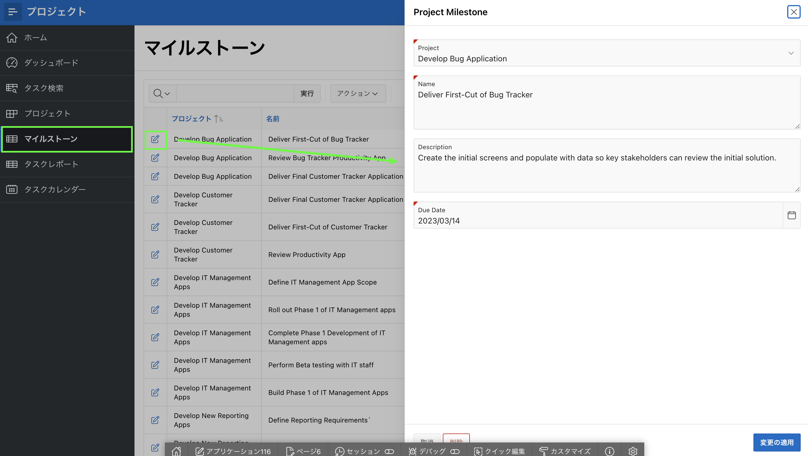

_注：以前のラボからランタイム環境に移動する方法を参照してください。_

## タスク1：生成されたアプリの削除

アプリケーション作成ウィザードからアプリを再生成する予定があるため、混乱を避けるために削除することをお勧めします。

1.  ランタイム環境内の開発ツールバーで、**Application xxxxx** をクリックします。
    
    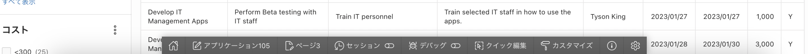
    
    _注意：開発者ツールバーは、App Builderからアプリケーションを実行する開発者にのみ表示されます。エンドユーザーには開発者ツールバーは表示されません。_
    
2.  アプリのホームページから、タスクの下にある**このアプリを削除する**をクリックします。
    
    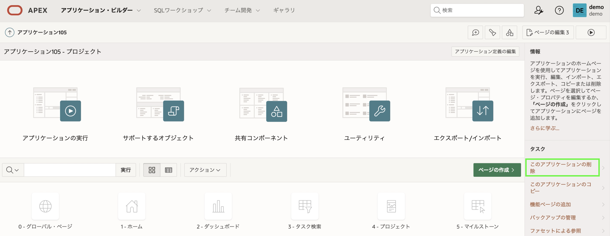
    
3.  確認のため、**今すぐ完全に削除する**をクリックします。

## タスク2: プロジェクトアプリを再読み込みする

アプリケーション生成ウィザードには、以前に生成したアプリを再読み込みする機能が含まれており、変更を加えて最初のアプリの新しいバージョンを簡単に生成することができます。

1.  App Builderホームページから、**作成**をクリックしてください。
    
    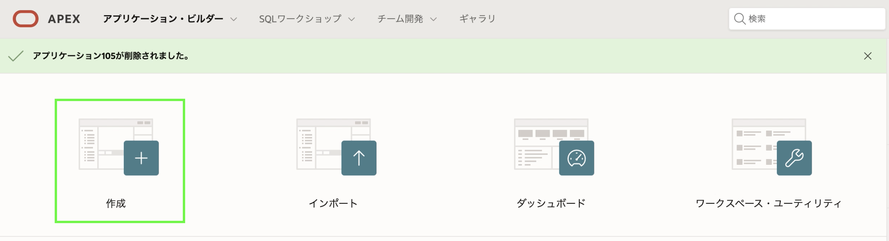
    
2.  **新しいアプリケーション**をクリックしてください。
    
3.  **ブループリントを読み込む**をクリックしてください。 ブループリントを読み込むには、最新の生成されたアプリをクリックして**ロード**をクリックします。
    
    
    
    以前に定義されたアプリのブループリントが表示されます。

## タスク 3: マイルストーン ページの置き換え
マイルストーン レコードを維持するための 2 つの方法を用意するのではなく、元のレポートとフォーム ページを削除してから、新しいページを追加して、ページのリストに再配置します。

1. ページのリストで、[マイルストーン] の [**編集**] をクリックします。
2. [**削除**] をクリックします。  

    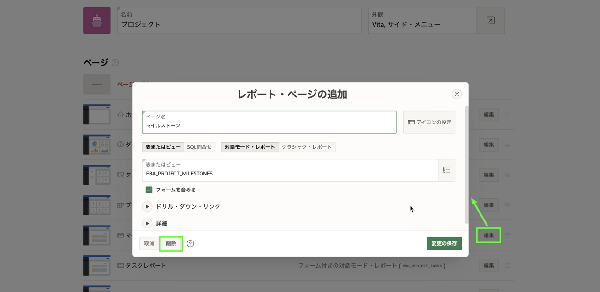

3. アプリケーションの作成ウィザードで、[**ページの追加**] をクリックします。
4. **会話グリッド**をクリックします。
5. [会話グリッドの追加] ページで、次のように入力します。
     - ページ名 - **マイルストーン**を入力
     - 表またはビュー - **EBA\_PROJECT\_MILESTONES** を選択します

     - [**ページの追加**] をクリックします  

    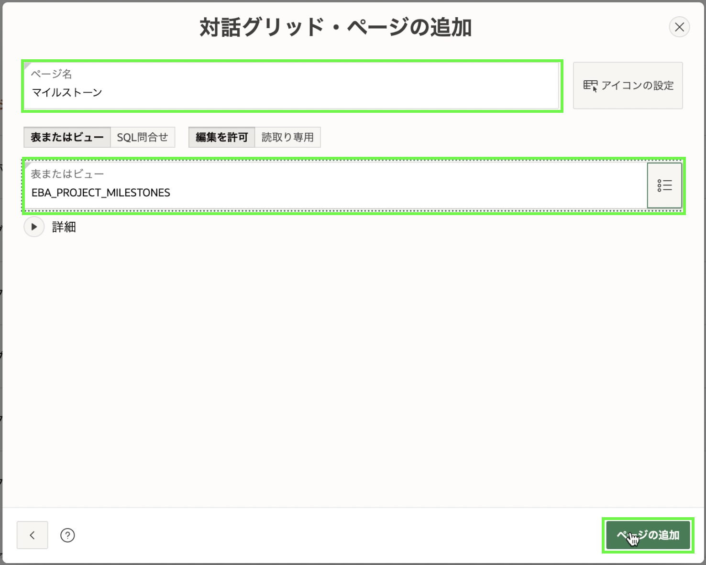

6. 次に、新しいページを並べ替えます。

    ページのリストの [マイルストーン] ページで、ハンバーガーを選択します。
     プロジェクトページの下になるまでページを上にドラッグしてドロップします。

    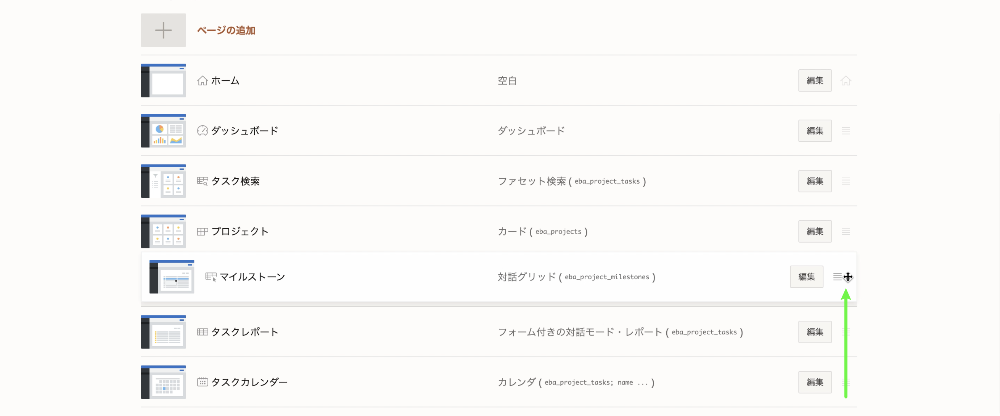

## タスク 4: ステータス ページを追加する
**EBA\_PROJECT\_STATUS** 表は、プロジェクトのステータスを維持するために使用されます。 この表は保守可能である必要があります。 ただし、アプリケーション管理者のみがレコードを変更できる必要があります。 そのため、[管理] の下に [ステータス] ページを追加することが最適なソリューションです。

1. アプリケーションの作成ウィザードで、[**ページの追加**] をクリックします。
2. **会話グリッド**をクリックします。
3. [会話グリッドの追加] ページで、次のように入力します。
     - ページ名 - **ステータス**を入力
     - 表またはビュー - **EBA\_PROJECT\_STATUS** を選択します
     - **高度な**を展開します
         - [**管理ページとして設定**] をクリックします。

     - [**ページの追加**] をクリックします  

    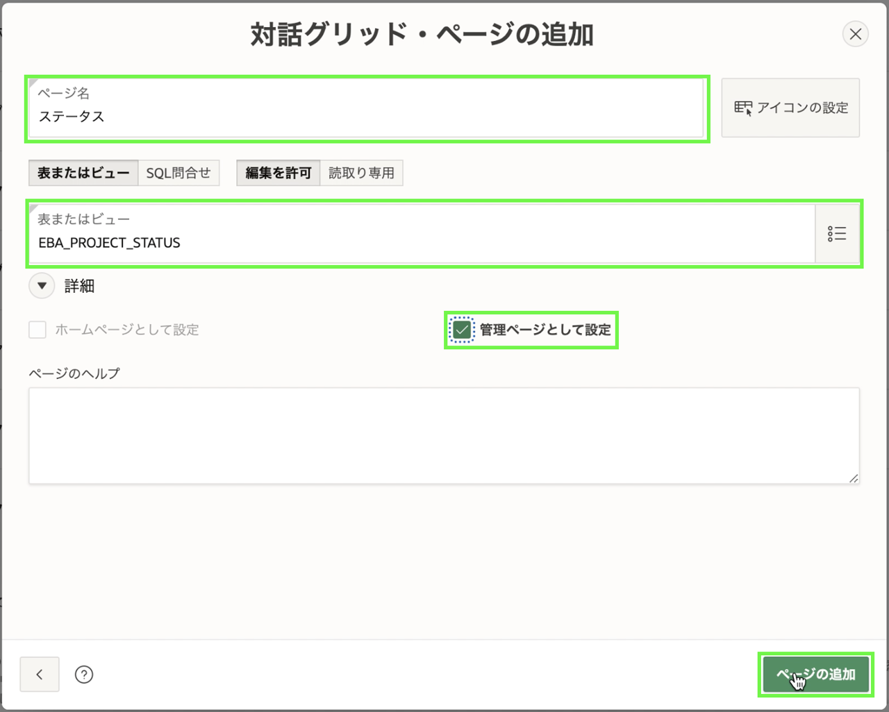

## タスク 5: アプリの完成
アプリケーションの作成ウィザードには、アクセス制御、アクティビティ レポート、フィードバックなどのさまざまな機能をアプリに追加して、アプリをより機能的に完成させ、"本番環境に対応した" ものにする機能もあります。

1. アプリケーションの作成ウィザードで、[機能] の [**すべてチェック**] をクリックします。
2. **アプリケーションの作成**をクリックします

    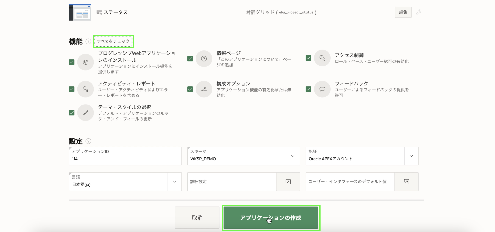
    *注: 通常、新しいアプリケーションには新しいアプリケーション ID が割り当てられます*

     新しいアプリケーションが アプリケーション に表示されます。

3. [**アプリケーションの実行**] をクリックします。
4. ユーザー資格証明を入力します。
5. **マイルストーン**に移動します。
6. 任意の列をダブルクリックして、グリッドにデータを直接入力する方法を確認します。

    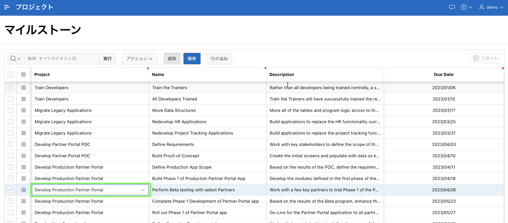

    *注意: プロジェクト列にはプロジェクトのリストが表示され、名前と説明の列はテキスト領域になり、期日列はさまざまなデータ タイプに基づいて日付ピッカーになります。*

7. ページの左上にあるナビゲーション ボタンをクリックし、**管理** に移動して、提供されている機能を確認します。

    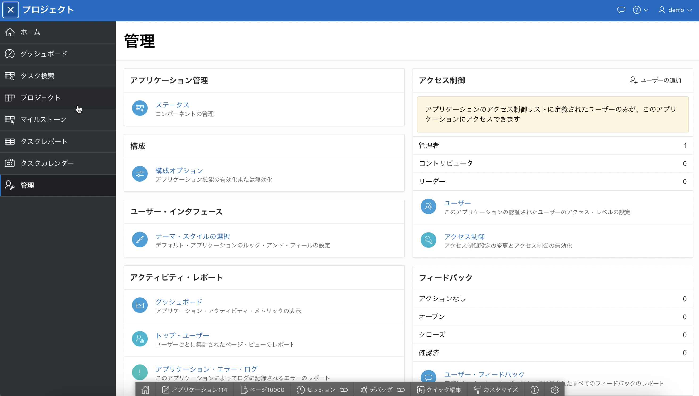

## **まとめ**

これで実習 3 は終了です。これで、アプリケーションを再生成して機能を追加する方法がわかりました。 [ラボ 4 に移動するには、ここをクリックしてください](?lab=lab-4-improving-dashboard)

## **謝辞**

  - **著者** - Salim Hlayel, Principle Product Manager
  - **寄稿者** - Arabella Yao, Product Manager Intern, DB Product Management
  - **最終更新者/日付** - Madhusudhan Rao, Apr 2022
