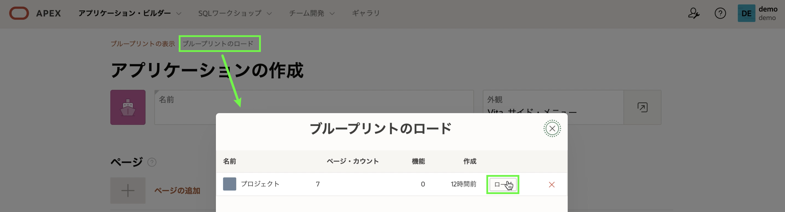

# アプリの再生成

## はじめに
ランタイム環境で、[マイルストーン] に移動し、レポート ページから編集アイコンをクリックすると、マイルストーンを管理するためのフォーム ページが表示されます。フィールドが少ないことに気付くでしょう。したがって、スプレッドシートに似た対話型グリッドを使用して、グリッド内で複数のレコードを直接管理できる方がよい場合があります。

*注: 前のラボのランタイム環境に移動する方法を参照してください。

## タスク 1:生成されたアプリを削除する
アプリケーションの作成ウィザードからアプリを再生成する場合は、混乱を避けるために、生成したアプリを削除することをお勧めします。

1. ランタイム環境の開発ツールバーで、**Application xxxxx** をクリックします。  

      

    *注意: 開発者ツールバーは、アプリ ビルダーからアプリケーションを実行する開発者にのみ表示されます。 エンド ユーザーに開発者ツールバーが表示されることはありません*

2. アプリのホームページの [タスク] で、[**このアプリケーションを削除**] をクリックします。  

      

3. [削除の確認] ページで、[**今すぐ完全に削除**] をクリックします。

## タスク 2: Projects アプリをリロードする
アプリケーションの作成ウィザードには、以前に生成したアプリをリロードする機能が含まれているため、簡単に変更を加えたり、最初のアプリの新しい改良バージョンを生成したりできます。

1. App Builder のホームページから、[**作成**] をクリックします。

    

2. [**新しいアプリケーション**] をクリックします。

3. [**ブループリントをロード**] をクリックします。
     [ブループリントの読み込み] で、生成された最新のアプリについて、[**読み込み**] をクリックします。  

      

    以前に定義したアプリのブループリントが表示されます。

## タスク 3: マイルストーン ページの置き換え
マイルストーン レコードを維持するための 2 つの方法を用意するのではなく、元のレポートとフォーム ページを削除してから、新しいページを追加して、ページのリストに再配置します。

1. ページのリストで、[マイルストーン] の [**編集**] をクリックします。
2. [**削除**] をクリックします。  

    

3. アプリケーションの作成ウィザードで、[**ページの追加**] をクリックします。
4. **会話グリッド**をクリックします。
5. [会話グリッドの追加] ページで、次のように入力します。
     - ページ名 - **マイルストーン**を入力
     - 表またはビュー - **EBA\_PROJECT\_MILESTONES** を選択します

     - [**ページの追加**] をクリックします  

    

6. 次に、新しいページを並べ替えます。

    ページのリストの [マイルストーン] ページで、ハンバーガーを選択します。
     プロジェクトページの下になるまでページを上にドラッグしてドロップします。

    

## タスク 4: ステータス ページを追加する
**EBA\_PROJECT\_STATUS** 表は、プロジェクトのステータスを維持するために使用されます。 この表は保守可能である必要があります。 ただし、アプリケーション管理者のみがレコードを変更できる必要があります。 そのため、[管理] の下に [ステータス] ページを追加することが最適なソリューションです。

1. アプリケーションの作成ウィザードで、[**ページの追加**] をクリックします。
2. **会話グリッド**をクリックします。
3. [会話グリッドの追加] ページで、次のように入力します。
     - ページ名 - **ステータス**を入力
     - 表またはビュー - **EBA\_PROJECT\_STATUS** を選択します
     - **高度な**を展開します
         - [**管理ページとして設定**] をクリックします。

     - [**ページの追加**] をクリックします  

    

## タスク 5: アプリの完成
アプリケーションの作成ウィザードには、アクセス制御、アクティビティ レポート、フィードバックなどのさまざまな機能をアプリに追加して、アプリをより機能的に完成させ、"本番環境に対応した" ものにする機能もあります。

1. アプリケーションの作成ウィザードで、[機能] の [**すべてチェック**] をクリックします。
2. **アプリケーションの作成**をクリックします

    
    *注: 通常、新しいアプリケーションには新しいアプリケーション ID が割り当てられます*

     新しいアプリケーションが App Builder に表示されます。

3. [**アプリケーションの実行**] をクリックします。
4. ユーザー資格証明を入力します。
5. **マイルストーン**に移動します。
6. 任意の列をダブルクリックして、グリッドにデータを直接入力する方法を確認します。

    

    *注意: プロジェクト列にはプロジェクトのリストが表示され、名前と説明の列はテキスト領域になり、期日列はさまざまなデータ タイプに基づいて日付ピッカーになります。*

7. ページの左上にあるナビゲーション ボタンをクリックし、**管理** に移動して、提供されている機能を確認します。

    

## **まとめ**

これで実習 3 は終了です。これで、アプリケーションを再生成して機能を追加する方法がわかりました。 [ラボ 4 に移動するには、ここをクリックしてください](?lab=lab-4-improving-dashboard)

## **謝辞**

  - **著者** - Salim Hlayel, Principle Product Manager
  - **寄稿者** - Arabella Yao, Product Manager Intern, DB Product Management
  - **最終更新者/日付** - Madhusudhan Rao, Apr 2022
