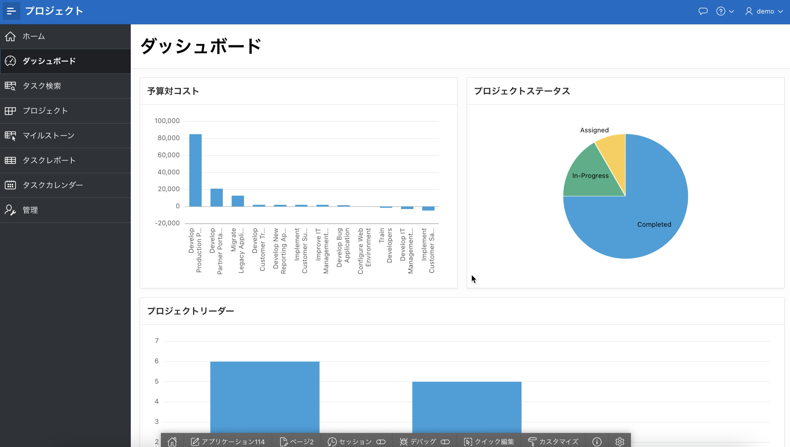

# ダッシュボードの改善

## 序章

このラボでは、Page Designer で領域を操作してダッシュボードを改善する方法を学習します。

## タスク 1: チャート 4 の削除
ダッシュボードを見ると、グラフ 4 はデモ データに基づいており、削除する必要があることがわかります。

1. ランタイム環境で、**ダッシュボード**をクリックします。
2. 開発者ツールバー (ランタイム ページの下部) で、[**Edit Page 2**] をクリックします。

    

    *Page Designer* が表示されます。 Page Designer は、アプリケーションの改善に多くの時間を費やす場所です。 Page Designer には 3 つのペインがあります。 左ペインには、最初にレンダリング ツリーが表示され、ページ コンポーネントのリストが表示されます。 中央のペインには、ページの表現であるレイアウト、および新しいコンポーネントをレイアウトにドラッグ アンド ドロップできるギャラリー (下部) が表示されます。 右側のペインはプロパティ エディタで、選択したコンポーネントの属性を変更できます。

     *注意: ページの下部に開発者ツールバーが表示されない場合は、現在のランタイム環境を閉じて、App Builder から再度アクセスしてみてください。*

3. Page Designer 内の Rendering ツリー (左ペイン) で、下にスクロールして **Chart 4** を右クリックし、**Delete** を選択します。

    

4. ダッシュボードをもう一度確認しましょう。
     Page Designer ツールバー (画面上部) で、**Save and Run Page** ボタンをクリックします。

    

    修正後のレイアウトが表示されます。

    

## タスク 2: リージョンを移動する
改訂されたダッシュボード ページを見ると、予算とコストのグラフを 1 行に並べた方が見栄えがします。

1. ランタイム環境から、Developer Toolbar の **Edit Page 2** をクリックするか、手動で App Builder ブラウザー タブに戻って、App Builder に戻ります。
2. Page Designer の Rendering ツリー (左ペイン) で、**Project Status** をクリックします。
     プロパティ エディター (右側のペイン) で、**_check_** **[レイアウト] > [新しい行を開始]**。
     *注意: レイアウト (中央のペイン) 内で、[プロジェクト ステータス] 領域が単独で行に移動します*

    

3. 次に、プロジェクト リード チャートをプロジェクト ステータス チャートと同じ行に移動します。
     レンダリング ツリー (左ペイン) で、**Project Leads** をクリックします。
     プロパティ エディター (右側のペイン) で、**_uncheck_** **[レイアウト] > [新しい行を開始]**。
     *注意: レイアウト (中央のペイン) 内で、[プロジェクト リーダー] 領域が上に移動し、[プロジェクト ステータス] と同じ行に表示されます*

    

5. 今すぐページを確認してください。
     **[ページを保存して実行]** ボタンをクリックします。

    

## **まとめ**

これでラボ 4 は完了です。これで、領域を削除して再配置する方法がわかりました。 [ラボ 5 に移動するには、ここをクリックしてください](?lab=lab-5-improving-projects)

## **謝辞**

  - **著者** - Salim Hlayel, Principle Product Manager
  - **寄稿者** - Arabella Yao, Product Manager Intern, DB Product Management
  - **最終更新者/日付** - Madhusudhan Rao, Apr 2022
