# プロジェクトの改善

## 紹介
このラボでは、*ページの作成ウィザード*を使用してアプリにページを追加する方法を学習します。 次に、新しいページを既存のカードページにリンクします。 次に、項目の表示方法を簡単に操作する方法を学び、最後に *動的アクション*を作成します。

## タスク1: カードリージョンのスタイルを変更する
プロジェクトのカードリージョンを見ると、カードのアイコンが円形であり、表示が異なることに気付くはずです。 カードリージョンのスタイルを変更するには、アプリケーション・ビルダー から変更することができます。 

1. ランタイム環境で、[**プロジェクト**]をクリックします。
2. 開発者ツールバー (ランタイム環境の下部) で、**ページ４**をクリックして編集画面に遷移します。
    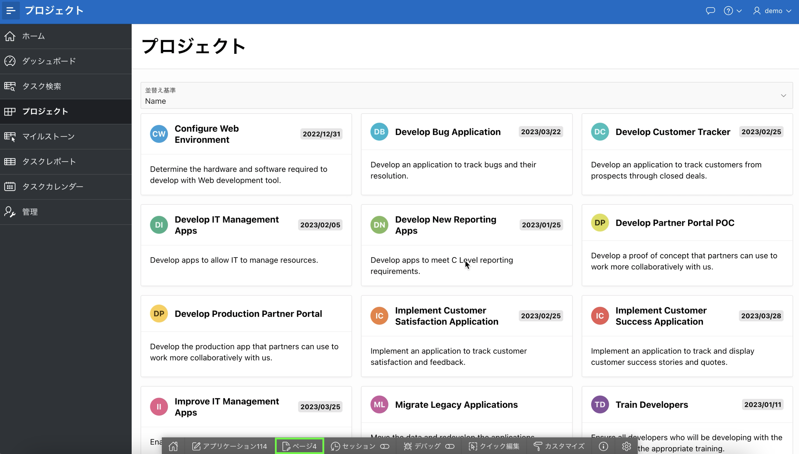
3. プロパティ・エディター(右側のペイン) の [リージョン] タブで、**外観** > **テンプレート・デフォルトの使用**をクリックします。
    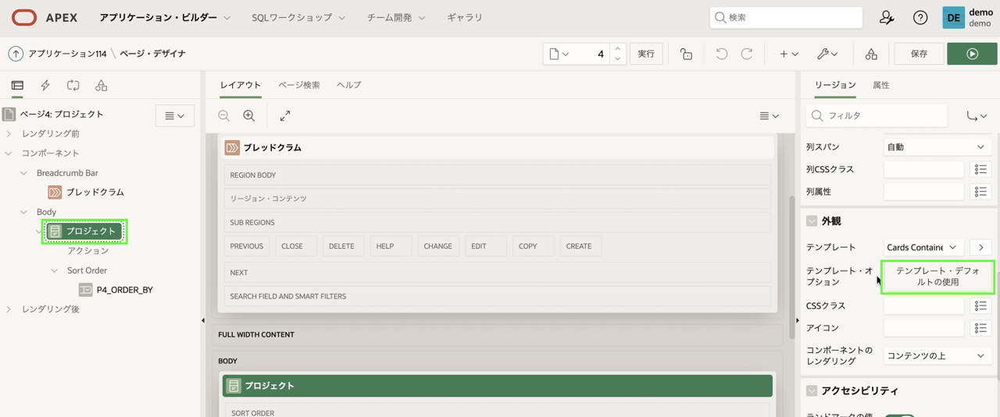

4. [テンプレートオプション] ダイアログで、次を選択します。
     - Style - **Style A**を選択します
  
5. **OK**をクリックします。   
    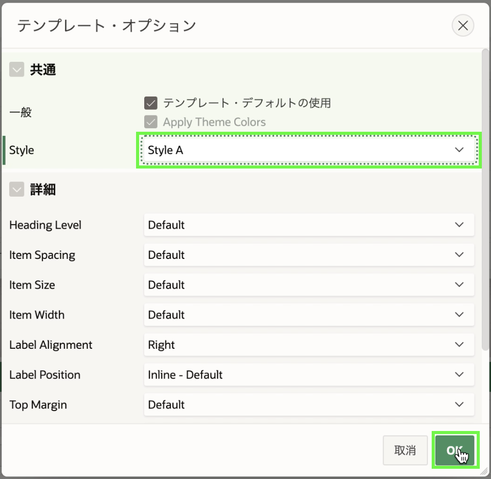   

6. **保存して実行**をクリックします。
    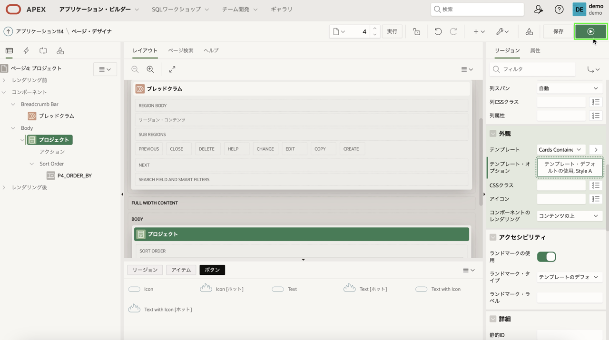
    画面のスタイルが変更されました。
    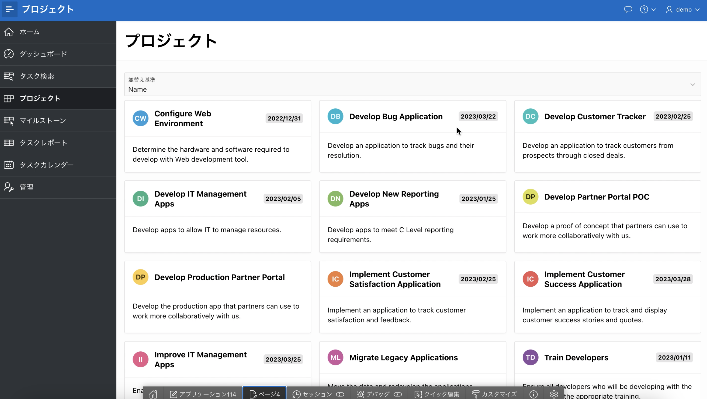

## タスク2: プロジェクトページの強化
プロジェクトページには、現在利用可能な幅に基づいてカードの列が表示されます。 グリッド列の数を4に固定しましょう。また、カードのサブタイトルにプロジェクトリーダーを追加します。
1. 開発者ツールバー(ランタイム環境の下部) で、**ページ４**をクリックして編集画面に遷移します。
    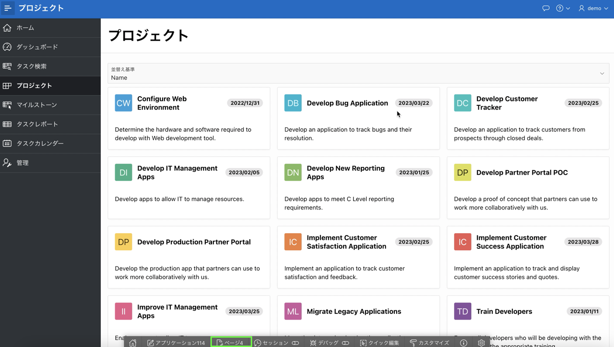
2. プロパティ・エディター(右側のペイン) の [属性] タブで、次のように変更します。
       - グリッド列を**4列**に変更します
       - サブタイトル列を**PROJECT_LEAD**に変更します
       - [**保存して実行**] ボタンをクリックします
    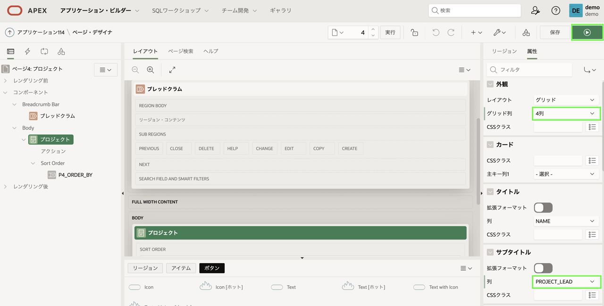
3. カードリージョンには、行ごとに 4 つのプロジェクトのみが表示されるようになりました。 プロジェクトリーダーは、カードのサブタイトルに追加されます。
    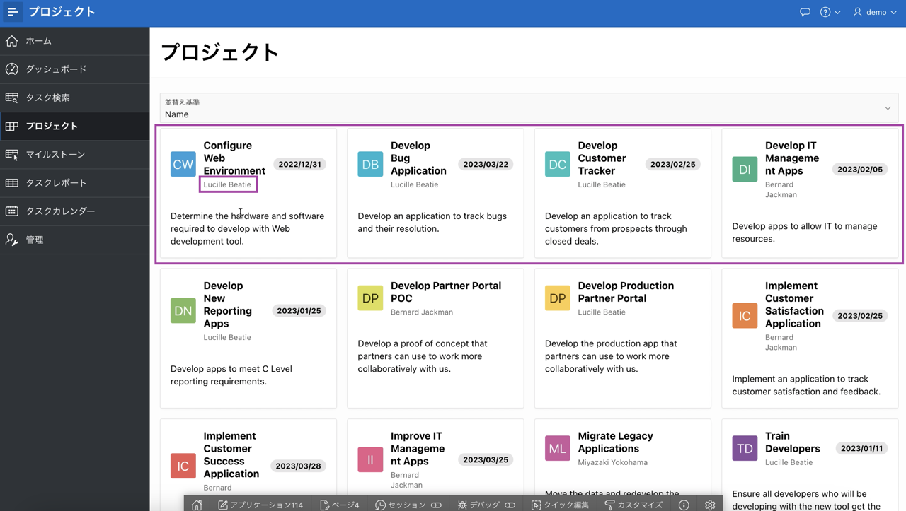

## タスク3: フォームページの追加
現在、プロジェクトレコードを保守する方法はありません。 これから*ページ作成ウィザード*を使用して、*EBA_PROJECTS* 表にフォームページを作成します。

1. 開発者ツールバーの **アプリケーションxxxxx**をクリックするか、手動でアプリケーション・ビルダーブラウザータブをクリックするか、アプリケーション・ビルダーに戻ります。
2. アプリケーションのホームページで、**ページの作成**をクリックします。

    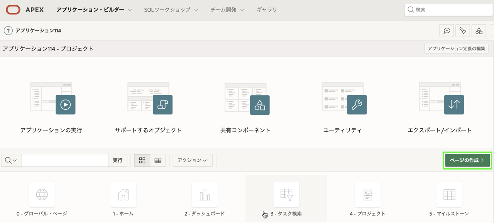

3. [ページの作成] ダイアログで、[**フォーム**]をクリックします。

    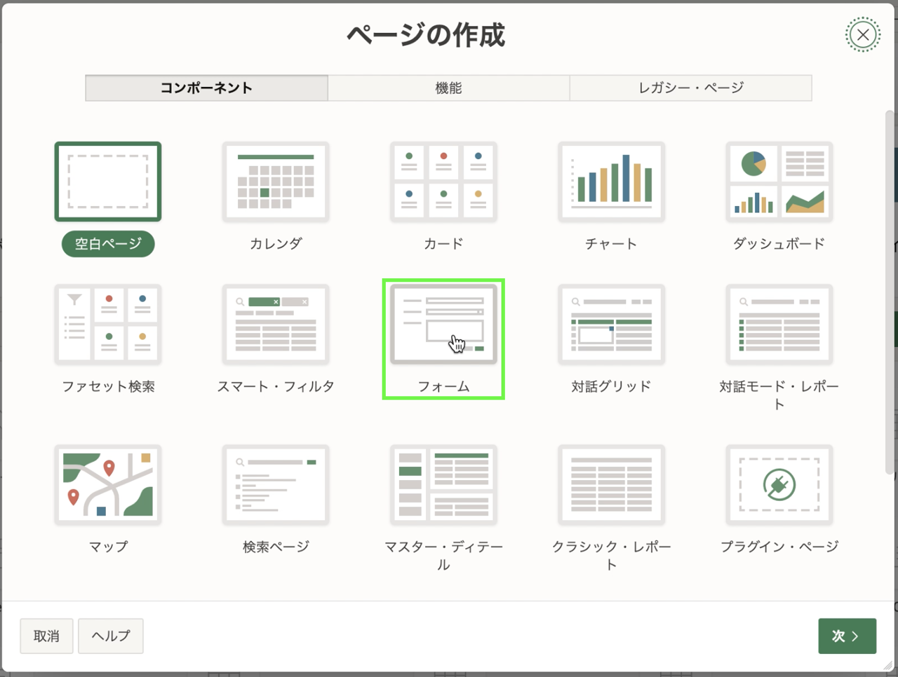    

4. 「フォームの作成」ダイアログで、次のように入力します:
      - **ページ定義**
          - ページ名 – **プロジェクト詳細** を入力します
          - ページモード – **モーダル・ダイアログ**をクリックします
      - **データ・ソース**
          - 表/ビューの名前 – **EBA_PROJECTS** を入力します
      - **ナビゲーション**
          - ナビゲーションの使用 – **チェック**します
          - 親ナビゲーション・メニュー・エントリの使用 – **プロジェクト** を入力します
    **次へ**をクリックします。

    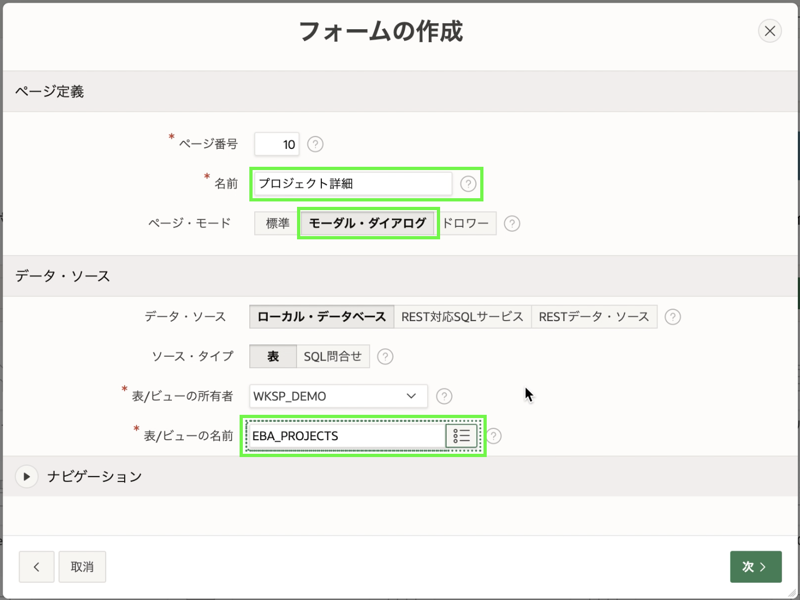
    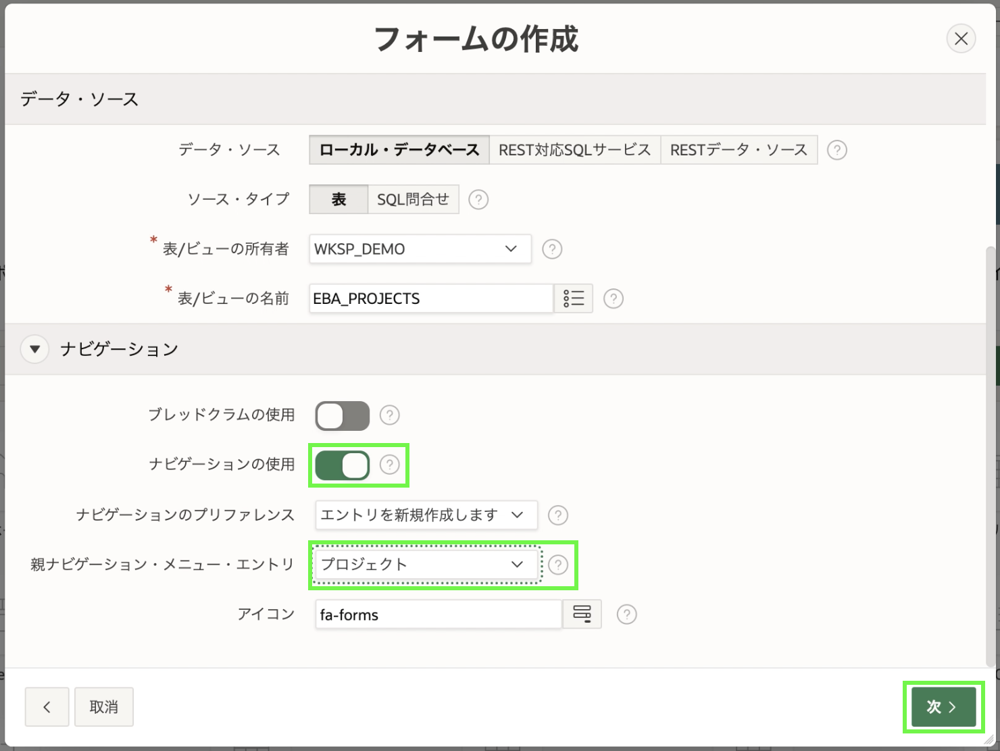
5. [主キー列1] で [**ID (Number)**]を選択します。
     [**作成**]をクリックします。

    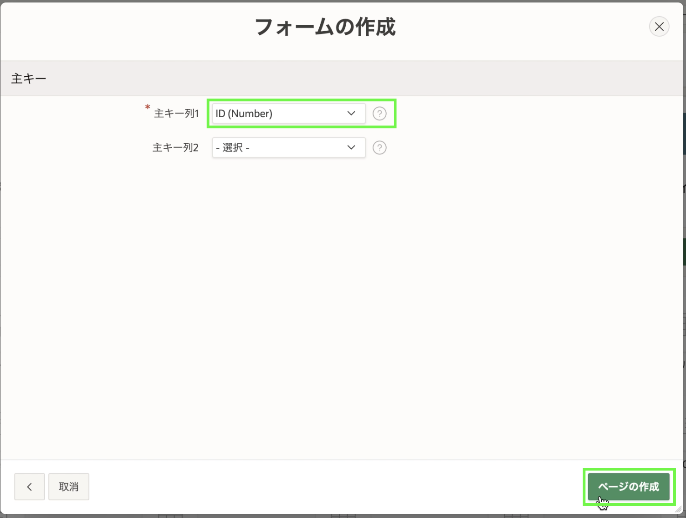
    *注意: 前のセクションに正しく従った場合、_Page 10: プロジェクト_ が作成されます。 10ページでない場合は、ラボ 3を繰り返して、マイルストーンとステータスの両方の対話グリッドが作成されていることを確認してください*

## タスク4: プロジェクトページへのリンク
この新規ページをプロジェクトカード ページにリンクします。   
*注意: カードリージョンのリンクを定義するには、SQL ステートメントを変更する必要があります。 ただし、ラボ 7 で学習するように、Oracle APEX の他の場所では、リンクの定義は非常に簡単で宣言型です。

1. アプリケーション ツールバーで、ページ番号 (10) の前にあるページ セレクタをクリックします。    
    [プロジェクト] ページの **4**をクリックします。

    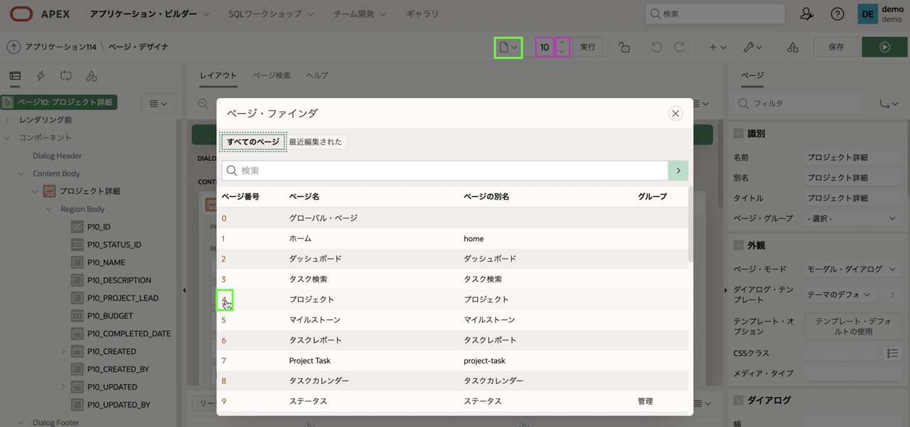

    *注意: または、ページ番号を入力するか、アプリケーション ツールバーの上下矢印を使用して、ページ・デザイナ内の別のページに移動することもできます*

2. レンダリング・ツリー(左ペイン) で、**プロジェクト** の下の **アクション**を右クリックし、**アクションの作成**をクリックします。   
    
    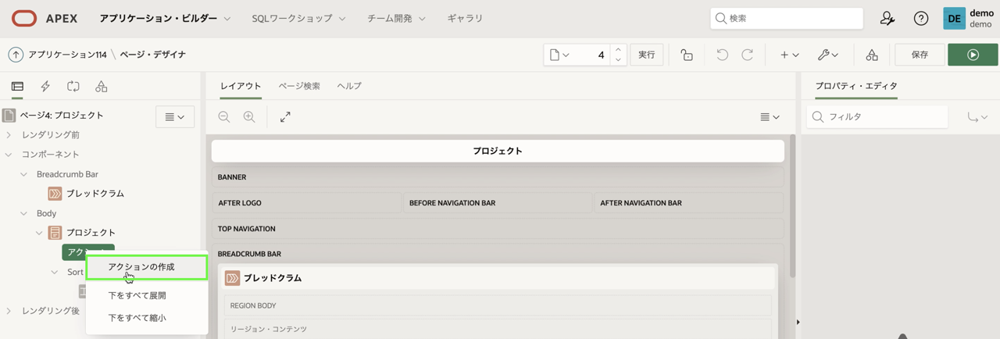

    プロパティ・エディター(右側のペイン) で、次のプロパティを更新します。
     - **タイプ:** - カード全体を選択します
     - **[リンク] > [リンクが定義されていません]**をクリックします
     - リンク・ビルダー・ターゲットダイアログで、**[ターゲット] > [ページ]** に**10**を入力します
     - **アイテムの設定**の下で、**名前** に **P10_ID**を入力し、**値** に **&ID.**を入力します。

    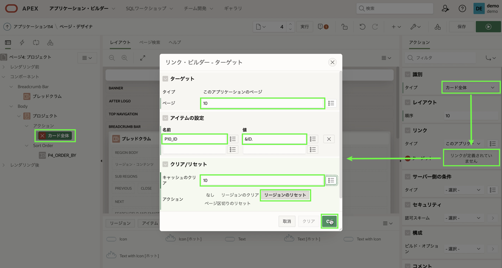

3. また、新しいプロジェクトを追加できるようにする必要があるため、ボタンを追加してプロジェクト フォーム ページにリンクする必要があります。 これを追加する最も簡単な方法は、コンポーネントをギャラリーからレイアウト (中央のペイン) にドラッグ アンド ドロップすることです。
    - レイアウト (中央のペイン) で、**ブレッドクラム**をクリックしてリージョンを強調表示します。
    - ギャラリー (レイアウトの下) で、[**ボタン**]をクリックします。
    - **Text [ホット]**をクリックしたままにします。
    - ボタンをブレッドクラム領域にドラッグし、**作成**プレースホルダーの下にカーソルを置きます。

     CREATEの選択範囲が大きな黄色のボックスに展開されたら、マウスを離します。

    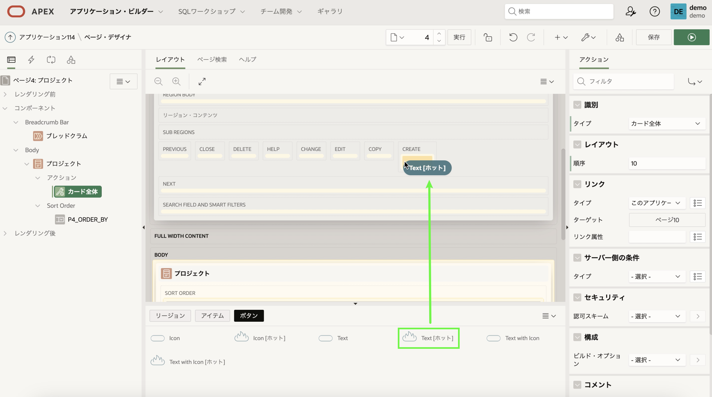

4. 次に、ボタンのプロパティを更新します。
     プロパティ・エディター (右側のペイン) で、次のように入力します。

     - 識別 > ボタン名 - **作成** を入力します   
     *注意: ボタン名を入力すると、[識別] > [ラベル] が [作成] に更新されます*
     - 動作 > アクション - **このアプリケーションのページにリダイレクト**を選択します
     - [動作] > [ターゲット] - [**リンクが定義されていません**]をクリックし、次のように入力します。
         - ターゲット > ページ - **10**を入力します
         - クリア/リセット > キャッシュをクリア - **10**を入力します

5. [**OK**]をクリックします

    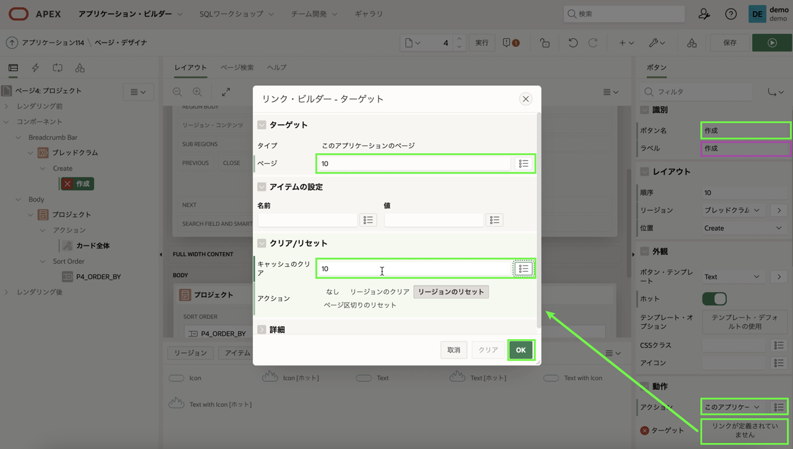

6. ページリンクが機能するかどうかをテストします。
     **[保存して実行]** ボタンをクリックします。
     プロジェクトカードをクリックするか、**作成**をクリックします。

    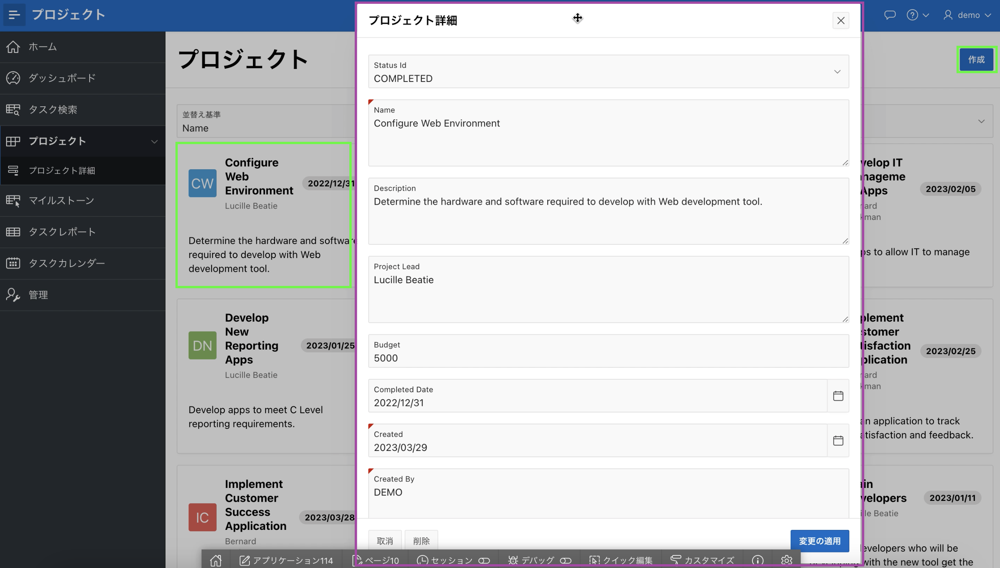

## タスク5: アイテムの表示方法を更新する
ステータスID、名前、およびプロジェクトリーダーの表示方法は、簡単に改善できます。
**Status Id**アイテムは、**EBA\_PROJECT\_STATUS**表への外部キーです。 これからエンドユーザーに数値の入力を要求するのではなく、ルックアップ表に基づくLOVになるように項目を更新します。 NameフィールドとProject Leadフィールドをテキストフィールドに更新する必要があります。 最後に、監査列(Created、Created By、Updated、Updated By)を非表示にする必要があります。

1. 最初に、Status項目を数値エントリからLOVに変更する必要があります。
     ランタイム環境の[プロジェクトフォーム]ページの[開発者ツールバー]で、[**ページ10**]をクリックして編集画面に遷移します。
     または、アプリケーション・ビルダーブラウザタブに戻り、手動で10 ページに移動します。
2. ページ・デザイナのレンダリングツリー(左ペイン) で、**P10\_STATUS\_ID**をクリックします。
     プロパティ・エディター(右側のペイン) で、次のように入力します。
     - 識別 > タイプ - **選択リスト**を選択します   
     *注意: [選択リスト]を選択するとすぐに、P10\_STATUS\_ID 項目が赤色に変わり、アプリケーション ツールバーにメッセージ インジケーターが表示されます。 これは、値リストの属性が入力されると修正されます*

     - ラベル > ラベル - **ステータス**を入力します
     - LOV > タイプ - **SQL問合せ**を選択します
     - SQL問合せを入力:

        ```
        select code d, id r
        from eba_project_status
        order by display_order
        ```

    *注意: _code_ 列はユーザーに表示される値であり、_id_ 列は表列に返される値です。 表には、ステータスが正しい順序で表示されるように _display\_order_ 列が含まれています*

     - 追加値の表示 - **チェック**を外します
     - NULL値の表示 - **- ステータスを選択してください -**　を入力します   
     *注: このテキストは必ず入力してください*

    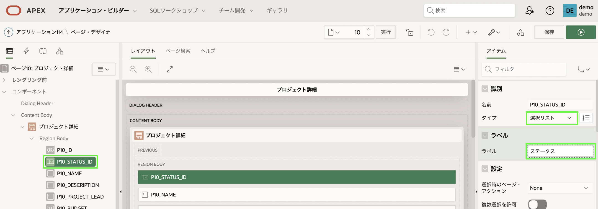
    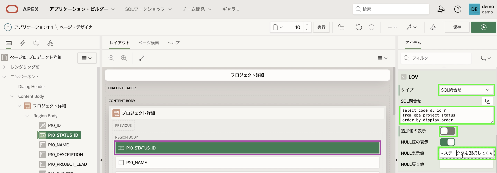

3. ここで、名前とプロジェクトリードの項目をテキスト・フィールドに更新します。
     レンダリング・ツリー(左ペイン) で、**P10\_NAME**をクリックします。
     [Control] キー (Mac では [Command] キー)を押しながら、**P10\_PROJECT\_LEAD**をクリックします。

     プロパティ・エディター(右側のペイン) の [識別] > [タイプ] で、[**テキストフィールド**]を選択します。

    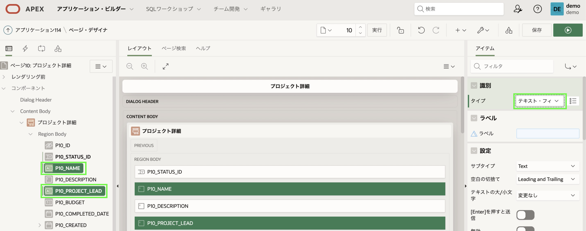

4. 最後のステップは、監査列を非表示にすることです。
     レンダリング・ツリー(左ペイン) で、**P10\_CREATED**をクリックします。
     [Shift]キーを押しながら**P10\_UPDATED\_BY**をクリック

     プロパティ・エディター(右側のペイン) で、[識別] > [タイプ] に対して [**非表示**]を選択します。

    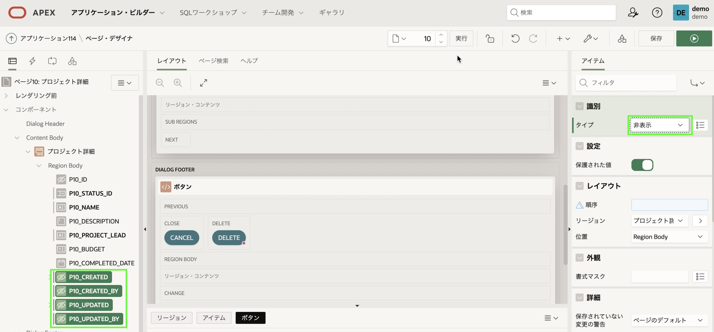

## タスク6: 完了日の改善
現在、完了日はどのプロジェクトにも入力できます。 ただし、ステータスが_COMPLETED_の場合にのみ完了日を入力できるようにすると、データ品質が大幅に向上します。 このような機能を実装するには、ステータスの値に基づいて完了日を動的に有効/無効にする JavaScript が必要です。 ありがたいことに、APEX 開発者として、そのような JavaScriptを記述する必要はありません。 *動的アクション*を定義するだけで、トリガー、アクション、および影響を受ける要素を指定することで、そのようなクライアント側の対話機能を宣言的に定義できます。

1. ステータスであるトリガー要素で動的アクションを定義する必要があります。
     レンダリング・ツリー(左ペイン) で、**P10\_STATUS\_ID**を _右クリック_ します.
     **動的アクションの作成**を選択します。

    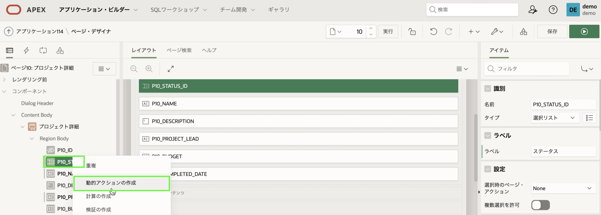

2. 動的アクションを更新して、ステータスが _COMPLETED_ の場合にのみトリガーされるようにします。
     [動的アクション]を選択した状態で ([動的アクション] の下の [**新規**]をクリック)、プロパティ・エディター(右側のペイン) で次のように入力します。
     - 識別 > 名前 - **完了日を有効にする**を入力します
     - クライアント側の条件 > タイプ - **アイテム = 値**を選択します   
     *注意: クライアント側の条件 > アイテムは、現在のアイテム *_P10\_STATUS\_ID_* に自動的に設定されます。
     - クライアント側の条件 > 値 - **3** を入力します   
     *注: 値 _3_ は COMPLETED のステータスに対応します*

    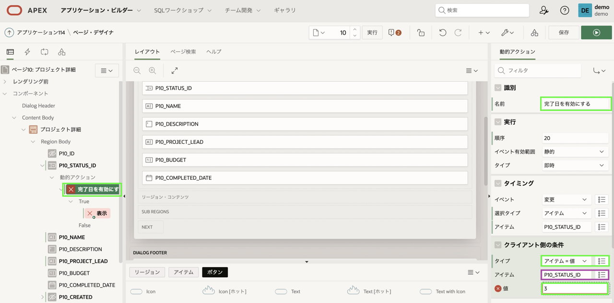

3. 次に、トリガー イベントが true の場合に何が起こるかを指定する必要があります。
     レンダリング・ツリー(左ペイン) で、True (現在は表示) の下のアクションをクリックします。
     プロパティ・エディター(右側のペイン)で、次のように入力します。
     - 識別 > アクション - **有効化**(**コンポーネント**の下)を選択します
     - 影響を受ける要素 > アイテム - **P10\_COMPLETED\_DATE**を選択します

    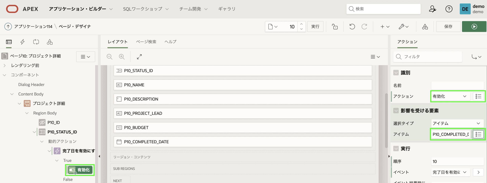

4. 最後に、トリガー イベントが false の場合は、完成日項目を_無効化_することが非常に重要です。
     レンダリング・ツリー(左ペイン) の [動的アクション] の下で、 **有効化**を右クリックします。
     **反対のアクションの作成**を選択します。

    

5. 完了日をページの下に表示するよりも、ステータス アイテムの直後にアイテムを表示する方がはるかに優れています。
     レンダリング・ツリー(左ペイン) で、**P10\_COMPLETED\_DATE**をクリックします。
     プロパティ・エディター(右側のペイン) で、次のように入力します。
     - レイアウト > 顺序 - **25** を入力します   
     *注: これにより、P10\_COMPLETED\_DATE が P10\_STATUS\_ID (顺序 20) と P10\_NAME (顺序 30) の間に配置されます*
     - レイアウト > 新しい行を開始 - _チェックを外します_   
     *注意: これにより、前のアイテム P10\_STATUS\_ID* と同じ行にアイテムが配置されます。

    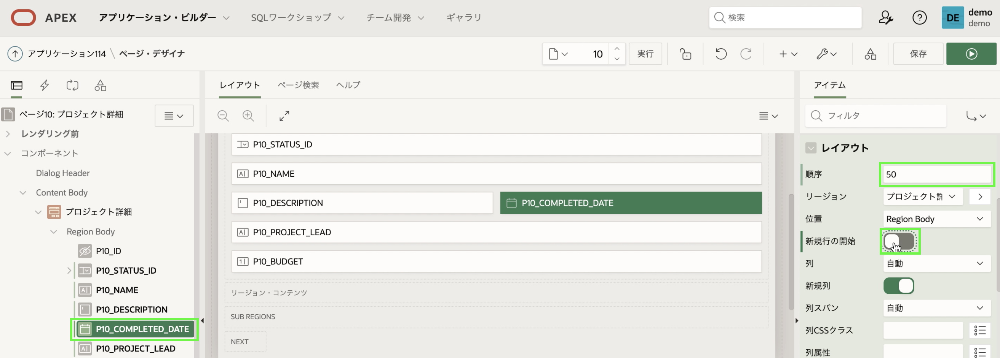

6. 次に、プロジェクト フォーム ページを確認します。
     **保存**をクリックします   
     *注意: [ページを保存して実行] ボタンをクリックすると、変更は保存されますが、ページは実行されません。 プロジェクトフォームページはモーダルページであるため、ページ・デザイナ* から直接ではなく、呼び出しページから実行する必要があります。
     *注意: [ページを保存して実行] ボタンをクリックすると、変更は保存されますが、ページは実行されません。 プロジェクトフォームページはモーダルページであるため、ページ・デザイナ* から直接ではなく、呼び出しページから実行する必要があります。

7. ランタイム環境に戻り、ブラウザーを更新して、ナビゲーション メニュー (左側) 内で **プロジェクト**をクリックします。
     カードレコードをクリックすると、対応するレコードがフォームページに表示されます。
     ステータスを変更し、完了日が正しく有効化/無効化されていることを確認します。
     変更を加えて、[**変更を適用**]をクリックするか、[**キャンセル**]をクリックします。

    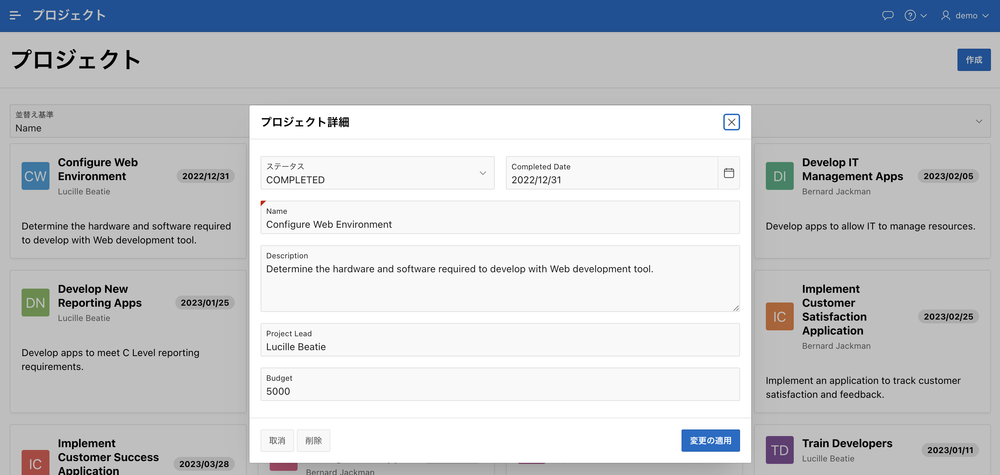


## **まとめ**

これでラボ 5 は終了です。アプリケーションにページを追加する方法、ページをリンクする方法、アイテムの表示方法を変更する方法、およびクライアント側の対話機能を宣言的に定義する方法がわかりました。 [ラボ 6 に移動するには、ここをクリックしてください](?lab=lab-6-improving-milestones)

## さらに詳しく: ページ・アイテムのラベルとレポート列のヘッダーを変更する方法

今回作成したアプリケーションについて、ページ・アイテムのラベルとレポート列のタイトルは英語で表示されています。この部分を日本語へ変更する場合が多いので、ここではページ・アイテムのラベルとレポート列のヘッダーを変更する方法について説明します。
- ページ・アイテムのラベルの変更方法
    1. ページ・デザイナのレンダリングツリー(左ペイン)で、編集するページ・アイテムを選択します。
    2. プロパティ・エディター(右側のペイン) で、**[ラベル] > [ラベル]** に日本語のラベルを入力します。
        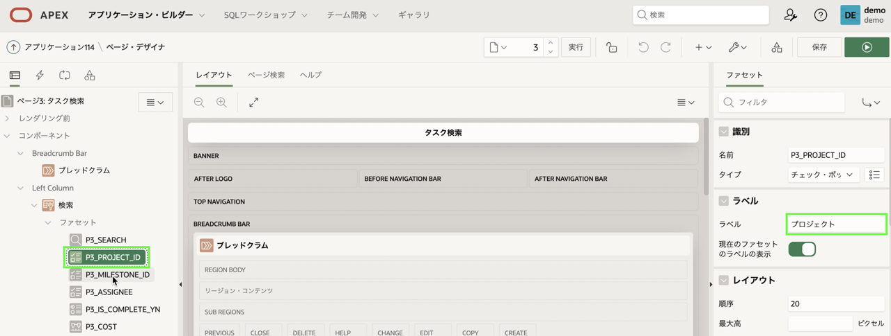
    3. **保存**をクリックして、編集内容を保存します。

　　
- レポート列のヘッダーの変更方法
    1. ページ・デザイナのレンダリングツリー(左ペイン)で、編集するレポート列を選択します。
    2. プロパティ・エディター(右側のペイン) で、**[ヘッダー] > [ヘッダー]** に日本語のヘッダーを入力します。
        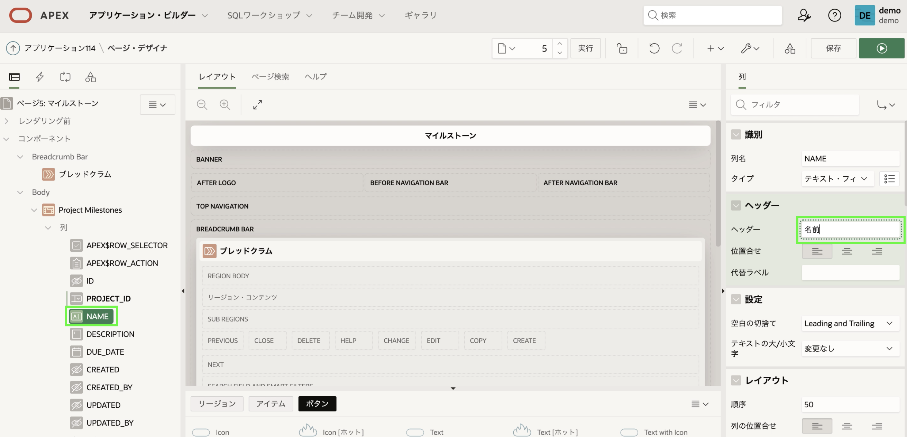
    3. **保存**をクリックして、編集内容を保存します。


## **謝辞**

  - **著者** - Salim Hlayel, Principle Product Manager
  - **寄稿者** - Arabella Yao, Product Manager Intern, DB Product Management
  - **最終更新者/日付** - Salim Hlayel, Principle Product Manager, November 2020
