# Improving Milestones

## Introduction
In this lab, you will learn how to update and then save the layout of an *Interactive Grid* to improve your Milestones.

## Task 1: Change the Name Column
In your runtime environment, click on **Milestones** and then double-click a record, you can edit the details. Navigate to each column and notice that the Project column is a select list, the Name and Description columns are textareas, and the Due Date is a date picker. Generally, the Name is not that long; therefore, you should update the column type to a text field.

1. Navigate to the App Builder.
2. Within your application, navigate to **Page 5: Milestones** in Page Designer.
3. In the Rendering tree (left pane), under the **Project Milestones** region, expand **Columns**.  
    Within the list of columns click **Name**.  
    In the Property Editor (right pane), for Identification > Type select **Text Field**.

    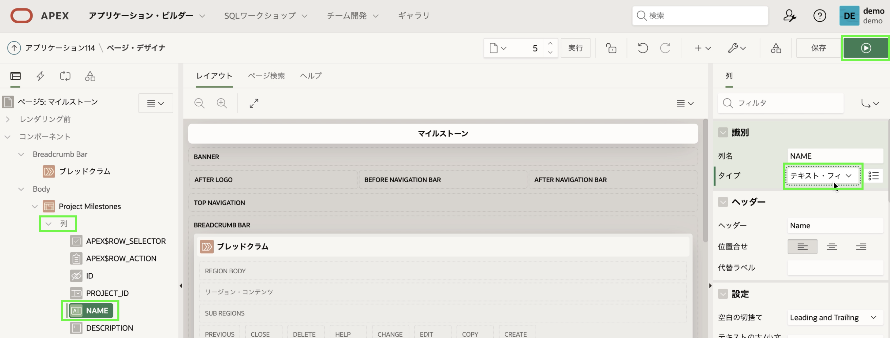

4. In the Application toolbar, click **Save and Run Page**   
    Double-click a record and review the Name column.

    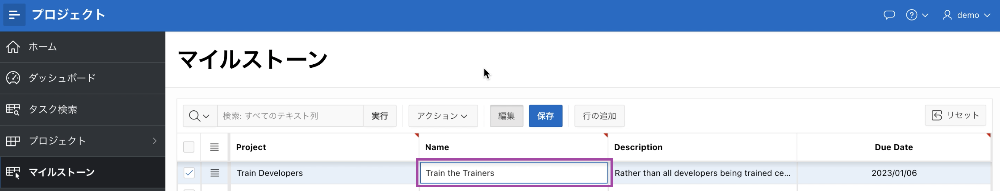

## Task 2: Update the Grid Layout
Once again reviewing the report, it would be beneficial to rearrange the columns into the following order - Name, Project, Due Date, and then Description. It would also be useful to freeze the Name column so users can scroll left and right to see more of the Description column.

1. In the Runtime environment, click **Actions**, and then click **Columns**

    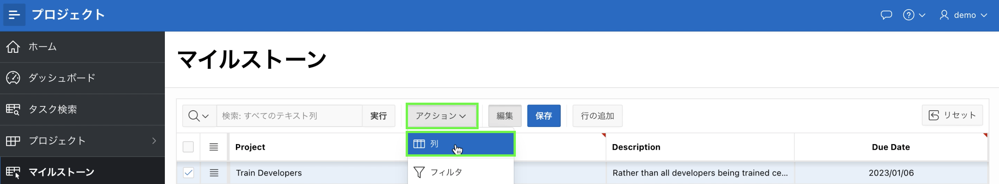

2. In the Columns dialog, click **Name** and then click the up arrow to move the column before **Project**.    
    Click **Save**.

    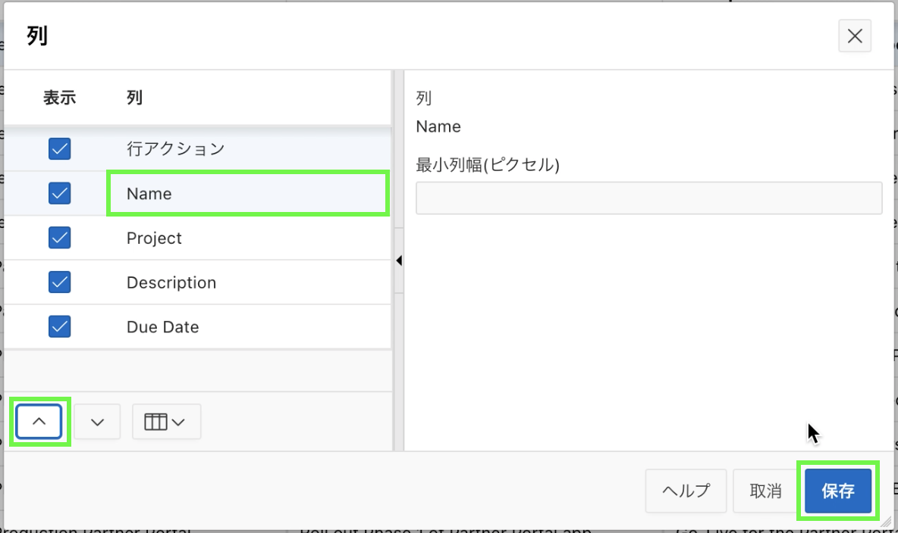

3. You can also reorder columns using Drag and Drop.    
      - Hover over the beginning of the **Due Date** column until the movement indicator is displayed.  
      - Click and hold the mouse.   
      - Drag the column to the left until it displays before the **Description** column.    
      - Release the mouse, dropping the column.

    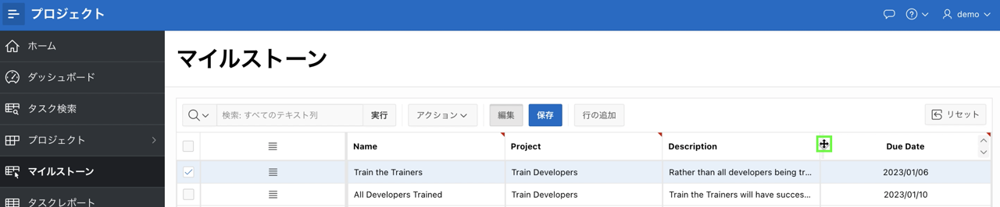
    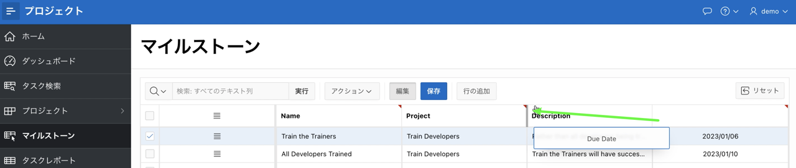

4. To see the grid better, you can collapse the menu.   
    Click the icon in front of the application name.

    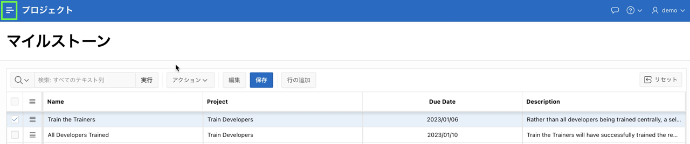

5. Now that the columns are in the correct order, you should freeze the Name column.   
      - Click the **Name** column heading.  
      - Click **Freeze**.

    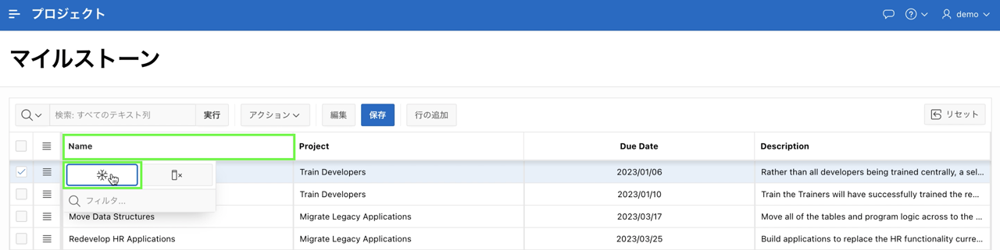

6. The column sizes now need to be adjusted to better display the data.     
      - Hover in between the **Name** and **Project** columns until the resize indicator is displayed.  
      - Drag the column separator to the right until it is a good size for the **Name** column.     
      - Repeat for the Project and Due Date columns.  
    *Note: You can also expand the size of the Description column by using the resize indicator at the end of the column*

    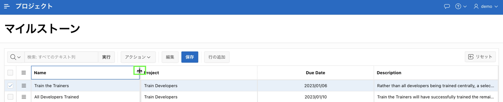
    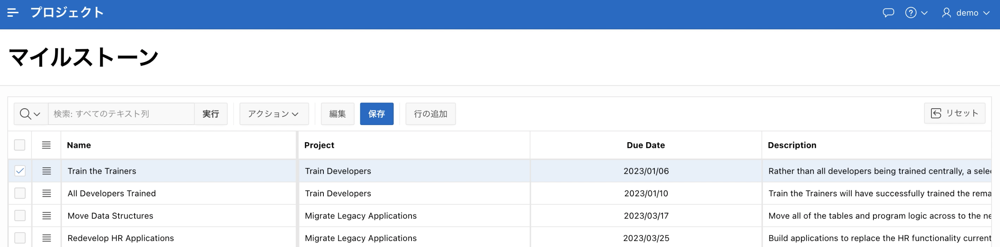

7. To test the freeze display, redisplay the menu. Click the icon in front of the application name.

    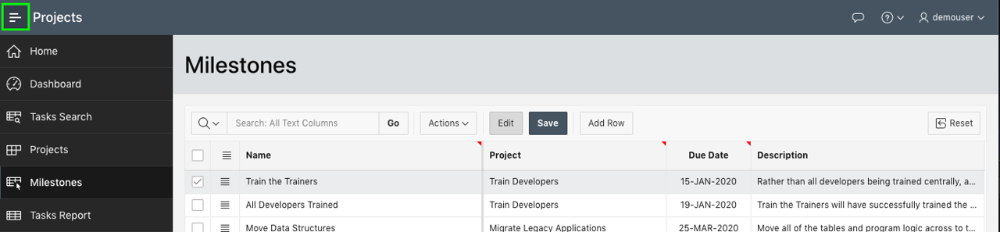

## Task 3: Save the Report
The changes you have made to the grid layout are only visible to you. If other users log in, they will see the original layout with the previous column order and column sizes. Therefore, you need to save the Default report layout.

1. In the runtime environment, click **Actions**, select **Report**, and then select **Save**.  
    *Note: Only developers, who have run the application from App Builder, can save the "Default" report. End users can only use "Save As"*

    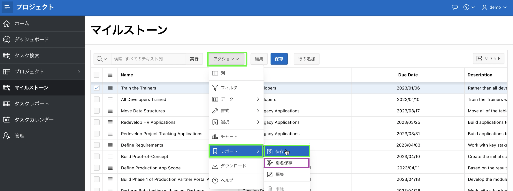

## **Summary**

This completes Lab 6. You now know how to manipulate an Interactive Grid and save a default report. [Click here to navigate to Lab 7](?lab=lab-7-improving-tasks)

## **Acknowledgements**

 - **Author** -  Salim Hlayel, Principle Product Manager
 - **Contributors** - Arabella Yao, Product Manager Intern, DB Product Management
 - **Last Updated By/Date** - Madhusudhan Rao, Apr 2022

