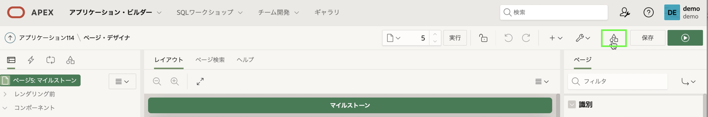
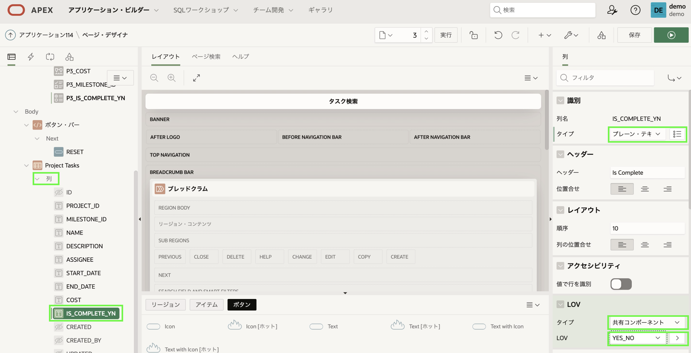
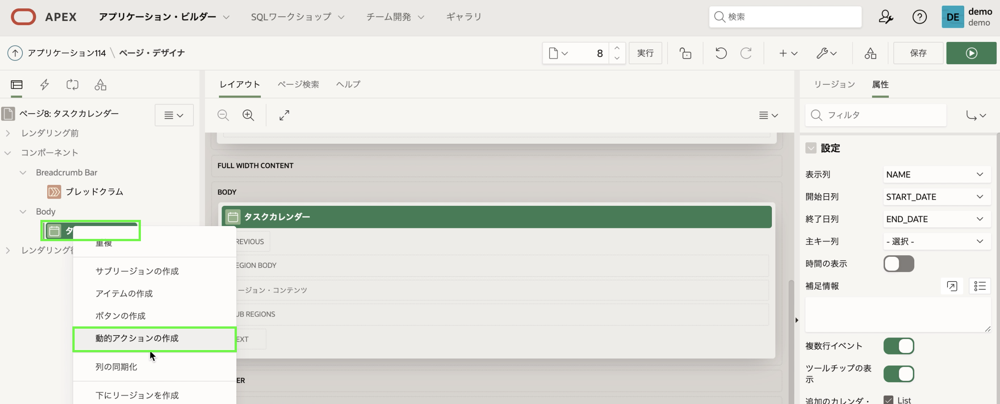
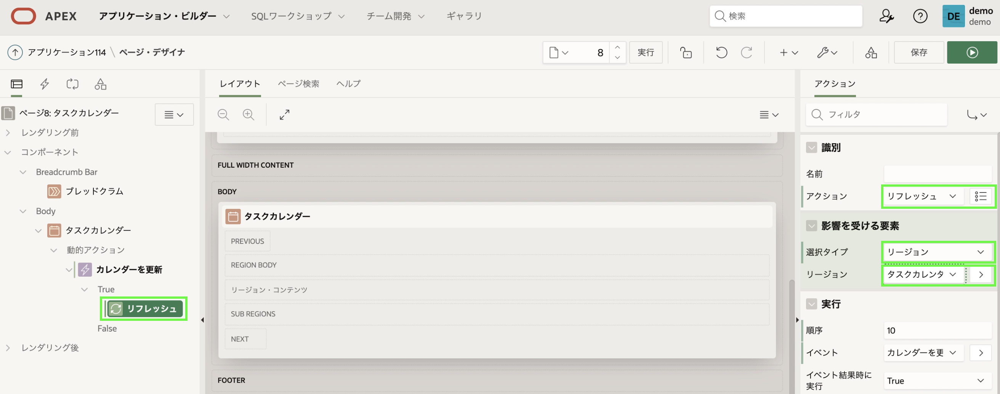

# タスクの改善

## 紹介
このラボでは、共有 **LOV**を定義し、それを使用してタスクのファセット検索と対話モード・レポート ページを改善する方法を学習します。 また、カレンダーをタスクフォームページに簡単にリンクできることも学びます。

## タスク1: 共有LOVの定義
ランタイム環境で **タスク検索** に移動し、ページを確認します。 [Is Complete] 列には単に「Y」または「N」が表示されていることに注意してください。 **タスクレポート**に移動すると、同じ問題に気付くでしょう。 「Yes」または「No」を表示する方がはるかに良いでしょう。 これは、*LOV (LOV)*を定義することで簡単に実現できます。

LOV はページ上で直接定義できます。 ただし、ここで行うように複数のページで同じ LOV が必要な場合は、*共有コンポーネント*として 1 回定義する方がはるかに優れています。

1. アプリケーション・ビルダーブラウザタブに戻り、アプリケーションをクリックします。
2. アプリケーションのホームページで、[**共有コンポーネント**]をクリックします。

    

    または、ページ・デザイナの場合は、ツールバー内で**共有コンポーネント**アイコンをクリックします。

    

3. [共有コンポーネント]で、[**他のコンポーネント**]の下の[**LOV**]をクリックします。

    

4. 既にいくつかのLOVがリストされていることがわかります。
     新しい LOVを作成するには、**作成**をクリックします。

    

5. [LOVの作成]ダイアログで、[ソース]はデフォルトの選択("最初から")のままにします。
     **次へ**をクリックします
6. [名前とタイプ] ダイアログで、次のように入力します。
       - 名前 - **YES_NO**を入力します
       - タイプ - **Static**を選択します

7. **次へ**をクリックします

    

8. [静的値] ダイアログで、次のように入力します。
     - シーケンス 1
         - 表示値 - **Yes** を入力します
         - 戻り値 - **Y**を入力します
     - シーケンス 2
         - 表示値 - **いいえ**を入力します
         - 戻り値 - **N**を入力します

     - [**LOVの作成**]をクリックします。

    

## タスク2: ファセット検索の更新
共有コンポーネントを定義したので、それをファセット検索ページで利用する必要があります。

1. ブレッドクラムで、**アプリケーションxxxxx**をクリックします。

    

2. アプリケーションのホームページから、[**3 - タスク検索**]をクリックします。

    

3. まず、*検索* のエントリを更新します。
     - ページ・デザイナ内のレンダリング・ツリー(左ペイン) で、[検索] の下にある [**P3\_IS\_COMPLETE\_YN**]をクリックします。   

4. プロパティ・エディター(右側のペイン) で、次を選択します。
     - LOV > タイプ - **共有コンポーネント**を選択します
     - LOV > LOV - **YES_NO**を選択します

    

5. 次に、*レポート*に表示される値も更新します。
     - レンダリング・ツリー(左ペイン) で、[Project Tasks]の下にある [列]を展開します。
     - 列のリスト内で、**IS\_COMPLETE\_YN**をクリックします。

6. プロパティ・エディター(右側のペイン) で、次のように入力します。
     - 識別 > タイプ - **プレーン・テキスト(LOVに基づく)**を選択します。
     - LOV > タイプ - **共有コンポーネント**を選択します
     - LOV > LOV - **YES_NO**を選択します

    

7. レポートには多くの列があります。 [Description] 列は場所を取りすぎるため、非表示にする必要があります。
     - レンダリング・ツリー(左側のペイン) で、[プロジェクト タスク]の下の列のリストで [Description]をクリックします。
     - プロパティ・エディター(右側のペイン) で、[識別] > [タイプ] で [**非表示列**]を選択します。

    

8. ページにいる間に、検索列の順序をすばやく変更できます。
     - レンダリング・ツリー(左ペイン) の **検索** で、**P3\_MILESTONE\_ID**をクリックします。
     - プロパティ・エディター(右側のペイン) で、[レイアウト] > [シーケンス] に **25** を入力します。   
     *注: これにより、P3\_MILESTONE\_ID が P3\_PROJECT\_ID の後に配置されます (シーケンス 20)*

    - レンダリング・ツリー(左ペイン) で、**P3\_IS\_COMPLETE\_YN**をクリックします。
     - プロパティ・エディター(右側のペイン) で、[レイアウト] > [シーケンス] に **35** を入力します。   
     *注: これにより、P3\_IS\_COMPLETE\_YN が P3\_ASSIGNEE の後に配置されます (シーケンス 30)*

    

9. ファセット検索が完了したことを確認しましょう。
     - ページ・デザイナのツールバーで、[**ページを保存して実行**]をクリックします。

    

## タスク3: 対話モード・レポートの更新
タスクレポートでは、[完了] 列も更新する必要があります。

1. ランタイム環境で、メニューの **タスクレポート**をクリックします。
     - 開発者ツールバー (ページの下部) で、[**ページ6の編集**]をクリックします。   
     *注意: App Builder ブラウザー タブでアプリケーションのホームページに戻り、手動でページ6 に移動することもできます*

2. ページ・デザイナで **ページ6: タスクレポート**を選択し、レンダリング・ツリー(左ペイン) の **Project Tasks**リージョンで**列**を展開します。
     - LOVで、**IS\_COMPLETE_YN**をクリックします。

3. プロパティ・エディター(右側のペイン) で、次のように入力します。
     - 識別 > タイプ - **プレーン・テキスト(LOVに基づく)**を選択します。
     - LOV > LOV - **YES_NO**を選択します

    

3. アプリケーションを実行します。
     ページ・デザイナのツールバーで、[**保存して実行**]をクリックします。

    

4. レコードの編集アイコンをクリックします。
     Is Complete はスイッチを使用するため、フォーム ページを変更する必要がないことに注意してください。   
     *注: フォーム ページは、次のパートで必要になるページ 7 です*

## タスク4: カレンダーをリンクする
タスクカレンダーページには、多数のタスクが表示されます。 ただし、レコードを直接変更する方法はありません。 したがって、既存のプロジェクト タスク フォーム ページへのリンクを追加する必要があります。

1. ランタイム環境のナビゲーション メニューで、[**タスク カレンダー**]をクリックします。
2. 任意のエントリをクリックして、イベントの詳細が表示されることを確認します

    

3. 開発者ツールバー (ページの下部) で、[**ページ8の編集**]をクリックします。
4. ページ・デザイナのレンダリング・ツリー(左ペイン) で、[タスク カレンダー] 領域の下にある [属性]をクリックします。
     - プロパティ・エディター(右側のペイン) で、[設定] > [リンクの表示/編集] で、[**リンクが定義されていません**]をクリックします。

5. リンク・ビルダーダイアログで、次のように入力します。
     - ターゲット > ページ - **7**を選択します
     - アイテムの設定 > 名前 - **P7_ID**を選択します
     - アイテムの設定 > 値 - **ID**を選択 (**&ID.**を返す)
     - クリア / リセット > キャッシュをクリア - **7** と入力します

6. [**OK**]をクリックします

    

7. プロジェクトタスクフォームページがカレンダーから呼び出されたときに、タスク名、開始日、または終了日が更新された場合、カレンダーが更新されることが重要です。
     - レンダリング・ツリー(左ペイン)で、_右クリック_ **タスクカレンダー**。
     - **動的アクションの作成**を選択します。

    

8. [動的アクション]の下の[**新規**]を選択した状態で、プロパティ・エディター(右側のペイン) で次のように入力します。
     - 識別 > 名前 - **カレンダーを更新**を入力します
     - タイミング > イベント - **ダイアログのクローズ**を選択します。

    *注意: モーダルページであるため、プロジェクトタスクフォームページが閉じられると、カレンダーの更新イベントが発生します*

    

9. レンダリング・ツリー(左ペイン) で、Trueアクションの下にある[**表示**]をクリックします。
     プロパティ・エディター(右側のペイン) で、次を選択します。
     - 識別 > アクション - **リフレッシュ** (**コンポーネント**の下)を選択します。
     - 影響を受ける要素 > 選択タイプ - **リージョン**を選択します
     - 影響を受ける要素 > リージョン - **タスクカレンダー**を選択します

    **保存**をクリックします

    

10. ランタイム環境に戻り、ブラウザーを更新します。
     - カレンダーエントリをクリックします

    

    名前、開始日、または終了日を更新し、[プロジェクトタスクフォーム] ページで [**変更の適用**]をクリックすると、変更がすぐにカレンダーに反映されます。

## **まとめ**

これで、ラボ7とワークショップは完了です。 共有コンポーネントを作成し、それを使用してファセット検索ページと対話型レポートを改善し、レコードが更新された後に更新されるカレンダーページをリンクする方法がわかりました。

## もっと詳しく知る - *役立つリンク*

- [Autonomous Database上のAPEX](https://apex.oracle.com/autonomous)
- [APEXコラテラル](https://apex.oracle.com)
- [チュートリアル](https://apex.oracle.com/en/learn/tutorials)
- [コミュニティ](https://apex.oracle.com/community)
- [外部サイト + Slack](http://apex.world)

## 謝辞

  - **著者** - Salim Hlayel, Principle Product Manager
  - **寄稿者** - Arabella Yao, Product Manager Intern, DB Product Management
  - **最終更新者/日付** - Salim Hlayel, Principle Product Manager, November 2020
