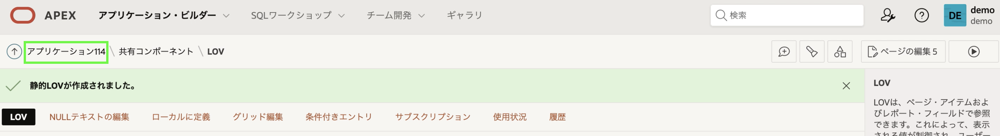
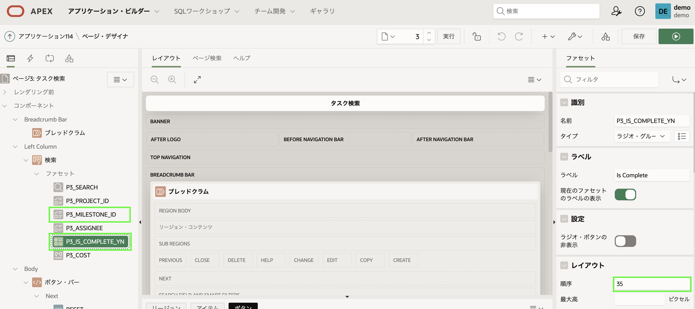

# タスクの改善

## 紹介
このラボでは、共有 *List of Values* を定義し、それを使用してタスクのファセット検索とインタラクティブ レポート ページを改善する方法を学習します。 また、Calendar を Tasks Form ページに簡単にリンクできることも学びます。

## タスク 1: 共有値リストの定義
ランタイム環境で **Tasks Search** に移動し、ページを確認します。 [Is Complete] 列には単に「Y」または「N」が表示されていることに注意してください。 **タスク レポート**に移動すると、同じ問題に気付くでしょう。 「はい」または「いいえ」を表示する方がはるかに良いでしょう。 これは、*値のリスト (LOV)* を定義することで簡単に実現できます。

LOV はページ上で直接定義できます。 ただし、ここで行うように複数のページで同じ LOV が必要な場合は、*共有コンポーネント*として 1 回定義する方がはるかに優れています。

1. App Builder ブラウザ タブに戻り、アプリケーションをクリックします。
2. アプリケーションのホームページで、[**共有コンポーネント**] をクリックします。

    

    または、Page Designer の場合は、ツールバー内で **Shared Components** アイコンをクリックします。

    

3. [共有コンポーネント] で、[**その他のコンポーネント**] の下の [**値のリスト**] をクリックします。

    

4. 既にいくつかの LOV がリストされていることがわかります。
     新しい LOV を作成するには、**Create** をクリックします。

    

5. [値のリストの作成] ダイアログで、[ソース] はデフォルトの選択 ("最初から") のままにします。
     **次へ**をクリックします
6. [名前とタイプ] ダイアログで、次のように入力します。
       - 名前 - **YES_NO** を入力
       - タイプ - **静的**を選択します

6. **次へ**をクリックします

    

7. [静的値] ダイアログで、次のように入力します。
     - シーケンス 1
         - 表示値 - **Yes** と入力します
         - 戻り値 - **Y** を入力
     - シーケンス 2
         - 表示値 - **いいえ**を入力
         - 戻り値 - **N** を入力

     - [**値リストの作成**] をクリックします。

    

## タスク 2: ファセット検索の更新
共有コンポーネントを定義したので、それをファセット検索ページで利用する必要があります。

1. ブレッドクラムで、**Application xxxxx** をクリックします。

    

2. アプリケーションのホームページから、[**3 - タスク検索**] をクリックします。

    

3. まず、*検索* のエントリを更新します。
     - Page Designer 内のレンダリング ツリー (左ペイン) で、[検索] の下にある [**P3\_IS\_COMPLETE\_YN**] をクリックします。   

4. プロパティ エディター (右側のペイン) で、次を選択します。
     - 値の一覧 > タイプ - **共有コンポーネント**を選択します
     - 値リスト > 値リスト - **YES_NO** を選択します

    

4. 次に、*Report* に表示される値も更新します。
     - レンダリング ツリー (左ペイン) で、[プロジェクト タスク] の下にある [列] を展開します。
     - 列のリスト内で、**IS\_COMPLETE\_YN** をクリックします。

5. プロパティ エディター (右側のペイン) で、次のように入力します。
     - 識別 > タイプ - **プレーン テキスト (値のリストに基づく)** を選択します。
     - 値の一覧 > タイプ - **共有コンポーネント**を選択します
     - 値リスト > 値リスト - **YES_NO** を選択します

    

6. レポートには多くの列があります。 [説明] 列は場所を取りすぎるため、非表示にする必要があります。
     - レンダリング ツリー (左側のペイン) で、[プロジェクト タスク] の下の列のリストで [説明] をクリックします。
     - プロパティ エディター (右側のペイン) で、[識別] > [タイプ] で [**非表示の列**] を選択します。

    

7. ページにいる間に、検索列の順序をすばやく変更できます。
     - レンダリング ツリー (左ペイン) の **検索** で、**P3\_MILESTONE\_ID** をクリックします。
     - プロパティ エディター (右側のペイン) で、[レイアウト] > [シーケンス] に **25** と入力します。
     *注: これにより、P3\_MILESTONE\_ID が P3\_PROJECT\_ID の後に配置されます (シーケンス 20)*

    - レンダリング ツリー (左ペイン) で、**P3\_IS\_COMPLETE\_YN** をクリックします。
     - プロパティ エディター (右側のペイン) で、[レイアウト] > [シーケンス] に **35** と入力します。
     *注: これにより、P3\_IS\_COMPLETE\_YN が P3\_ASSIGNEE の後に配置されます (シーケンス 30)*

    

8. ファセット検索が完了したことを確認しましょう。
     - ページ デザイナーのツールバーで、[**ページを保存して実行**] をクリックします。

    

## タスク 3: インタラクティブ レポートの更新
タスク レポートでは、[完了] 列も更新する必要があります。

1. ランタイム環境で、メニューの **タスク レポート** をクリックします。
     - 開発者ツールバー (ページの下部) で、[**Edit Page 6**] をクリックします。
     *注意: App Builder ブラウザー タブでアプリケーションのホームページに戻り、手動でページ 6 に移動することもできます*

2. Page Designer で **Page 6: Tasks Report** を選択し、レンダリング ツリー (左ペイン) の **Project Tasks** 領域で **Columns** を展開します。
     - 列のリストで、**IS\_COMPLETE_YN** をクリックします。

3. プロパティ エディター (右側のペイン) で、次のように入力します。
     - 識別 > タイプ - **プレーン テキスト (値のリストに基づく)** を選択します。
     - 値リスト > 値リスト - **YES_NO** を選択します

    

3. アプリケーションを実行します。
     ページ デザイナーのツールバーで、[**ページを保存して実行**] をクリックします。

    

4. レコードの編集アイコンをクリックします。
     Is Complete はスイッチを使用するため、フォーム ページを変更する必要がないことに注意してください。
     *注: フォーム ページは、次のパートで必要になるページ 7 です*

## タスク 4: カレンダーをリンクする
タスク カレンダー ページには、多数のタスクが表示されます。 ただし、レコードを直接変更する方法はありません。 したがって、既存のプロジェクト タスク フォーム ページへのリンクを追加する必要があります。

1. ランタイム環境のナビゲーション メニューで、[**タスク カレンダー**] をクリックします。
2. 任意のエントリをクリックして、イベントの詳細が表示されることを確認します

    

3. 開発者ツールバー (ページの下部) で、[**Edit Page 8**] をクリックします。
4. ページ デザイナーのレンダリング ツリー (左ペイン) で、[タスク カレンダー] 領域の下にある [属性] をクリックします。
     - プロパティ エディター (右側のペイン) で、[設定] > [リンクの表示/編集] で、[**リンクが定義されていません**] をクリックします。

5. Link Builder ダイアログで、次のように入力します。
     - ターゲット > ページ - **7** を選択
     - セット項目 > 名前 - **P7_ID** を選択
     - Set Items > Value - **ID** を選択 (**&ID.** を返す)
     - クリア / リセット > キャッシュをクリア - **7** と入力

6. [**OK**] をクリックします

    

7. プロジェクト タスク フォーム ページがカレンダーから呼び出されたときに、タスク名、開始日、または終了日が更新された場合、カレンダーが更新されることが重要です。
     - レンダリング ツリー (左ペイン) で、_右クリック_ **タスク カレンダー**。
     - **動的アクションの作成**を選択します。

    

8. [動的アクション] の下の [**新規**] を選択した状態で、プロパティ エディター (右側のペイン) で次のように入力します。
     - 識別 > 名前 - **カレンダーを更新**を入力します
     - When > Event - **Dialog Closed** (**Framework Events** の下) を選択します。

    *注意: モーダル ページであるため、プロジェクト タスク フォーム ページが閉じられると、カレンダーの更新イベントが発生します*

    

9. レンダリング ツリー (左ペイン) で、True アクションの下にある [**表示**] をクリックします。
     プロパティ エディター (右側のペイン) で、次を選択します。
     - 識別 > アクション - **更新** (**コンポーネント**の下) を選択します。
     - 影響を受ける要素 > 選択タイプ - **領域**を選択します
     - 影響を受ける要素 > 地域 - **タスク カレンダー**を選択します

    **保存**をクリックします

    

10. ランタイム環境に戻り、ブラウザーを更新します。
     - カレンダーエントリをクリックします

    

    名前、開始日、または終了日を更新し、[プロジェクト タスク フォーム] ページで [**変更を適用**] をクリックすると、変更がすぐにカレンダーに反映されます。

## **まとめ**

これで、ラボ 7 とワークショップは完了です。 共有コンポーネントを作成し、それを使用してファセット検索ページと対話型レポートを改善し、レコードが更新された後に更新されるカレンダー ページをリンクする方法がわかりました。

## Learn More

- [APEX on Autonomous Database](https://apex.oracle.com/autonomous)
- [APEX Collateral](https://apex.oracle.com)
- [APEX Tutorials](https://apex.oracle.com/en/learn/tutorials)
- [APEX Community](https://apex.oracle.com/community)
- [APEX External Site + Slack](http://apex.world)

## 謝辞

  - **著者** - Salim Hlayel, Principle Product Manager
  - **寄稿者** - Arabella Yao, Product Manager Intern, DB Product Management
  - **最終更新者/日付** - Salim Hlayel, Principle Product Manager, November 2020
