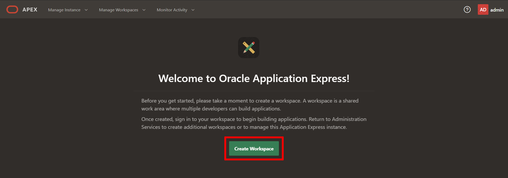
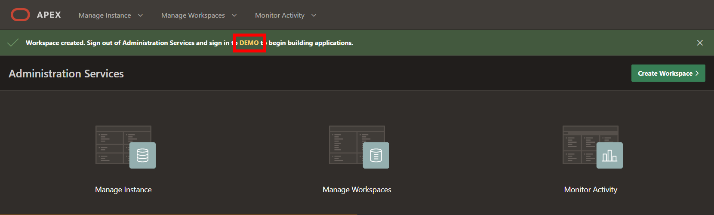
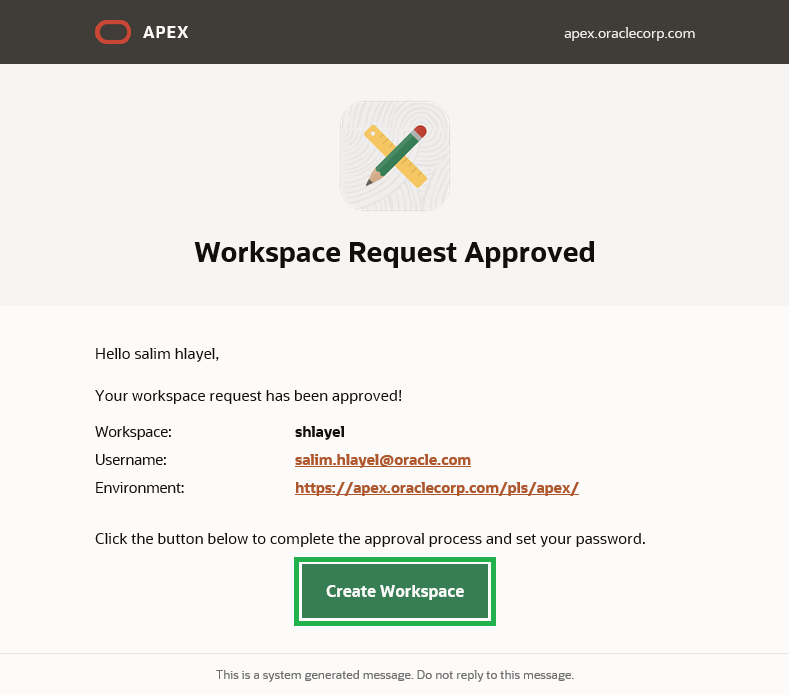

# APEX Workspace のサインアップ

## はじめに

Oracle APEXは、Oracleデータベース向けのローコードアプリケーションプラットフォームです。APEXアプリケーション開発、Autonomous Data Warehouse（ADW）、Autonomous Transaction Processing（ATP）、Autonomous JSON Databaseは、Oracle Cloudで現代的なデータ駆動型アプリケーションを迅速に構築および展開するための、APEXと完全に統合された、事前に構成された完全に管理されたサービスです。ビジネスユーザー、市民、およびアプリケーション開発者は、ブラウザだけで複雑なWeb技術を学ぶことなく、100倍のコードを20倍早く記述することができます。まず、ワークショップで使用するサービスを決定し、それに応じたAPEXワークスペースを作成する必要があります。さらに詳しく知りたい場合は、以下を読み進めてください！

すでにAPEX 22.1ワークスペースがプロビジョニングされている場合は、このラボをスキップできます。

所要時間：5分

以下のビデオを見て、ラボを素早く実行する方法を確認してください。

[](youtube:RcSCnZnDzDE)

### APEXワークスペースとは何ですか？
APEXワークスペースは、APEXアプリケーションを定義する論理ドメインです。各ワークスペースには、表、ビュー、パッケージなどのデータベースオブジェクトを格納するために使用される1つ以上のデータベーススキーマ（データベースユーザー）が関連付けられています。 APEXアプリケーションは、これらのデータベースオブジェクトの上に構築されています。

### 自分のAPEXリリースをどのように見つけるか？
現在実行中のOracle APEXのリリースを確認するには、次のいずれかを実行します:

* ワークスペースのホームページでリリース番号を確認します:
    - Oracle APEXにサインインします。ワークスペースのホームページが表示されます。現在のリリースバージョンは右下隅に表示されます。

    
    

* APEXについてのページを表示する:
    - Oracle APEXにサインインします。ワークスペースのホームページが表示されます。
    - ページの上部にあるヘルプメニューをクリックし、Aboutを選択します。APEXについてのページが表示されます。

  

### ラボの実行場所
このラボは、APEX 22.1がインストールされたOracle Databaseのどこでも実行できます。これには、新しいAPEX Application Development Service、Oracle Autonomous Database、無料の「開発専用」apex.oracle.comサービス、オンプレミスのOracle Database（APEX 22.1がインストールされている場合）、APEX 22.1がインストールされたサードパーティのクラウドプロバイダ、またはOracle XEまたはOracle VirtualBox App Dev VMをインストールしてラップトップ上で実行することができます。

以下は、*APEX Application Development*サービス、*Oracle Autonomous Database*クラウドサービス、または*apex.oracle.com*サービスに登録する方法の手順です。

- APEX Application Development Serviceは、データベース管理を心配することなくAPEX開発に集中することができる柔軟な有料オプションです。1 OCPUと1 TBを提供し、必要に応じて拡張できます。
  
- Always Free Oracle Autonomous Databaseオプションは、Oracle DatabaseとAPEXについて学習するのに理想的で、1 OCPUと圧縮ストレージ20 GBを提供します。このサービスは、プロダクションアプリケーションにも利用でき、必要に応じて有料サービスに簡単にアップグレードできます。

- 一方、apex.oracle.comは無料のサービスですが、開発目的にのみ指定されており、プロダクションアプリを実行することはできません。

このワークショップでラボを実行するには、どちらのサービスも利用できます。

*注*: スプレッドシートラボ、ショッピングカートアプリのビルド、およびMovies Watchlist Appワークショップを除き、これら以外のAPEXワークショップには現在、21.2またはそれ以前の手順/スクリーンショットが含まれています。最新リリースであるAPEX 22.1を使用するようにワークショップを更新するために努力していますが、ワークショップの手順については引き続き参照することができます。一部の手順は異なる場合があります。

以下のいずれかのオプションをクリックして続行してください。

## **オプション1**：APEXサービス
Oracle Application Development（APEX Service）は、Oracle APEXプラットフォームへの便利なアクセスを提供する低コストのOracle Cloudサービスです。[https://apex.oracle.com/en/platform/apex-service/](https://apex.oracle.com/en/platform/apex-service/)を訪問して、Oracle Cloud上のAPEXサービスについて詳しく学習してください。

このパートでは、Oracle APEXアプリケーション開発サービスのトライアルアカウントを作成します。サービスに登録した後、* APEX Service *を作成します。プロセスの最終段階は、Oracle APEXをプロビジョニングすることです。

1.  [このリンクをクリックして無料アカウントを作成してください](https://signup.cloud.oracle.com/). 登録プロセスを完了すると、APEX Serviceを作成するために利用できる300ドルのクレジットが付与されたアカウントが提供されます。残りのクレジットを使用して、Oracle Cloudを引き続き探索できます。

2.  サインアッププロセスが完了すると、Oracle Cloud Infrastructure（OCI）コンソールに自動的にログインされます。
    - ブラウザを閉じた場合は、OCIコンソールにログインするために受信したはずの**Oracle Cloudで今すぐ開始**メールを参照できます。   
    **ユーザー名**、**パスワード**、および**Cloud Account Name**をメモしてください。

        

    - 代わりに、ブラウザから次のURLにアクセスしてOracle Cloudアカウントにログインできます:       
    [https://cloud.oracle.com](https://cloud.oracle.com)

        入力フィールドに**Cloud Account Name**を入力し、**次へ**ボタンをクリックします。

        

        入力フィールドに**User Name**および**Password**を入力し、**サインイン**をクリックします。

        
   
3. クラウドダッシュボードから、左上隅のハンバーガーメニューをクリックします。ナビゲーションメニューから、**Developer Services**を選択し、次に**APEX Application Development**または**APEX Instances**を選択します。APEX Instancesページが表示されます。
    
    
    
4. APEX Instancesページの上部にある**Create APEX Service**ボタンをクリックします。

    
    
5. **Always Free**オプションを選択し、ADMINパスワードに **```SecretPassw0rd```**を入力し、**Create APEX Service**をクリックします。
    
    
    
    
    
6. APEX Instances詳細が再表示されます。

    プロビジョニングプロセスが完了すると、APXロゴはオレンジ色から緑色に変わり、Launch APEXおよびLaunch Database Actionsボタンが有効になります。
  
  
  
  
7. 新しいAPEXサービスを使用する前に、2つのタスクを完了してAPEXサービスインスタンスをセットアップする必要があります：初期のAPEXワークスペースを作成し、APEXユーザーアカウントを作成します。

    APEX Instance詳細で、Launch APEXをクリックします。
    
    
    
8. Administration Servicesサインインページが表示されます。Administration Servicesのパスワードを入力し、**Sign In to Administration**をクリックします。
パスワードは、APEXサービスを作成するときにADMINユーザーのために入力したものと同じです：**```SecretPassw0rd```**
  
  


9. **Create Workspace**をクリックします。

  

10.  ワークスペースを作成する方法に応じて、**New Schema**または**Existing Schema**を選択します。はじめての場合は、**New Schema**を選択してください。

  
    
11. Create Workspaceダイアログボックスで、以下を入力します：
    | Property | Value |
    | --- | --- |
    | Workspace Name | DEMO |
    | Workspace Username | DEMO |
    | Workspace Password | **`SecretPassw0rd`** |

    **Create Workspace**をクリックします。

  

12. APEXインスタンス管理ページで、成功メッセージの中の **DEMO** リンクをクリックします。

    *注: これにより、APEX管理からログアウトされ、新しいワークスペースにログインできるようになります。*

  

13.  APEXワークスペースログインページにて、パスワードに **``SecretPassw0rd``**を入力し、**ワークスペースとユーザー名を記憶する** チェックボックスをオンにした後、ログインをクリックします。

  


## **オプション2**：Oracle CloudでのAutonomous Database

このセクションでは、Oracle Cloudのトライアルアカウントを作成します。サービスに登録したら、_Autonomous Transaction Processing_データベースを作成します。プロセスの最後のステップは、Oracle APEXをプロビジョニングすることです。

1.  [このリンクをクリックして無料アカウントを作成してください](https://signup.cloud.oracle.com)。登録プロセスが完了すると、$300のクレジットといくつかの「永遠に無料の」サービスが提供されます。これにより、ワークショップを無料で完了することができます。残りのクレジットを使用して、Oracle Cloudをさらに探索することができます。永久に無料のサービスはトライアル期間が終了しても引き続き使用可能です。
    
2.  トライアルをリクエストした直後に、**Oracle Cloudでの開始**メールを受け取ります。**ユーザー名**、**パスワード**、**クラウドアカウント名**をメモしておいてください。
    
    
    
3.  サービスが利用できるようになったので、Oracle Cloudアカウントにログインして、さまざまなサービスを使用できるようになります。任意のブラウザから[https://cloud.oracle.com/en_US/sign-in](https://cloud.oracle.com/en_US/sign-in)にアクセスしてください。
    
    入力フィールドに**クラウドアカウント名**を入力し、**Next**ボタンをクリックします。
    
    
    
4.  入力フィールドに**ユーザー名**と**パスワード**を入力し、**サインイン**をクリックします。
    
    
    
5.  Oracle Cloud環境内で、Autonomous Transaction Processingデータベースサービスのインスタンスを作成します。
    
    クラウドダッシュボードから、左上隅にあるナビゲーションメニューアイコンを選択し、**Autonomous Transaction Processing**を選択します。
    
    
    
  
6.  **Autonomous Databaseの作成**をクリックします。
    
    
    
7.  **常時無料** オプションを選択し、管理者パスワードに **`SecretPassw0rd`**を入力し、 **Autonomous Databaseを作成**をクリックします。
    
     
    
8.  **Autonomous Databaseの作成**をクリックした後、新しいインスタンスのAutonomous Databaseの詳細ページにリダイレクトされます。
    
    ステータスが以下のように変更されたら、続行してください。
    
    
    
    から
    
    
    
9.  新しいデータベースでは、APEX はまだ設定されていません。これから最初に APEX にアクセスするときは、APEX インスタンス管理者としてログインしてワークスペースを作成する必要があります。
    
    **Tools** タブをクリックします。 **APEXを開く**をクリックします。
    
    
    
    _注意: 常時無料のAutonomous Databaseは、7日間非アクティブになると停止されます。その場合は、 **詳細アクション**をクリックしてから **開始**をクリックしてAutonomous Databaseを開始し、その後 **APEXを開く**をクリックする必要があります。_
    
10. 管理サービスのパスワードを入力し、 **管理にサインイン**をクリックします。 パスワードは、ATP インスタンスの作成時に ADMIN ユーザーのために入力したものと同じです: **`SecretPassw0rd`**
    
  
11. **ワークスペースを作成**をクリックします。
    
    
    
12. ワークスペースの作成方法によって、**新しいスキーマ**または**既存のスキーマ**を選択します。初めての場合は、**新しいスキーマ**を選択してください。
    

1. 「ワークスペースを作成」ダイアログに、次の情報を入力します:
 
    | プロパティ | 値   |
    | ------ | ------ |
    | ワークスペース名 | DEMO |
    | ワークスペースのユーザー名 | DEMO |
    | ワークスペースのパスワード | **`SecretPassw0rd`** |
    
    「ワークスペースを作成」をクリックします。
    
    

14.  APEXインスタンス管理ページで、成功メッセージの中の **DEMO**リンクをクリックします。  
    _注：これにより、APEX管理からログアウトして、新しいワークスペースにログインできます。_    
    
    
15.  APEXワークスペースのログインページで、パスワードに **`SecretPassw0rd`**を入力し、**ワークスペースとユーザー名を記憶する**チェックボックスをオンにして、**サインイン**をクリックします。    
    

## **オプション3**：apex.oracle.com


apex.oracle.comへの登録は、作成したいワークスペースの詳細を提供し、承認メールを待つだけの簡単な手続きです。

1.  [https://apex.oracle.com](https://apex.oracle.com)にアクセスしてください。
    
2.  **Get Started for Free**をクリックしてください。
    
    
    
3.  下にスクロールして、apex.oracle.comの詳細が表示されるまで待ってください。**Request a Free Workspace**をクリックしてください。
    
    
    
4.  ワークスペースの識別詳細を入力します。名前、姓、メールアドレス、ワークスペースを入力してください。   
_注意: ワークスペースには、ファーストイニシャルと名字など、ユニークな名前を入力してください。_
    
    **次へ**をクリックしてください。
    
    
    
5.  残りのウィザード手順を完了してください。
    
6.  メールを確認してください。数分以内にOracle APEXからメールが届くはずです。  
    _注意: メールが届かない場合は、ステップ3に戻ってメールアドレスを正しく入力してください。_
    
    メール本文内の**Create Workspace**をクリックしてください。
    
    
    
7.  **Continue to Sign In Screen**をクリックしてください。
    
8.  パスワードを入力し、**Apply Changes**をクリックしてください。
    
9.  これでAPEX Builderに入ることができます。
    
    
    

## **まとめ**

これで、APEXワークスペースの作成方法を知り、素晴らしいアプリケーションの構築を始める準備ができました。

次のラボに進むことができます。

## **謝辞**

- **著者** - Apoorva Srinivas, Senior Product Manager
- **貢献者** - Salim Hlayel, Arabella Yao, Jaden McElvey
- **最終更新者/日付** - Apoorva Srinivas, Senior Product Manager, May 2022
