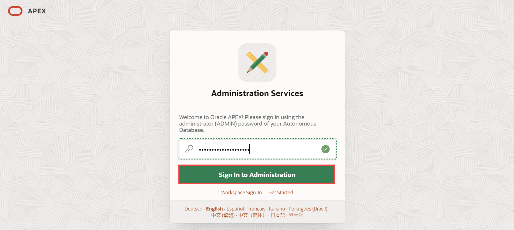

APEX Workspace のサインアップ
======================

はじめに
----

このラボでは、Oracle Autonomous Database（Autonomous Transaction Processing \[ATP\]）で Oracle APEXを使用し始めるための手順を説明します。このラボでは、新しい ATP インスタンスをプロビジョニングして APEX Workspaceを作成します。

所要時間: 5 分

目的

このラボでは、以下を実行します。

* Oracle Cloud Infrastructure コンソールを使用して Oracle Autonomous Transaction Processing クラウドサービスにアクセスします。
* 新しい Autonomous Transaction Processing データベースをプロビジョニングします。
* APEX Workspaceを作成します。

タスク1: ATP インスタンスを作成する
----------------------

1.  **はじめに** ラボで示されているように、Oracle Cloud にログインします。
    
2.  ログインすると、すべての利用可能なサービスが表示されるクラウドサービスダッシュボードに移動します。左上のナビゲーションメニューをクリックしてトップレベルのナビゲーションオプションを表示します。
    
    
    
    注：ダッシュボードのクイックアクションセクションから Autonomous Data Warehouse や Autonomous Transaction Processing サービスに直接アクセスすることもできます。
    
3.  **Autonomous Transaction Processing**を選択します。
    
    
    
4.  リストスコープドロップダウンメニューを使用してコンパートメントを選択します。LiveLabs 環境を使用している場合は、リストスコープドロップダウンメニューから環境で提供されるコンパートメントを選択してください。
    
    
    
5.  ページの右上隅に現在のデフォルトリージョンが表示されます。
    
6.  **Create Autonomous Database**をクリックします。
    
    
    
7.  **Always Free** オプションを選択し、ADMIN パスワードに **`SecretPassw0rd`**を入力してから、**Create Autonomous Database**をクリックします。
    
     
    
8.  **Autonomous Databaseの作成**をクリックすると、新しいインスタンスのAutonomous Databaseの詳細ページにリダイレクトされます。次のステータスに変わるまで待ちます。
    
    
    
    から
    
    
    
    に変わったら、続行してください。
    

タスク2: APEXワークスペースの作成
--------------------

1.  新しいデータベース内では、APEXはまだ設定されていません。そのため、初めてAPEXにアクセスするときは、APEXインスタンス管理者としてログインしてワークスペースを作成する必要があります。
    
    **ツール** タブをクリックします。 **APEXを開く**をクリックします。
    
    
    
2.  管理サービスのパスワードを入力し、**管理にサインイン**をクリックします。 パスワードは、ATPインスタンスを作成するときにADMINユーザーのために入力したものと同じです: **`SecretPassw0rd`**
    
    
    
3.  **ワークスペースの作成**をクリックします。
    
    
    
4.  ワークスペースを作成する方法によっては、**新しいスキーマ** または **既存のスキーマ**を選択します。始める場合は、 **新しいスキーマ**を選択します。
    
    
    
5.  ワークスペースの作成ダイアログで、以下を入力します。
    
    | プロパティ | 値   |
    | --- | --- |
    | ワークスペース名 | DEMO |
    | ワークスペースユーザー名 | DEMO |
    | ワークスペースパスワード | **`SecretPassw0rd`** |
    
    **ワークスペースの作成**をクリックします。
    
    
    
6.  APEXインスタンス管理ページで、成功メッセージ内の **DEMO** リンクをクリックします。 _注意: これにより、APEX管理からログアウトされ、新しいワークスペースにログインできます。_
    
    
    

7.  APEXワークスペースのログインページで、パスワードに **`SecretPassw0rd`**を入力し、 **ワークスペースとユーザー名を記憶する** チェックボックスを選択して、 **サインイン**をクリックします。
    
    
    

## **要約**

この時点で、APEXワークスペースを作成する方法を知っており、素晴らしいアプリケーションを素早く構築する準備ができています。

今後の実習に **進んでください** 。
    
## **謝辞**
- **著者** - Apoorva Srinivas, Senior Product Manager
- **最終更新者/日付** - Apoorva Srinivas, Senior Product Manager, September 2022
