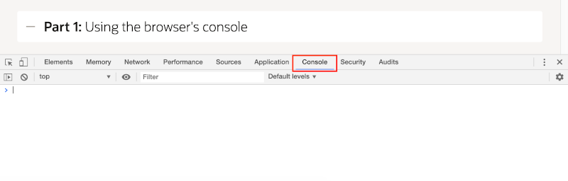
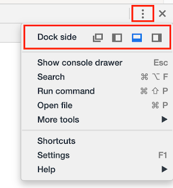
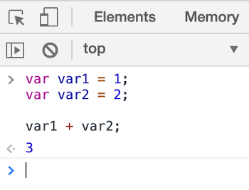
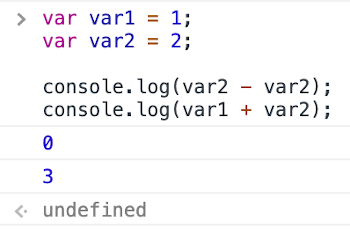
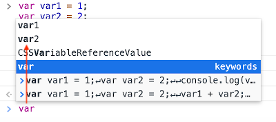

# JavaScriptの基礎

## はじめに

このラボでは、変数、演算子、関数など、JavaScriptの基礎をブラウザのデベロッパー・ツールのコンソールから扱い始めます。 

このラボは、<a href="https://developers.google.com/web/tools/chrome-devtools/" target="_blank">Google ChromeのDevTools</a>に基づいているため、可能であればそのブラウザを使用してください。必要に応じて、別のブラウザを使用することもできますが、ショートカット・キーや説明などを調整する必要があります。

以下のビデオを視聴して、このラボの概要を学んでください。

[](youtube:02thxqv-m_c)

 <a href="https://www.slideshare.net/DanielMcGhan/module-1-javascript-basics" target="_blank">ここをクリック</a>してスライドを表示してください。

## タスク1: ブラウザのコンソールの利用

この部分では、Webブラウザのコンソールで変数の宣言とさまざまな演算子の利用方法を学びます。

1. Chromeで、**Command+Option+J** (Mac) または **Control+Shift+J** (Windows/Linux)を押してDevToolsコンソール・タブを開きます。

    

2. デベロッパー・ツールのウィンドウは、ブラウザに様々な方法でドッキングしたり、完全にアンドックすることができます。カスタマイズ・メニューを使って、デベロッパー・ツールのウィンドウのサイズ変更と位置変更を練習してください。

   デベロッパー・ツールのウィンドウを希望の位置に置いたら、次のステップに進んでください。

    

3. 次のコードを**コンソール**タブに入力してください。コピペではなく、自分で入力するようにしてください。**Enter**を押すとコンソール内のコードが実行されることに注意してください。改行するには**Shift+Enter**を使用します。

    ```
    <copy>
    var var1 = 1;
    var var2 = 2;

    var1 + var2;
    </copy>
    ```

4. 前のステップで入力したコードを実行するために**Enter**を押してください。コンソールに`3`という出力が表示されるはずです。

    

    ご覧のとおり、コンソールはRead-Eval-Print-Loop (REPL) の実装です。入力の読み取り（Read）、評価（Eval）、表示（Print）を繰り返す（Loop）のでREPLと呼ばれます。
    いちいちファイルを書いてコンパイルして実行しなくても挙動を確認できます。

5. **上矢印**を押して、前に実行したコードブロックを読み込んでください。**上矢印**と**下矢印**を使用すると、コンソールの実行履歴を循環できることに注意してください。コードを以下のように修正してください。

    ```
    <copy>
    var var1 = 1;
    var var2 = 2;

    console.log(var2 - var2);
    console.log(var1 + var2);
    </copy>
    ```

6. コードを実行するために**Enter**を押してください。コンソールに次のような出力が表示されるはずです。

    

    ご覧のとおり、`console.log` メソッドはコンソールにメッセージを出力します。これはシンプルなデバッグに役立ちます。

    最後のステートメント(`console.log`への呼び出し)が値を返さなかったため、末尾に`undefined`が表示されています。 未定義の値（`undefined`）が返されたということです。

7. コンソールに戻り、前のコードで宣言された変数の名前(例:`var1`)の一部varを入力します。変数var1とvar 2の名前が表示されるオート・コンプリートのポップアップ・ウィンドウが表示されるはずです。

    

    変数の完全な名前を入力して**Enter**を押すと、その変数の値がコンソールに表示されることに注意してください。

8. Webページを更新し、変数の名前をもう一度入力してみてください。ブラウザでページが読み込まれるたびに、新しいJavaScriptコンテキストが取得されるため、変数は表示されません。

## タスク2: 変数、データ型、演算子

これでコンソールの基本的な操作方法は理解できたので、JavaScriptを直接操作してみましょう。

1. 次のコードをコンソールに入力してください。そして、宣言をガイドとして、4つの新しい変数(各型1つずつ)を追加してください。**Enter**を押して、変数の値をコンソールで確認してください。

    ```
    <copy>
    var msg = 'Hello';
    var id = 123;
    var fun = true;
    var things = ['car', 'laptop', msg];
    </copy>
    ```

2. 前のステップのコードに以下の演算子を使用した文を追加してください。演算子の種類ごとに少なくとも2つずつ、合計で少なくとも8文を選択してください。

    | 演算子のタイプ | 演算子 |
    | --- | --- |
    | 代入 | `=`, `+=`, `-=`, `*=`, `/=`, `%=` |
    | 算術 | `+`, `-`, `*`, `/`, `%`, `++`, `--` |
    | 比較 | `==`, `===`, `!=`, `!==`, `>`, `<`, `>=`, `<=` |
    | 論理 | `&&`, `||`, `!` |

    
    例：
    ```
    <copy>
    var id2 = 123;
    var id3 = '123' ;
    id2 == id3;
    </copy>
    ```

    ```
    <copy>
    id2 === id3;
    </copy>
    ```

    ```
    <copy>
    id2 == id3 && id2 === id3;
    </copy>
    ```

    ```
    <copy>
    id2 == id3 || id2 === id3;
    </copy>
    ```

    ```
    <copy>
    let y = id2++;
    // id2 is 124; y is 123
    </copy>
    ```

    ```
    <copy>
    y = ++id2;
    // id2 is 125; y is 125
    </copy>
    ```

## タスク3: 条件分岐とループ

条件分岐とループなしでは、プログラミングは不可能です。JavaScriptを使用するには、基本的な `if` 文と `for` ループが必要です。

1. 前の部分のコードにmsgとfunが定義したので、好きな `if` 文を追加してください。

    ```
    <copy>
    if (msg === 'bye') {
      fun = false;
    }
    console.log(fun);
    </copy>
    ```

    ```
    <copy>
    msg = 'bye';
    if (msg === 'bye') {
      fun = false;
    }
    console.log(fun);
    </copy>
    ```

    必要に応じてコードを実行してテストしてください。練習のために、`if-then-else` 文も書いてみましょう。

2. タスク2のステップ1で宣言した配列の値を表示するループを追加してください。

    ```
    <copy>
    for (var x = 0; x < things.length; x += 1) {
      console.log(things[x]);
    }
    </copy>
    ```

    必要に応じてコードを実行してテストしてください。

## タスク4: オブジェクトと関数

オブジェクトと関数は、JavaScriptでコードを構成および整理するために使用されます。より複雑なトピックに進む前に、それらの基本的な動作を理解することが重要です。

1. 次のコードをコンソールに入力し、実行してください。

    ```
    <copy>
    var person = {
      first: '',
      last: ''
    };

    function sayHello(p) {
      console.log('Hi ' + p.first + ' ' + p.last);
    }
    </copy>
    ```

2. コンソールを使用して、`person`変数の`first`と`last`属性の値を設定するコードを入力し実行してください。

    ```
    <copy>
    person.first = 'John';
    person.last = 'Smith';
    </copy>
    ```

3. コンソールを使用して、`person`変数を渡すことにより`sayHello`関数を呼び出すコードを入力し実行してください。  

    ```
    <copy>
    sayHello(person);
    </copy>
    ```
    
4. 時間が許すなら、次の拡張を検討してください:

    * personの配列を受け取る`sayHello2`という新しい関数を追加する。そして、それぞれのpersonに対してHelloと言うためにループを回す。
        次のコードをコンソールに入力し、実行してください。
        ```
        <copy>
        function sayHello2(persons) {
            for (let i = 0; i < persons.length; i++) {
                console.log('Hi ' + persons[i].first + ' ' + persons[i].last);
            }
        }

        persons = [{first: 'Mike', last: 'Tyson'},{first: 'Tomas', last: 'Edison'}];

        sayHello2(persons);
        </copy>
        ```
        次のコードをコンソールに入力し、実行してください。
        ```
        <copy>
        function Person(first,last){
            this.first = first ;
            this.last = last ;
        }

        persons = [new Person('Mike','Tyson'),new Person('Tomas','Edison')];

        sayHello2(persons);
        </copy>
        ```
        ご覧のとおり、Personオブジェクトを作成する方法が異なります。1 つはオブジェクト・リテラルと呼ばれ、もう1つはオブジェクト・コンストラクターと呼ばれます。
        この二つ方法の区別について、<a href="https://developer.mozilla.org/ja/docs/Learn/JavaScript/Objects/Basics" target="blank">こちら</a>に参照してください。
    * `sayHello2` を更新して、personの名前や姓が空の文字列(`''`)、`null`、または`undefined`の場合にはHelloと言わないようにする。
    次のコードをコンソールに入力し、実行してください。
        ```
        <copy>
        function sayHello2(persons) {
            for (let i = 0; i < persons.length; i++) {
                if(persons[i].first && persons[i].last){
                    console.log('Hi ' + persons[i].first + ' ' + persons[i].last);
                }
            }
        }

        persons = [{first: 'Mike', last: 'Tyson'},{first: 'Tomas', last: 'Edison'},{first:'Anyomous'}];

        sayHello2(persons);
        </copy>
        ```
        こちらFalsy (偽値)を利用して、personの名前判断を行いました。Falsy (偽値)の詳細について、<a href="https://developer.mozilla.org/ja/docs/Glossary/Falsy" target="blank">こちら</a>に参照してください。
## **まとめ** 

以上でラボ1は完了です。この時点で、コンソールとJavaScriptのコアコンセプトの扱いに慣れてきたはずです。次のラボ2に進んでください。


## **謝辞**
 - **著者** -  Dan McGhan, Database Product Management
 - **寄稿者** - Arabella Yao, Jeffrey Malcolm Jr, Robert Ruppel, LiveLabs QA
 - **最終更新者/日付** - Jeffrey Malcolm Jr, LiveLabs QA, June 2020
