# APEXアプリにJavaScriptを追加する

## はじめに

ここまでは、APEXの外でJavaScriptを操作してきました。このラボでは、APEXアプリケーションにJavaScriptを追加する一般的な方法を学びます。オプションには、動的アクション、JavaScriptフックを使用した動的アクション、ページおよびコンポーネントレベルの属性、アプリケーション・ファイルが含まれます。

これらのオプションは、順を追って進化するものと考えてください。それぞれが、JavaScript、APEXのJavaScript API、およびWeb開発全般に関するより多くの知識が必要になります。新しいAPEX開発者は、動的アクションから学び始め、より高度なアプローチがなければアプリケーションの要件を満たすことができない場合にのみ、後続のオプションに進むべきです。一般的に、ソリューションが宣言的であればあるほど、実装とメンテナンスが容易になります。

このラボのビデオをご覧ください。

[](youtube:-l6E5LuNU3U)

<a href="https://www.slideshare.net/DanielMcGhan/module-2-adding-javascript-to-apex-apps" target="\_blank">こちらをクリック</a>してスライドをご覧ください。

## タスク1: 動的アクションの使用

動的アクションは、APEXアプリケーションにJavaScriptを追加する最も簡単な方法です。多くの場合、完全に宣言的(コード不要)にできます。このステップでは、アイテムの値に基づいてページコンポーネントを非表示/表示する動的アクションを作成します。  

1. APEXワークスペースにログインしてください。このラボの導入で説明した手順を使用してワークスペースを作成した場合、**ワークスペース**と**ユーザー名**は `DEMO` で、**パスワード** は `SecretPassw0rd` です。

    

2. **アプリケーション・ビルダー**に移動し、**Sample Database Application**インポートしてインストールしてください。

    [こちらをクリックして](files/SampleDatabaseApplication_Apex_19.2.sql)、このラボの SQLファイル`SampleDatabaseApplication_Apex_19.2.sql`をローカルコンピュータにダウンロードしてください。

    **アプリケーション・ビルダー**画面で、**インポート**をクリックします。
    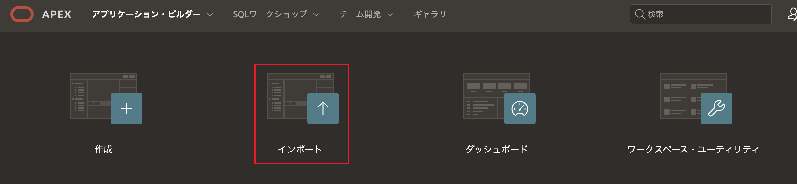  

    **インポートウィザード**画面が表示されます、ここで**ドラッグ・アンド・ドロップ**をクリックします。
    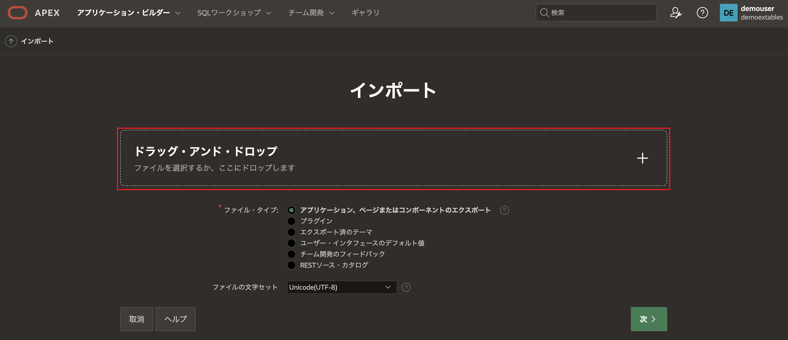  

    ファイル**SampleDatabaseApplication_Apex\_19.2.sql**を選択します。
    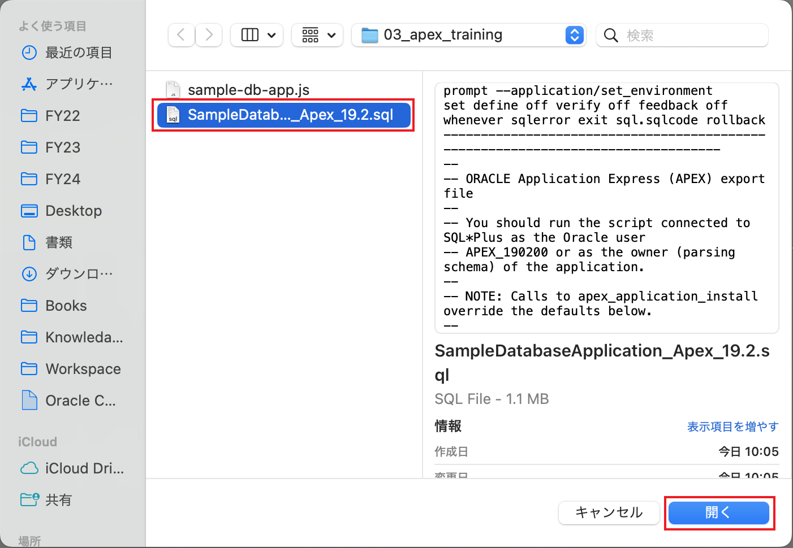  

    **次へ**をクリックします。
    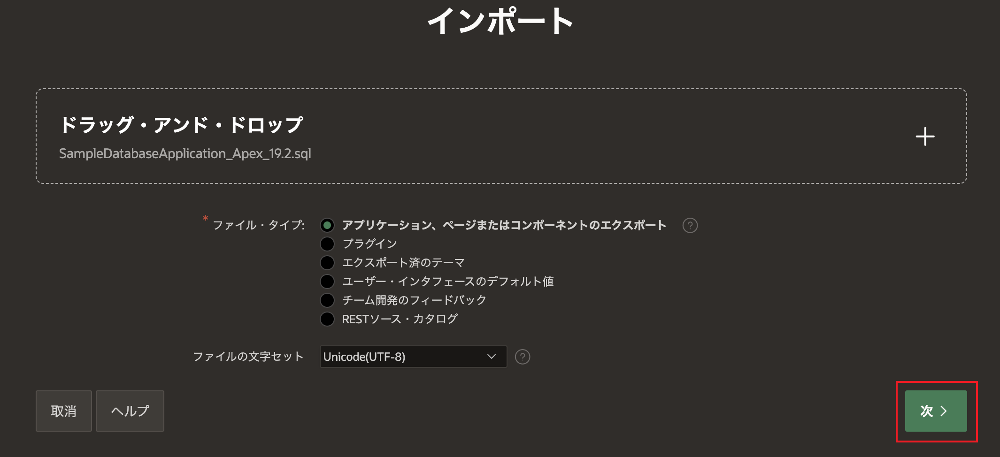 

    **次へ**をクリックします。 
    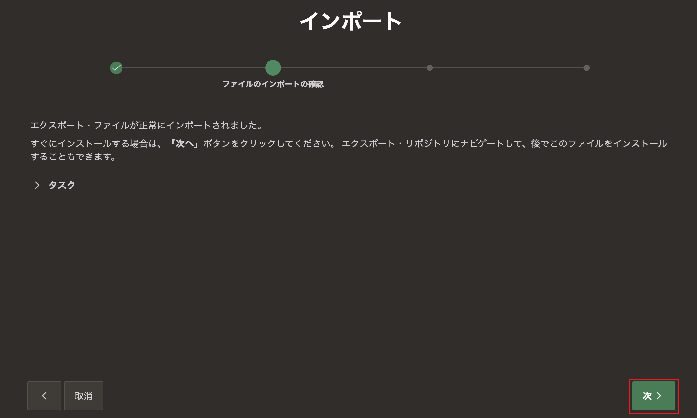  

    **アプリケーションのインストール**をクリックします。
    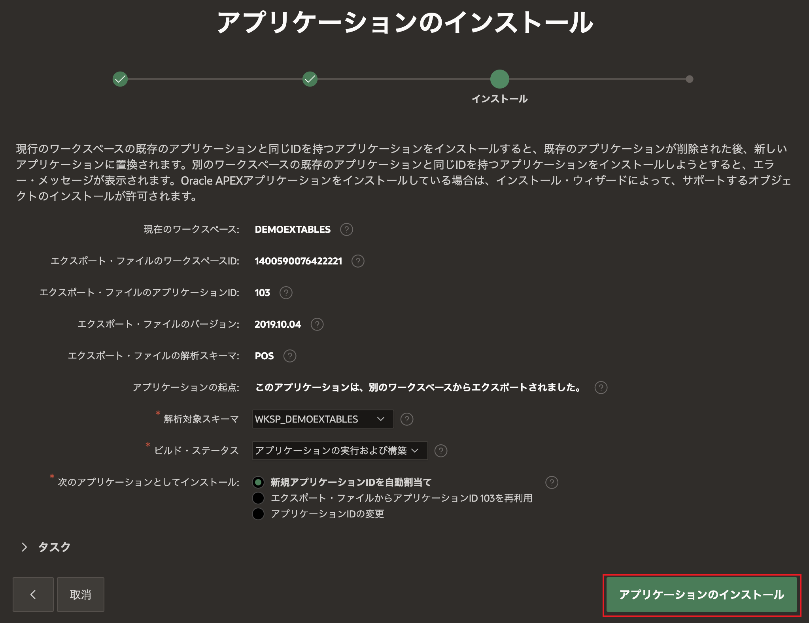  

    **次へ**をクリックします。
    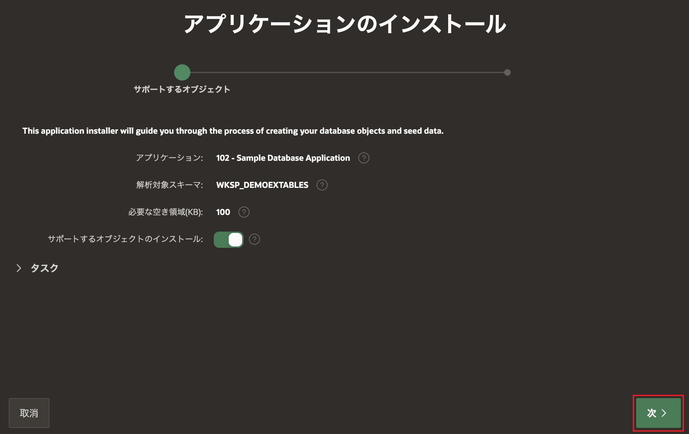 

    **インストール**をクリックします。 
    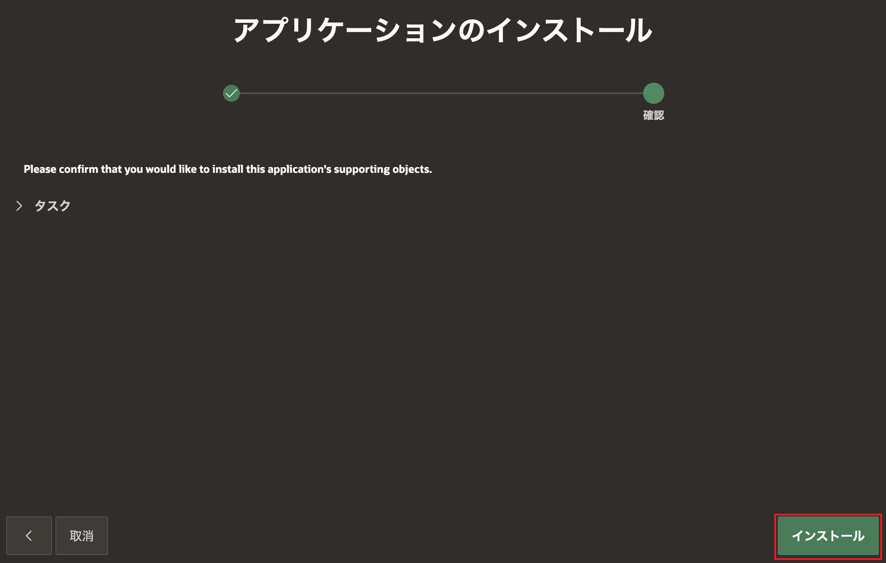  

    **アプリケーションの実行**をクリックして、アプリケーションを実行します。
    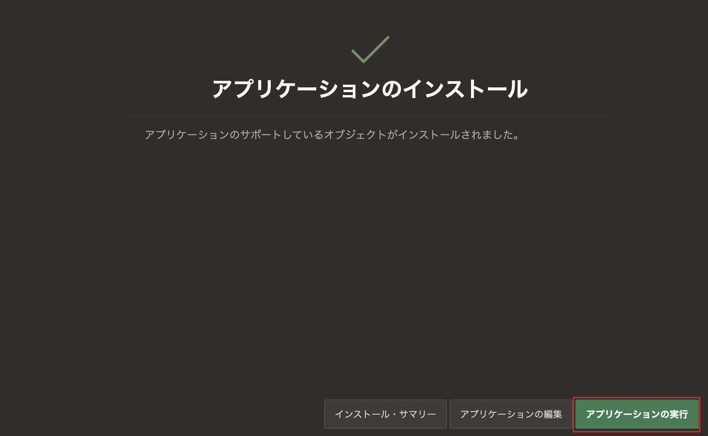  

3. アプリを実行し、**Products**ページに移動します。 **Bag**などの製品の**Name**をクリックします。次のようなフォームが表示されます。 

    

    現時点では、**Product Available**アイテムが**No**に設定されているときに、**Product Image**アイテムと**Product Image**領域の両方が表示されています。次のステップでは、**Product Available**アイテムが**No**に設定されているときに、Product ImageアイテムとProduct Image領域を非表示にする動的アクションを実装します。

4. サンプルアプリのページ6、Product Detailsページのページ・デザイナーに移動します。左のレンダリングパネルで、**P6\_PRODUCT\_AVAIL**という名前のアイテムを右クリックし、**動的アクションの作成**を選択します。

    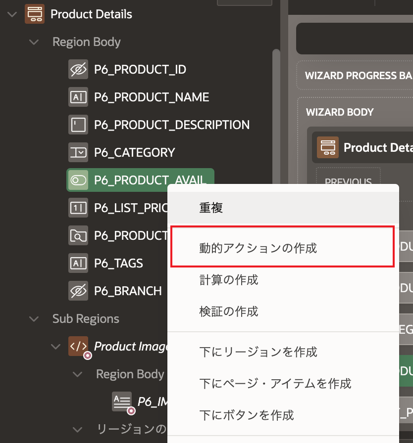

5. 右のプロパティパネルで、**名前**を**P6\_PRODUCT_AVAIL changed**に設定します。**イベント**、**選択タイプ**、**アイテム**の選択はすべて正しく設定されているはずです。これは、アクションが**P6\_PRODUCT\_AVAIL**を右クリックして作成されたためです。続ける前に、**イベント**の選択リストを開いて、使用可能な他のイベントを確認してください。

    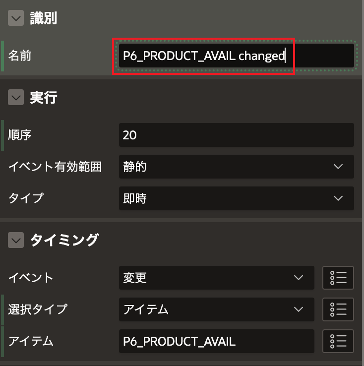

6. 真偽のアクションを定義するには、クライアントサイドの条件を定義する必要があります。 **クライアント側の条件**セクションで、**タイプ**を**アイテム = 値**に、**アイテム**を**P6\_PRODUCT\_AVAIL**(デフォルト)に、**値**を**Y**に設定します。

    

7. 左のパネルで、**表示**アクションを選択します。これはデフォルトで作成されたアクションですが、必要なアクションだったことがわかります。

    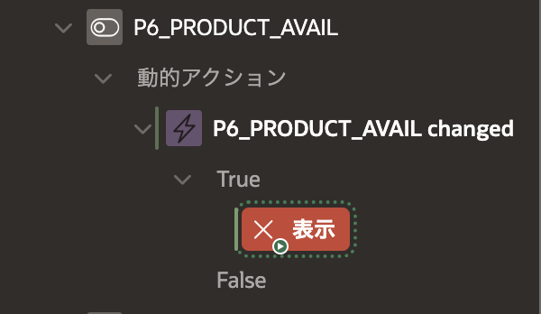

8.  右のパネルで、**選択タイプ**を**アイテム**に、**アイテム**を**P6\_PRODUCT\_IMAGE**に設定します。

    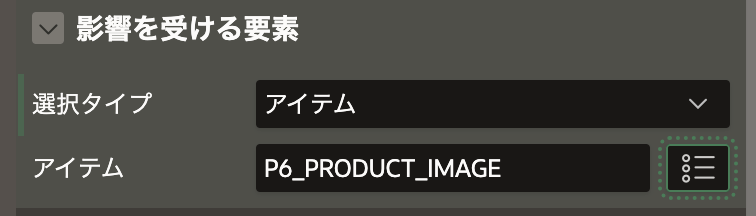

    これにより、イメージアイテムが正しく表示されますが、リージョンも考慮する必要があります。次にそれを行います。

9.  左のパネルの**表示**アクションを右クリックし、**重複**を選択します。

    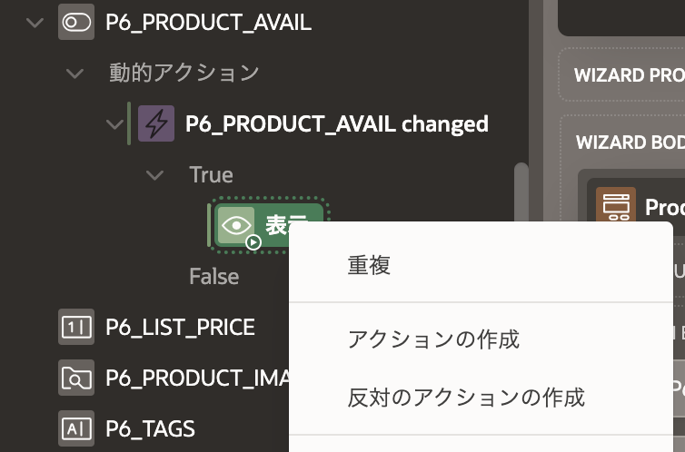

10. 右のプロパティパネルで、**選択タイプ**を**リージョン**に、**リージョン**を**..Product Image**に設定します。

    

11. この時点で、表示アクションは正しく設定されていますが、非表示アクションはまだ作成する必要があります。 非表示は表示の反対なので、APEXではこれを非常に簡単にできます。 左のパネルで両方の表示アクションを選択した後、アクションのいずれかを右クリックし、**反対のアクションの作成**を選択します。

    

    動的アクションのFalseブランチの下に、2つの新しい非表示アクションが表示されるはずです。 最高のところは、前のアクションの設定がすでに設定されていることです。

12. 変更を保存し、ランタイムアプリケーションに戻ります。フォームページを閉じ、製品を再度クリックすることで再度開きます。 これで、イメージアイテムとリージョンは、**Product Available**の値に基づいて非表示/表示されるはずです。 動的アクションを使用すると、1行のJavaScriptコードも書かずにそれをすべて実現できます。

    


## タスク2: JavaScriptフックとともに動的アクションを使用する

動的アクション・フレームワークは、少しJavaScriptを知っている開発者向けに、さまざまなJavaScriptフックまたは機能を提供します。 これらの機能により、動的アクション・フレームワークをより強力で柔軟なものにすることができます。

このステップでは、前のステップで作成した動的アクションでこれらの機能を使用します。 最終結果は同じですが、必要なときに使用できるJavaScriptフックについてよりよく理解できます。

1. ページ6のページ・デザイナーに戻り、前のステップで作成した動的アクションを選択します。

    

2. 右パネルの**タイミング**セクションで、**イベント**を**カスタム**に、**カスタム・イベント**を**change**に、**選択タイプ**を**jQueryセレクタ**に、**jQueryセレクタ**を**#P6\_PRODUCT\_AVAIL**に設定します。

    

    これらの設定は、宣言型の設定と同じです。 次のラボで、イベント、jQuery、jQueryセレクターの詳細を学習します。

3. **クライアント側の条件**セクションで、**タイプ**を**JavaScript式**に、**JavaScript式**をこのコードに設定します: `$v(this.triggeringElement.id) === 'Y'`

    

    `$v` は [APEX用JavaScript API](https://apex.oracle.com/jsapi) によって提供される関数です。 アイテムの値を返します。 アイテムのidプロパティは動的に取得されるため、名前が変更されても式を更新する必要はありません。

4. アクションを変更する前に、リージョンのプロパティを設定して、Product Imageリージョンの静的idを提供する必要があります。 左のパネルで、**Product Image**リージョンを選択します。

    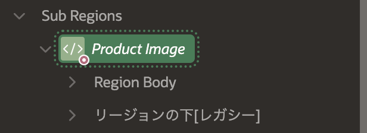

5. 右のパネルで、**静的ID**を**product-image-reg**に設定します。

    

6. 左のパネルで、**動的アクション**タブを選択します。 jQueryセレクターを使用している場合、このアクションはアイテムに直接リンクされていなかったため、このアクションは [動的アクション] タブにのみ表示されます。

    **表示**アクションの1つを右クリックして**削除**します。 残りの**表示**アクションを選択します。

    

7. 右のパネルで、**アクション**を**JavaScriptコードの実行**に設定し、次のコードを**コード**プロパティに入力します。

    ```
    <copy>
    $('#product-image-reg').show();
    $('#P6_PRODUCT_IMAGE')
    .closest('.t-Form-fieldContainer')
    .show();
    </copy>
    ```

    そのコードは、次のラボで説明されるDOMのメソッドを使用しています。アクションは次のように表示される必要があります。

    

8. **初期化時に実行**属性を**On**に設定します。

    

9. 左のパネルで、**動的アクション**タブを選択します。 **非表示**アクションの1つを右クリックして**削除**します。 残りの**非表示**アクションを選択します。

    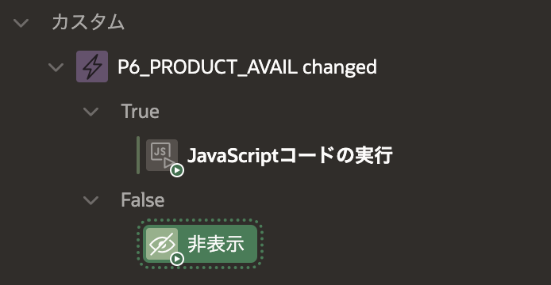

10. 右のパネルで、**アクション**を**JavaScriptコードの実行**に設定し、次のコードを**コード**プロパティに入力します。

    ```
    <copy>
    $('#product-image-reg').hide();
    $('#P6_PRODUCT_IMAGE')
    .closest('.t-Form-fieldContainer')
    .hide();
    </copy>
    ```

    アクションは次のように表示されるはずです。

    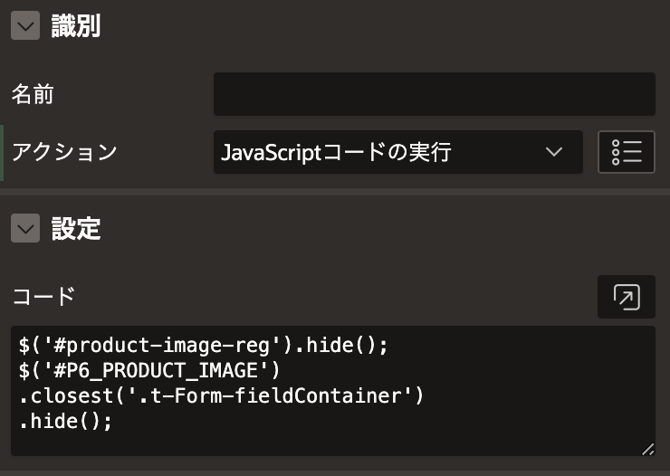

11. **初期化時に実行**属性を**On**に設定します。 

    

12. 変更を保存し、フォームページを再度開きます。以前とまったく同じようにすべて機能するはずです。うまくいけば、宣言型オプションはJavaScriptフックを使用するよりもはるかに簡単であることに同意するでしょう。ただし、それらが提供する柔軟性が必要な場合は、フックがそこにあることを嬉しく思うでしょう!


## タスク3: ページとコンポーネントレベルの属性を使用する

動的アクションに加えて、ページとコンポーネントレベルには、JavaScript向けのさまざまな属性があります。 このステップでは、それらの属性がどこにあるかと、それらがどのように使用されるかを学習します。

1. ページ1のページ・デザイナー、つまりホームページに戻り、レンダリングタブの下のツリー内のルート要素を選択します。

    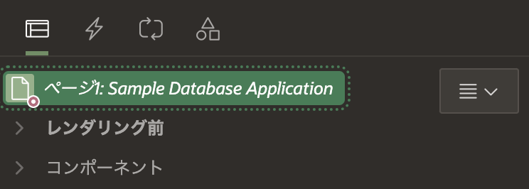

2. 右のパネルで、プロパティをスクロールダウンし、**JavaScript**セクションを見つけます。 次の関数を**ファンクションおよびグローバル変数の宣言**プロパティに入力します。

    ```
    <copy>
    function doWork() {
      console.log('doWork fired!');
    }
    </copy>
    ```

    そのプロパティのコードは、DOMの読み込みイベントとAPEXコンポーネントが初期化される前に、グローバルスコープで実行されます。

    次に、このコードを**ページ・ロード時に実行**プロパティに追加します。

    ```
    <copy>
    doWork();
    </copy>
    ```

    そのプロパティのコードは、DOMの読み込みイベントとAPEXコンポーネントの初期化後に、関数スコープで実行されます。

    設定は次のようになります。

    

3. 変更を保存し、ブラウザのコンソールを開いた状態でホームページを実行します。 `doWork`関数が呼び出されたときにメッセージが表示されるはずです。 このシンプルなサンプルは機能的には何も行いませんが、次のラボでは、どのようなことができるかについて詳しく説明します。

      

4. **Reports** > **Sales by Category** に移動します。 現在、チャート内のカテゴリに割り当てられた色はランダムに選択されています。 さまざまな緑色の色合いを明示的に設定するJavaScriptコードを追加します。

    

5. ページ16のページ・デザイナーに移動し、**Sales by Category**リージョンを選択します。 ページ・デザイナーの右側にあるプロパティ・エディターで**属性**タブをクリックします。 **初期化JavaScriptファンクション**が表示されるまで、パネルを下にスクロールし、次の関数をそのフィールドにコピーします。

    ```
    <copy>
    function(options) {
      options.dataFilter = function(data) {
        data.series[0].color = '#0B6623';
        data.series[1].color = '#9DC183';
        data.series[2].color = '#708238';

        return data;
      };
      return options;
    }
    </copy>
    ```

    この匿名関数はオプション・オブジェクトを受け取り、`dataFilter`関数を追加することで各シリーズの属性を変更できます。 ここのdataFilter関数は、チャートの各シリーズに明示的な色を割り当てます。

    

6. 変更を保存し、ページを再実行します。 緑の色でチャートが表示されるはずです。 

    

## タスク4: 静的ファイルの使用  

上のタスクでは、ページとコンポーネント・レベルのプロパティに直接JavaScriptコードを追加しました。 パフォーマンスと再利用性の理由から、JavaScriptコードを静的ファイルに移動することが望ましい場合があります。 このステップでは、以前に追加したコードを静的ファイルに移動する方法を確認します。

1. 次のコードには、ホームページで呼び出されている`doWork`関数と、カテゴリ別の売上チャートの色付けを行う関数が含まれています。 2番目の関数への唯一の変更は、現在名前が付いていることです(以前は匿名関数でした)。

    **この**<a href="https://c4u04.objectstorage.us-ashburn-1.oci.customer-oci.com/p/EcTjWk2IuZPZeNnD_fYMcgUhdNDIDA6rt9gaFj_WZMiL7VvxPBNMY60837hu5hga/n/c4u04/b/livelabsfiles/o/developer-library/sample-db-app.js" download="sample-db-app.js" target="\_blank">リンク</a>**をクリック**して、このラボのJavascriptファイル`sample-db-app.js`をローカル・コンピュータにダウンロードしてください。

    または、コンピュータ上に**sample-db-app.js**という名前の新しいファイルを作成し、以下のコードを保存することもできます。

    ```
    <copy>
    function doWork() {
      console.log('doWork fired!');
    }

    function styleSalesByCatChart(options) {
      options.dataFilter = function(data) {
        data.series[0].color = '#0B6623';
        data.series[1].color = '#9DC183';
        data.series[2].color = '#708238';

        return data;
      };

      return options;
    }
    </copy>
    ```

2. **共有コンポーネント** > **静的アプリケーション・ファイル** に移動します。**ファイルの作成**をクリックします。**ファイルをドラッグ・アンド・ドロップ** 項目をクリックして、前のステップで作成した **sample-db-app.js** ファイルを を選択して、**作成** をクリックします。新しくアップロードされたファイルの **参照** 列の文字列「**#APP_IMAGES#sample-db-app.js**」に注意してください。これは次のステップで利用します。

    

3. ページ16のページ・デザイナーに移動し、**Sales by Category** リージョンの **属性** をクリックします。**初期化JavaScriptファンクション** が表示されるまで、パネルを下にスクロールし、値を`styleSalesByCatChart`に置き換えます。

    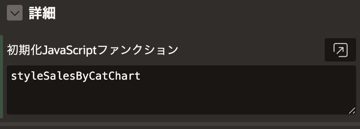

    関数の末尾に括弧がないことに注意してください。これにより、関数の呼び出しではなく、ファイルで宣言された関数への参照になります。APEXは適切なタイミングで関数を呼び出します。
   
4. ページ・レベルの属性(レンダリング・タブの下のルート・ノード)を選択し、**JavaScript** セクションの **ファイルURL** 項目に次のファイル参照パスを入力します。  
    **#APP_IMAGES#sample-db-app.js**

    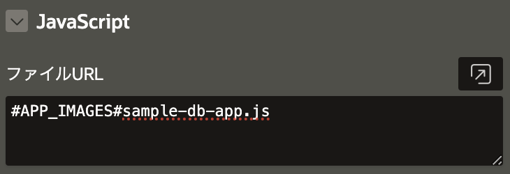
   
5. 変更を保存し、ページを実行します。チャートは以前と同様に緑色のグラデーションでスタイル設定されるはずですが、今回はJavaScriptは静的ファイルで定義されているだけです。関数が十分に汎用的であれば、アプリケーションの他の場所でも使用できます。
   
6. ページ1のページ・デザイナーに移動し、右側にあるプロパティ・エディターを下にスクロールします。**ファンクションおよびグローバル変数の宣言** フィールドの値をクリアし、**JavaScript** セクションの **ファイルURL** 項目に次のファイル参照パスを入力します。  **#APP_IMAGES#sample-db-app.js**

    

7. 変更を保存し、ページを実行します。以前と同じ `doWork` 関数からのメッセージが表示されるはずですが、今回の関数が静的ファイルで定義されています。

## **まとめ**

これでラボ2が完了しました。この時点で、APEXアプリケーションにJavaScriptを追加するために利用できるオプションについて確かな理解が得られたはずです。次にラボ3に進んでください。


## **謝辞**
 - **著者** -  Dan McGhan, Database Product Management
 - **寄稿者** - Arabella Yao, Jeffrey Malcolm Jr, Robert Ruppel, LiveLabs QA
 - **最終更新者/日付** - Arabella Yao, Product Manager Intern, Database Management, July 2020

