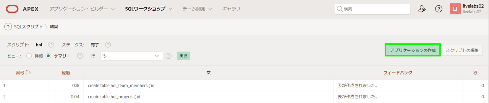
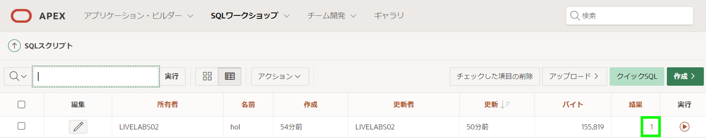
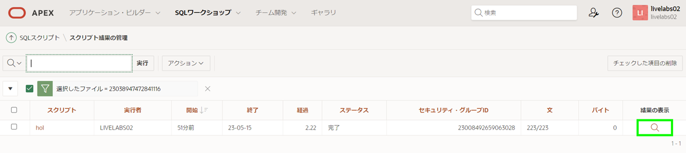
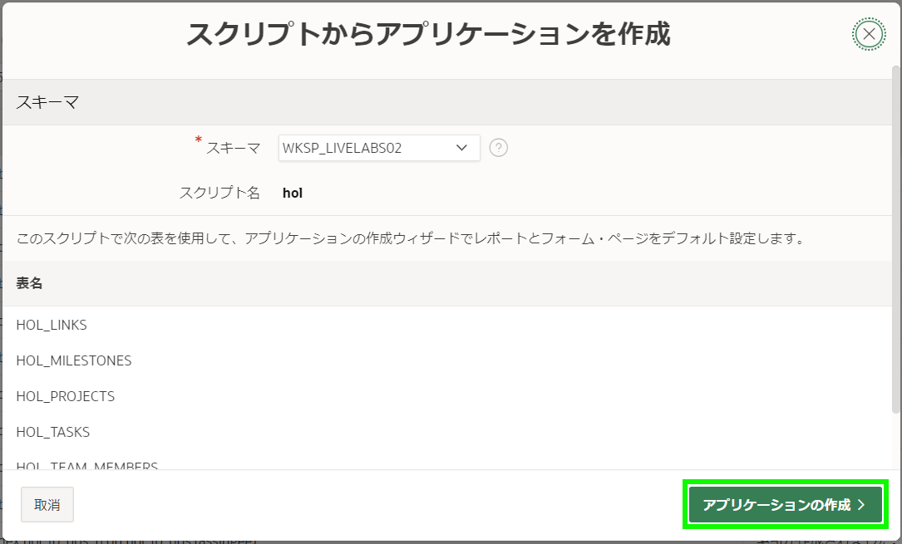
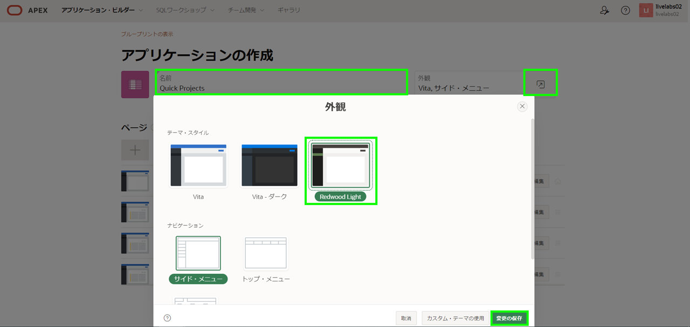
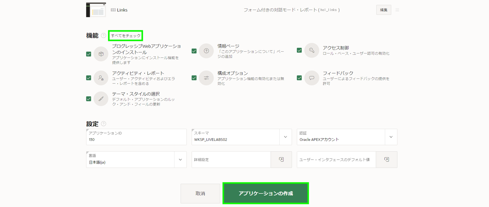
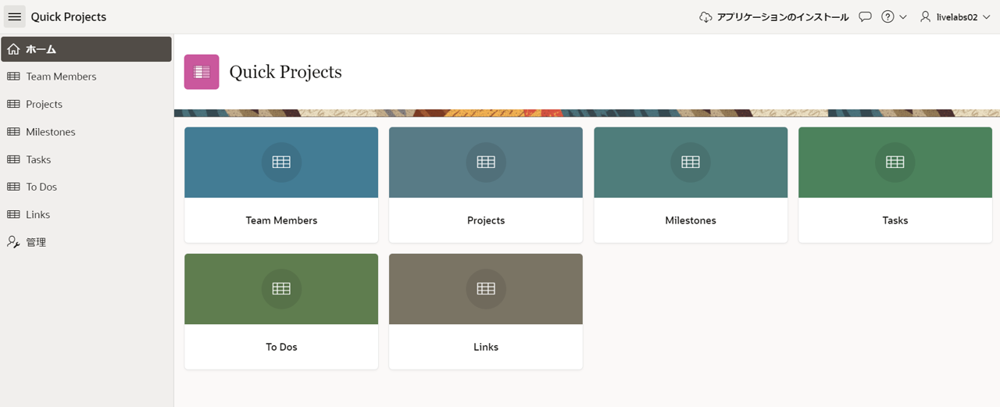
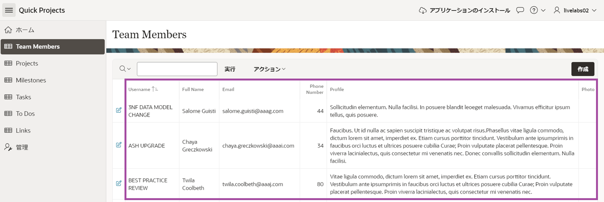

# アプリケーション作成ウィザードを使用してアプリケーションの作成

## 紹介

このラボでは、前のラボで作成したデータ構造を使用して対話型アプリケーションを構築します。

### 目的
- 前のLabで使用したテーブルとデータを使用して対話型アプリケーションを作成する

### 必要なもの

- Oracle Cloudの有料アカウント、LiveLabsアカウント、または無料トライアル。 
- サンプルデータを含むデータ構造

## タスク1:アプリ作成ウィザードを実行する

1. SQLスクリプト > 結果から、**アプリケーションの作成**をクリックします。

    

    *注:* "アプリケーションの作成"ボタンが表示されない場合は、次の手順を実行します:
    - *結果列内で、たった今実行したスクリプトの"1"をクリックします。*

      

    - *結果の表示の下にある拡大鏡アイコンをクリックします。*

    

    *上記に示した結果ページが再度表示されるはずです。*

2. スクリプトからアプリケーションを作成ダイアログで、アプリケーションの作成をクリックします。

      

3. アプリケーションの作成ページで、名前に**Quick Projects**と入力します。
   **外観**をクリックします。    
   テーマ・スタイルで**Redwood Light**を選択します。     
   **変更の保存**をクリックします。

   

4. 機能の**「すべでをチェック」**をクリックします。   
   アプリケーションの作成をクリックします。

   

## タスク2:アプリケーションを実行する

1. 新規アプリケーションがページ・デザイナーに表示されます。

   **アプリケーションの実行**をクリックします。

   

2. ランタイム環境では、ログインページが表示されます。

   **ユーザー名**と**パスワード**を入力します。   
   **サインイン**をクリックします。

   新規アプリケーションが表示されます。

     

3. アプリケーションを試してみましょう。すべてのレコードが表示されるので、データの確認が非常に容易になります。データの更新も簡単にできます。

     

## **まとめ**  
今では、SQLスクリプトから直接アプリケーション作成ウィザードを使用してアプリケーションの最初の切り取りを作成する方法を知っています。

## **謝辞**

  - **著者** - Salim Hlayel, Principle Product Manager
  - **寄稿者** - Oracle LiveLabs Team (Robbie Ruppel, Functional Lead; Marilyn Isabella Kessinger, QA Intern; Arabella Yao, Product Manager Intern)
  - **最終更新者/日付** - Anoosha Pilli, Product Manager, DB Product Management, June 2020
