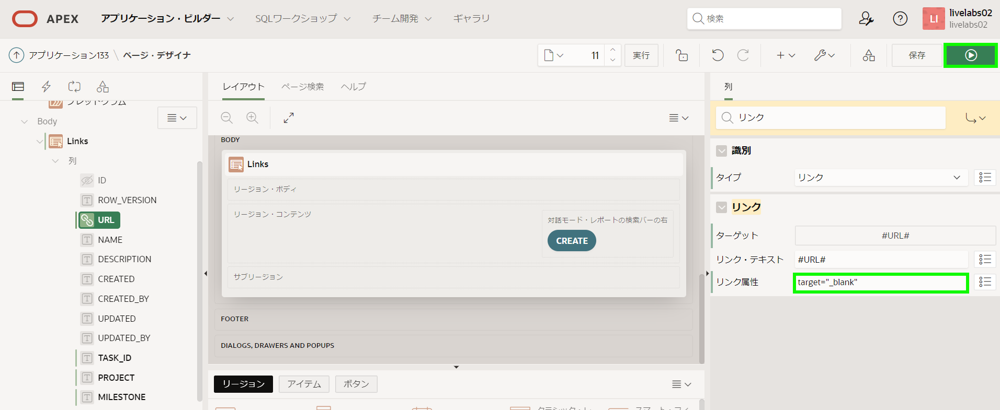
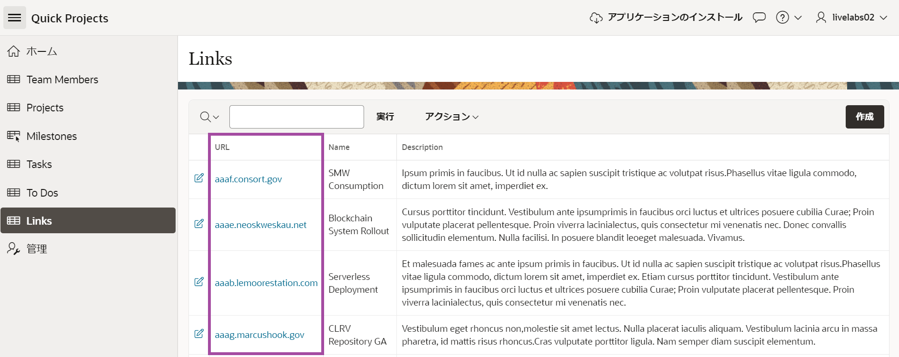
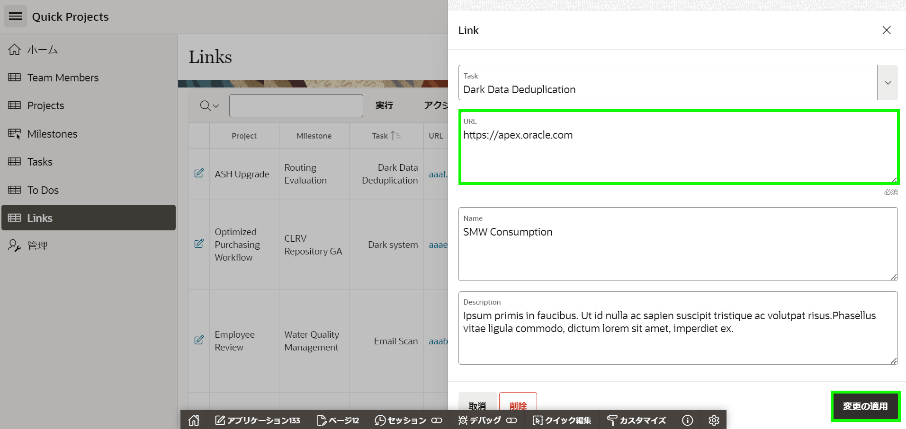

# リンクの改善

## 紹介

このラボでは、URLを変更して、コンテンツを新しいウィンドウに表示できるようにする方法を学習します。

推定時間：5分

### 目的

- プロジェクトのLOVを改善する
- アプリケーションのリンクセクションを更新します

### 必要なものは?

- Oracle Cloudの有料アカウント、LiveLabsアカウント、またはフリートライアル。  
- APEXワークスペースとアプリケーション

## タスク1:レポートに列を追加する  

To Dosレポートを変更した方法と同様の方法で、Linksレポートを更新してプロジェクトとマイルストーンの列を含める必要があります。

1. ランタイムアプリケーションから、Linksレポートページに移動し、ページ・デザイナーに移動します。

    開発者ツールバーの**ページ11**をクリックして、編集画面を開きます。
    

    ページ・デザイナーで**ページ11: Links**がロードされているはずです。


2. Links用に定義されたクエリを更新する必要があります。

    ページ・デザイナー内で、レンダリング・ツリー (左パネル)の**Links**をクリックします。

    プロパティ・エディター(右パネル)で、ソース > タイプに**SQL問合せ**を選択します。
    *{注:SQLクエリが入力されます。SQLステートメントはHOL_LINKSテーブルのすべての列を選択します。}*

    ソース > SQL問合せに次の内容を入力します:

    ```
    <copy>
    select ID,
       (select p.name
        from hol_projects p, hol_tasks t
        where p.id = t.project_id
        and t.id = l.task_id
       ) project,
       (select m.name
        from hol_milestones m, hol_tasks t
        where m.id = t.milestone_id
        and   t.id = l.task_id
       ) milestone,
       TASK_ID,
       ROW_VERSION,
       URL,
       NAME,
       DESCRIPTION,
       CREATED,
       CREATED_BY,
       UPDATED,
       UPDATED_BY
  from HOL_LINKS l
  </copy>
    ```
    
  

      
3. レンダリング・タブ(左パネル)でLinksレポート下にある列を展開して、TASK_IDを選択します。プロパティ・エディター(右パネル)に次の内容を入力します。
    - 識別 > タイプ  - **プレーン・テキスト(LOVに基づく)**を選択します。
    - LOV > LOV  - **HOL\_TASKS.NAME**を選択します。
    - ヘッダー > ヘッダー - **Task**と入力します。

      


4. レポート内のURL列を更新する必要があります。

    列のリストで、**URL**をクリックします。
    プロパティ・エディター(右パネル)に次の内容を入力します。
    - 識別 > タイプ  - **リンク**を選択します。
    - リンク > ターゲット - **リンクが定義されていません**をクリックし、次の内容を入力します。  
        - ターゲット > タイプ - **URL**を選択します。
        - ターゲット > URL - **#URL#**と入力します。   
        *{注:これにより、URL列の値にリンクされます。}*    

     **OK**をクリックします。 

    

    - Link > Link Attributes - **target="_blank"**と入力します。
    *{注:ヘルプ(中央パネル)をクリックして例を確認してください。}*

      


5. ページをレビューする時間です。

    ページ・デザイナーツールバーの**保存して実行**をクリックします。  

    

    *{注:URL列はリンクになっています。リンクの1つをクリックすると新しいページが開きますが、URLにはハイパーテキスト転送プロトコル(httpやhttps)が欠落していて、値は架空のサイトアドレスです。}*

6. 新しいプロジェクトとマイルストーンの列はレポートに配置されていませんので、それらの列を非表示から表示に変更します。 

    ランタイム環境で、Linksレポートメニューの**アクション**をクリックします。     
    ドロップダウンから**列**を選択します。

      

7. 列の選択ダイアログで、右矢印「>」を利用して以下の列を「表示しない」エリアから「レポートに表示」エリアに移動します。
    - Project
    - Milestone
    - Task
  
    次に「レポートに表示」エリアにある列を選択して、上矢印と下矢印を使用して列の表示順番を以下のように調整します。
    - Project
    - Milestone
    - Task
    - URL   
    - Name
    - Description

    **適用**をクリックします。

       

8. 改訂されたレポートレイアウトを保存する必要があります。他のユーザーが新しく改善された列の配置を見ることができます。

    ランタイム環境で、Linksレポートメニューの**アクション**をクリックします。      
    ドロップダウンから**レポート**を選択し、**レポートの保存**をクリックします。

      

9. レポートの保存ダイアログで、保存(開発者にのみ表示)の**デフォルトのレポート設定として保存**を選択します。

      

10. デフォルト・レポートの保存ダイアログで、**適用**をクリックします。      

      

    *{注:レポートを主として保存する必要があります。ユーザーがページに移動すると、現在の表示がエンドユーザーに表示されます。}*

## タスク2:フォームページを更新する
レポートの編集アイコンをクリックして、Linksフォームページを開きます。Taskアイテムにプロジェクトとマイルストーンが表示されないことがわかります。以前のラボでタスクのLOVを更新して追加の表示列を含めました。したがって、ここで行う必要があるのは、タスクアイテムをポップアップLOVに更新することだけです。

1. ランタイム環境で、開発者ツールバーの**ページ12**をクリックします。
  

2. ページ・デザイナー内で、レンダリング・ツリー (左パネル)の**P12\_TASK\_ID**をクリックします。
    プロパティ・エディター(右パネル)で、識別 > タイプの**ポップアップLOV**を選択します。

    ページ・デザイナーツールバーの**保存**をクリックします。

       


3. 完成したフォームページをレビューする時間です。     

    ランタイム環境タブまたはブラウザに移動します。
    **Links**に移動し、ページをリフレッシュします。
    Linkの編集アイコンをクリックします。

    Taskの下向き矢印をクリックしてタスクのポップアップLOVを表示します。     
    検索条件を入力して[Enter]キーを押します。

    

    URLに**https://apex.oracle.com**と入力します。     
    **変更の適用**をクリックします。
    
    
         

    Linksレポートページで、更新したレコードのURLをクリックします。
    新しいブラウザタブまたはウィンドウでメインのAPEXサイトが開くはずです。

## **まとめ**

これで、URL値を別のブラウザタブまたはウィンドウへのリンクに変更する方法を知っています。

## さらに詳しく - *役立つリンク*

- [Autonomous Database上のAPEX](https://apex.oracle.com/autonomous)
- [APEXコラテラル](https://apex.oracle.com)
- [チュートリアル](https://apex.oracle.com/en/learn/tutorials)
- [コミュニティ](https://apex.oracle.com/community)
- [外部サイト + Slack](http://apex.world)

## **謝辞**

  - **著者** - Salim Hlayel, Principle Product Manager
  - **寄稿者** - LiveLabs QA Team (Arabella Yao, Product Manager Intern | Dylan McLeod, QA Intern)
  - **最終更新者/日付** - Salim Hlayel, Principle Product Manager, November 2020
