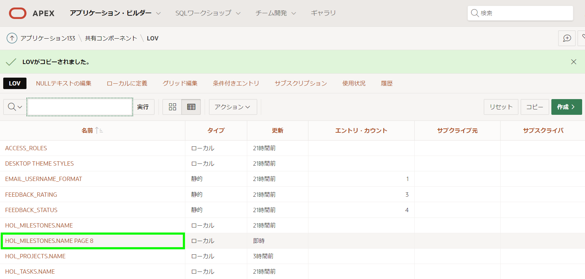

# タスクの改善

## 紹介

このラボでは、LOVを改善する方法を学びます。

推定時間: 15分  

### 目的
- プロジェクトのLOVを改善する
- タスクフォームページを更新する

### 必要なもの 
- Oracle Cloudの有料アカウント、LiveLabsアカウント、または無料トライアル 
- APEXアプリケーション 

## タスク1:プロジェクトのLOVを改善する  

ランタイム環境でタスクに移動し、任意のレコードの編集アイコンをクリックしてタスクフォームページを開きます。プロジェクトの選択リストをクリックして、プロジェクトレコードがどのように表示されるかを確認します。

  

プロジェクトの名前の表示ではなく、プロジェクトに関連する他の情報も見えるように変更します。

1. ランタイムアプリケーションから、ページ・デザイナーのタスクフォームページに移動します。  

    APEXアプリケーション・ビルダーからこのアプリを実行した場合は、画面の下部に開発者ツールバーが表示されます。*{注:アプリに直接ログインするエンドユーザーはこのツールバーを表示しません。}*

    開発者ツールバーの**ページ8**をクリックして、ページ8の編集画面を開きます。

        

     または、適切なブラウザータブやウィンドウを選択することにより、手動でブラウザのAPEXアプリケーション・ビルダータブに戻ることもできます。   
     アプリケーション・ビルダーに入ると、**8 - Task**をクリックします。

      

    ページ・デザイナーで**ページ8: Task**がロードされた状態になっているはずです。  


2. プロジェクトに現在使用されているLOVを確認する必要があります。  

    ページ・デザイナー内で、レンダリング・ツリー (左パネル)の**P8\_PROJECT_ID**をクリックします。  

    プロパティ・エディター(右パネル)で、フィルターに**LOV**と入力します。      
    *{注:長いリストをスクロールダウンして探す代わりに、フィルターを入力すると特定の属性を見つけやすくなります。}*  

    プロパティ・エディター(右パネル)で、**LOV**の矢印をクリックします。

      

    *{注:LOV > タイプは_共有コンポーネント_なので、適切な共有コンポーネントを編集する必要があります。}*   

3. 左パネルが共有コンポーネントタブに変わり、適切なLOVがハイライトされます。  

    プロパティ・エディター(右パネル)で、**コンポーネントの編集**をクリックします。

     

4. 追加表示列を追加します。

    LOV: HOL_PROJECTS.NAMEページで、**列の選択**をクリックします。     

    追加表示列の選択ダイアログで、次の列をダブルクリックします:  
    -   STATUS  
    -   COMPLETED_DATE  
    -   DESCRIPTION  

    **更新**をクリックします。  

    

    **変更の適用**をクリックします。     
     *{注:ページ・デザイナーにPage 8が選択された状態で戻されます。}*

5. 追加の表示値を表示するには、選択リストの代わりに、ポップアップLOVにする必要があります。

    ページ・デザイナー内で、Layout(中央パネル)の**P8\_PROJECT_ID**をクリックします。  

    プロパティ・エディター(右パネル)で、識別 > タイプの**ポップアップLOV**を選択します。  

    ページ・デザイナーツールバーで、**保存**をクリックします

    

    *{注: _保存_の代わりに_保存して実行_ をクリックすると、ページは保存されますが、このページはモーダルページなのでページ・デザイナーから直接実行できないため、警告が表示されます。}*

    

6. 改善されたプロジェクトアイテムを確認する時間です!

    ランタイム環境タブまたはブラウザに移動します。     
    **Tasks**に移動し、ページを更新します。     
    タスクの編集アイコンをクリックし、**Project**の下矢印をクリックして新しいポップアップLOVを確認します。

    

    *{注:ポップアップLOVに表示される列のサイズと列の並び替えが可能です。}*

## タスク2:カスケーディングLOVの定義
マイルストーンの選択リストを確認すると、すべてのマイルストーンがリストされています。リストされた値は、選択されたプロジェクトに関連付けられたものにのみ制限される必要があります。これを行うには、マイルストーン(**P8\_MILESTONE\_ID**)を_カスケードLOV_として定義する必要があります。これには、マイルストーンLOV内の親アイテム(**P8\_PROJECT\_ID**)を指定し、親アイテムの値でマイルストーンを制限するLOVステートメントを作成する必要があります。  

1. 開発環境に戻ります。  
2. ページ・デザイナー内で、Page 8が選択されている状態で、ページ・デザイナーツールバーの**共有コンポーネント**をクリックします。 

    

    または、アプリケーションのホームページから**共有コンポーネント**をクリックします。

    

3. 共有コンポーネントから、他のコンポーネントの下にある**LOV**をクリックします。

      

4. LOVページから**コピー**をクリックします。

    LOVのコピーダイアログで次の内容を入力します:
    - LOVのコピー - **HOL_MILESTONES.NAME - 動的**を選択 
    - 新規LOV名 - **HOL_MILESTONES.NAME PAGE 8**と入力  

    **コピー**をクリックします。  

      

5. 新しいLOVをカスタマイズする必要があります。  

    LOVのレポートで、**HOL_MILESTONES.NAME PAGE 8**をクリックします。   

      

6. LOV編集ページで、Where句に次の内容を入力します:

    ```
    <copy> project_id = :P8_PROJECT_ID
    </copy>
    ```   
      

    *{注:これにより、プロジェクトアイテム_P8\_PROJECT\_ID_で現在選択されている値に基づいて返されるマイルストーンが制限されます。}*

    **変更の適用**をクリックします。

    

## タスク3:タスクフォームページの更新 

1. 新しいLOVをPage 8のアイテムにバインドする必要があります。

    LOVページから、ツールバーの**ページ8**をクリックして、編集画面を開きます。 

      

2. ページ・デザイナーで、左パネルの**レンダリング**アイコンをクリックします。  
    レンダリング・ツリー (左パネル)で、**P8\_MILESTONE_ID**をクリックします。

    プロパティ・エディター(右パネル)で、次の内容を入力します:
    - LOV - **HOL_MILESTONES.NAME PAGE 8**を選択
    - 親アイテム - **P8\_PROJECT_ID**を選択
    *{注:親アイテムを指定することは極めて重要です。そうしないと、選択されたプロジェクトの値が設定されず、マイルストーンLOV は値を返しません。}*  

    **保存**をクリックします。

    

3. Milestoneアイテムをテストする時間です。 

    ランタイム環境タブまたはブラウザに移動します。
    **Tasks**に移動し、ページを更新します。
    タスクの編集アイコンをクリックし、プロジェクトの値を変更して、マイルストーンの値の変化を確認します。

      

    *{注:Milestoneアイテムには定期的に名前の代わりに番号がリストされます。これは、サンプルデータが作成されたときにプロジェクトとマイルストーンがランダムに選択されたためです。サンプルデータジェネレータは、関連するテーブルが同じテーブル内の2番目の外部キーカラムの子テーブルでもあるかどうかを判断するために各外部キー関係を確認しません。}*

    *このサンプルデータの問題を修正するには、利用可能なリストから名前の1つを選択するだけで済みます。これらは選択したプロジェクトに関連付けられたマイルストーンを表します。}*  

4. プロジェクトが選択されていない場合に何が起こるかを最も簡単に確認する方法は、新しいタスクを作成することです。  

    ランタイム環境で、モーダルページを閉じてタスクレポートページに戻ります。  
    タスクレポートページで、**作成**をクリックします。     
    プロジェクトを選択しないでください。代わりに、**Milestone**のセレクターをクリックします。

      

    *{注:プロジェクトが選択されていないため、マイルストーンはリストされません。}*

## **まとめ**

さまざまな種類のLOVを使用して、追加の列を表示する方法、およびカスケードLOVを定義する方法を知っています。


## **謝辞**

  - **著者** - Salim Hlayel, Principle Product Manager
  - **寄稿者** - LiveLabs QA Team (Arabella Yao, Product Manager Intern | Dylan McLeod, QA Intern)
  - **最終更新者/日付** - Salim Hlayel, Principle Product Manager, November 2020
