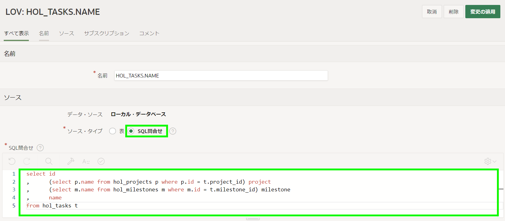

# To Dosの改善

## 紹介

このラボでは、レポートに列を追加します。そして、LOVを改善する方法を学びます。

推定時間：10分

### 目的
- プロジェクトのLOVを改善する  
- アプリケーションのTo Dosセクションを更新する  

### 必要なもの

* Oracle Cloudの有料アカウント、LiveLabsアカウントまたは無料トライアル  
* APEXワークスペースとアプリケーション  

## タスク1:レポートに列を追加する  

ランタイム環境でTo Dosに移動すると、レポートにはタスクが含まれていますが、関連するプロジェクトとマイルストーンは含まれていないことに気付きます。レポートでこれらの値を取得するには、プロジェクトとマイルストーンテーブルに関連付けられたSQLを利用する必要があります。これは内部SELECTまたは複数のテーブルを結合することで実行できます。シンプルにするために、内部SELECTステートメントを実装します。


1. ランタイムアプリケーションから、To Dosレポートページに移動し、ページ・デザイナーに移動します。

    開発者ツールバーの**ページ9**をクリックして、編集画面を開きます。

    

    ページ・デザイナーに**ページ9: To Dos**がロードされているはずです。


2. To Dos用に定義されたクエリを更新する必要があります。

    ページ・デザイナー内で、レンダリング・ツリー (左パネル)の**To Dos**をクリックします。

    プロパティ・エディター(右パネル)で、ソース > タイプに**SQL問合せ**を選択します。   
    *{注:SQLクエリが入力されます。SQLステートメントはHOL\_TO\_DOSテーブルのすべての列を選択します。}* 

    ソース > SQL問合せの**コード・エディター**アイコンをクリックします。
    コード・エディターで、次の内容を入力します:

    ```
    <copy>select ID,
         (select p.name
          from hol_projects p, hol_tasks t
          where p.id = t.project_id
          and t.id = td.task_id
         ) project,
         (select m.name
          from hol_milestones m, hol_tasks t
          where m.id = t.milestone_id
          and   t.id = td.task_id
         ) milestone,
         TASK_ID,
         ROW_VERSION,
         TODO,
         ASSINGEE,
         DUE_DATE,
         DETAILS,
         CREATED,
         CREATED_BY,
         UPDATED,
         UPDATED_BY
    from HOL_TO_DOS td</copy>
    ```

    コード・エディターツールバーの**検証**をクリックします。
    **OK**をクリックします。

    

    *{注:2つの内部選択ステートメントは、プロジェクト/マイルストーンテーブルをタスクテーブルに、タスクテーブルをtodosテーブルに接続します。}*   
3. レンダリング・タブ(左パネル)でTo Dosレポート下にある列を展開して、TASK_IDを選択します。プロパティ・エディター(右パネル)に次の内容を入力します。
    - 識別 > タイプ  - **プレーン・テキスト(LOVに基づく)**を選択します。
    - LOV > LOV  - **HOL\_TASKS.NAME**を選択します。
    - ヘッダー > ヘッダー - **Task**と入力します。

    

4. レンダリング・タブ(左パネル)でTo Dosレポート下にASSINGEE列を選択します。プロパティ・エディター(右パネル)に次の内容を入力します。
    - 識別 > タイプ  - **プレーン・テキスト(LOVに基づく)**を選択します。
    - LOV > LOV  - **HOL\_TEAM\_MEMBERS.USERNAME**を選択します。

    

    **保存して実行**をクリックします。

5. アプリケーションを実行して、列が正しく表示されることを確認します。

       

6. 新しいプロジェクトとマイルストーンの列はレポートに配置されていませんので、それらの列を非表示から表示に変更します。   

    ランタイム環境で、To Dosレポートメニューの**アクション**をクリックします。     
    ドロップダウンから**列**を選択します。

     
7. 列の選択ダイアログで、右矢印「>」を利用して以下の列を「表示しない」エリアから「レポートに表示」エリアに移動します。
    - Project
    - Milestone
    - Task
    - Assingee   
  
    次に「レポートに表示」エリアにある列を選択して、上矢印と下矢印を使用して列の表示順番を以下の順番に調整します。
    - Project
    - Milestone
    - Task
    - Todo
    - Assingee   
    - Due Date
    - Details

    **適用**をクリックします。

       

8. 改訂されたレポートレイアウトを保存する必要があります。他のユーザーが新しく改善された列の配置を見ることができます。

    ランタイム環境で、To Dosレポートメニューの**アクション**をクリックします。      
    ドロップダウンから**レポート**を選択し、**レポートの保存**をクリックします。

      

9.  レポートの保存ダイアログで、保存(開発者のみ表示)の**デフォルトのレポート設定として保存**を選択します。

      

10.  デフォルト・レポートの保存ダイアログで、**適用**をクリックします。      

      

    *{注:レポートを主として保存する必要があります。ユーザーがページに移動すると、現在の表示がエンドユーザーに表示されます。}*

## タスク2:タスクのLOVを更新する
レポートの編集アイコンをクリックして、To Dosフォームページを開きます。フォームページにプロジェクトとマイルストーンがないことを確認します。
データ入力を簡素化するために、タスクの選択リストをポップアップLOVに変更し、プロジェクトとマイルストーンの情報も表示するように修正します。 

同じLOVはLinksフォームページでも使用されているため、そこでも再利用できます。

1. ランタイム環境で、開発者ツールバーの**アプリケーションxxxxx**をクリックします。   

2. アプリケーションホームページから、**共有コンポーネント**をクリックします。

      

3. 共有コンポーネントから、他のコンポーネントの下の**LOV**をクリックします。   

4. LOVページから、**HOL\_TASKS.NAME**をクリックします。   

5. LOVページで、次の内容を入力します。  
    - ソース > ソース・タイプ -  **SQL問合せ**をクリックします。
    - ソース > SQL問合せ - 次の内容を入力します。   

        ```
        <copy>
        select id
        ,      (select p.name from hol_projects p where p.id = t.project_id) project
        ,      (select m.name from hol_milestones m where m.id = t.milestone_id) milestone
        ,      name
        from hol_tasks t
        </copy>
        ```
        

    - 列のマッピング > 戻り値 - **ID**を選択します。  
    - 列のマッピング > 表示 - **NAME**を選択します。 
    - 列のマッピング > デフォルトのソート - **NAME**を選択します。

    

    追加の列を表示するには、**列の選択**をクリックします。

    追加表示列の選択で、次のアクションを実行します。      
    - **PROJECT (Varchar2)** を右パネルに移動             
    - **MILESTONE (Varchar2)** を右パネルに移動    
    - **NAME (Varchar2)** を右パネルのMilestoneの下に移動      
    *{注:ID列はリストに含める必要がありますが、Visible = Noとしてマークされるため表示されません。}*

    **更新**をクリックします。

    

    LOVツールバーの**変更の適用**をクリックします。

6. To Doフォームページでは、タスクのアイテムタイプを更新する必要があります。    

    共有コンポーネントから、パンくず内の**アプリケーションxxxxx**をクリックします。  
    アプリケーションホームページから、ページのリストで**10 - To Dos**をクリックします。  

       

7. ページ・デザイナー内で、レンダリング・ツリー (左パネル)の**P10\_TASK\_ID**をクリックします。
    プロパティ・エディター(右パネル)で、識別 > タイプの**ポップアップLOV**を選択します。

       

8. ページ・デザイナーツールバーの**保存**をクリックします。   

9. 完成したフォームページをレビューする時間です。   

    ランタイム環境タブまたはブラウザに移動します。
    **To Dos**に移動し、ページをリフレッシュします。
    To Doの編集アイコンをクリックします。

    Taskの下向き矢印をクリックしてタスクのポップアップLOVを表示します。  
    検索条件を入力して[Enter]キーを押します。

     

## **まとめ**

これで、関連する詳細を表示するためにレポートと値クエリのリストを強化する方法を知っています。


## **謝辞**

  - **著者** - Salim Hlayel, Principle Product Manager
  - **寄稿者** - LiveLabs QA Team (Arabella Yao, Product Manager Intern | Dylan McLeod, QA Intern)
  - **最終更新者/日付** - Salim Hlayel, Principle Product Manager, November 2020
