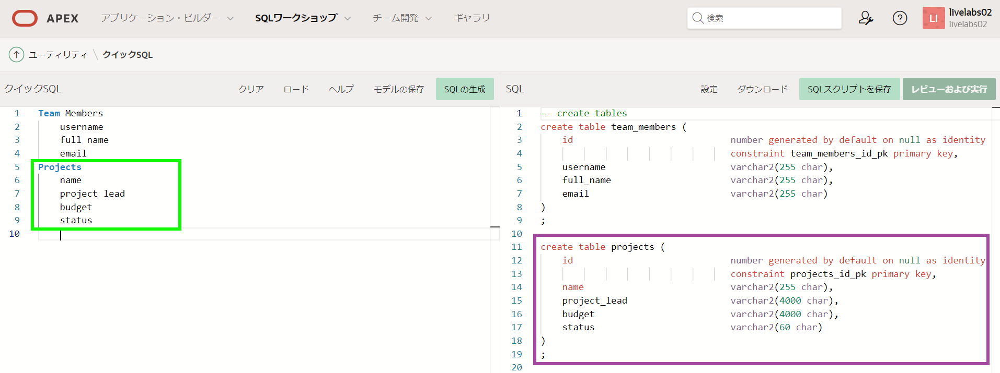
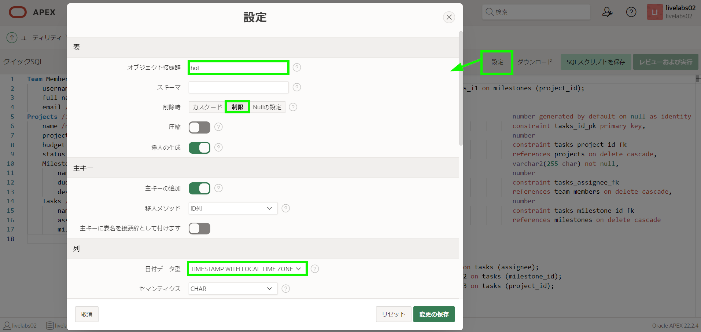
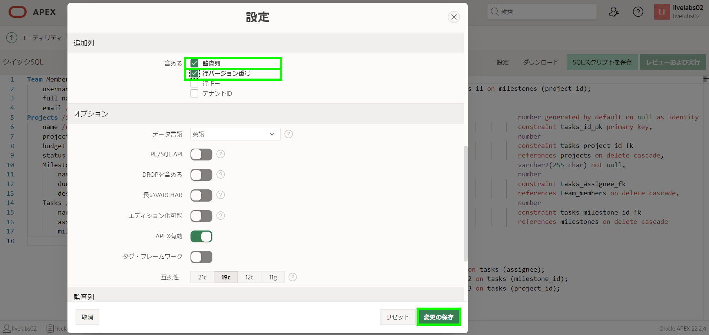
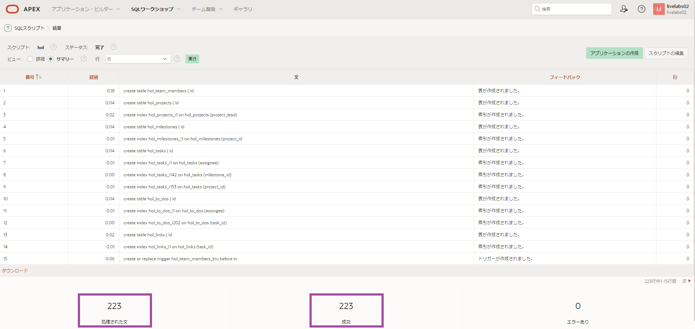

# クイックSQLを使用した新しいデータ構造の定義

## はじめに

データベースオブジェクトを作成および管理するSQLを覚えるのは難しいです。ただし、ショートカット構文やグラフィカルユーザーインターフェイスに基づいてコードを生成するツールがあります。このラボでは、クイックSQLでデータ構造を定義することによってテーブルとビューを作成する方法を説明します。  

推定時間: 15分  

### 問題定義
ほとんどの組織では、スプレッドシートの使用が膨大です。スプレッドシートは単純なデータレビューと個人データの追跡を行うのに優れていますが、たとえばチームメンバー間でデータを収集するのには非常に適していません。  

非常に一般的な使用事例は、マネージャーがチームが取り組んでいるさまざまなプロジェクトを追跡する必要があるということです。マネージャーは重要なデータ要素を持つスプレッドシートを作成しました。ただし、チームが成長するにつれて、スプレッドシートの更新を管理するのが難しくなり、単一の真実の情報源を得るのはほぼ不可能になっています。

以下は、マネージャーがチームに送信しているスプレッドシートの抜粋です:


### ナプキンデザイン-プロジェクトの改善されたデータモデル
スプレッドシートに基づいて単一のプロジェクトタスクテーブルだけを作成する代わりに、関係性をより適切にモデル化し、価値のある追加情報を収集するためのデータ構造のコレクションを定義できます。

以下はプロジェクト情報を収集するためのナプキンデザインです:

  

新しいモデルでは、プロジェクトにチームメンバーを割り当てることができるだけでなく、オプションとしてタスクとToDoにも割り当てることができることに注意してください。マイルストーンを持つプロジェクトの概念が導入されましたが、タスクがマイルストーンに関連付けられるのはオプションです。さらに、ToDoとリンクがタスクに追加されました。

### 目的  
- Oracle APEXワークスペースにテーブルを追加し、データを挿入する

### 必要なもの  
- Oracle Cloudの有料アカウント、LiveLabsアカウント、またはフリートライアル。
- APEXワークスペース

## タスク1: クイックSQLを開く
1. ワークスペースにログインします
2. **SQLワークショップ**をクリックします
3. **SQLスクリプト**をクリックします

      

4. **クイックSQL**をクリックします

      

## タスク2:テーブルのショートカットを入力する
クイックSQLは、インデントされたテキスト文書から関係データモデルを作成するために必要なSQLを生成する簡単な方法を提供します。このツールは、SQLテーブル、トリガー、インデックスなどを作成するために必要な時間と労力を削減するように設計されています。

*{注:テーブルの一部と各テーブルのいくつかの列のみを入力します。この演習はクイックSQLの概念を教えるためのものであり、タイピングの演習ではありません。後で完了したスクリプトが提供されます。}*  

1. 最初のテーブルといくつかの列を入力します。  

    クイックSQL(左パネル)にテーブル名を入力します。  
    <code>Team Members</code>  

    2つ以上のスペースをインデントして、複数の列名を入力します。  
    <code>username</code>    
    <code>full name</code>   
    <code>email</code>  

      

   *{注:各行を入力するにつれて、SQL(右パネル)は定義しているテーブルを作成するために必要なSQLで更新されます。出力が画像のように見えない場合は、usernameなどの列を正しくインデントしていることを確認してください。}*  

2. 2番目のテーブルといくつかの列を入力します。 

    クイックSQL(左パネル)の最初の列にテーブル名を入力します。  
    <code>Projects</code>  

    2つ以上のスペースをインデントして、列名を入力します。  
    <code>name</code>      
    <code>project lead</code>    
    <code>budget</code>  
    <code>status</code>

     

## タスク3:ショートカットを改善する
これまでに基本的なテーブルを定義しました。これから、生成されたSQLを改善するためにショートカットに追加できるディレクティブとデータ型を説明します。

1. **ヘルプ**をクリックします。  
    **表ディレクティブ**をクリックします。

      

2. **列ディレクティブ**をクリックします。

      

3. **データ型**をクリックします。

      

4. **ヘルプ**を閉じます。
5. クイックSQL(左パネル)で、Team Membersテーブルを以下のように更新します。  
    - テーブル:team members - **/insert 10**を追加*{これにより10件のサンプルレコードが挿入されます}* 
    - 列: username - **/nn /upper**を追加*{これにより列が大文字になり必須になります}*  
    - 列: email - **/nn**を追加  

    Projectsテーブルを以下のように更新します。  
    - テーブル:projects - **/insert 20**を追加*{これにより20件のサンプルレコードが挿入されます}*   
    - 列: name - **/nn**を追加    
    - 列: project lead - **/references team_members**を追加      
    *{これによりTeam Membersテーブルへの外部キー関係が追加されます}*  
    - 列: budget - **num**を追加*{これにより列が数値になります}*    
    - 列: status - **vc30 /nn /check ASSIGNED,IN_PROGRESS,COMPLETED**を追加    *{これにより必須列の長さが定義され、3つの指定値を使用してチェック制約が追加されます}*

    

    *{注:_username_の_/_upper_の実装をレビューするには、SQL(右パネル)内をスクロールダウンする必要があります。さらに下にスクロールすると、すべてのinsert文が表示されます。}*

## タスク4:子テーブルを入力する
テーブル名をインデントすることで、新しいテーブルを上にあるテーブルの子テーブルとして定義でき、SQLは2つのテーブル間に外部キー関係を生成します。

1. Projectsに関連する子テーブルを入力します。

    クイックSQL(左パネル)にテーブル名とディレクティブを入力します。  
    <code>Milestones /insert 30</code>
    *{Projectsテーブルの列と同じインデントを使用します}*

    2つ以上のスペースをインデントして、列名とディレクティブを入力します。  
    <code>name /nn</code>   
    <code>due_date /nn</code> *{アンダースコアを含めない場合、列は_due_ではなく_due\_date_と呼ばれます。}*   
    <code>description</code>    

    

    *{注:MilestonesテーブルのSQLにはproject_id列と親テーブルProjectsへの外部キー関係が含まれています。}*  

2. Projectsに関連する別の子テーブルを入力します。

    クイックSQL(左パネル)にテーブル名とディレクティブを入力します。  
    <code>Tasks /insert 100</code>
    *{インデントはMilestonesテーブルと同じであるべきです。これにより、この新しいテーブルはProjectsの親であり、上のテーブルの親ではないことが保証されます。}*

    2つ以上のスペースをインデントして、列名とディレクティブを入力します。  
    <code>name /nn</code>   
    <code>assignee /references team_members</code>   
    <code>milestone id /references milestones</code>   

    

## タスク5:設定を更新する
生成されたSQLをさらに改善するために数多くの設定を定義できます。

1. SQL(右パネル)のツールバーで**設定**をクリックします。

    設定ダイアログに以下を入力します。
    - オブジェクト接頭辞 - **hol**と入力します。
    - 削除時 - **制限**を選択します。
    - 日付データ型 - **TIMESTAMP WITH LOCAL TIME ZONE**を選択します。
    - 監査列 - **チェック**を入れます。  
    - 行バージョン番号 - **チェック**を入れます。  

    **変更の保存**をクリックします。

    
    

    生成されたSQLは大幅に変更されています。テーブル名が更新され、追加の列と更新されたトリガーがあります。  

    

## タスク6:完全な略記法をコピーする  

1. クイックSQL(左パネル)で、既存の略記法をすべて以下の内容に置き換えます。

    ```
    <copy>
    # settings = { prefix: "hol", ondelete: "restrict", pk: "identity" }
    # date: "timestamp with local time zone"
    # auditcols: true
    # rowVersion: true

    team_members /insert 10
      username /nn /upper
      full name
      email /nn
      phone_number
      profile
      photo file
    projects /insert 20
      name /nn
      project_lead /nn /references team_members
      budget num
      status vc30 /nn /check ASSIGNED, IN-PROGRESS, COMPLETED
      completed_date
      description
      milestones /insert 30
        name /nn
        due_date /nn
        description
      tasks /insert 100
        name /nn
        assignee /references team_members
        milestone_id /references milestones
        start_date /nn
        end_date
        cost num
        description
        is_complete_yn /check Y, N
        to dos /insert 20
          todo vc(255) /nn
          assingee /references team_members
          due_date
          details
        links /insert 10
          url vc(255) /nn /lower
          name
          description

    view project_tasks projects tasks
    </copy>
    ```
    
   **SQLの生成**をクリックします。

   

   *{注:完全な略記法は、必要なすべての設定を定義しています。また、多くのテーブルに追加の列を含み、追加のディレクティブとデータ型があります。ビューも定義されています。}*

## タスク7:スクリプトを実装する
この段階で、SQLステートメントのリストを作成しました。ただし、まずステートメントをスクリプトファイルとして保存し、その後スクリプトを実行する必要があります。これにより、データベースオブジェクトが作成され、データが挿入されます。

1. SQL(右パネル)のツールバーで**SQLスクリプトを保存**をクリックします。
2. スクリプトを保存ダイアログで、スクリプト名に**hol**と入力します。  
   **スクリプトを保存**をクリックします。

     

3. SQL(右パネル)のツールバーで**レビューおよび実行**をクリックします。
     

   スクリプトは**スクリプトエディター**内に表示されます。

   **実行**をクリックします。

     

4. スクリプトの実行ページで**即時実行**をクリックします。

     
5. スクリプト結果ページに処理されたステートメント、正常に完了したもの、エラーのあるものをリストした結果が表示されます。

   

   *{注:217個のステートメントが処理されていない場合は、クイックSQLに戻り、_SQLの生成_をクリックし、スクリプトを再保存してから再実行します。217個の正常完了していない場合は、結果内のフィードバックに表示されているエラーを確認してください。}*  

## **まとめ**  
今では、サンプルデータを含む複雑なデータ構造をクイックSQLを使用して構築する方法を知っています。

## **謝辞**

  - **著者** - Salim Hlayel, Principle Product Manager
  - **寄稿者** - LiveLabs QA Team (Arabella Yao, Product Manager Intern | Dylan McLeod, QA Intern)
  - **最終更新者/日付** - Salim Hlayel, Principle Product Manager, November 2020
