# アプリケーションの再生成

## 紹介

このラボでは、より良いアプリケーションを作成するためにアプリケーションを再生成します。  

Milestonesレポートとフォームをレビューすると、わずか4項目しかありません。次に、エンドユーザーと話をすると、特定のプロジェクトに対して一度に多くのマイルストーンを入力したいとよく言われます。

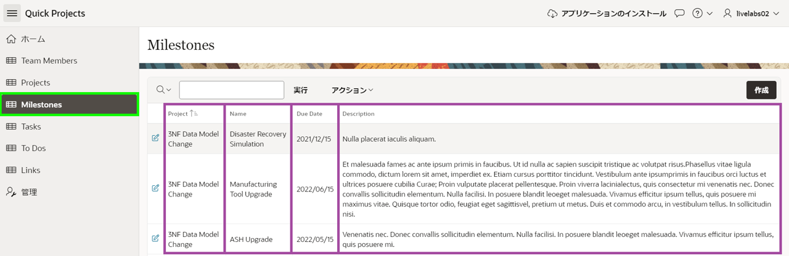

したがって、スプレッドシートのように複数のレコードをグリッド内で直接に保守できるように、現在のレポートとフォームを対話グリッドに置き換えます。

生成したばかりのアプリケーションで追加の開発が行われていないため、現在のアプリケーションを削除してから新規アプリケーションを再生成するのが最も迅速で簡単な方法です。  

*{注:アプリケーションで開発が行われていた場合、再生成すると変更が失われます。これを避けるには、ページ作成ウィザードを使用して新しい対話グリッドページを作成し、既存のレポートとフォームを削除した後、ナビゲーションリストを新しいページを指すように変更できます。}*  

推定所要時間:5分  

### 目的
- 開発者に優しい環境のためにアプリケーションを再生成する  
- アプリケーションのステップを更新する  

### 必要なもの  

- Oracle Cloudの有料アカウントまたは無料トライアル。30日間$300のクレジットを含むトライアルアカウントにサインアップするには、[こちら](http://oracle.com/cloud/free)をクリックしてください。  
- APEXアプリケーション

## タスク1:既存のアプリケーションを削除する
同じ名前の2つのアプリケーションがあることを避けるために、作成したばかりのアプリケーションを削除します。

1. アプリケーションのホームページに戻ります。  

   APEXアプリケーション・ビルダーからこのアプリを実行したため、画面下部に開発者ツールバーが表示されます。     
   *{注:アプリに直接ログインするエンドユーザーはこのツールバーは見えません。}*

   開発者ツールバーの**アプリケーションxxxxx**をクリックします。

   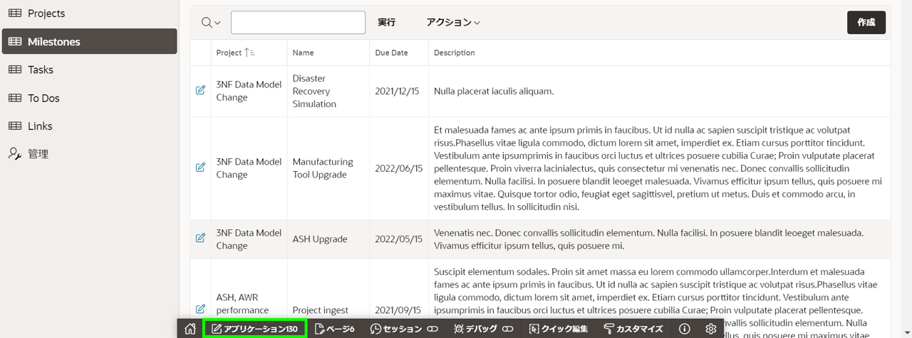  

   または、ブラウザのタブを選択してAPEXアプリケーション・ビルダータブに手動で戻ることもできます。

2. 開発環境から、アプリケーションのホームページで、右パネルのタスクの下にある**このアプリケーションの削除**をクリックします。

   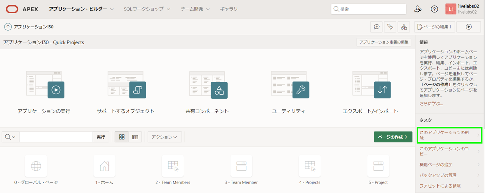  

3. 削除の確認ページで、**今すぐ完全に削除**をクリックします。

   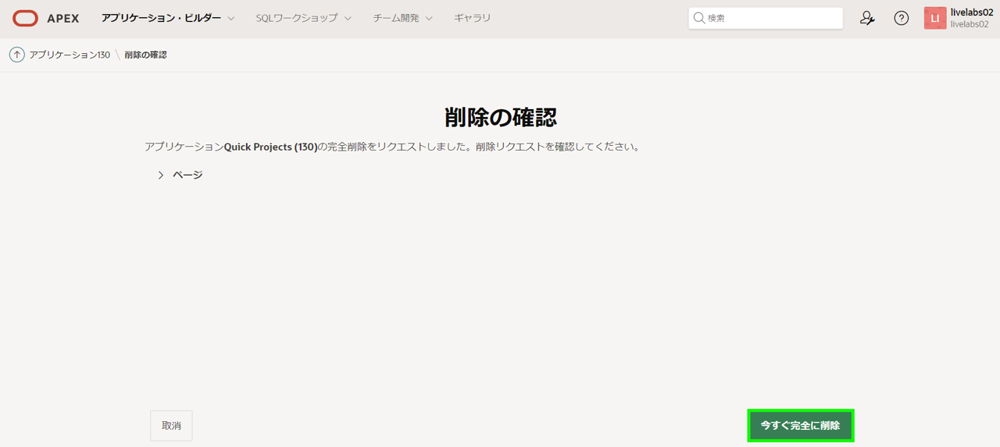  
 

## タスク2:ブループリントをロードする 
アプリケーション作成ウィザードを使用すると、開発者は以前に生成されたアプリケーション定義(_ブループリント_と呼ばれる)をロードできます。この機能を利用すると、前に生成されたアプリケーションのブループリントをロードし、マイルストーンページを変更してからアプリケーションを再生成できます。

1. アプリケーション・ビルダーのホームページから、**アプリケーション・ビルダー**メニューを開き、**作成**をクリックします。

   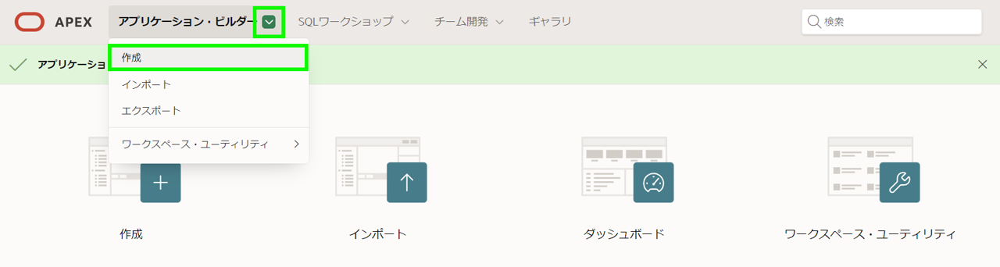  

2. アプリケーションの作成ページで、**新規アプリケーション**をクリックします。

   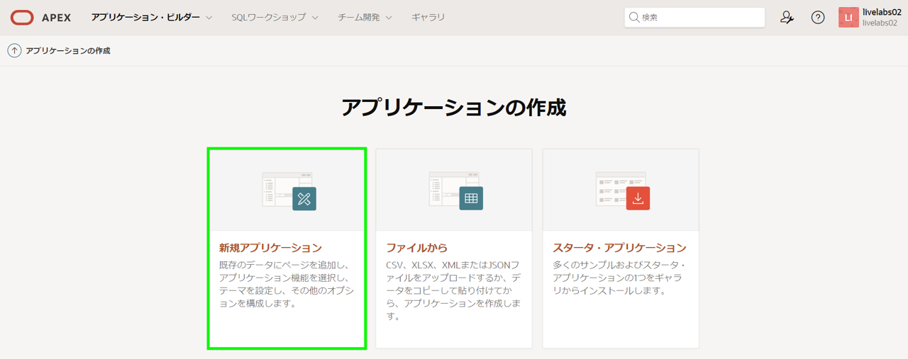

3. アプリケーション作成ウィザードで、**ブループリントのロード**をクリックします。

   Quick Projectsに対して、**ロード**をクリックします。

   

## タスク3:マイルストーンページを更新する
元のページを再ロードしたので、古いマイルストーンページを削除し、新しいページタイプでマイルストーンページを追加します。

1. アプリケーションの作成ページで、ページの下のMilestonesに対して**編集**をクリックします。

   レポート・ページの追加で、**削除**をクリックします。

   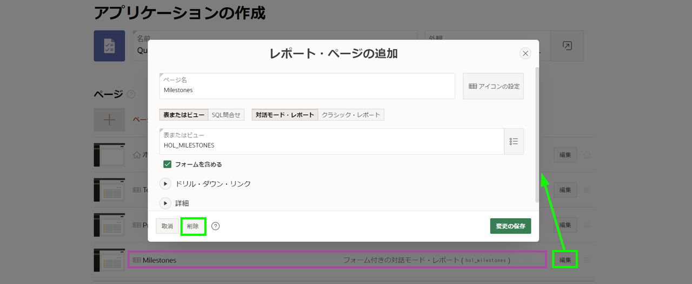

2. **ページの追加**をクリックします。  

   ページの追加ダイアログで、**対話グリッド**をクリックします。

   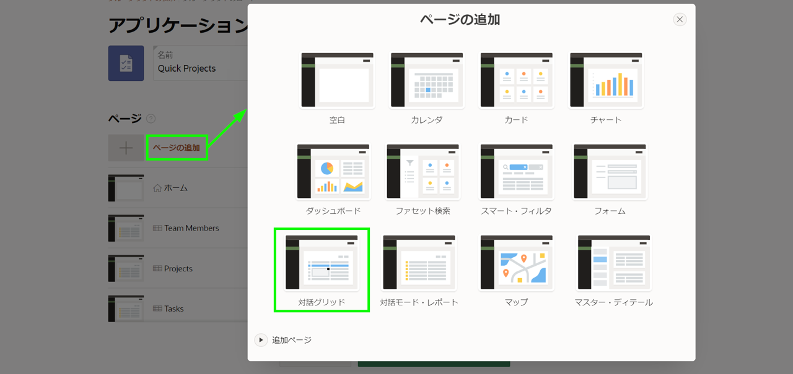  

3. 対話グリッド・ページの追加ダイアログで、次の内容を入力します。
   - ページ名 - Milestonesと入力します。  
   - 表またはビュー - HOL_MILESTONESを選択します。  

   **ページの追加**をクリックします。

   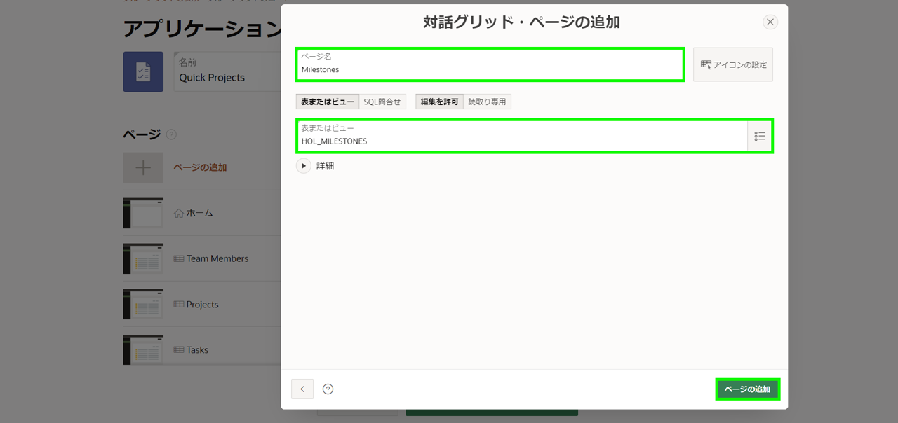  

4. **Milestones – 対話グリッド**の右のハンバーガーアイコンをクリックします。 その後、ページを上にドラッグしてProjectsページの下に移動し、ドロップします。

   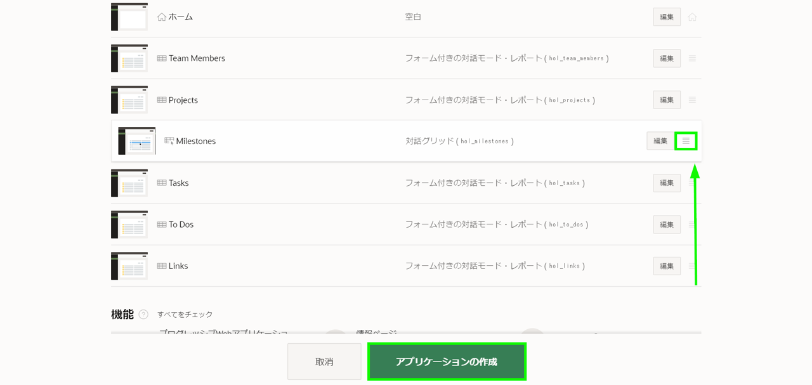  

5. アプリケーションの生成画面で、アプリケーションの作成をクリックします。  

## タスク4:新規アプリケーションを実行する

1. ページ・デザイナーで、**アプリケーションの実行**をクリックします。  

2. 新規アプリケーションでMilestonesに移動し、ページを確認します。  

   既存のレコードをダブルクリックするか、「行の追加」をクリックして新しいレコードを挿入できることを確認します。

   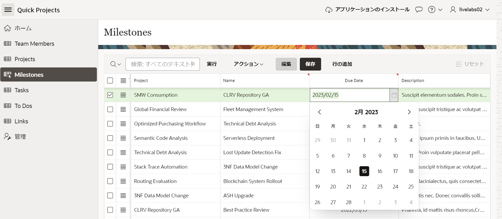  

   *{注:レコードを対話グリッド内から直接挿入、更新、削除できます。ウィザードはProjectsのリスト値を生成し、Due Dateはポップアップカレンダーを使用し、他の2つのフィールドではテキストエリアを使用してデータをページ上で直接維持します。}*   

## **まとめ**  
ブループリントを使用して以前のアプリケーション定義をアプリケーション作成ウィザードにロードする方法を知っています。

## **謝辞**

  - **著者** - Salim Hlayel, Principle Product Manager
  - **寄稿者** - LiveLabs QA Team (Arabella Yao, Product Manager Intern | Dylan McLeod, QA Intern)
  - **最終更新者/日付** - Salim Hlayel, Principle Product Manager, November 2020
