# テーブルの作成

## はじめに

このラボでは、クイックSQLでデータ構造を定義することによりテーブルを作成する方法を学びます。

所要時間: 10分  

## タスク1: クイックSQLを開く
1. ワークスペースにログインします。  
2. **SQLワークショップ**をクリックします。
3. **SQLスクリプト**をクリックします。

    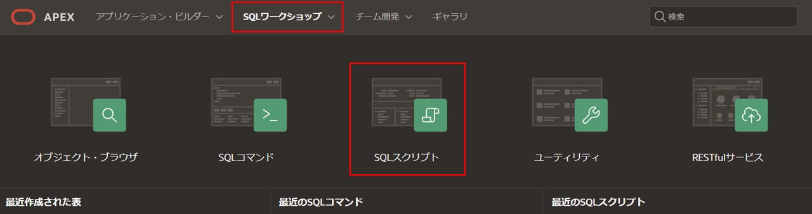

4. **クイックSQL**をクリックします。

    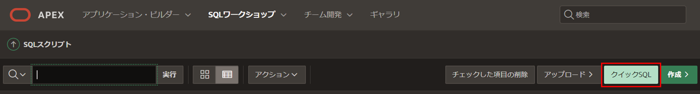

## タスク2: テーブルのショートカットを入力する
クイックSQLでは、インデントされたテキスト文書から関係データ・モデルのSQLを生成する簡単な方法を提供します。このツールは、SQLテーブル、トリガー、インデックスなどを作成するために必要な時間と労力を削減することを目的としています。

1. クイックSQL(左パネル)に次のように入力します。

    ```
    <copy>big_mac_index  
      country_name  
      country_iso
      currency_code
      local_price num
      dollar_exchange_rate num
      gdp_dollar num
      entry_date</copy>
    ```

    *注意: country\_nameやその後の行をインデントすることで、これらが最初の行で定義されたテーブルbig\_mac\_indexの列であることを示しています。*

    **SQLの生成**をクリックします。

    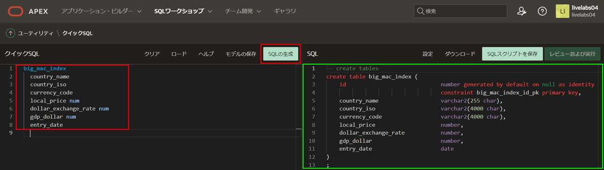

## タスク3: スクリプトを実装する
この段階では、SQLステートメントが作成されました。ただし、まずステートメントをスクリプト・ファイルとして保存してから、スクリプトを実行する必要があります。これにより、定義したデータベース・オブジェクトが作成されます。

1. SQL(右パネル)のツールバーで、**SQLスクリプトを保存**をクリックします。  
2. スクリプトの保存ダイアログで、スクリプト名に**remote**を入力します。  
    **スクリプトを保存**をクリックします。

    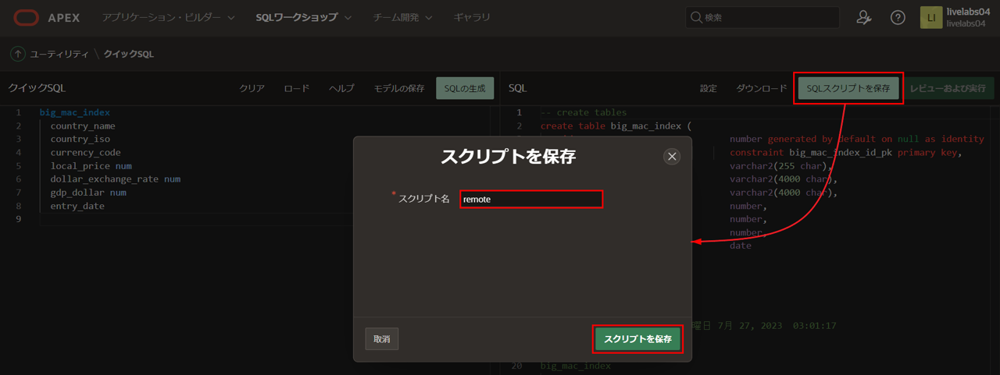

3. SQL(右パネル)のツールバーで、**レビューおよび実行**をクリックします。

    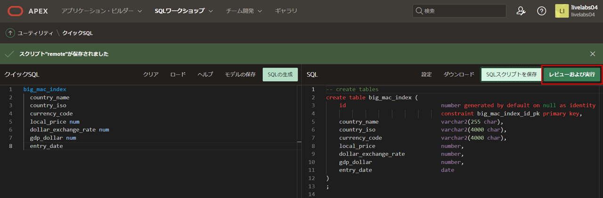

4. スクリプトは、SQLスクリプト内の**スクリプト・エディタ**に表示されます。 **実行**をクリックします。

    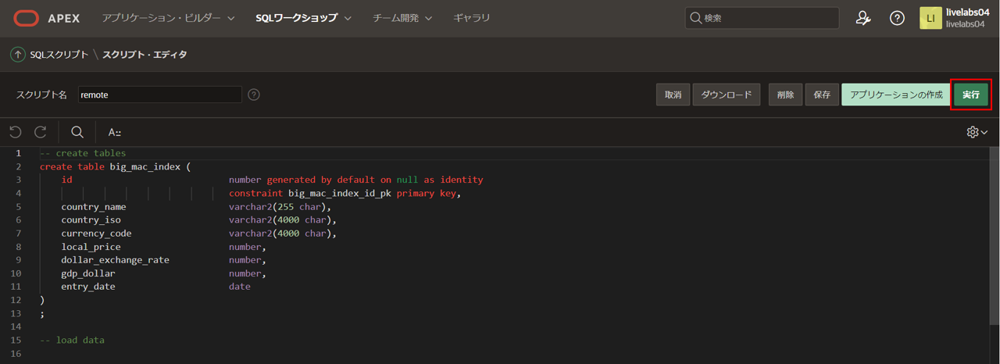

5. スクリプトの実行ページで、**即時実行**をクリックします。

    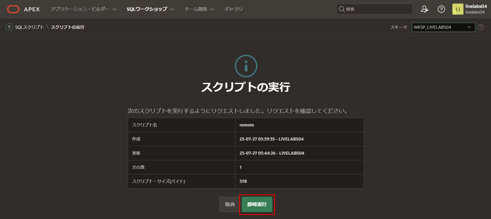

6. スクリプト結果ページに処理されたステートメント、成功したステートメント、エラーのあるステートメントがリストされます。

    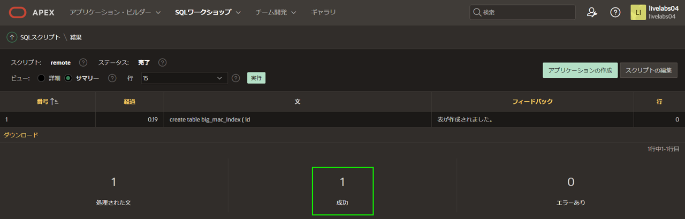

    *注意: 処理されたステートメントが1ではない場合は、クイックSQLに戻り、SQLの生成をクリックし、スクリプトを再保存し、再実行してください。それでも成功したステートメントが1ではない場合は、エラーを確認してください。*

## タスク4: アプリケーションを作成する

テーブルを作成したので、レポートとフォームを含むアプリケーションをすぐに作成できます。

1. **アプリケーションの作成**をクリックします。

    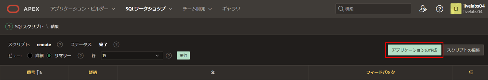

2. 「スクリプトからアプリケーションを作成」ダイアログで、**アプリケーションの作成**をクリックします。

    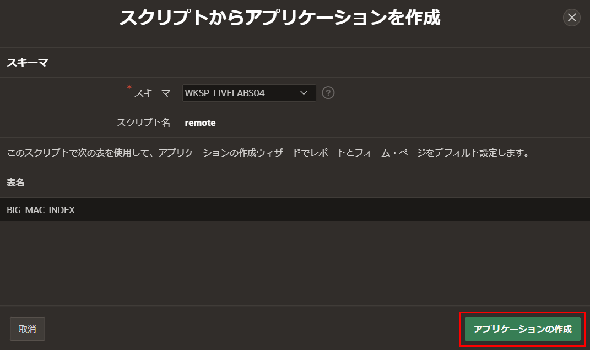

3. アプリケーションの作成ページで、次の項目を入力します。
    - **名前:** **Global Exchange**と入力します
    - **機能:** **すべてをチェック** をクリックします

   ページの下部で、**アプリケーションの作成**をクリックします。

    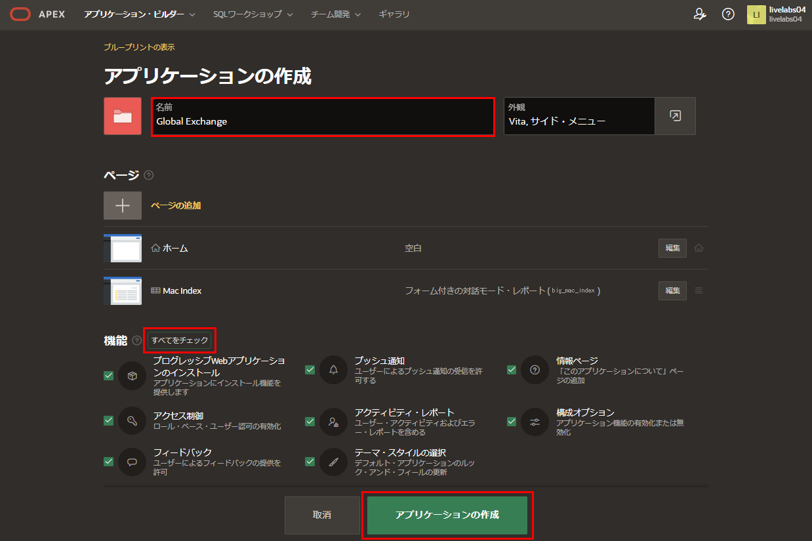  

4. 新しいアプリケーションがページ・デザイナーに表示されます。
5. **アプリケーションの実行**をクリックします。

    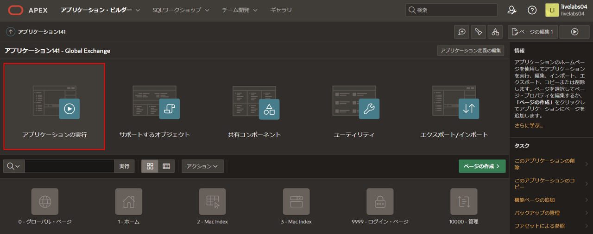

6. ランタイム環境では、ログインページが表示されます。

    ユーザー名とパスワードを入力します。
    サインインをクリックします。

    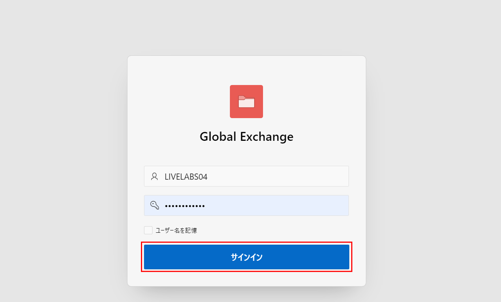  

7. 新しいアプリケーションを操作してみてください。

    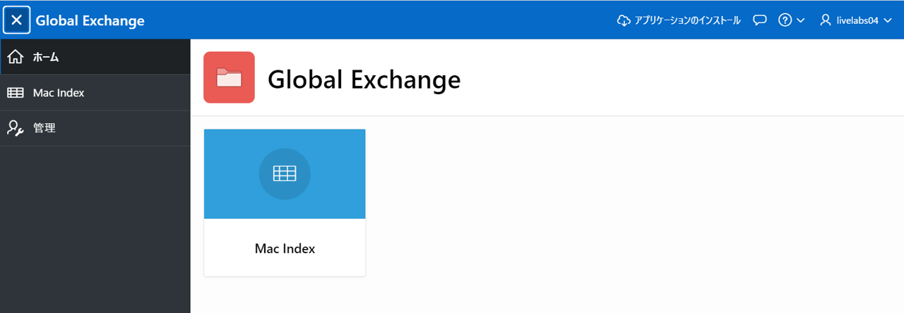

    *注意: Mac Indexをクリックしてもデータが表示されません。次のラボでテーブルにデータを入力するので、手動でデータを入力する必要はありません。*

## **まとめ**
これでラボ2は完了です。クイックSQLを利用してシンプルなテーブルを構築し、その上にアプリケーションを作成する方法がわかりました。[次のラボに進むにはここをクリック](?lab=lab-3-populating-table)

## 謝辞

 - **作成者/投稿者** -  Salim Hlayel, Principle Product Manager
 - **投稿者** - Jaden McElvey, Technical Lead - Oracle LiveLabs Intern
 - **最終更新日** - Salim Hlayel, Principle Product Manager, November 2020

