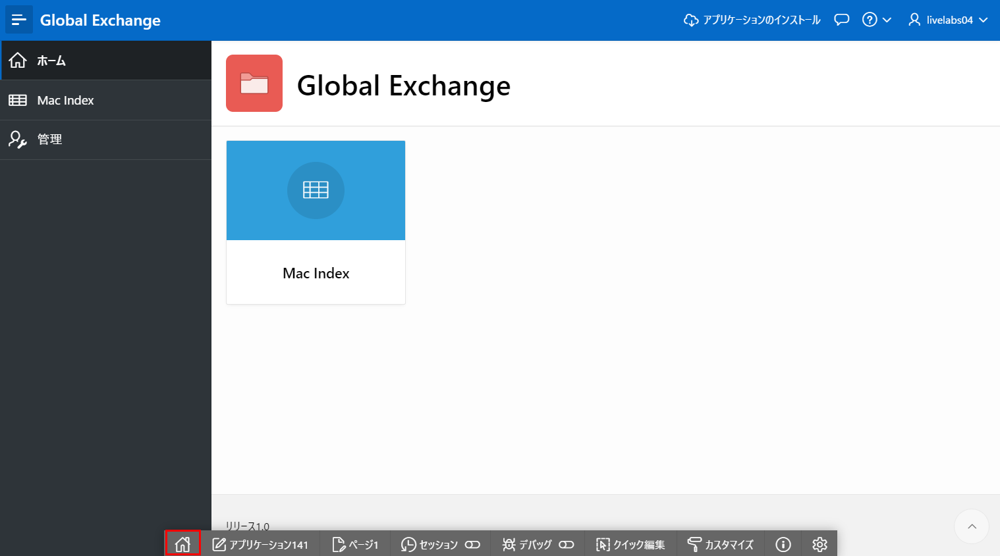
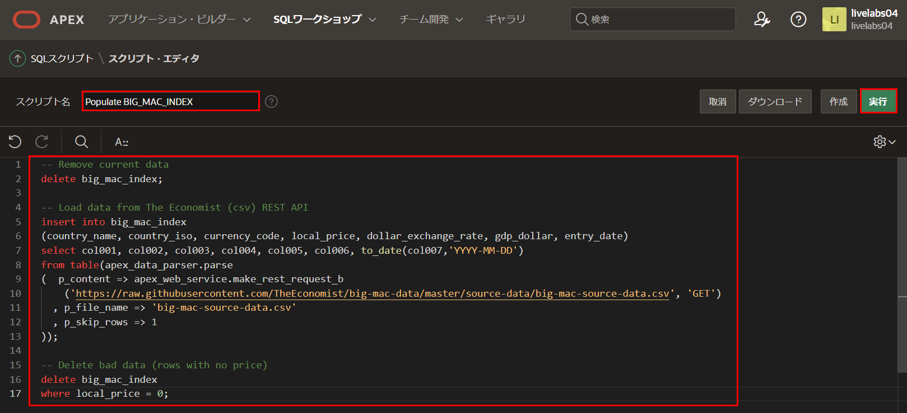

# テーブルにデータを入力する

## はじめに

このラボでは、REST APIを利用してテーブルにデータを挿入する方法を学びます。

所要時間: 5分  

### 背景情報

**apex\_data\_parser** はPL/SQLパッケージで、コンマ区切り(.csv)を含むさまざまな形式からファイルを簡単に解析するインターフェースを提供します。このパーサーはテーブル関数として実装されているため、開発者はテーブルのようにパーサーの結果にアクセスできます。したがって、指定されたファイルから行をテーブルに直接挿入するために、INSERT ... SELECT ステートメント内にパーサーの結果を利用できます。

**apex\_web\_service.make\_rest\_request\_b** はPL/SQL関数で、RESTfulスタイルのWebサービスを呼び出し、結果をBLOBで返します。この関数をapex\_data\_parser内で利用することにより、REST APIから直接データをテーブルに読み込むことができます。

## タスク1: スクリプトを作成する

一回限りのSQLステートメントではなく、SQLスクリプトを記述することで、SQLステートメントを繰り返し実行できます。

ビッグ・マック・データは6か月ごとに更新されます。したがって、このスクリプトを年に2回使用して、データを最新の状態に保つことができます。

1. ランタイム環境から、開発者ツールバー(画面下部)の**ホーム**アイコンをクリックします。
  
   
2. **SQLワークショップ**をクリックし、**SQLスクリプト**を選択します。 
   
   
3. 「SQLスクリプト」ページのツールバーで、**作成**をクリックします。
   
   

4. 「スクリプト・エディタ」ページで、以下のように入力します。
   
      * **スクリプト名:** **Populate BIG\_MAC\_INDEX**と入力します  
      * 以下のコードをコピー&ペーストします。

      ```
      <copy>-- Remove current data
      delete big_mac_index;

      -- Load data from The Economist (csv) REST API
      insert into big_mac_index
      (country_name, country_iso, currency_code, local_price, dollar_exchange_rate, gdp_dollar, entry_date)
      select col001, col002, col003, col004, col005, col006, to_date(col007,'YYYY-MM-DD')
      from table(apex_data_parser.parse
      (  p_content => apex_web_service.make_rest_request_b
         ('https://raw.githubusercontent.com/TheEconomist/big-mac-data/master/source-data/big-mac-source-data.csv', 'GET')
         , p_file_name => 'big-mac-source-data.csv'
         , p_skip_rows => 1
      ));

      -- Delete bad data (rows with no price)
      delete big_mac_index
      where local_price = 0;</copy>    
      ```

5. **実行**をクリックします。
   
   

6. 「スクリプトの実行」ページで、**即時実行**をクリックします。
   
   
   
7. スクリプト結果ページに、処理されたステートメント、成功したステートメント、エラーのあるステートメントがリストされます。    
   2023年7月の結果では、**1948行挿入済み**および**1行削除済み**が表示されるはずです(スクリプトを実行する日によって、挿入/削除された行数が異なる場合があります)。
   
   
   
   *注意: 3つのステートメントが正常に処理されたことが表示されない場合は、テーブル定義とテーブル入力のスクリプトを確認してください。*

## タスク2: データを確認する

データを確認する方法はいくつかあります。ランタイム環境と開発環境の両方で確認できます。

1. ランタイム環境のタブまたはウィンドウに移動します。
2. アプリケーション・メニューから**Mac Index**をクリックします。    
   レポート上で**Entry Date**をクリックし、**昇順ソート**をクリックすると、最新のデータが表示されます。

   
   
3. APEXビルダーのタブまたはウィンドウで、**SQLワークショップ**をクリックし、**オブジェクト・ブラウザ**を選択します。

   
4. オブジェクト・ブラウザ内の表を展開し、**BIG\_MAC\_INDEX** をクリックします。  
   中央のペインで、**データ**をクリックします。

   
   
   注意: DOLLAR\_EXCHANGE\_RATE列の小数点以下の桁数を確認してください。次のラボで、データが適切に表示されるようにします。

## **まとめ**

これでラボ3は完了です。**apex\_data\_parser** と **apex\_web\_service.make\_rest\_request\_b** を利用して、RESTエンドポイントに基づいてOracleデータベース内のテーブルにデータを入力する方法がわかりました。[次のラボに進むにはここをクリック](?lab=lab-4-improving-report)

## 謝辞

 - **作成者/投稿者** -  Salim Hlayel, Principle Product Manager
 - **投稿者** - Jaden McElvey, Technical Lead - Oracle LiveLabs Intern
 - **最終更新日** - Madhusudhan Rao, Apr 2022

