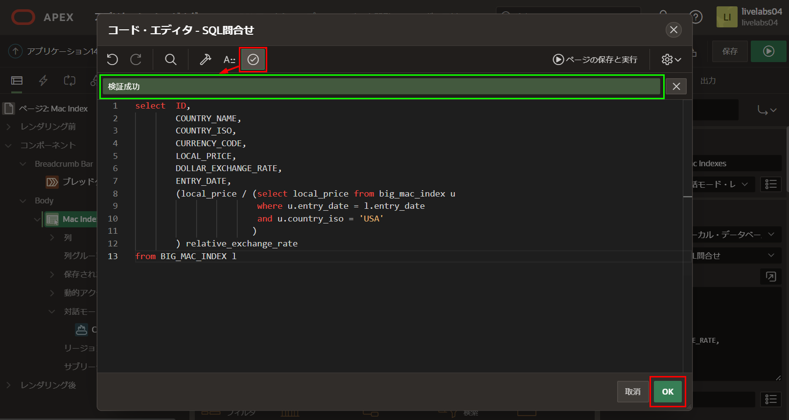
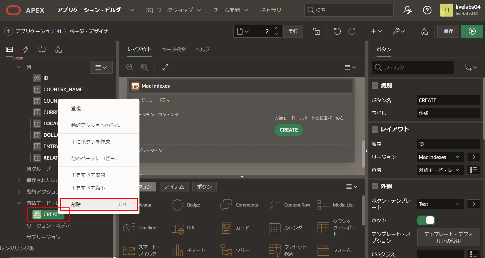
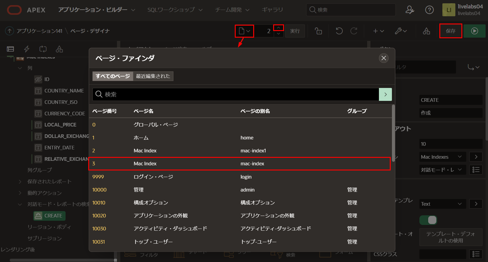
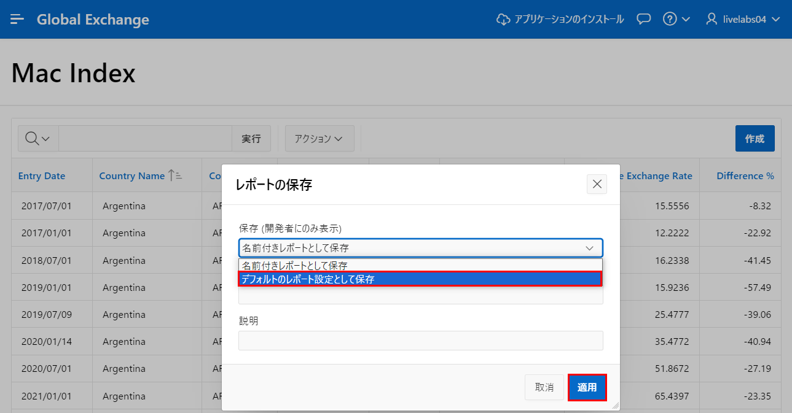
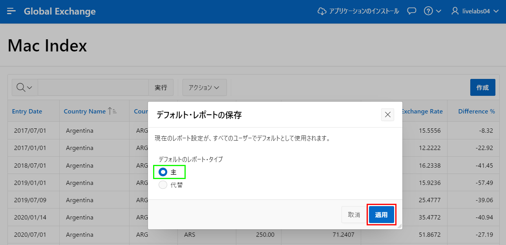

# レポートの改善

## はじめに
このラボでは、対話モード・レポートを操作して、表示されるデータを改善し、ユーザーがデータを確認しやすくする方法を学びます。

所要時間: 15分  

### 背景情報
BIG\_MAC\_INDEXテーブルにデータがロードされたので、マクドナルドのビッグマックの現地価格と米ドルとの為替レートを確認できるようになりました。 

どの国についても、その国のビッグマックの現地価格を、同じ期間の米国のビッグマックの現地価格で割ることで、ビッグマックの価格に基づいて両国間の相対的な為替レートを計算できます。

その後、相対的な為替レートからドル為替レートを引き、ドル為替レートで割ると、米ドルに対して通貨が過大評価 (プラス) か過小評価 (マイナス) かを判断できます。

注意:これは米ドルに対する通貨の過大評価や過小評価を正確に判断するものではありませんが、ほとんどの国で一般的に入手可能な商品を使用した場合の適切な近似値です。

## タスク1: レポート・クエリを更新する
アプリケーションの生成時には標準のテーブルの列が利用されていました。SQLクエリに変換し、SQLを更新することで、相対的な為替レートを含めることができ、人々がデータを確認しやすくなります。

1. ツールバーで、**アプリケーション・ビルダー**をクリックします。

    

2. アプリケーション・リストで、**Global Exchange**をクリックします。 

    

3. アプリのホームページから、**2 – Mac Index**をクリックすると、ページ・デザイナがロードされ、レポートページであるページ2に移動します。

      

4. ページ・デザイナ内で、レンダリング・ツリー(左側のペイン)の、Bodyの下の**Mac Indexes**(これがレポート・リージョンです)をクリックします。

    

    プロパティ・エディタ(右側のペイン)に次の内容を入力します。
    - **ソース > タイプ:** **SQL問合せ** を選択
    - **ソース > SQL問合せ:** **「コード・エディタ:SQL問合せ」**アイコンをクリックし、以下のコードをコピー&ペーストします。

    ```
    <copy>select  ID,
                COUNTRY_NAME,
                COUNTRY_ISO,
                CURRENCY_CODE,
                LOCAL_PRICE,
                DOLLAR_EXCHANGE_RATE,
                ENTRY_DATE,
                (local_price / (select local_price from big_mac_index u
                                where u.entry_date = l.entry_date
                                and u.country_iso = 'USA'
                               )
                ) relative_exchange_rate
    from BIG_MAC_INDEX l</copy>
    ```

    **検証**をクリック - 検証成功が表示されます。
    **OK**をクリックします。

    

    *注: gdp_dollar列は不要なので削除しました。内側の選択は、同じ日付の米国の価格を取得し、相対的な為替レートを計算するために使用されます。*

## タスク2: レポート列を更新する
データを正しく表示するには、個々のレポート列に、より適切な書式マスクが必要です。

1. レンダリング・ツリー(左側のペイン)で、**列**をクリックします。
   列のリスト内で、**LOCAL\_PRICE**をクリックします。

   プロパティ・エディタ(右側のペイン)で、**外観 > 書式マスク**の選択アイコンをクリックします。  
   書式マスクの選択ダイアログで、**5,234.10**を選択します。

   

2. レンダリング・ツリー(左側のペイン)で、列のリスト内の**DOLLAR\_EXCHANGE\_RATE**をクリックします。

   プロパティ・エディタ(右側のペイン)で、**外観 > 書式マスク**の選択アイコンをクリックします。  
   書式マスクの選択ダイアログで、**5,234.1000**を選択します。

3. レンダリング・ツリー(左側のペイン)で、列のリスト内の**RELATIVE\_EXCHANGE\_RATE**をクリックします。

   プロパティ・エディタ(右側のペイン)で、**外観 > 書式マスク**の選択アイコンをクリックします。  
   書式マスクの選択ダイアログで、**5,234.1000**を選択します。


## タスク3: データ入力コンポーネントを削除する
データは外部ソース(エコノミストのREST API)から取得されるため、アプリケーションのユーザーは既存のレコードを更新や削除したり、新しいレコードを作成したりできないはずです。

1. 編集アイコンを削除して、エンド・ユーザーがレコードを更新や削除できないようにします。

   レンダリング・ツリー(左側のペイン)で、対話モード・レポート**Mac Indexes**を選択します。   
   プロパティ・エディタ(右側のペイン)で、**属性**パネルを開きます。リンク > リンク列に、**リンク列の除外**を選択します。

   

2. 作成ボタンを削除して、エンド・ユーザーが新しいレコードを追加できないようにします。

   レンダリング・ツリー(左側のペイン)で、**CREATE**ボタン・コンポーネントを右クリックし、**削除**をクリックします。

   

3. Mac Indexのフォームページ全体を削除するのがいいですが、このステップは必須ではありません。  
   ページ3に移動する前に、ページ2で行った変更を保存する必要があります。

   ページ・デザイナのツールバーで、ページ2を選択した状態で、**保存**をクリックします。  
   ページ・デザイナのツールバーで、ページ・セレクターまたは上矢印を使用して、**ページ3 - Mac Index**に移動します。

   

4. ページ**3 - Mac Index**で、ページ・デザイナのツールバーで**ユーティリティ** アイコンをクリックし、**ページの削除**を選択します。

   

5. 削除の確認ページで、**ページを完全に削除**をクリックします。

   *注: ページ・デザイナはページ1: ホームの表示に戻ります。*

## タスク4: レポート列の並べ替え
列の表示順序を変更するには、レポートを実行して、ランタイム環境で列の順序を再配置する必要があります。

1. ページ・デザイナのツールバーで、**保存して実行**をクリックします。

   

2. ランタイム環境で、レポートページを開きます。**アクション**をクリックし、**列**をクリックします。

   

3. 列の選択ダイアログで、**Entry Date**を選択し、**一番上**アイコンをクリックします。  
   

   
   
4. **Dollar Exchange Rate**をクリックして、**Relative Exchange Rate**を選択し、**移動**アイコンをクリックします。

   **適用**をクリックします。

   

   
## タスク5: 計算を追加する

リージョンのSQLクエリに列を追加する代わりに、ランタイム環境から計算列を定義することもできます。

このレポートには、ドルの為替レートと相対的な為替レートの列があります。相対的な為替レートからドルの為替レートを差し引いて、それをドルの為替レートで割ると、通貨の評価を計算できます。結果に100をかけてパーセンテージで表示するのが最適です。

1. レポートページの**アクション**をクリックし、**データ**を選択して、**計算**をクリックします。

   

2. 計算ダイアログで、次の内容を入力します。
   - **列ラベル:** **Difference %** と入力
   - **書式マスク:** **5,234.10** を選択
   - **計算式:** 次の内容を入力します。

    ```
    <copy>
    (I - F) * 100 / F
    </copy>
    ```

   **適用**をクリックします。

   

   *注: F は「列の別名」の下にリストされているドル為替レートを参照し、I は相対的な為替レートを参照しています。*

## タスク6: レポートを保存する
現在、ランタイム環境で行った変更は変更者にしか見えません。さらに、ランタイム環境からログアウトして再ログインした場合、変更は失われます。修正されたレポートをすべての人が確認できるようにするには、レポートを主レポートとして保存する必要があります。

1. ランタイム環境で、**アクション**をクリックし、**レポート**を選択して、**レポートの保存**をクリックします。

   

2. レポートの保存ダイアログで、**デフォルトのレポート設定として保存**を選択します。

   
   
3. 「デフォルト・レポートの保存」ダイアログで、**適用**をクリックします。

   

## **まとめ**
これでラボ4は完了です。このラボでは、SQLクエリをレポートの基礎として利用する方法、列の表示書式を改善する方法、不要なページ要素を削除する方法、レポート・レイアウトを操作する方法、そしてそれをすべての人が利用できるように保存する方法を学びました。[ここをクリックしてラボ5に移動](?lab=lab-5-adding-chart)

## 謝辞

 - **作成者/投稿者** -  Salim Hlayel, Principle Product Manager
 - **投稿者** - Jaden McElvey, Technical Lead - Oracle LiveLabs Intern
 - **最終更新日** - Salim Hlayel, Principle Product Manager, November 2020

